- [一、AD/DA简介](10_ADDA实验ADDA原理.md#一、AD/DA简介)
	- [1.1  DAC：网络权电阻DAC转换原理](10_ADDA实验ADDA原理.md#一、AD/DA简介#1.1%20%20DAC：网络权电阻DAC转换原理)
				- [原理图](10_ADDA实验ADDA原理.md#原理图)
				- [计算公式](10_ADDA实验ADDA原理.md#计算公式)
	- [1.2  ADC采样原理](10_ADDA实验ADDA原理.md#一、AD/DA简介#1.2%20%20ADC采样原理)
				- [采样定理](10_ADDA实验ADDA原理.md#采样定理)
				- [量化](10_ADDA实验ADDA原理.md#量化)
- [二、硬件设计](10_ADDA实验ADDA原理.md#二、硬件设计)
	- [2.1  DA转换芯片：AD9708](10_ADDA实验ADDA原理.md#二、硬件设计#2.1%20%20DA转换芯片：AD9708)
				- [原理图](10_ADDA实验ADDA原理.md#原理图)
				- [引脚注释](10_ADDA实验ADDA原理.md#引脚注释)
				- [时序](10_ADDA实验ADDA原理.md#时序)
	- [2.2  AD转换芯片：AD9280](10_ADDA实验ADDA原理.md#二、硬件设计#2.2%20%20AD转换芯片：AD9280)
				- [原理图](10_ADDA实验ADDA原理.md#原理图)
				- [引脚注释](10_ADDA实验ADDA原理.md#引脚注释)
				- [时序](10_ADDA实验ADDA原理.md#时序)

## 一、AD/DA简介
ADC/DAC（即模数转换器/数模转换器）

D/A：将数字量转换成模拟量。
A/D：将模拟量转换成数字量。源：电压/电流等电信号、声、光、压力、湿度等物理信号转电信号

分类
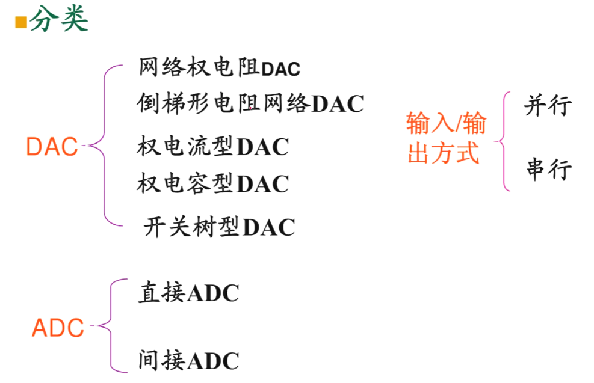

### 1.1  DAC：网络权电阻DAC转换原理
###### 原理图
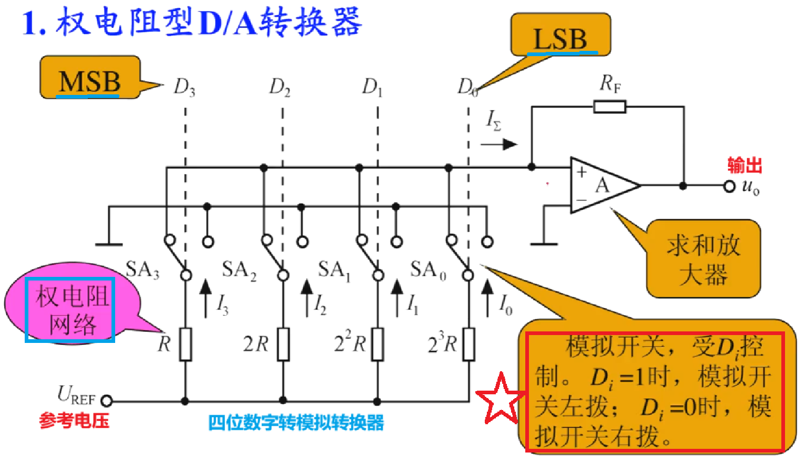
###### 计算公式
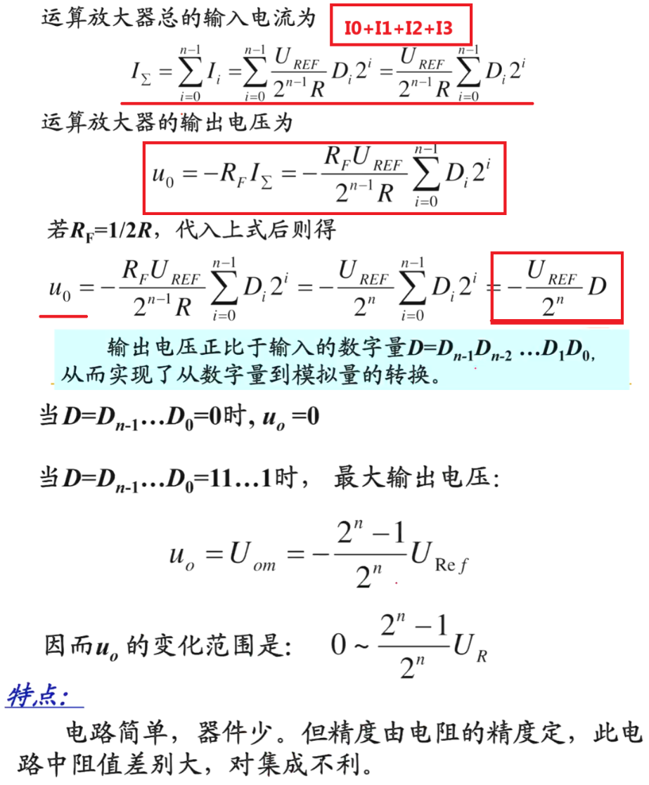

### 1.2  ADC采样原理
###### 采样定理
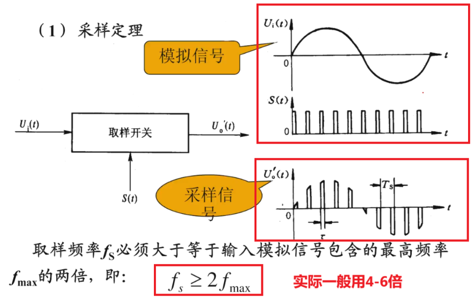
###### 量化
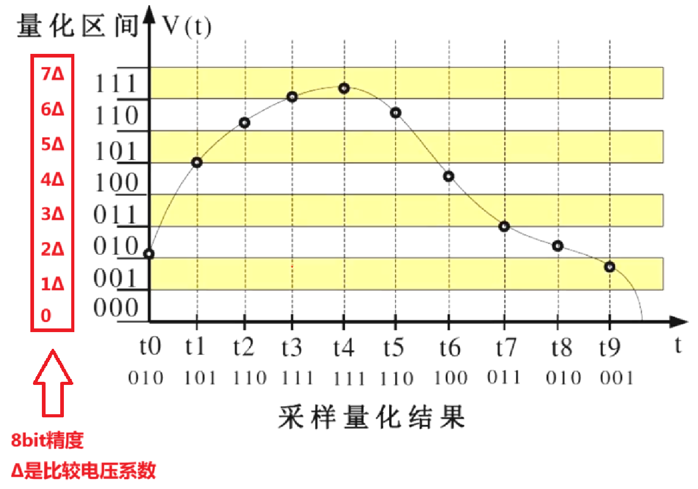
量化得到的数值通常用二进制表示
对有正负极（双极性）的模拟量一般采用偏移码表示。
	例如，8位二进制偏移码10000000代表数值0，
		00000000代表负电压满量程，
		11111111代表正电压满量程
（数值位负时符号位为0，为正时符号位为1）

## 二、硬件设计
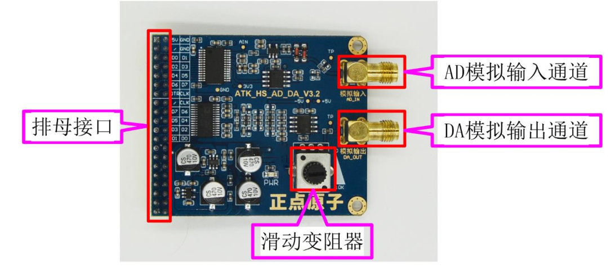
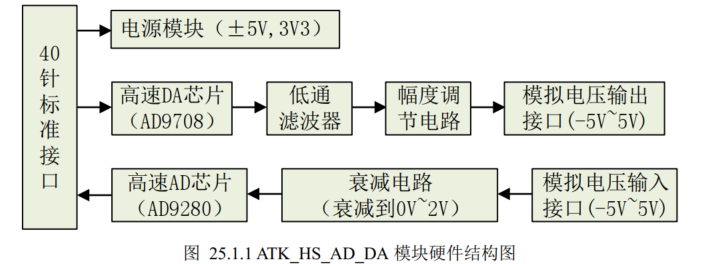
### 2.1  DA转换芯片：AD9708
DA芯片
- 输出：8位数字信号
- 抗干扰：电路中接入了低通滤波器
- 调节：滑动变阻器调节幅度
- 输出：一对差分电流信号。模拟电压范围是-5V~+5V
- 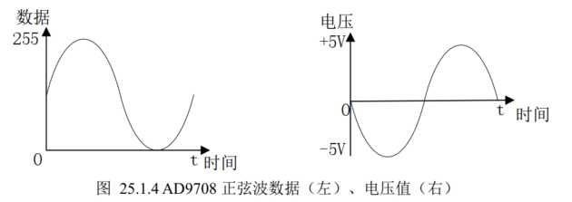
###### 原理图
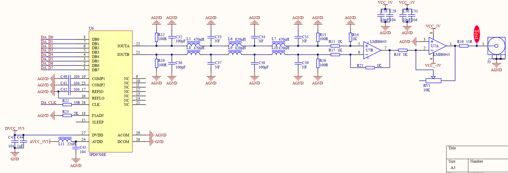
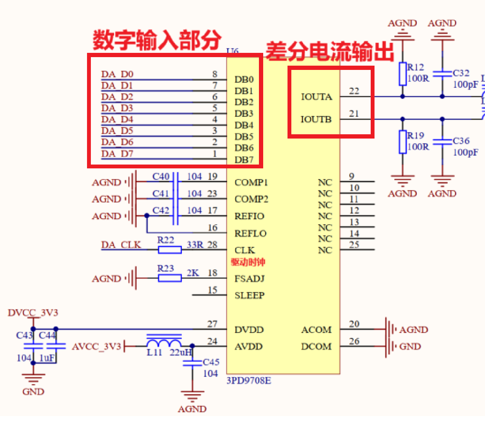
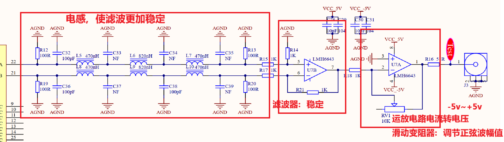
###### 引脚注释
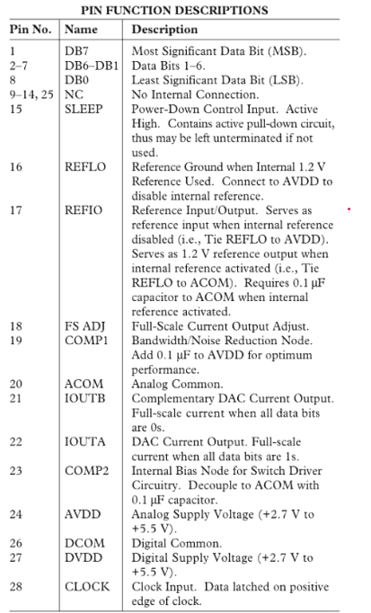
###### 时序
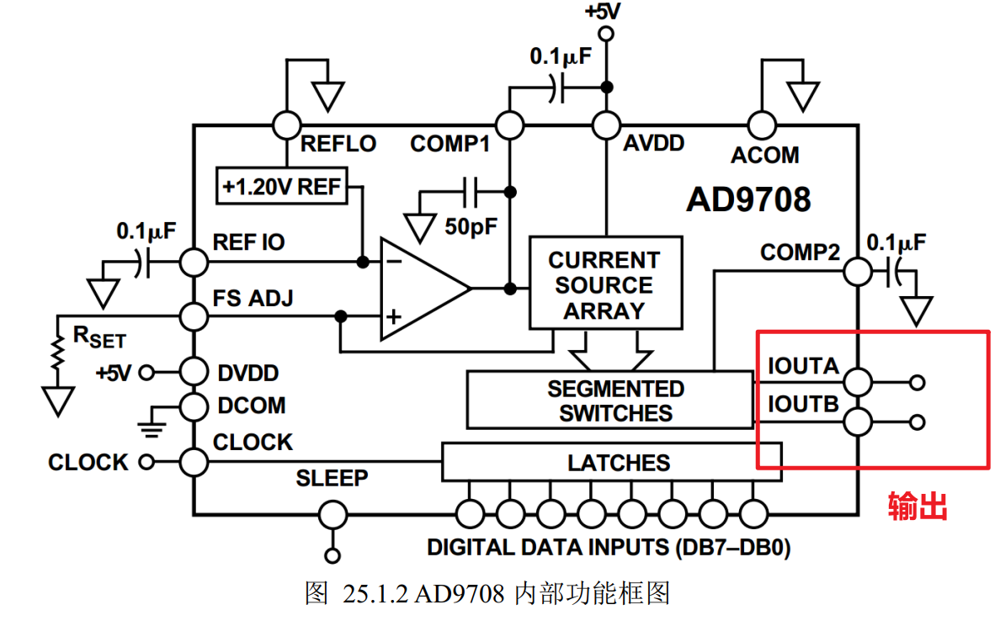
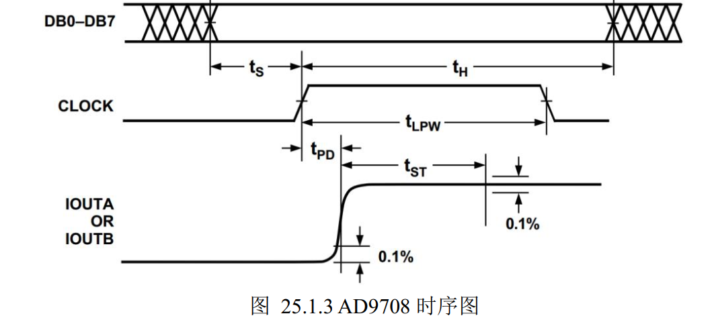
给8bit数据量，就会生成模拟信号输出。调节数据量，可以输出想要的波形。
### 2.2  AD转换芯片：AD9280
AD芯片
输入：-5V~+5V
处理：衰减电路
输出：0V~2V
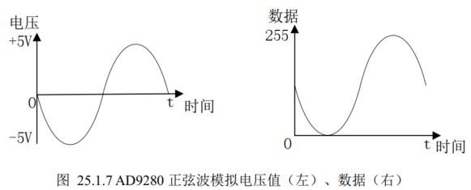

###### 原理图
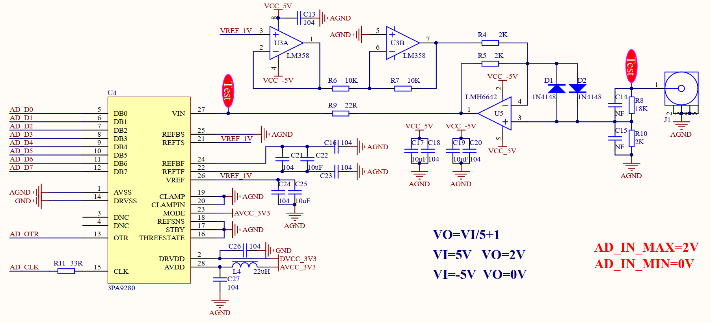
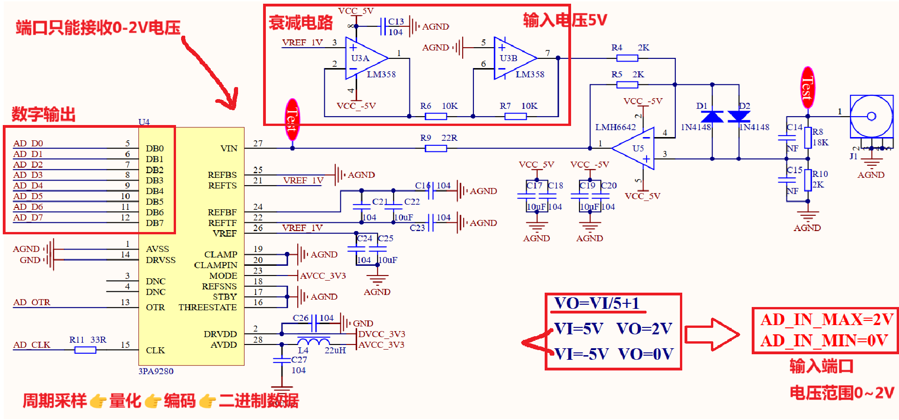
###### 引脚注释
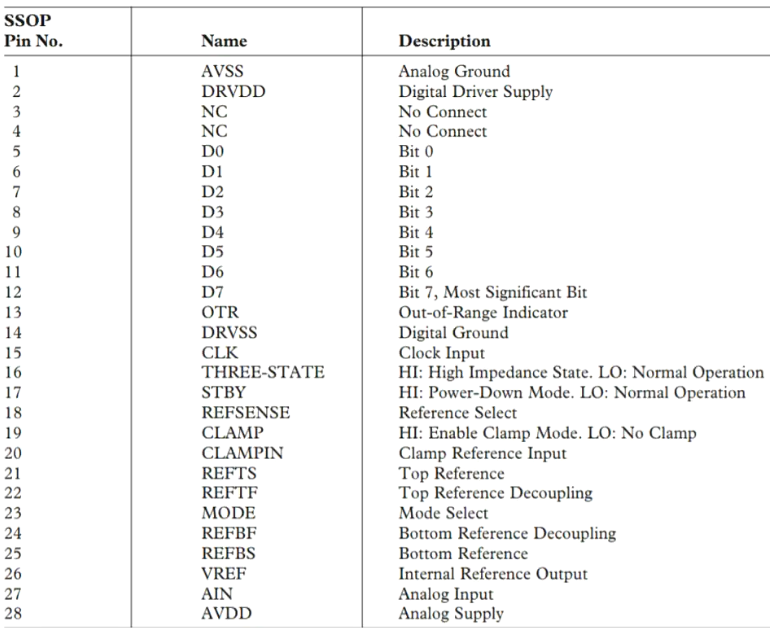
###### 时序
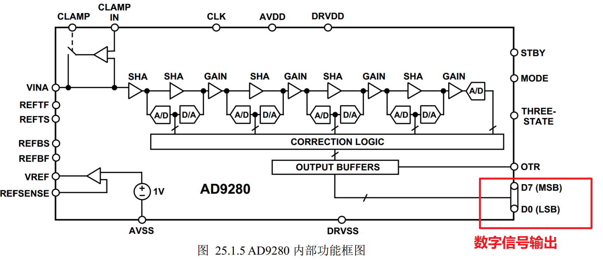
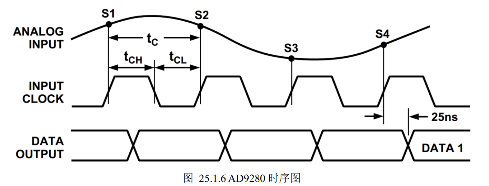
==采样有25ns的延迟==

