- [一、硬件设计](11_ADDA实验程序设计.md#一、硬件设计)
- [二、实验流程](11_ADDA实验程序设计.md#二、实验流程)
- [三、上板测试结果](11_ADDA实验程序设计.md#三、上板测试结果)
- [四、顶层设计](11_ADDA实验程序设计.md#四、顶层设计)
- [五、软件代码](11_ADDA实验程序设计.md#五、软件代码)


##### 一、硬件设计
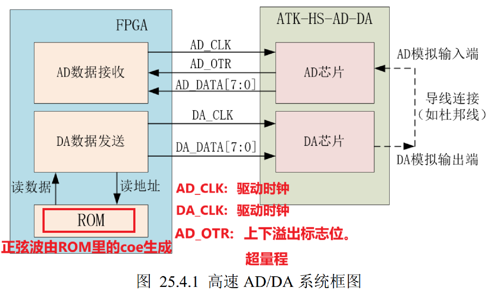
FPGA生成sin函数是非常复杂的。verilog生成DA_DATA【7:0】很复杂
通过软件将正弦波，转换成数字量，生成coe文件，储存到ROM中，输出正弦波
当然也可以直接接示波器或信号发生器


##### 二、实验流程
使用WaveToMem生成正弦信号coe文件
8位位宽：对应8位数模转换
深度256：对应fifo ip核的深度
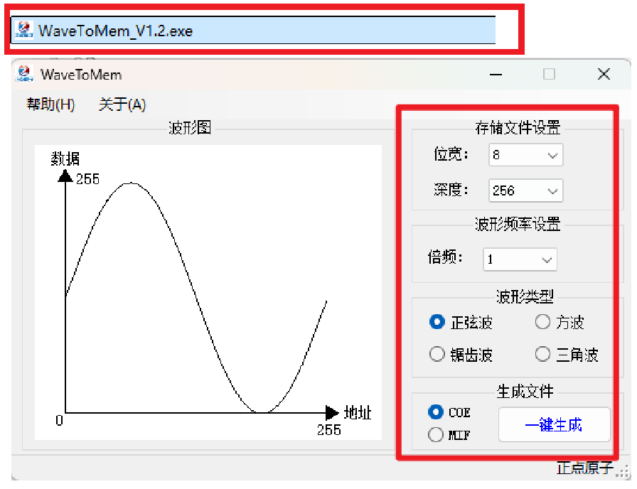
生成coe文件
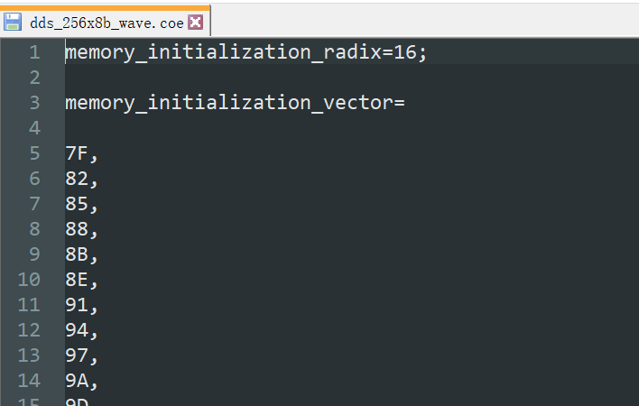
这个文件可以直接加载到ROM IP核中。

ROM IP核配置
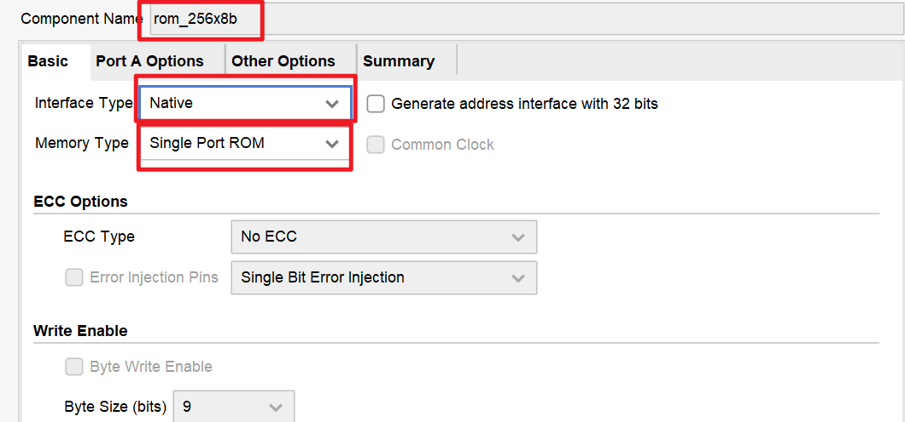
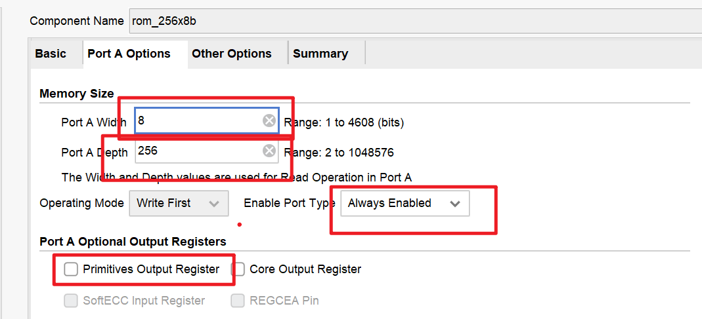
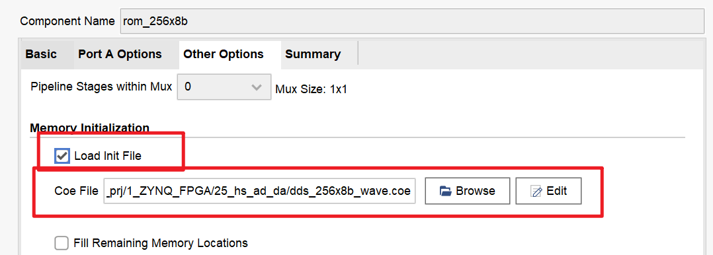


ila ip核配置
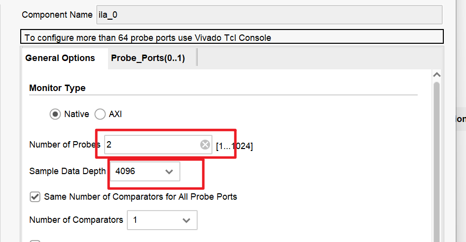
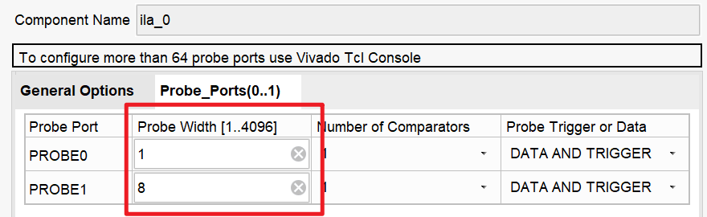

##### 三、上板测试结果
DA模拟输出接示波器
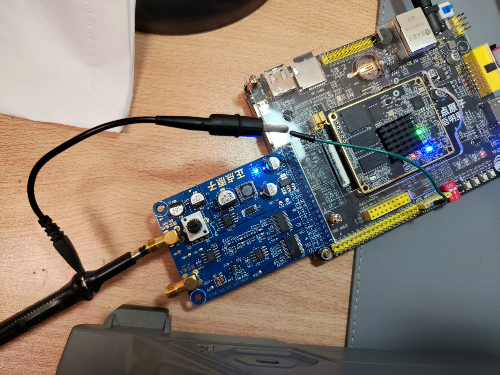
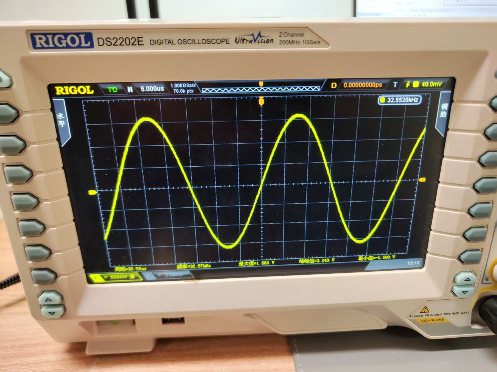
DA接AD，ila抓接收端数据
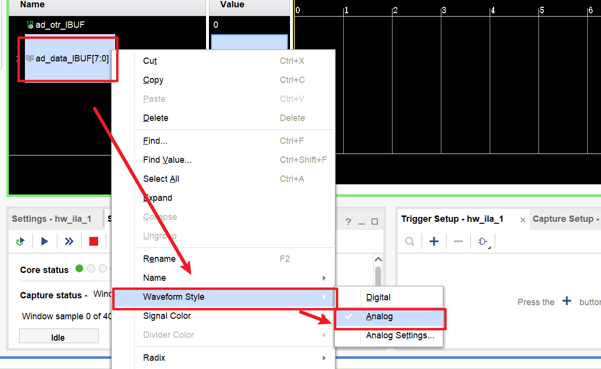

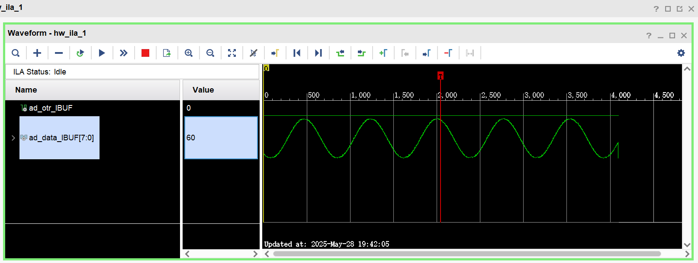

##### 四、顶层设计
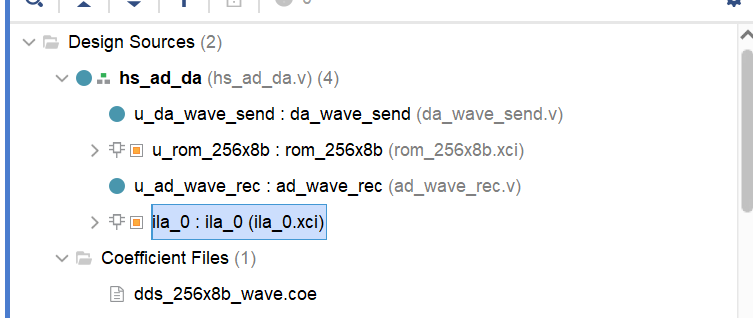
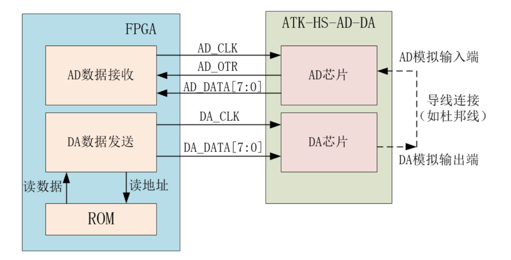
FPGA 顶层模块（hs_ad_da） 例化了以下三个模块： 
- DA 数据发送模块（da_wave_send） ： DA 数据发送模块输出读 ROM 地址， 将输入的 ROM 数据发送至DA 转换芯片的数据端口。
- ROM 波形存储模块（rom_256x8b）： ROM 波形存储模块由 Vivado 软件自带的 Block Memory Generator IP 核实现， 其存储的波形数据可以使用波形转存储文件的上位机来生成.coe 文件。
- AD 数据接收模块（ad_wave_rec）： AD 数据接收模块输出 AD 转换芯片的驱动时钟和使能信号，随后接收 AD 转换完成的数据


##### 五、软件代码
```verilog
module hs_ad_da(
	input 			sys_clk 	,		//系统时钟
	input 			sys_rst_n 	, 		//系统复位，低电平有效
//DA 芯片接口
	output 			da_clk 		, 		//DA(AD9708)驱动时钟,最大支持 125Mhz 时钟
	output 	[7:0] 	da_data 	, 		//输出给 DA 的数据
//AD 芯片接口
	input 	[7:0] 	ad_data 	, 		//AD 输入数据
										//模拟输入电压超出量程标志(本次试验未用到)
	input 			ad_otr 		, 		//0:在量程范围 1:超出量程	
	output 			ad_clk 				//AD(AD9280)驱动时钟,最大支持 32Mhz 时钟
);

//wire define
wire [7:0]	rd_addr				; 		//ROM 读地址
wire [7:0]	rd_data				; 		//ROM 读出的数据
//*****************************************************
//** main code
//*****************************************************

//DA 数据发送
da_wave_send u_da_wave_send(
	.clk 		(sys_clk	),
	.rst_n 		(sys_rst_n	),
	.rd_data 	(rd_data	),
	.rd_addr 	(rd_addr	),
	.da_clk 	(da_clk		),
	.da_data 	(da_data	)
);

//ROM 存储波形
rom_256x8b u_rom_256x8b(
	.clka 		(sys_clk	), 			// input wire clka
	.addra 		(rd_addr	), 			// input wire [7 : 0] addra
	.douta 		(rd_data	) 			// output wire [7 : 0] douta
);

//AD 数据接收
ad_wave_rec u_ad_wave_rec(
	.clk 		(sys_clk	),
	.rst_n 		(sys_rst_n	),
	.ad_data 	(ad_data	),
	.ad_otr 	(ad_otr		),
	.ad_clk 	(ad_clk		)
);

//ILA 采集 AD 数据
ila_0 ila_0(
	.clk 		(ad_clk 	), 			// input wire clk
	.probe0 	(ad_otr 	), 			// input wire [0:0] probe0
	.probe1 	(ad_data	) 			// input wire [7:0] probe0
);

endmodule
```

```verilog
module da_wave_send(
	input 				clk 	, 	//时钟
	input 				rst_n 	, 	//复位信号，低电平有效

	input 		[7:0] 	rd_data	, 	//ROM 读出的数据
	output reg 	[7:0] 	rd_addr	, 	//读 ROM 地址

//DA 芯片接口
	output 				da_clk 	, 	//DA(AD9708)驱动时钟,最大支持 125Mhz 时钟
	output 		[7:0] 	da_data		//输出给 DA 的数据
);

//parameter
//频率调节控制
parameter 	FREQ_ADJ = 8'd5	;		//频率调节,FREQ_ADJ 的值越大,最终输出的频率越低,范围 0~255

//reg define
reg [7:0] 	freq_cnt 		;		//频率调节计数器

//********************************************************************************************
//** main code
//********************************************************************************************

//数据 rd_data 是在 clk 的上升沿更新的，所以 DA 芯片在 clk 的下降沿锁存数据是稳定的时刻
//而 DA 实际上在 da_clk 的上升沿锁存数据,所以时钟取反,这样 clk 的下降沿相当于 da_clk 的上升沿
assign da_clk 	= ~clk		;
assign da_data 	= rd_data	;		//将读到的 ROM 数据赋值给 DA 数据端口

//频率调节计数器
always @(posedge clk or negedge rst_n) begin
	if(rst_n == 1'b0)
		freq_cnt <= 8'd0;
	else if(freq_cnt == FREQ_ADJ)
		freq_cnt <= 8'd0;
	else
		freq_cnt <= freq_cnt + 8'd1;
end

//读 ROM 地址
always @(posedge clk or negedge rst_n) begin
	if(rst_n == 1'b0)
		rd_addr <= 8'd0;
	else begin
		if(freq_cnt == FREQ_ADJ) begin
			rd_addr <= rd_addr + 8'd1;
		end
	end
end

endmodule
```

```verilog
module ad_wave_rec(
	input 				clk 		, 	//时钟
	input 				rst_n 		, 	//复位信号，低电平有效
	
	input 		[7:0] 	ad_data 	, 	//AD 输入数据
//模拟输入电压超出量程标志(本次试验未用到)
	input 				ad_otr 		, 	//0:在量程范围 1:超出量程
	output reg 			ad_clk 			//AD(AD9280)驱动时钟,最大支持 32Mhz 时钟
);

//*****************************************************
//** main code
//*****************************************************

//时钟分频(2 分频,时钟频率为 25Mhz),产生 AD 时钟
always @(posedge clk or negedge rst_n) begin
	if(rst_n == 1'b0)
		ad_clk <= 1'b0		;
	else
		ad_clk <= ~ad_clk	;
end

endmodule
```


