### **一、模块框图**
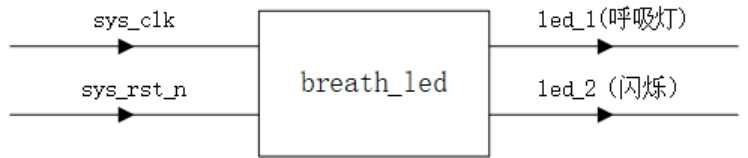
输入信号：
- sys_clk：系统时钟（50Mhz）
- sys_rst_n：复位信号（用PUSH按键实现）

输出信号：
- led_1：呼吸灯（PWM调光）
- led_2：闪烁灯（亮灭切换）
### **二、实现原理**
闪烁灯：每间隔两秒切换一次亮灭状态。
呼吸灯：led置1时亮，置0时灭。通过调节占空比实现灯的亮暗调节。呼吸灯一个亮灭周期为4s。

前半周期：由灭到亮；
后半周期：由亮到灭。
### **三、波形图**
1、通过调节占空比实现呼吸灯效果。
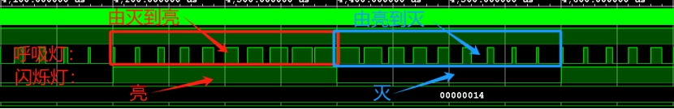
2、计数器
cnt_200us：计数器；
cnt_20ms：每次计数可控制空占比，计数到MAX则为单个脉冲循环；
cnt_2s：每次计数代表单个脉冲循环，计数到MAX以2s的间隔区分‘’亮到灭‘’和‘’灭到亮‘’；
led_flag：以2s的间隔区分‘’亮到灭‘’和‘’灭到亮‘‘。
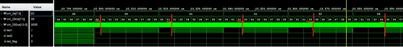
3、输出信号
led_1：占空比的改变控制呼吸灯的亮灭；
led_2：高低电平切换闪烁灯闪烁。


### **四、代码部分**

```verilog
`timescale 1ns / 1ns

module breath_led(//模块端口定义
	input 		sys_clk		,
	input 		sys_rst_n	,
	output reg 	led1		,
	output reg 	led2
);

parameter 	CNT_200US_MAX = 14'd10000	;//定义计数值的最大值
parameter 	CNT_20MS_MAX  = 7'd100		;
parameter 	CNT_2S_MAX    = 7'd100		;

reg [13:0] 	cnt_200us					;//定义200us的计数值，20ms的计数值，2s的计数值和led_flag
reg [7:0]  	cnt_20ms					;
reg [7:0]  	cnt_2s						;
reg 		led_flag					;	

always @(posedge sys_clk or negedge sys_rst_n) begin//200us的计时
   if(sys_rst_n == 1'b0)   //初始值为0
		cnt_200us <= 14'd0;
   else if(cnt_200us < (CNT_200US_MAX - 1) )   
		cnt_200us <= cnt_200us + 14'd1;
   else
		cnt_200us <= 14'd0;
end

always @(posedge sys_clk or negedge sys_rst_n) begin//计时20ms：每当cnt_200us计数到最大值，cnt_20ms改变一次
   if(sys_rst_n == 1'b0)   //初始值为0
		cnt_20ms <= 7'd0;
   else if(cnt_200us == (CNT_200US_MAX -1)) begin
		if(cnt_20ms == (CNT_20MS_MAX -1))
		  	cnt_20ms <= 7'd0;
		else
		   	cnt_20ms <= cnt_20ms + 7'd1;
   end
   else
		cnt_20ms <= cnt_20ms;
end

always @(posedge sys_clk or negedge sys_rst_n) begin//计时2s：每当cnt_20ms和cnt_200us计数到最大值，cnt_2s改变一次
   if(sys_rst_n == 1'b0)
		cnt_2s <= 7'd0;
   else if( (cnt_20ms == (CNT_20MS_MAX -1)) && (cnt_200us == (CNT_200US_MAX -1)) )  begin
		if(cnt_2s == ( CNT_2S_MAX -1 ))
		   	cnt_2s <= 7'd0;
		else
		 	cnt_2s <= cnt_2s +7'd1;
   end
   else
	 	cnt_2s <= cnt_2s;
end

always @(posedge sys_clk or negedge sys_rst_n) begin//控制led_flag，为0表示渐亮，为1表示渐灭。每当cnt_20ms、cnt_2s和cnt_200us计数到最大值，led_flag改变一次
   if(sys_rst_n == 1'b0)
		led_flag <= 1'b0;
   else if( (cnt_20ms == (CNT_20MS_MAX -1)) && (cnt_200us == (CNT_200US_MAX -1)) && (cnt_2s == ( CNT_2S_MAX -1 )) )
	 	led_flag <= ~led_flag;
   else
		led_flag <= led_flag;
end

always @(posedge sys_clk or negedge sys_rst_n) begin//控制led1灯的状态
   if(sys_rst_n == 1'b0)
		led1 <= 1'b0;
   else if( ((led_flag == 1'b1) && (cnt_20ms <= cnt_2s) ) || ( (led_flag == 1'b0) && (cnt_20ms > cnt_2s) ) )
	 	led1 <= 1'b1;
   else
		led1 <= 1'b0;
end

always @(posedge sys_clk or negedge sys_rst_n) begin//控制led2灯的状态
   if(sys_rst_n == 1'b0)
		led2 <= 1'b0;
   else if(led_flag == 1'b1)
		led2 <= 1'b1;
   else
	 	led2 <= 1'b0;
end

endmodule
```
**五、项目创建**
1、创建项目
打开vivado，Create Project，Next
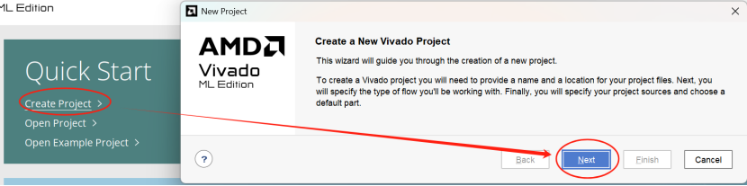
新建项目名称设置
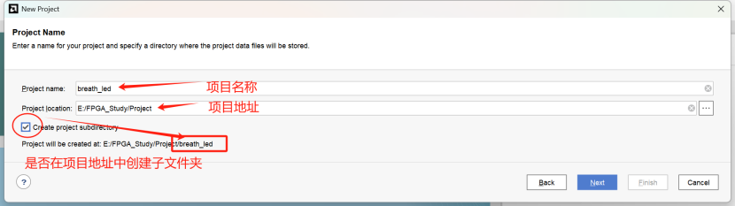
因为我们写的是RTL项目，所以选择RTL Project， 选择后点击next
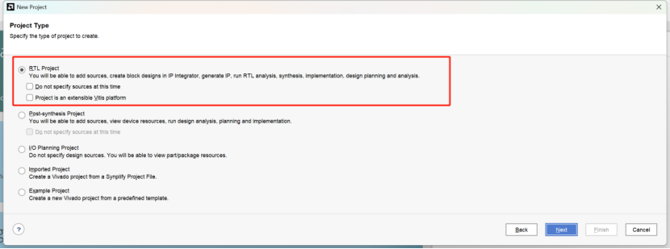
添加源代码（若已经写好直接add添加，也可next先跳过后续再创建），next，nest
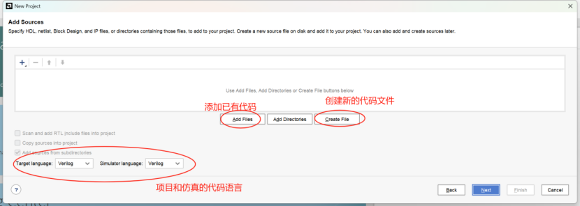
选择板卡类型
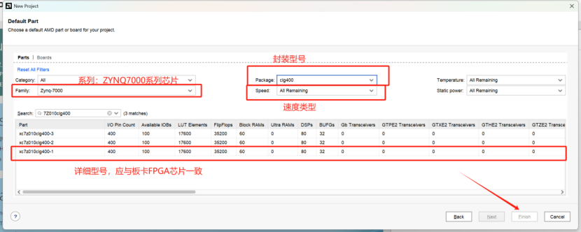
创建新项目完成
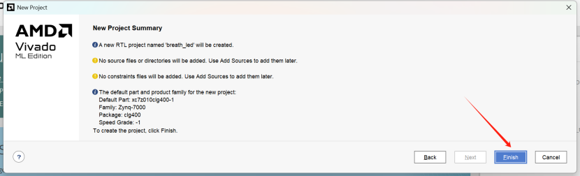
2、vivado界面
主要组件
1. 菜单栏 Menu Bar
2. 工具栏 Main Toolbar
3. 设计流程导航 Flow Navigator
4. 源+属性+网表 Data Windows Area
5. 快速访问搜索 Menu Command Quick Access Search Field
6. 工作空间 Workspace
7. 工程状态信息 Project Status Bar
8. 布局选择器 Layout Selector
9. 提示栏 Status Bar
10. 结果窗口 Results Windows Area
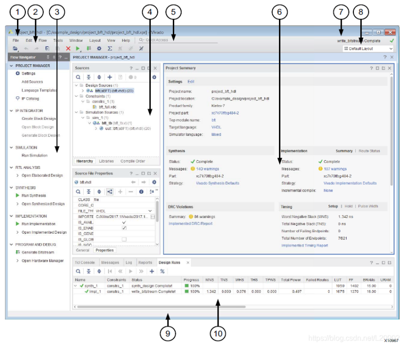
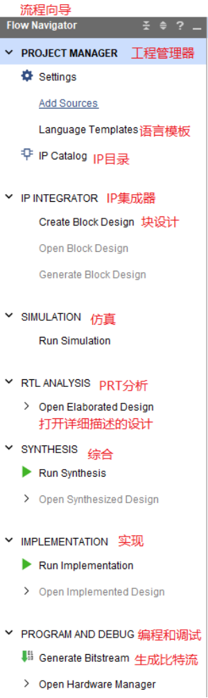
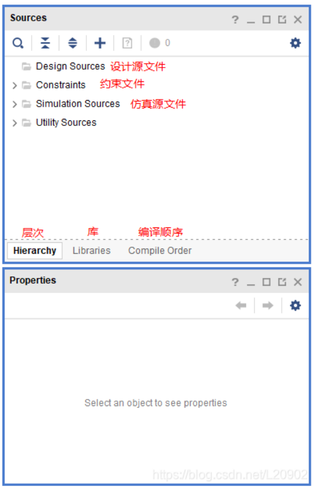
3、添加verilog代码
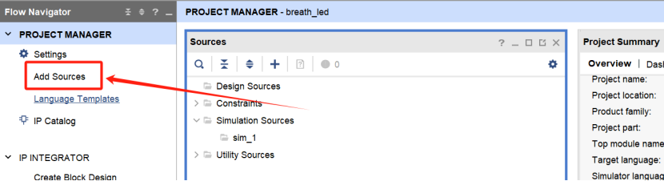
选择添加设计代码
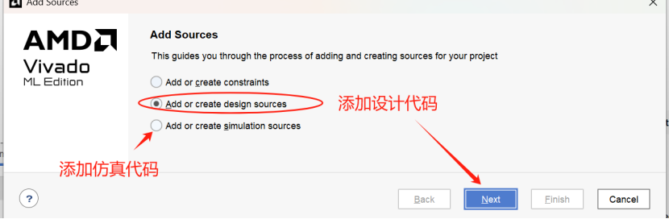
创建新的代码文件
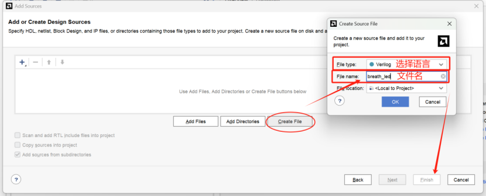
定义I/O port
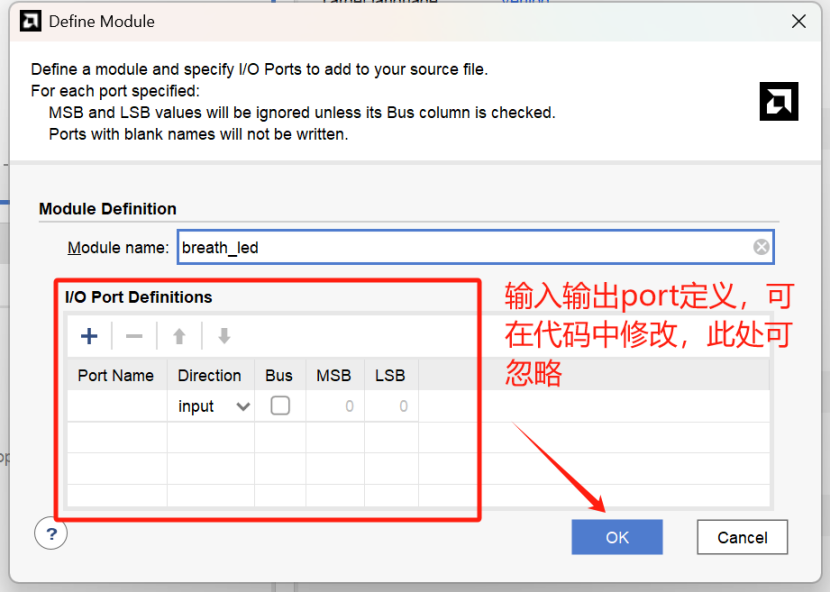
添加成功并编写代码
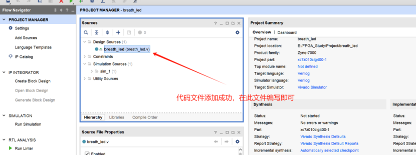
代码写完后进行综合，根据报错修改至代码正确为止
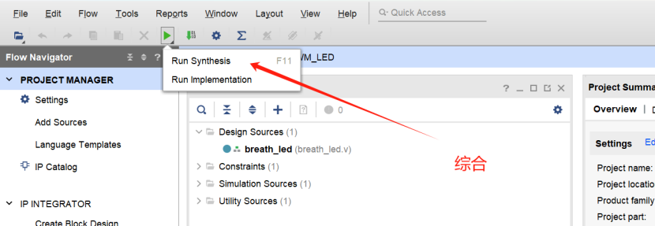
选择笔记本电脑最大核心数量可增加综合速度
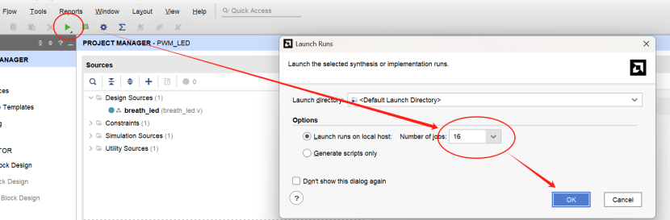
4、仿真
添加并编写tb文件进行仿真模拟
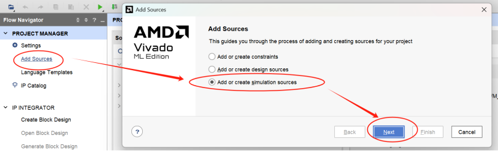
创建仿真文件，一般命名方式为：tb_xxxxx
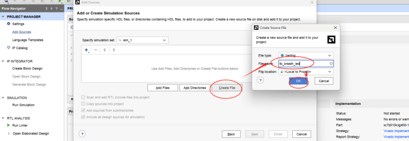
source文件夹中出现新创建的仿真文件，根据仿真需求编写仿真代码
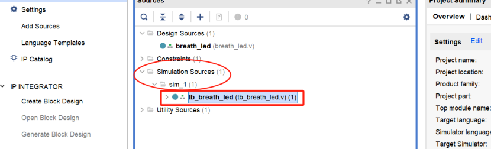
```verilog
`timescale 1ns / 1ns

module tb_breath_led();

//定义时钟周期为20ns
parameter CLK_PERIOD = 20;

//定义计数值的最大值
parameter CNT_200US_MAX = 14'd100;
parameter CNT_20MS_MAX  =  7'd10;
parameter CNT_2S_MAX    =  4'd10;

//定义输入和输出
reg   sys_clk     ;
reg   sys_rst_n   ;
wire  led1        ;
wire  led2        ;

initial begin
    sys_clk   <= 1'b0;
    sys_rst_n     <= 1'b0;
    #200
    sys_rst_n     <= 1'b1;
end

//产生时钟
always #(CLK_PERIOD/2) sys_clk=~sys_clk;

breath_led #( 
  .CNT_200US_MAX  (CNT_200US_MAX) ,
    .CNT_20MS_MAX     (CNT_20MS_MAX ) ,
    .CNT_2S_MAX       (CNT_2S_MAX   )
) 
u_breath_led(
    .sys_clk      (sys_clk)       ,
    .sys_rst_n    (sys_rst_n)     ,
    .led1         (led1)          ,
    .led2         (led2)
);
endmodule
```
仿真波形
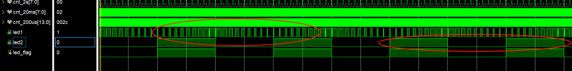
5、实现设计综合网表
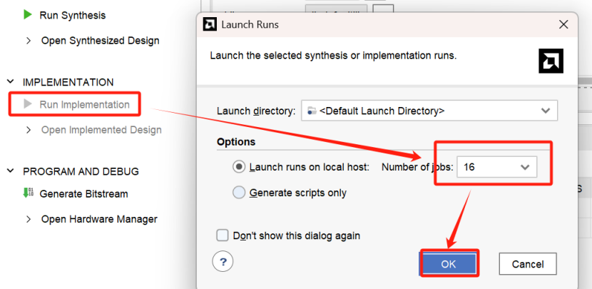
6、分配管脚
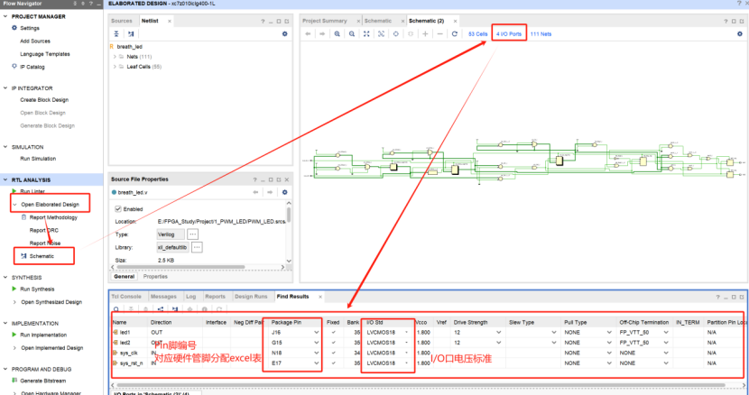
**六、上板测试，生成比特流，打开硬件管理**
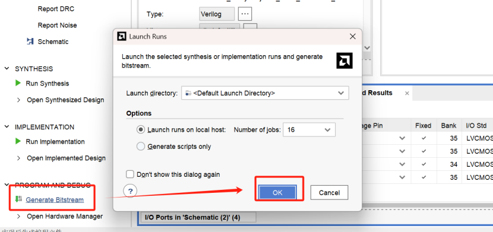