### **1、分辨率**
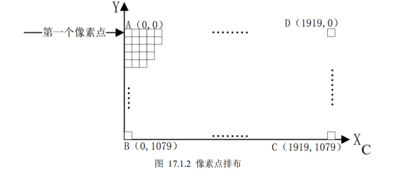

屏幕分辨率：1024* 600，即像素点个数

### **2像素格式**

像素格式：RGB888 、RGB565

RGB888：R、G、B这三部分分别使用8bit的数据，那么一个像素点就是8bit*3=24bit，一个像素点3个字节
RGB565 ：只需要两个字节

开发板上RGB TFT-LCD接口采用RGB888的像素格式
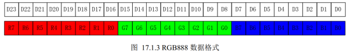

红色对应的值是24’hFF0000，绿色对应的值是 24’h00FF00，蓝色对应值为 24’h0000FF

### **3、LCD屏幕接口**

常用接口：VGA、 HDMI、 DP 、RGB LCD 、HDMI

启明星具有的接口：RGB LCD 、 HDMI
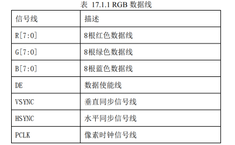
40PIN 的 FPC 座（0.5mm 间距） ：RGB888 ，支持触摸屏和背光控制
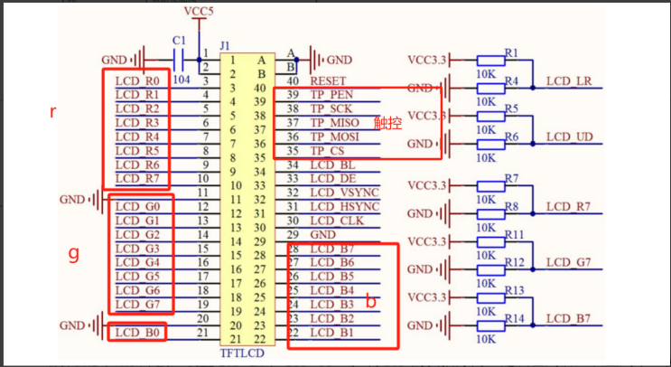

Bl是背光控制

右侧的几个电阻，并不是都焊接的，而是可以用户自己选择。
默认R1和R6焊接，设置LCD_LR和LCD_UD，控制LCD的扫描方向，是从左到右，从上到下（横屏看）
LCD_R7/G7/B7则用来设置LCD的 ID 。通过在模块上面，控制 R7/G7/B7 的上/下拉，来自定义 LCD 模块的 ID 帮助 MCU 判断当前 LCD 面板的分辨率和相关参数

我的显示器是这块
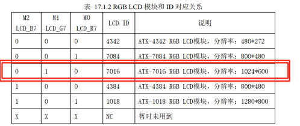
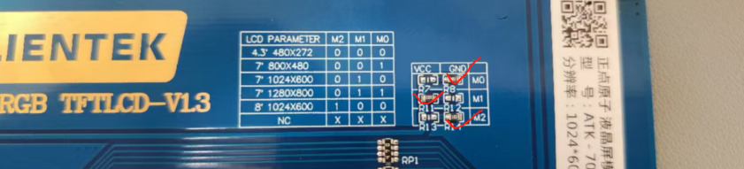

在程序里可以这样通过LCD_R7/G7/B7判断分辨率

### **4、LCD时间参数**
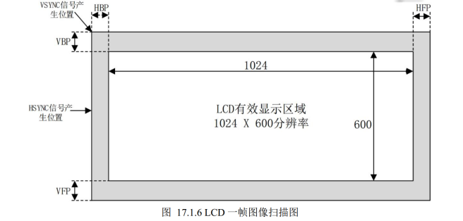

l HSYNC 行同步信号
l HSPW 行同步信号宽度，也就是HSYNC信号持续时间。HSYNC 不是脉冲，是需要持续一段时间才有效的
l HBP 行显示后沿
l HOZVAL 行有效显示区域，假如屏幕分辨率为 1024*600，那么 HOZVAL就是 1024
l HFP 行显示前沿

当 HSYNC 信号发出以后，需要等待 HSPW+HBP 个 CLK 时间才会接收到真正有效的像素数据
当显示完一行数据以后需要等待 HFP 个 CLK 时间才能发出下一个 HSYNC 信号
显示一行所需要的时间就是： HSPW + HBP + HOZVAL + HFP。
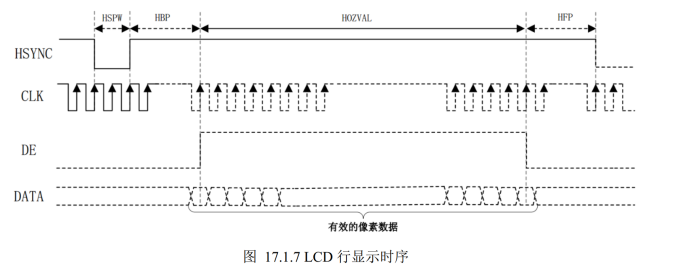

l VSYNC 帧同步信号
l VSPW：帧同步信号宽度。也就是 VSYNC 信号持续时间，单位为 1 行的时间。 
l VBP：帧显示后沿
l LINE：帧有效显示区域，即显示一帧数据所需的时间，屏幕分辨率为 1024*600，那么 LINE就是600 行的时间。
l VFP：帧显示前沿

显示一帧所需要的时间就是： VSPW+VBP+LINE+VFP 个行时间，
最终的计算公式：T = (VSPW+VBP+LINE+VFP) * (HSPW + HBP + HOZVAL + HFP)
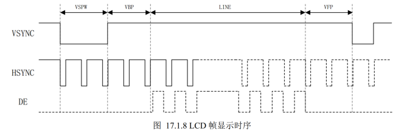

RGB LCD 液晶屏有两种数据同步方式：

l 行场同步模式（HV Mode）
l 数据使能同步模式（DE Mode）

（1）行场同步模式时，LCD接口的时序与 VGA 接口的时序图非常相似，只是参数不同。行同步信号（HSYNC）和场同步信号（VSYNC）作为数据的同步信号，此时数据使能信号（DE）必须为低电平
（2）DE同步模式时，LCD 的DE信号作为数据的有效信号。只有同时扫描到帧有效显示区域和行有效显示区域时，DE信号才有效（高电平）。当选择DE同步模式时，此时行场同步信号VS和HS必须为高电平。

实验采用 DE 同步的方式驱动 LCD 液晶屏。

### **6、像素时钟**

像素时钟就是 RGB LCD 的时钟信号 

一帧图像所需要的时钟数：
N=(VSPW+VBP+LINE+VFP)*(HSPW+HBP+HOZVAL+HFP)
=(3+20+600+12)*(20+140+1024+160)
=635*1344
=853440 

60 帧 ：
853440 * 60 = 51206400≈51.2M 

所以像素时钟就是51.2MHz（输出一个50MHz的时钟，方便写代码）
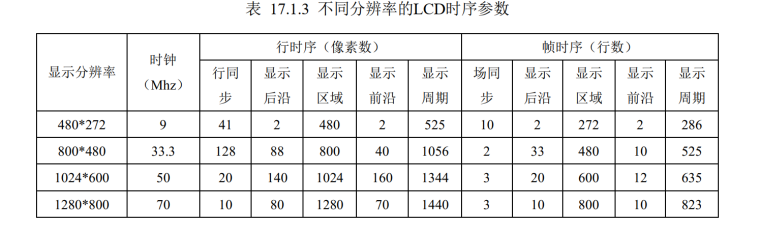

## **程序设计**

读取 ID 模块：获取 LCD 屏的 ID；
时钟分频模块：根据 LCD ID 来输出不同频率的像素时钟；
LCD 显示模块：负责产生液晶屏上显示的数据，即彩条数据；
LCD 驱动模块：根据 LCD 屏的 ID，输出不同参数的时序，来驱动 LCD 屏，并数据显示到 LCD 屏上。
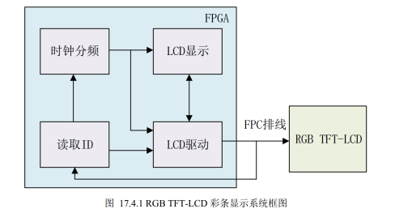

## **上板验证**
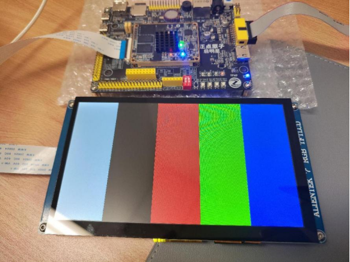