Obsidian真鸡巴好用啊
# 一、Obsidian软件安装


# 二、使用技巧

## 2.1 图片附件一定要改成子目录

方便对附件进行整理

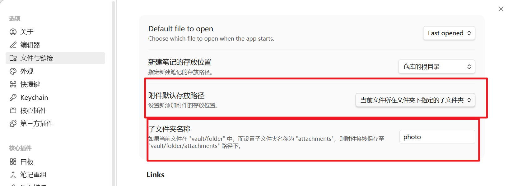

效果如下，所有图片及附件统一放在子目录下

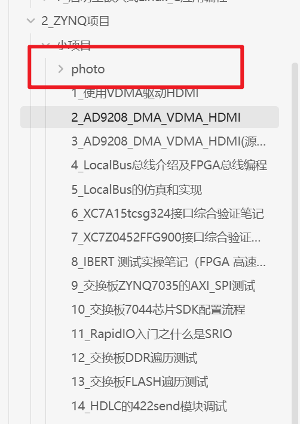


## 2.2 Wiki链接一定要关掉
否则影响导出word文档，word文档只能识别标准markdown格式，无法识别Wiki格式

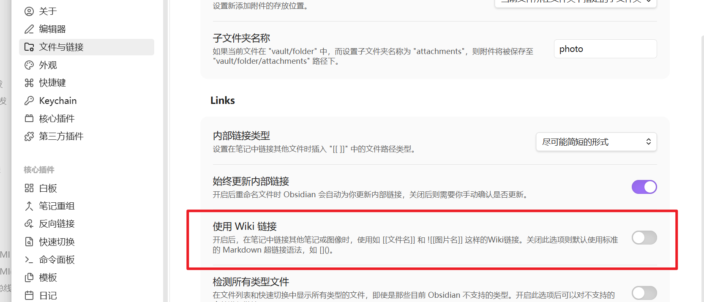


## 2.3 善用快捷键
常用快捷键建议设置好，可以极大增强使用便携度
如，一级标题，二级标题快捷键

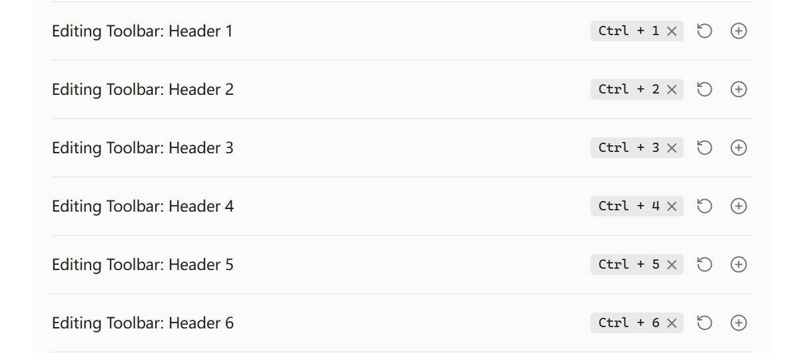

命令面板快捷键


# 三、Obsidian插件

## 3.1 目录侧边栏插件
插件名称：Quite Outline


插件效果：

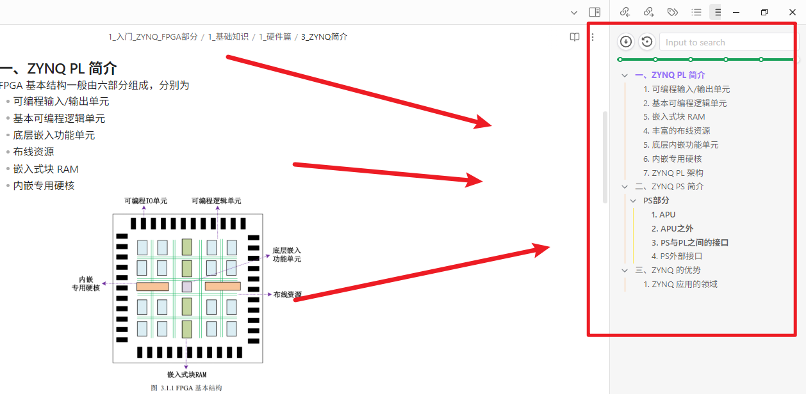


## 3.2 代码块插件
插件名称：Code Block

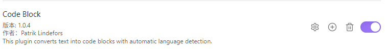

使用说明：
插件效果：

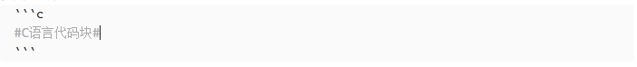
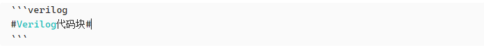


## 3.3 滚轮调整图片大小
插件名称：Mousewheel Image zoom

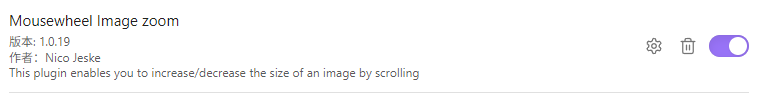

使用说明：alt+滚轮就可以快捷调整图片大小


## 3.4 删除附件同时删除本地文件
插件名称File Cleaner Redux

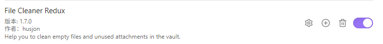


## 3.5 查看图片插件
插件名称：Image Toolkit

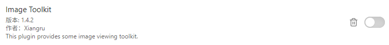

需要改一下配置，因为一点就自动放大很影响体验
改成alt＋左键，放大图片

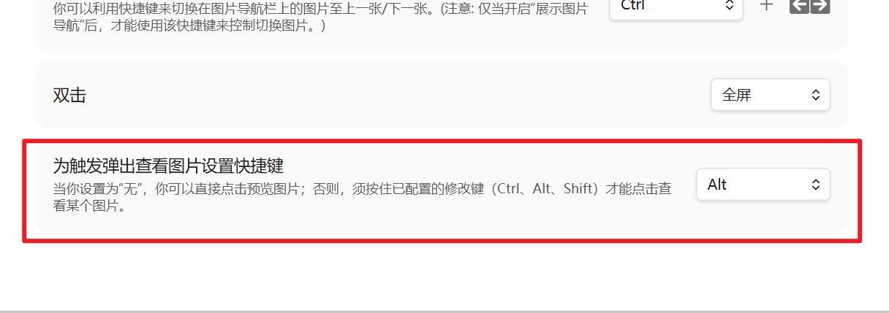

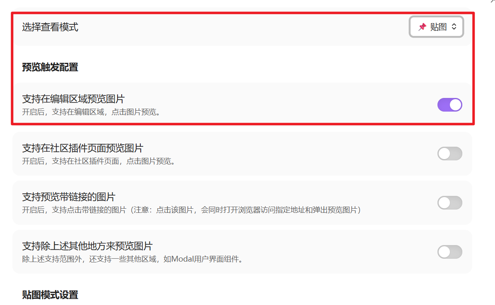


## 3.6 导出文档为word格式
先安装Pandoc
再装插件Enhancing Export
貌似还得改一下自定义参数，如何更改请自行研究

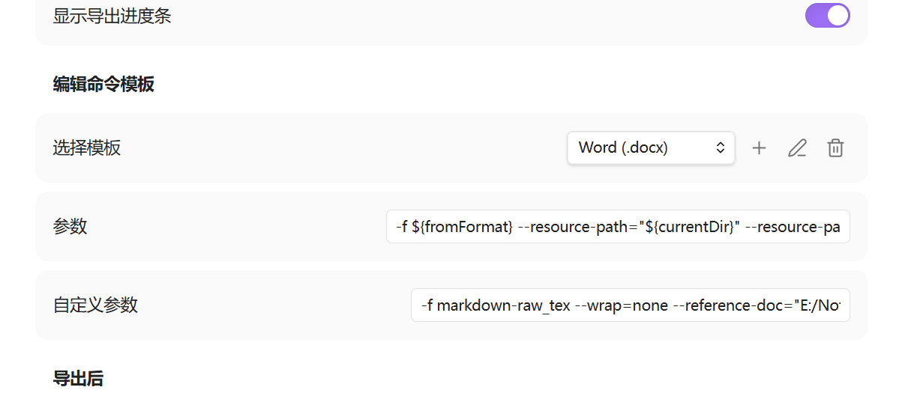

word文档导出肯定存在巨量问题，下面为遇到的问题及解决

### 3.6.1 避免使用---分隔符
使用横线分隔符导致文档文字竖着排列
[大佬们求助 我从obsidian导出为word出来的word文件 一开始是好的后面就 一行一个字 不知道怎么搞了 - 疑问解答 - Obsidian 中文论坛](https://forum-zh.obsidian.md/t/topic/38844/1)

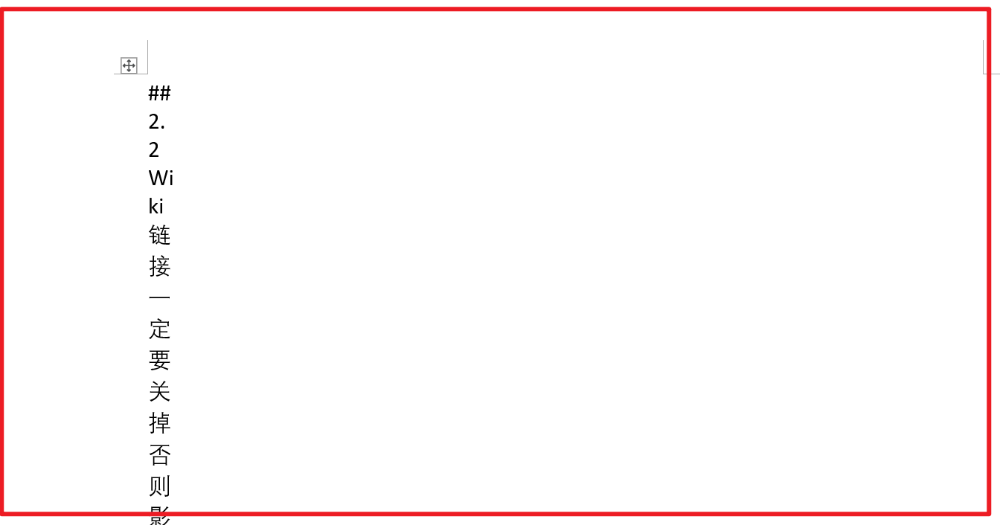


## 3.7 Linter------wiki转markdown插件
导出word以后发现图片无法显示，是图片代码用的wiki，所以word没法识别，需要一个插件把wiki格式的图片转成markdown以后图片才能正常显示

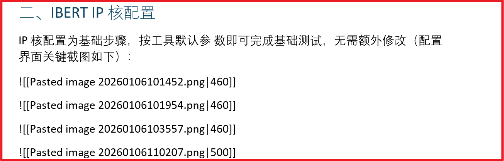

可以通过正则表达式替换修改wiki成标准markdown
具体怎么改建议问问AI

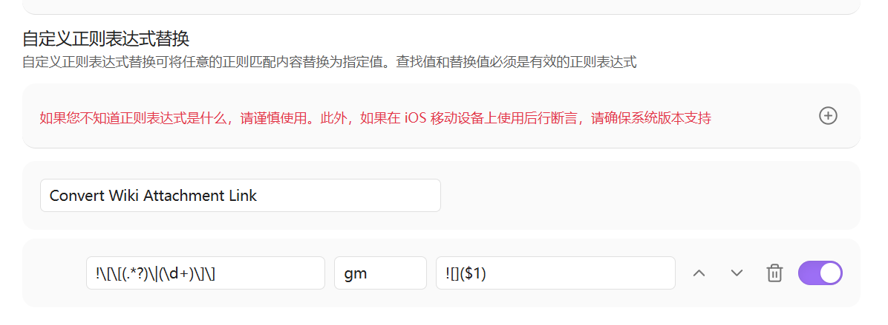

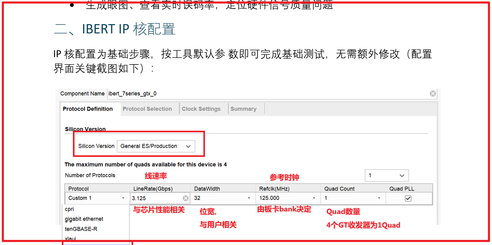

改完以后确实导出图片正常了，但是obsidian内部显示又出问题了
<font color="#ff0000">该插件使用需慎重。记得导出以后回复原文档内容</font>

测试了半天无论怎么改格式都不行，好像是图片存的位置有问题，因为这个文档移过地方，但是附件没有跟着移动到子目录，所以尝试将附件批量移动到当前子目录试试

使用File cooker

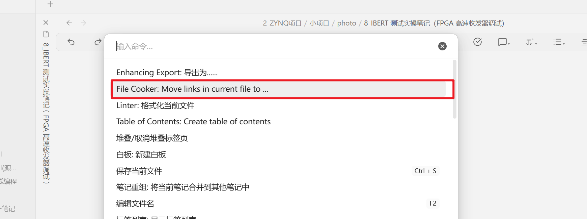

将文件里的连接移动到该文件子目录下

然后再用linter转成markdown格式


<font color="#ff0000">最终操作步骤如下，完全正确</font>
1、用File cooker整理附件目录到子目录下的photo
2、再通过两步正则修改，完成对图片链接的格式变更

```
1
!\[\[(.*?)\|.*?\]\]

2
(?<=!\[\]\(.*?)\s(?=.*?\))
%20
```

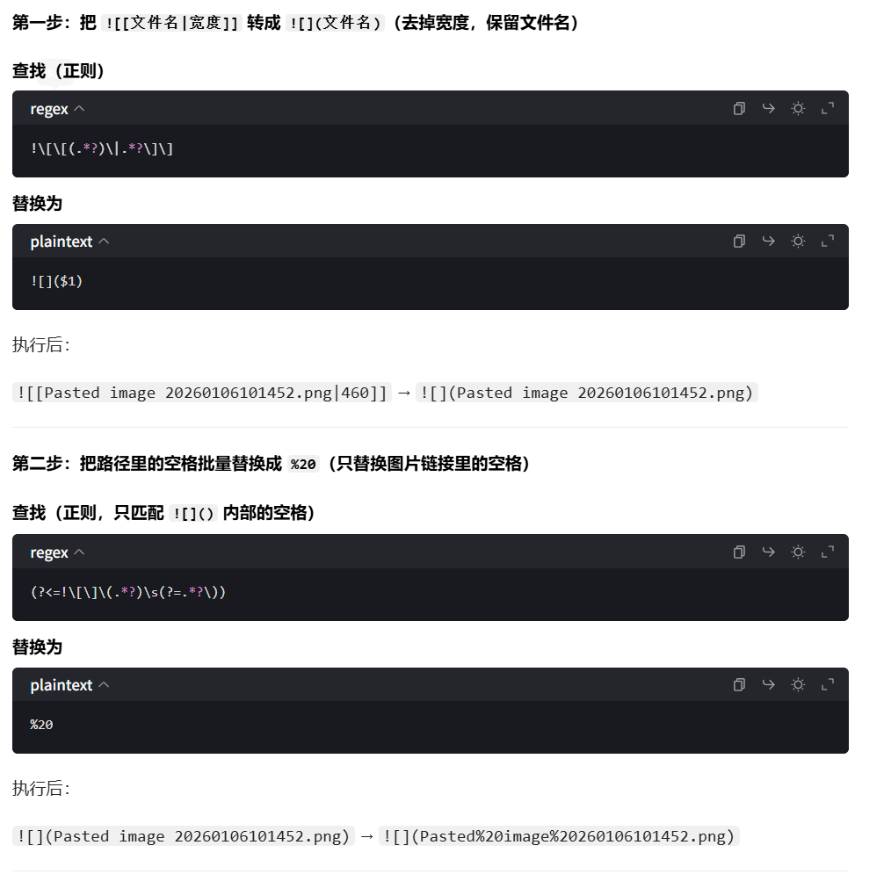
3、再导出为word格式，图片显示正常，obsidian内部图片显示也正常


## 3.8 **Editing Toolbar**
编辑bar
安装即可使用

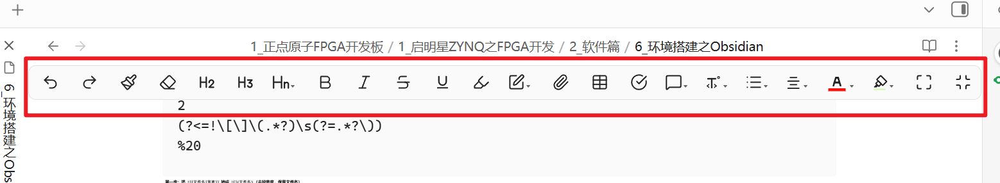


