# 一、将nolebase工程fork到github
https://github.com/Jackiexiao/nolebase-template
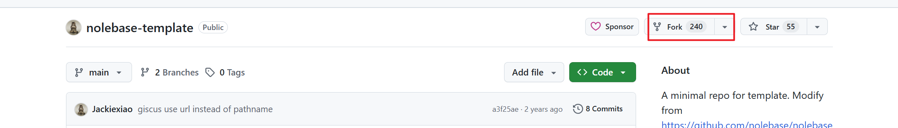

# 二、快速部署

### 2.1 vercel链接github

将github中克隆的nolebase，import到vercel中
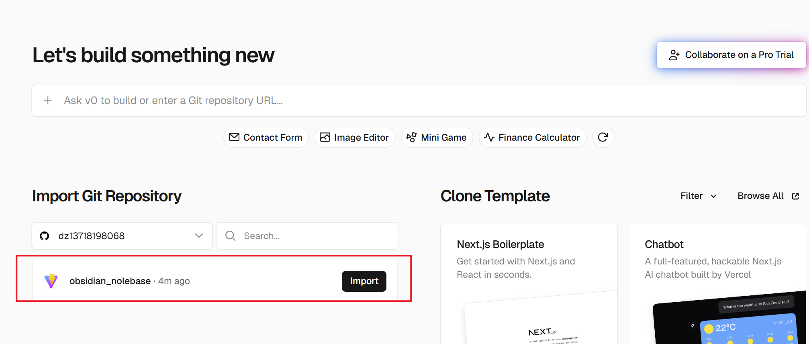

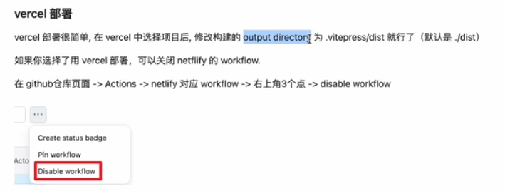
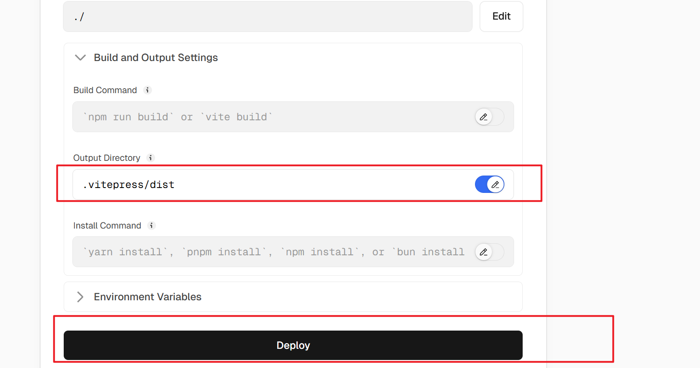

部署完成
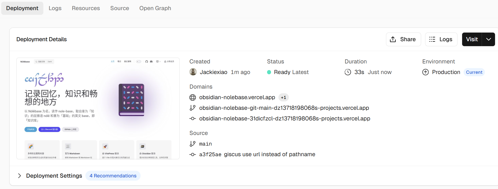

### 2.2 将博客修改为个人内容

回到github，打开github desktop
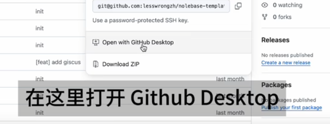
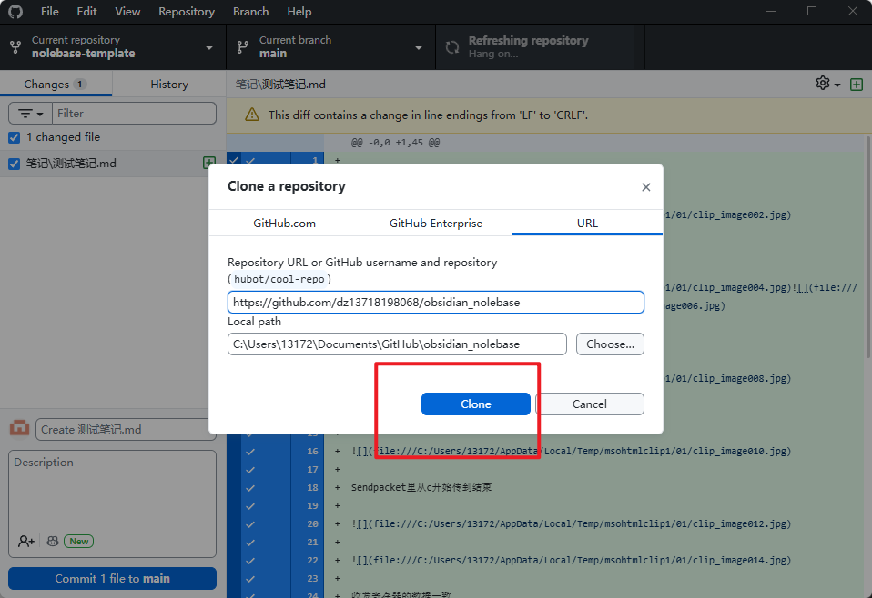
克隆到本地

用vscode打开工程
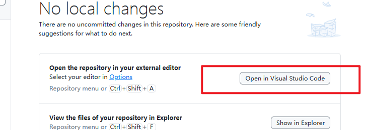

修改完博客网站代码后回到github desktop，更新代码，push到hub上
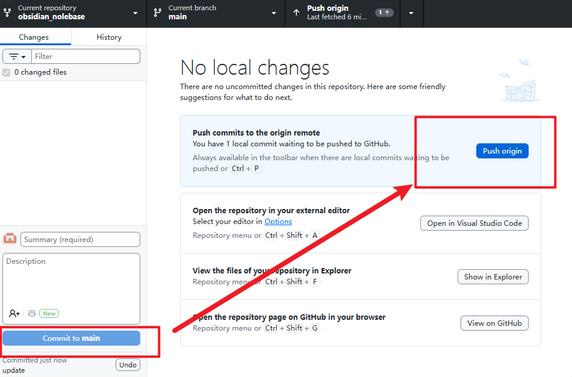
push完以后，git上面会自动更新
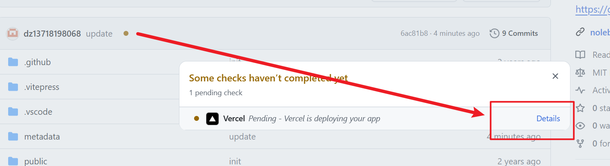vercel会重新部署网站

把obsidian的笔记内容移植到本地vscode代码的笔记页面就可以了
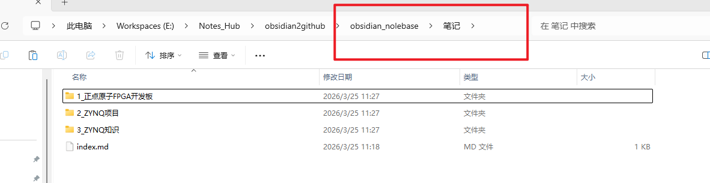

### 2.3 注意事项

图片文件名称不能有空格
用power rename批量将空格删除
再用正则把所有图片链接更改
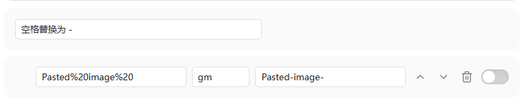

笔记里不要放.v文件的链接

# 三、更改成个人域名

将域名再vercel中更改成个人域名

