[Microsemi Libero系列教程（全网首发）-CSDN博客](https://blog.csdn.net/whik1194/article/details/102901710)

# 一、创建工程
新建工程，命名，路径

选择芯片型号
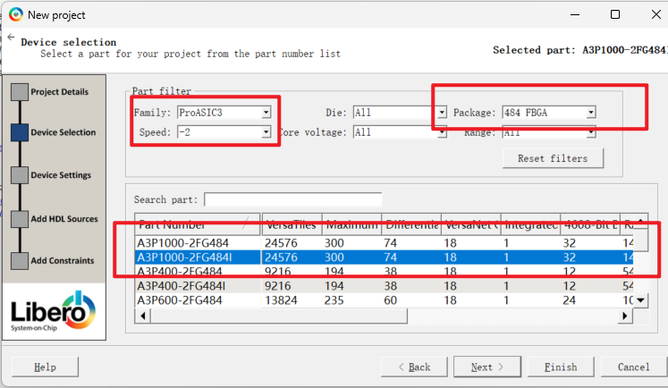

电平选择：根据文档NI_HRD中的接口电平，可以判断，在libero中电平选择LVCMOS33
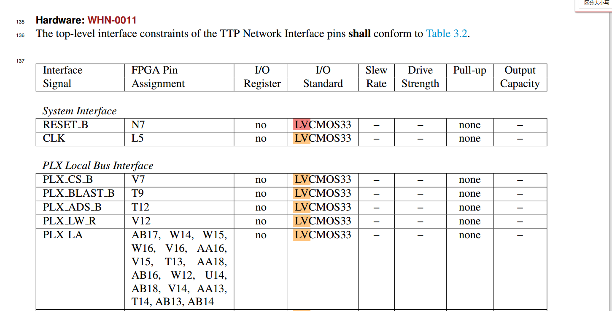

导入HDL设计文件，PDC约束文件，没有，直接跳过
创建HDL文件

写一个简单计数器，用于ila抓数
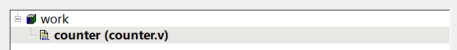
创建smartdesign图形化工具

检查语法错误
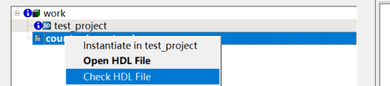
设顶层
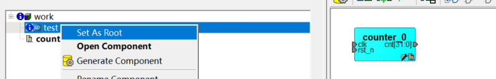
把端口设为i/o引脚

Generate Component生成组件文件
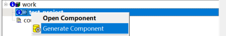
找几个output口作为工具验证的出口

使用逻辑分析仪

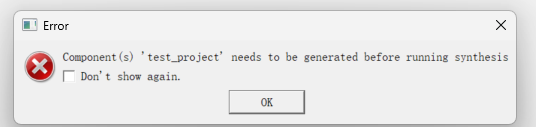
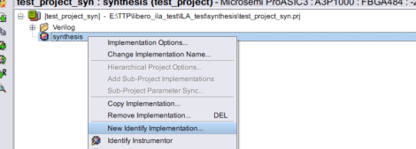

配置内存深度
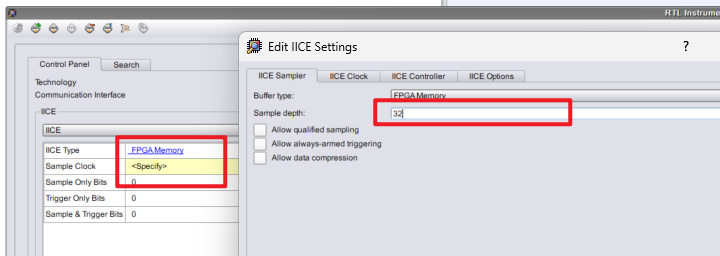
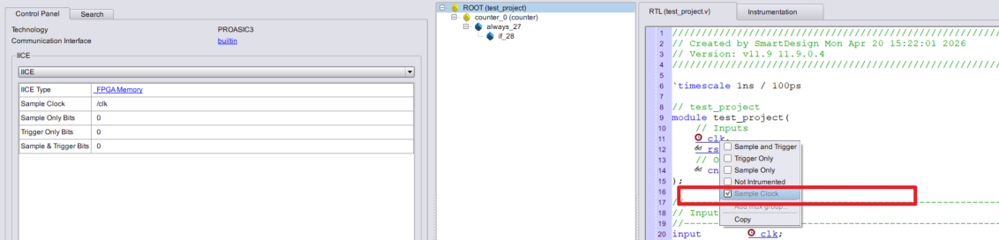
设置完信号以后run
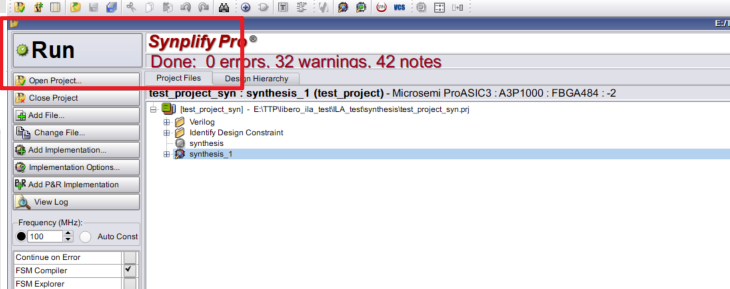

# 二、引脚分配

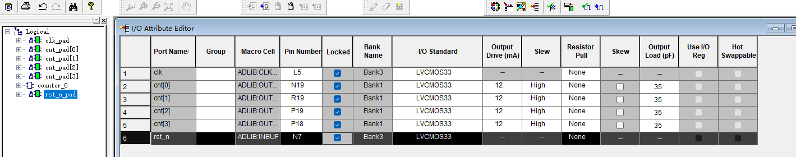

# 三、仿真

# 四、逻辑分析仪ILA

