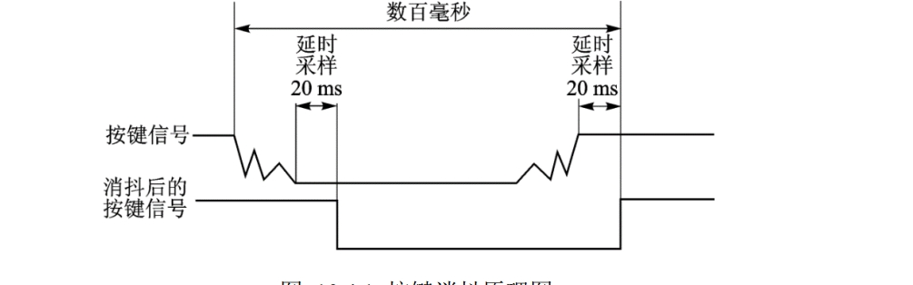
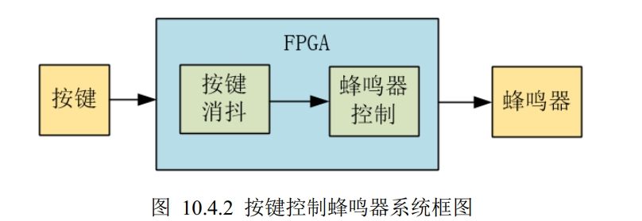
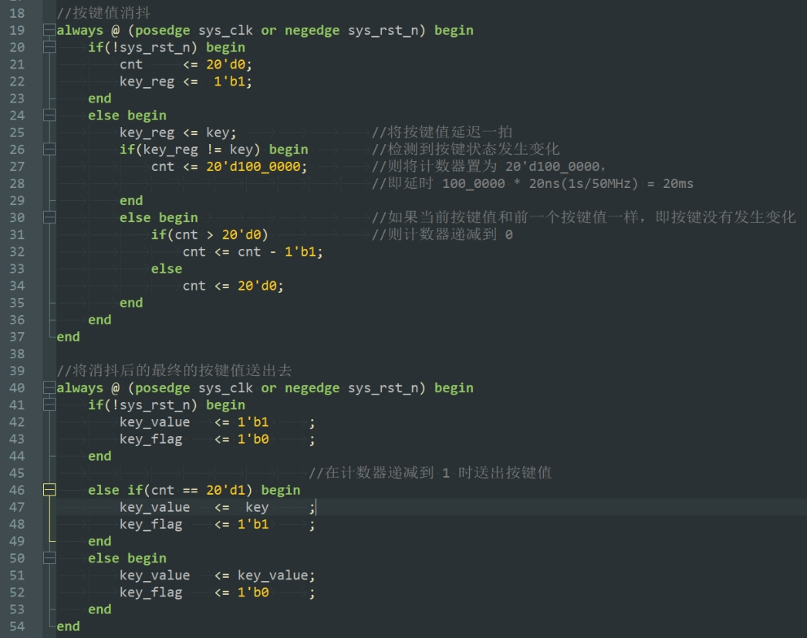
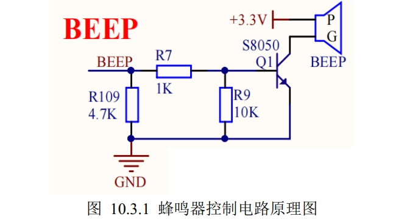

蜂鸣器分为：
有源蜂鸣器：控制相对简单，由于内部自带震荡源，只要加上合适的直流电压即可发声。 
无源蜂鸣器：成本更低，且发声频率可控。 

任务：初始状态为蜂鸣器鸣叫，按下按键后蜂鸣器停止鸣叫，再次按下开关，蜂鸣器重新鸣叫。

为避免采集错误按键状态，增加按键消抖处理
按键消抖：波形稳定后再改变按键状态

消抖思路：按键抖动时不改变key_reg置。按键稳定持续20ms后才会改变key_reg值

蜂鸣器：置1蜂鸣，置0静音
