- [一、Verilog 程序框架](2_Verilog%20程序框架和高级知识点.md#一、Verilog%20程序框架)
	- [3.1 注释](2_Verilog%20程序框架和高级知识点.md#一、Verilog%20程序框架#3.1%20注释)
	- [3,2 关键字](2_Verilog%20程序框架和高级知识点.md#一、Verilog%20程序框架#3,2%20关键字)
	- [3.3 程序框架](2_Verilog%20程序框架和高级知识点.md#一、Verilog%20程序框架#3.3%20程序框架)
- [二、Verilog 高级知识点](2_Verilog%20程序框架和高级知识点.md#二、Verilog%20高级知识点)
	- [2.1 阻塞赋值（ Blocking）](2_Verilog%20程序框架和高级知识点.md#二、Verilog%20高级知识点#2.1%20阻塞赋值（%20Blocking）)
	- [2.2 非阻塞赋值（ Non-Blocking）](2_Verilog%20程序框架和高级知识点.md#二、Verilog%20高级知识点#2.2%20非阻塞赋值（%20Non-Blocking）)
	- [2.3 assign 和 always 区别](2_Verilog%20程序框架和高级知识点.md#二、Verilog%20高级知识点#2.3%20assign%20和%20always%20区别)
	- [2.4 带时钟和不带时钟的 always](2_Verilog%20程序框架和高级知识点.md#二、Verilog%20高级知识点#2.4%20带时钟和不带时钟的%20always)
	- [2.5 什么是 latch](2_Verilog%20程序框架和高级知识点.md#二、Verilog%20高级知识点#2.5%20什么是%20latch)
	- [2.6 状态机](2_Verilog%20程序框架和高级知识点.md#二、Verilog%20高级知识点#2.6%20状态机)
	- [2.7 模块化设计](2_Verilog%20程序框架和高级知识点.md#二、Verilog%20高级知识点#2.7%20模块化设计)

# 一、Verilog 程序框架

## 3.1 注释
**注释语句**
```verilog
/* statement1 ， 
statement2， 
......
statementn */
```
**单行注释**（推荐）
```verilog
//statement1
```
## 3,2 关键字
**所有关键字**
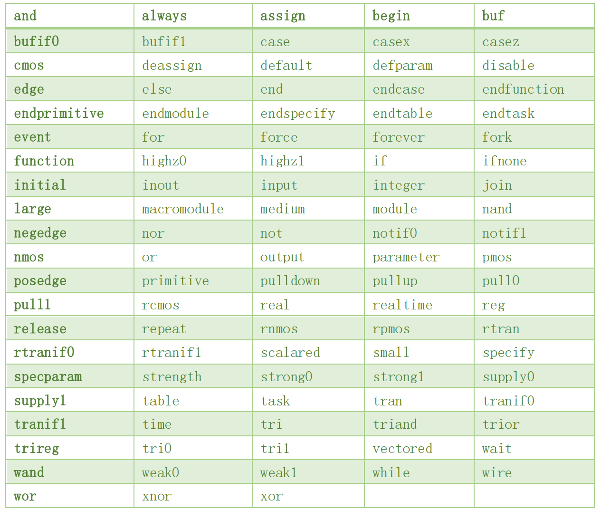
**常用关键字**
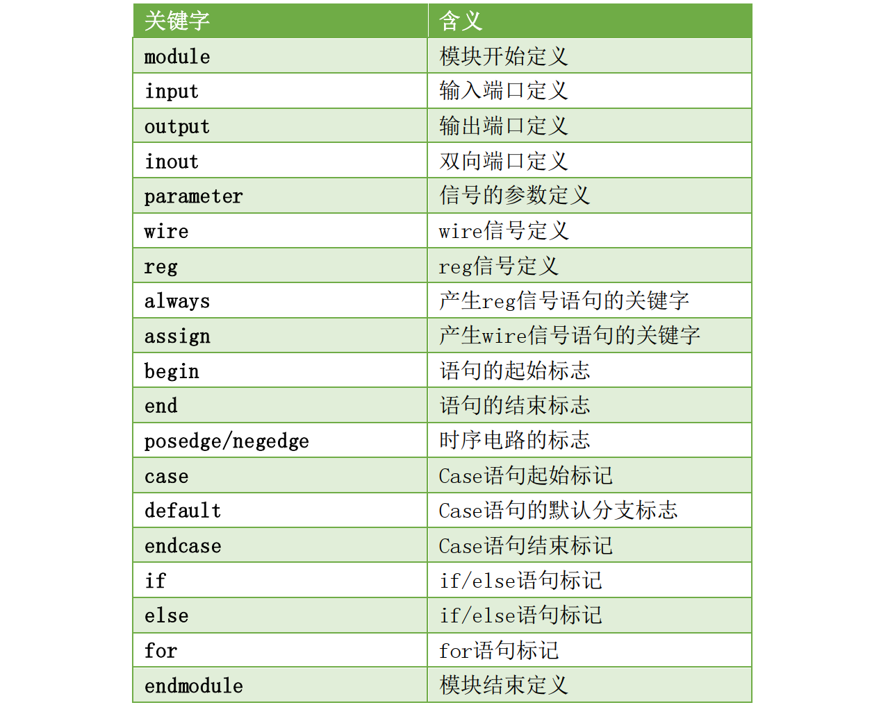
==关键字需小写==
例如，always是关键字，ALWAYS是标识符。
## 3.3 程序框架
```verilog
module led(
	input 				sys_clk 	, 	//系统时钟
	input 				sys_rst_n	, 	//系统复位，低电平有效
	output reg 	[3:0] 	led 			//4位LED灯
);

//parameter define
parameter WIDTH 	= 25 		;	//板载50M时钟=20ns，0.5s/20ns=25000000，需要25bit
parameter COUNT_MAX = 25_000_000; 	//位宽

//reg define
reg [WIDTH-1:0] counter 	;
reg [1:0] 		led_ctrl_cnt;

//wire define
wire counter_en ;

//***********************************************************************************
//** main code
//***********************************************************************************

//计数到最大值时产生高电平使能信号
assign counter_en = (counter == (COUNT_MAX - 1'b1)) ? 1'b1 : 1'b0;

//用于产生0.5秒使能信号的计数器
always @(posedge sys_clk or negedge sys_rst_n) begin
	if (sys_rst_n == 1'b0)
		counter <= 1'b0;
	else if (counter_en)
		counter <= 1'b0;
	else
		counter <= counter + 1'b1;
end

//led流水控制计数器
always @(posedge sys_clk or negedge sys_rst_n) begin
	if (sys_rst_n == 1'b0)
		led_ctrl_cnt <= 2'b0;
	else if (counter_en)
		led_ctrl_cnt <= led_ctrl_cnt + 2'b1;
end

//通过控制IO口的高低电平实现发光二极管的亮灭
always @(posedge sys_clk or negedge sys_rst_n) begin
	if (sys_rst_n == 1'b0)
		led <= 4'b0;
	else begin
		case (led_ctrl_cnt)
			2'd0 : led <= 4'b0001;
			2'd1 : led <= 4'b0010;
			2'd2 : led <= 4'b0100;
			2'd3 : led <= 4'b1000;
			default : ;
		endcase
	end
end

endmodule
```
# 二、Verilog 高级知识点
- 阻塞赋值和非阻塞赋值
- assign 和 always 语句差异
- 锁存器
- 状态机
- 模块化设计
## 2.1 阻塞赋值（ Blocking）
在同一个always 中，一条阻塞赋值语句如果没有执行结束，那么该语句后面的语句就不能被执行，即被“阻塞”。
符号“ =”用于阻塞的赋值（如:b = a;），阻塞赋值“ =”在 begin 和 end 之间的语句是顺序执行，属于串行语句。

在这里定义两个缩写：
RHS：赋值等号右边的表达式或变量可以写作 RHS 表达式或 RHS 变量； 
LHS： 赋值等号左边的表达式或变量可以写作 LHS 表达式或 LHS 变量；

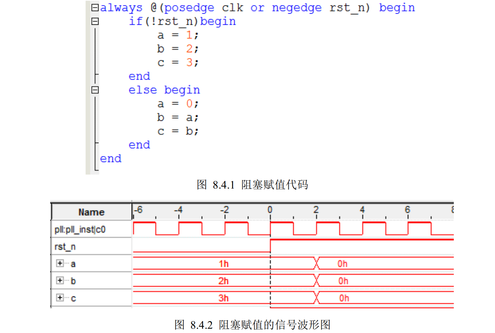
阻塞赋值语句
在复位的时候（ rst_n=0）， a=1， b=2， c=3；而结束复位之后（波形图中的 0 时刻），当 clk 的上升沿到来时（波形图中的 2 时刻）， a=0， b=0， c=0。这是因为阻塞赋值是在当前语句执行完成之后，才会执行后面的赋值语句，因此首先执行的是 a=0，赋值完成后将 a 的值赋值给 b，由于此时 a 的值已经为 0，所以 b=a=0，最后执行的是将 b 的值赋值给 c，而 b的值已经赋值为 0，所以 c 的值同样等于 0。
## 2.2 非阻塞赋值（ Non-Blocking）
“<=”
非阻塞赋值的操作过程可以看作两个步骤：
1. 赋值开始的时候，计算 RHS；
2. 赋值结束的时候，更新 LHS。
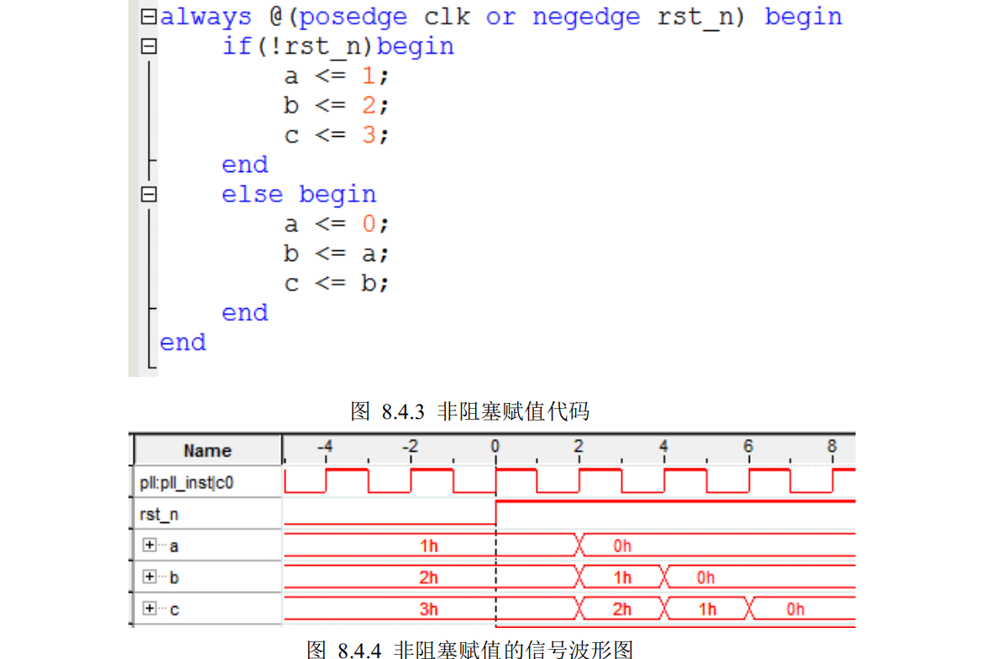
非阻塞赋值语句，从波形图中可以看到，在复位的时候（ rst_n=0）， a=1， b=2， c=3；而结束复位之后（波形图中的 0 时刻），当 clk 的上升沿到来时（波形图中的 2 时刻）， a=0， b=1， c=2。这是因为非阻塞赋值在计算 RHS 和更新 LHS 期间，允许其它的非阻塞赋值语句同时计算 RHS 和更新 LHS。在波形图中的 2 时刻， RHS 的表达是 0、 a、 b，分别等于 0、 1、 2，这三条语句是同时更新LHS，所以 a、 b、 c 的值分别等于 0、 1、 2。

==描述组合逻辑电路的时候，使用阻塞赋值==
比如 assign 赋值语句和不带时钟的 always 赋值语句，这种电路结构只与输入电平的变化有关系
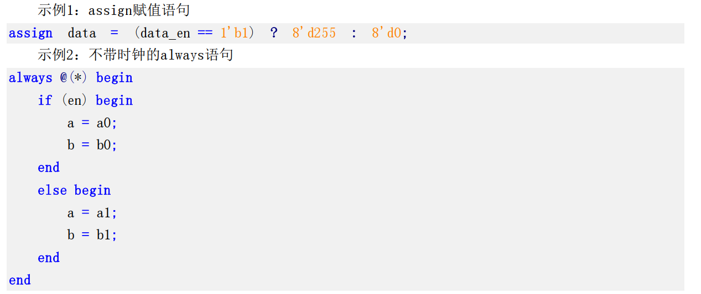
==在描述时序逻辑的时候，使用非阻塞赋值==
综合成时序逻辑的电路结构，比如带时钟的 always 语句；
这种电路结构往往与触发沿有关系，只有在触发沿时才可能发生赋值的变化，
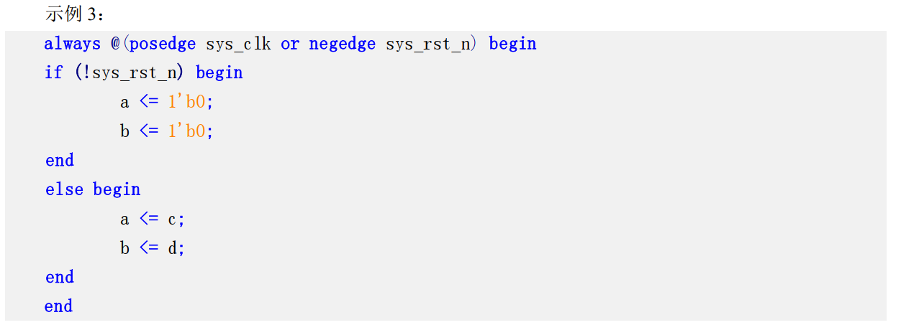
## 2.3 assign 和 always 区别
assign 语句使用时不能带时钟。
always 语句可以带时钟， 也可以不带时钟。不带时钟时逻辑功能和assign一致，只产生组合逻辑。
```verilog
assign counter_en = (counter == (COUNT_MAX - 1'b1)) ? 1'b1 : 1'b0;

always @(*) begin
	case (led_ctrl_cnt)
		2'd0 	: led = 4'b0001;
		2'd1 	: led = 4'b0010;
		2'd2 	: led = 4'b0100;
		2'd3 	: led = 4'b1000;
		default : led = 4'b0000;
	endcase
end
```
## 2.4 带时钟和不带时钟的 always
always 语句可以带时钟， 也可以不带时钟。==在 always 不带时钟时，逻辑功能和 assign 完全一致,虽然产生的信号定义还是 reg 类型，但是该语句产生的还是组合逻辑。==
```verilog
reg [3:0] led；

always @(*) begin
	case (led_ctrl_cnt)
		2'd0 	: led = 4'b0001;
		2'd1 	: led = 4'b0010;
		2'd2 	: led = 4'b0100;
		2'd3 	: led = 4'b1000;
		default : led = 4'b0000;
	endcase
end
```
在 always 带时钟信号时，这个逻辑语句才能产生真正的寄存器，如下示例 counter 就是真正的寄存器。
```verilog
//用于产生 0.5 秒使能信号的计数器
always @(posedge sys_clk or negedge sys_rst_n) begin
	if (sys_rst_n == 1'b0)
		counter <= 1'b0			 ;
	else if (counter_en)
		counter <= 1'b0			 ;
	else
		counter <= counter + 1'b1;
end
```
## 2.5 什么是 latch
latch 是指锁存器，一种对脉冲电平敏感的存储单元电路。
锁存器和寄存器都是基本存储单元
- 锁存器是电平触发的存储器
- 寄存器是边沿触发的存储器
两者的基本功能是一样的，都可以存储数据
- 锁存器是组合逻辑产生的
- 寄存器是在时序电路中使用，由时钟触发产生的

latch 的主要危害是会产生毛刺（glitch），这种毛刺对下一级电路是很危险的。
并且其隐蔽性很强，不易查出。
==因此，在设计中，应尽量避免 latch 的使用。==

两个出现latch的原因。if 或者 case 语句不完整的描述， 
比如：
1. if 缺少 else 分支
2. case 缺少 default 分支

解决：
==if 必须带 else 分支， case必须带 default 分支==
不带时钟的 always 语句中 if 或者 case 语句不完整描述才会产生 latch， 带时钟的 always 语句 if 或者 case 语句不完整描述不会产生 latch。
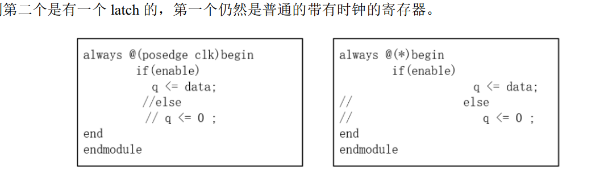
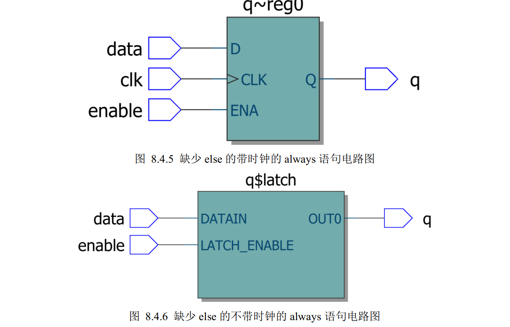
## 2.6 状态机
有限状态机（Finite State Machine，缩写为 FSM）
一种在有限个状态之间按一定规律转换的时序电路，可以认为是组合逻辑和时序逻辑的一种组合。
- 摩尔Mealy 状态机：组合逻辑的输出不仅取决于当前状态，还取决于输入状态。
- 米勒Moore 状态机：组合逻辑的输出只取决于当前状态。

1. Mealy 状态机
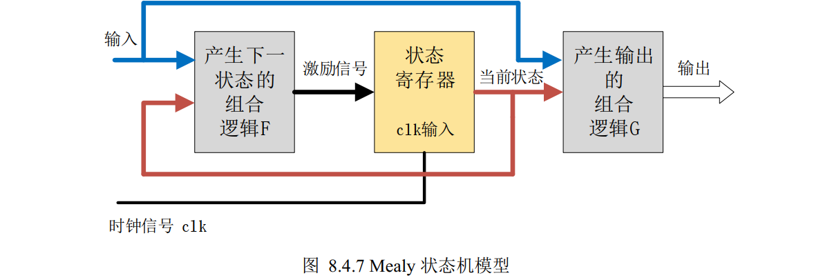
2. Moore 状态机
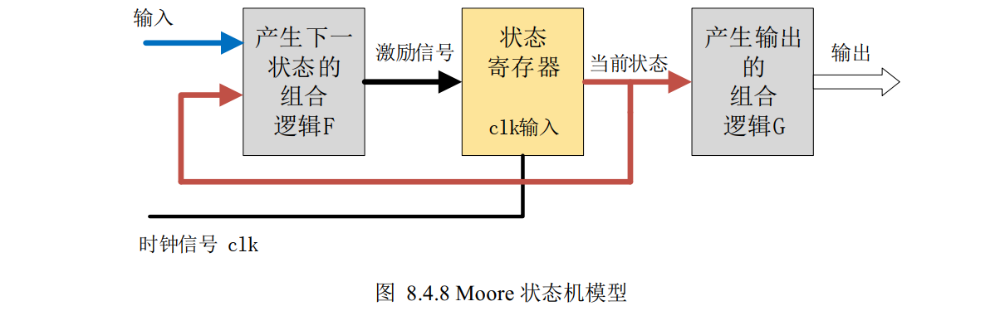
3. 三段式状态机
三段式状态机的基本格式是：
- 第一个 always 语句实现同步状态跳转；
- 第二个 always 语句采用组合逻辑判断状态转移条件；
- 第三个 always 语句描述状态输出(可以用组合电路输出，也可以时序电路输出)。
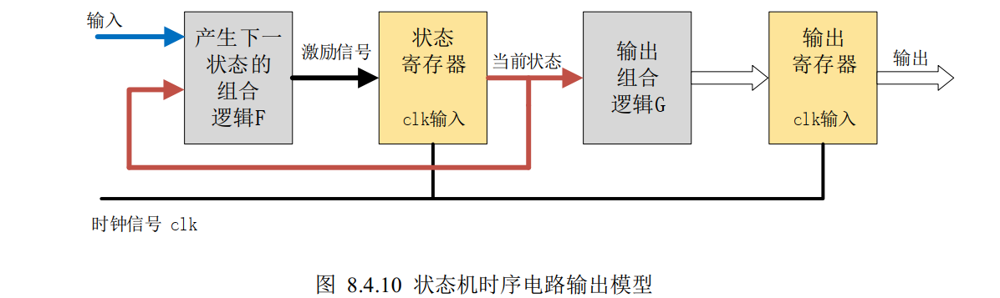
## 2.7 模块化设计
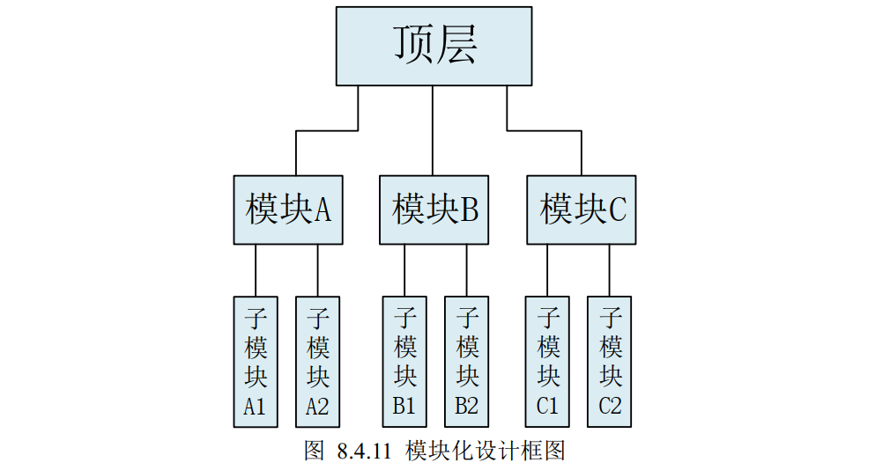
**模块的例化**
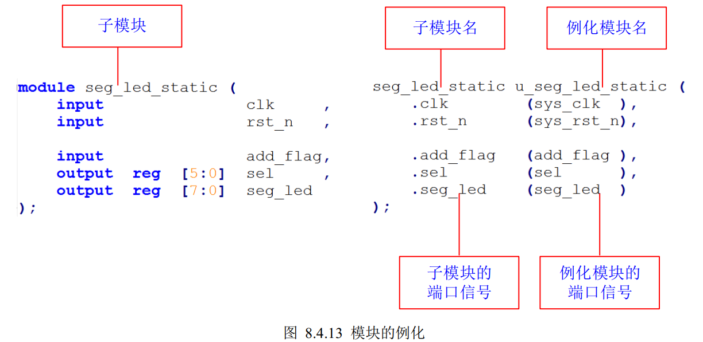
**模块参数的例化**
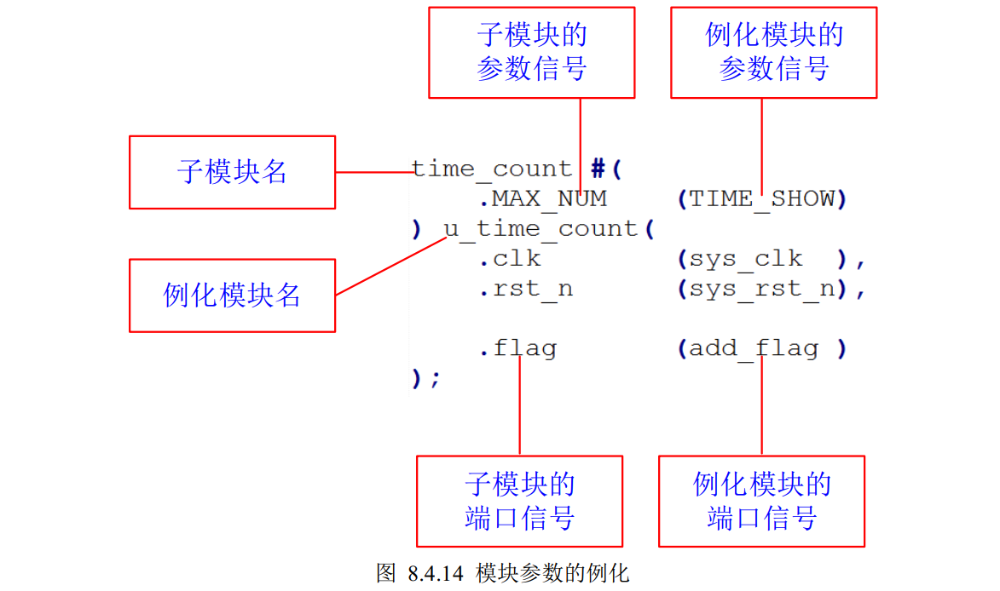
