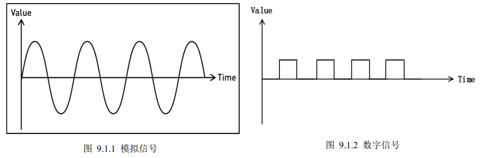
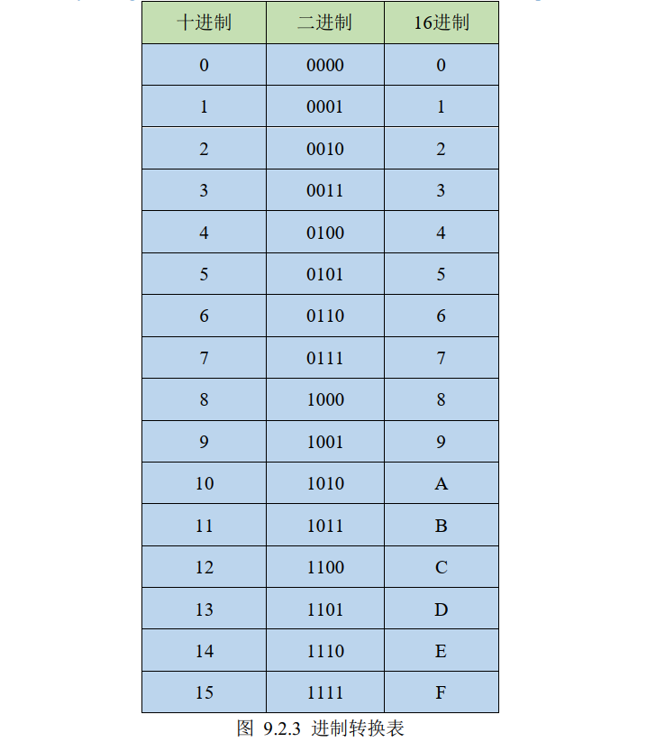
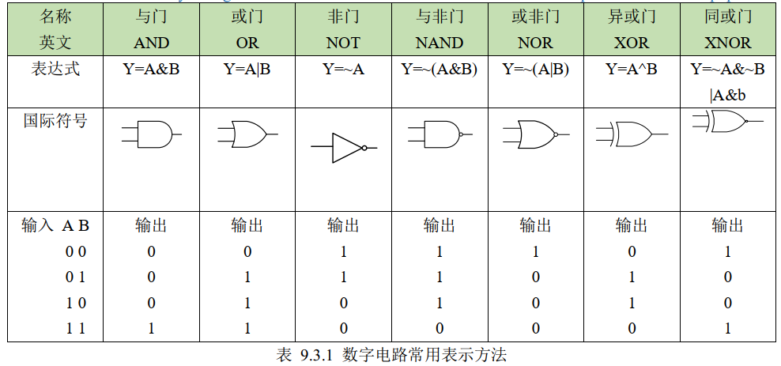

# 一、什么是数字电路

# 二、数字进制简介

二进制、八进制、十进制和十六进制
# 三、逻辑门简介

# 四、逻辑电路简介

==组合逻辑电路==在逻辑功能上的特点是任意时刻的输出仅仅取决于该时刻的输入，与电路原来的状态无关。组合逻辑电路没有记忆功能，没有反馈环路。下面章节我们会先从“与”、“或”和“非” 门开始来学习组合逻辑。

==时序逻辑电路==在逻辑功能上的特点是任意时刻的输出不仅取决于当时的输入信号，而且还取决于电路原来的状态，或者说，还与以前的输入有关。下面章节我们会从锁存器、触发器和寄存器来学习时序逻辑
# 五、硬件描述语言
VHDL
Verilog HDL
System Verilog