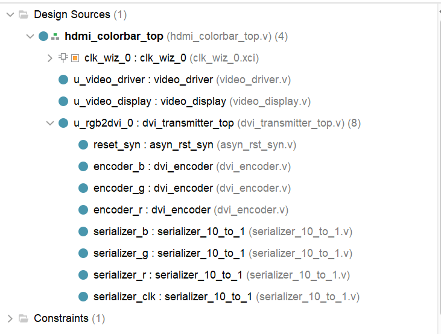

## 一、简介
早期是VGA，易受干扰体积大
HDMI取而代之，并向下兼容VGA

使用TMDS连接，逻辑上分为两阶段：编码和并串转换。
## 二、实验任务
驱动ZYNQ上的HDMI接口，在显示器上显示720p彩条图案（1024 * 720，像素75MHz）


## 三 、硬件设计


## 四、软件设计


## 五、下载验证


## 六、本章总结


## 七、遇到问题


## 八、源码备份


```verilog
module  hdmi_colorbar_top(
    input        sys_clk		,
    input        sys_rst_n		,
    
    output       tmds_clk_p		,	// TMDS 时钟通道
    output       tmds_clk_n		,
    output [2:0] tmds_data_p	,	// TMDS 数据通道
    output [2:0] tmds_data_n
);

//wire define
wire          pixel_clk			;
wire          pixel_clk_5x		;
wire          clk_locked		;

wire  [10:0]  pixel_xpos_w		;
wire  [10:0]  pixel_ypos_w		;
wire  [23:0]  pixel_data_w		;
		
wire          video_hs			;
wire          video_vs			;
wire          video_de			;
wire  [23:0]  video_rgb			;

//*****************************************************
//**                    main code
//*****************************************************

//例化MMCM/PLL IP核
clk_wiz_0  clk_wiz_0(
    .clk_in1        (sys_clk		),
    .clk_out1       (pixel_clk		), 		//像素时钟
    .clk_out2       (pixel_clk_5x	),  	//5倍像素时钟
    
    .reset          (~sys_rst_n		), 
    .locked         (clk_locked		)
);

//例化视频显示驱动模块
video_driver u_video_driver(
    .pixel_clk      (pixel_clk		),
    .sys_rst_n      (sys_rst_n		),

    .video_hs       (video_hs		),
    .video_vs       (video_vs		),
    .video_de       (video_de		),
    .video_rgb      (video_rgb		),

    .pixel_xpos     (pixel_xpos_w	),
    .pixel_ypos     (pixel_ypos_w	),
    .pixel_data     (pixel_data_w	)
);

//例化视频显示模块
video_display  u_video_display(
    .pixel_clk      (pixel_clk		),
    .sys_rst_n      (sys_rst_n		),

    .pixel_xpos     (pixel_xpos_w	),
    .pixel_ypos     (pixel_ypos_w	),
    .pixel_data     (pixel_data_w	)
);

//例化HDMI驱动模块
dvi_transmitter_top u_rgb2dvi_0(
    .pclk           (pixel_clk				),
    .pclk_x5        (pixel_clk_5x			),
    .reset_n        (sys_rst_n & clk_locked	),
                
    .video_din      (video_rgb				),
    .video_hsync    (video_hs				), 
    .video_vsync    (video_vs				),
    .video_de       (video_de				),
                
    .tmds_clk_p     (tmds_clk_p				),
    .tmds_clk_n     (tmds_clk_n				),
    .tmds_data_p    (tmds_data_p			),
    .tmds_data_n    (tmds_data_n			), 
    .tmds_oen       (						) 	//预留的端口，本次实验未用到
);

endmodule 
```

```verilog
// Descriptions:        视频显示驱动模块

module video_driver(
    input           pixel_clk	,
    input           sys_rst_n	,
    
    //RGB接口
    output          video_hs	,     	//行同步信号
    output          video_vs	,     	//场同步信号
    output          video_de	,     	//数据使能
    output  [23:0]  video_rgb	,    	//RGB888颜色数据
    
    input   [23:0]  pixel_data	,   	//像素点数据
    output  [10:0]  pixel_xpos	,   	//像素点横坐标
    output  [10:0]  pixel_ypos	    	//像素点纵坐标
);

//parameter define

//1280*720 分辨率时序参数
parameter  H_SYNC   =  11'd20		; 	//行同步
parameter  H_BACK   =  11'd140		;  	//行显示后沿
parameter  H_DISP   =  11'd1024		; 	//行有效数据
parameter  H_FRONT  =  11'd160		;  	//行显示前沿
parameter  H_TOTAL  =  11'd1344		; 	//行扫描周期

parameter  V_SYNC   =  11'd3		; 	//场同步
parameter  V_BACK   =  11'd20		;	//场显示后沿
parameter  V_DISP   =  11'd600		;	//场有效数据
parameter  V_FRONT  =  11'd12		;	//场显示前沿
parameter  V_TOTAL  =  11'd635		;	//场扫描周期

//reg define
reg  [10:0] 	cnt_h				;
reg  [10:0] 	cnt_v				;

//wire define
wire       		video_en			;
wire       		data_req			;

//*****************************************************
//**                    main code
//*****************************************************

assign video_de  = video_en;

assign video_hs  = ( cnt_h < H_SYNC ) ? 1'b0 : 1'b1;  	//行同步信号赋值
assign video_vs  = ( cnt_v < V_SYNC ) ? 1'b0 : 1'b1;  	//场同步信号赋值

//使能RGB数据输出
assign video_en  = (((cnt_h >= H_SYNC+H_BACK) && (cnt_h < H_SYNC+H_BACK+H_DISP))
                 &&((cnt_v >= V_SYNC+V_BACK) && (cnt_v < V_SYNC+V_BACK+V_DISP)))
                 ?  1'b1 : 1'b0;

//RGB888数据输出
assign video_rgb = video_en ? pixel_data : 24'd0;

//请求像素点颜色数据输入
assign data_req = (((cnt_h >= H_SYNC+H_BACK-1'b1) && 
                    (cnt_h < H_SYNC+H_BACK+H_DISP-1'b1))
                  && ((cnt_v >= V_SYNC+V_BACK) && (cnt_v < V_SYNC+V_BACK+V_DISP)))
                  ?  1'b1 : 1'b0;

//像素点坐标
assign pixel_xpos = data_req ? (cnt_h - (H_SYNC + H_BACK - 1'b1)) : 11'd0;
assign pixel_ypos = data_req ? (cnt_v - (V_SYNC + V_BACK - 1'b1)) : 11'd0;

//行计数器对像素时钟计数
always @(posedge pixel_clk ) begin
    if (!sys_rst_n)
        cnt_h <= 11'd0;
    else begin
        if(cnt_h < H_TOTAL - 1'b1)
            cnt_h <= cnt_h + 1'b1;
        else 
            cnt_h <= 11'd0;
    end
end

//场计数器对行计数
always @(posedge pixel_clk ) begin
    if (!sys_rst_n)
        cnt_v <= 11'd0;
    else if(cnt_h == H_TOTAL - 1'b1) begin
        if(cnt_v < V_TOTAL - 1'b1)
            cnt_v <= cnt_v + 1'b1;
        else 
            cnt_v <= 11'd0;
    end
end

endmodule
```

```verilog
// Descriptions:        视频显示模块，显示彩条

module  video_display(
    input                pixel_clk	,
    input                sys_rst_n	,
    
    input        [10:0]  pixel_xpos	,  	//像素点横坐标
    input        [10:0]  pixel_ypos	,  	//像素点纵坐标
    output  reg  [23:0]  pixel_data   	//像素点数据
);

//parameter define	
parameter  H_DISP = 11'd1024						; 	//分辨率——行
parameter  V_DISP = 11'd600							; 	//分辨率——列

localparam WHITE  = 24'b11111111_11111111_11111111	;  	//RGB888 白色
localparam BLACK  = 24'b00000000_00000000_00000000	;  	//RGB888 黑色
localparam RED    = 24'b11111111_00001100_00000000	;  	//RGB888 红色
localparam GREEN  = 24'b00000000_11111111_00000000	;  	//RGB888 绿色
localparam BLUE   = 24'b00000000_00000000_11111111	;  	//RGB888 蓝色
    
//*****************************************************
//**                    main code
//*****************************************************

//根据当前像素点坐标指定当前像素点颜色数据，在屏幕上显示彩条
always @(posedge pixel_clk ) begin
    if (!sys_rst_n)
        pixel_data <= 16'd0;
    else begin
        if((pixel_xpos >= 0) && (pixel_xpos < (H_DISP/5)*1))
            pixel_data <= WHITE	;
        else if((pixel_xpos >= (H_DISP/5)*1) && (pixel_xpos < (H_DISP/5)*2))
            pixel_data <= BLACK	;  
        else if((pixel_xpos >= (H_DISP/5)*2) && (pixel_xpos < (H_DISP/5)*3))
            pixel_data <= RED	;  
        else if((pixel_xpos >= (H_DISP/5)*3) && (pixel_xpos < (H_DISP/5)*4))
            pixel_data <= GREEN	;
        else 
            pixel_data <= BLUE	;
    end
end

endmodule
```


```verilog
// Descriptions:        DVI发送端顶层模块
module dvi_transmitter_top(
    input        pclk			,     	// pixel clock
    input        pclk_x5		,      	// pixel clock x5
    input        reset_n		,      	// reset
		
    input [23:0] video_din		,      	// RGB888 video in
    input        video_hsync	,    	// hsync data
    input        video_vsync	,    	// vsync data
    input        video_de		,       // data enable
		
    output       tmds_clk_p		,    	// TMDS 时钟通道
    output       tmds_clk_n		,
    output [2:0] tmds_data_p	,   	// TMDS 数据通道
    output [2:0] tmds_data_n	,
    output       tmds_oen       		// TMDS 输出使能
);
    
//wire define    
wire        reset				;
    
//并行数据
wire [9:0]  red_10bit			;
wire [9:0]  green_10bit			;
wire [9:0]  blue_10bit			;
wire [9:0]  clk_10bit			;  
  
//串行数据
wire [2:0]  tmds_data_serial	;
wire        tmds_clk_serial		;

//*****************************************************
//**                    main code
//***************************************************** 
assign tmds_oen 	= 1'b1				;  
assign clk_10bit 	= 10'b1111100000	;

//异步复位，同步释放
asyn_rst_syn reset_syn(
    .reset_n    (reset_n		),
    .clk        (pclk			),
		
    .syn_reset  (reset			)    //高有效
);
  
//对三个颜色通道进行编码
dvi_encoder encoder_b (
    .clkin      (pclk				),
    .rstin	    (reset				),
		
    .din        (video_din[7:0]		),
    .c0			(video_hsync		),
    .c1			(video_vsync		),
    .de			(video_de			),
    .dout		(blue_10bit			)
);

dvi_encoder encoder_g (
    .clkin      (pclk				),
    .rstin	    (reset				),
		
    .din		(video_din[15:8]	),
    .c0			(1'b0				),
    .c1			(1'b0				),
    .de			(video_de			),
    .dout		(green_10bit		)
);
    
dvi_encoder encoder_r (
    .clkin      (pclk				),
    .rstin	    (reset				),
    
    .din		(video_din[23:16]	),
    .c0			(1'b0				),
    .c1			(1'b0				),
    .de			(video_de			),
    .dout		(red_10bit			)
);
    
//对编码后的数据进行并串转换
serializer_10_to_1 serializer_b(
    .reset              (reset				),     		// 复位,高有效
    .paralell_clk       (pclk				),       	// 输入并行数据时钟
    .serial_clk_5x      (pclk_x5			),      	// 输入串行数据时钟
    .paralell_data      (blue_10bit			),   		// 输入并行数据

    .serial_data_out    (tmds_data_serial[0])   		// 输出串行数据
);    
    
serializer_10_to_1 serializer_g(
    .reset              (reset				),
    .paralell_clk       (pclk				),
    .serial_clk_5x      (pclk_x5			),
    .paralell_data      (green_10bit		),

    .serial_data_out    (tmds_data_serial[1])
);
    
serializer_10_to_1 serializer_r(
    .reset              (reset				),
    .paralell_clk       (pclk				),
    .serial_clk_5x      (pclk_x5			),
    .paralell_data      (red_10bit			),

    .serial_data_out    (tmds_data_serial[2])
);
            
serializer_10_to_1 serializer_clk(
    .reset              (reset				),
    .paralell_clk       (pclk				),
    .serial_clk_5x      (pclk_x5			),
    .paralell_data      (clk_10bit			),

    .serial_data_out    (tmds_clk_serial	)
);
    
//转换差分信号  
OBUFDS #(
    .IOSTANDARD         ("TMDS_33")    // I/O电平标准为TMDS
) TMDS0 (
    .I                  (tmds_data_serial[0]),
    .O                  (tmds_data_p[0]		),
    .OB                 (tmds_data_n[0]		) 
);

OBUFDS #(
    .IOSTANDARD         ("TMDS_33")    // I/O电平标准为TMDS
) TMDS1 (
    .I                  (tmds_data_serial[1]),
    .O                  (tmds_data_p[1]		),
    .OB                 (tmds_data_n[1]		)	 
);

OBUFDS #(
    .IOSTANDARD         ("TMDS_33")    // I/O电平标准为TMDS
) TMDS2 (
    .I                  (tmds_data_serial[2]), 
    .O                  (tmds_data_p[2]		), 
    .OB                 (tmds_data_n[2]		)  
);

OBUFDS #(
    .IOSTANDARD         ("TMDS_33")    // I/O电平标准为TMDS
) TMDS3 (
    .I                  (tmds_clk_serial	), 
    .O                  (tmds_clk_p			),
    .OB                 (tmds_clk_n			) 
);
  
endmodule
```


```verilog
// Descriptions:        异步复位，同步释放，并转换成高电平有效

module asyn_rst_syn(
    input 	clk			,     	//目的时钟域
    input 	reset_n		,		//异步复位，低有效
    
    output 	syn_reset   	 	//高有效
    );
    
//reg define
reg reset_1				;
reg reset_2				;
    
//*****************************************************
//**                    main code
//***************************************************** 
assign syn_reset  = reset_2;
    
//对异步复位信号进行同步释放，并转换成高有效
always @ (posedge clk or negedge reset_n) begin
    if(!reset_n) begin
        reset_1 <= 1'b1		;
        reset_2 <= 1'b1		;
    end
    else begin
        reset_1 <= 1'b0		;
        reset_2 <= reset_1	;
    end
end
    
endmodule
```


```verilog
//  Description :     TMDS encoder  

`timescale 1 ps / 1ps

module dvi_encoder (
	input           	clkin	,    	// pixel clock input
	input           	rstin	,    	// async. reset input (active high)
	input      	[7:0] 	din		,      	// data inputs: expect registered
	input            	c0		,       // c0 input
	input            	c1		,       // c1 input
	input            	de		,       // de input
	output reg 	[9:0] 	dout      		// data outputs
);

  ////////////////////////////////////////////////////////////
  // Counting number of 1s and 0s for each incoming pixel
  // component. Pipe line the result.
  // Register Data Input so it matches the pipe lined adder
  // output
  ////////////////////////////////////////////////////////////
reg 	[3:0] 	n1d		; 		//number of 1s in din
reg 	[7:0] 	din_q	;

//计算像素数据中“1”的个数
always @ (posedge clkin) begin
  n1d <=#1 din[0] + din[1] + din[2] + din[3] + din[4] + din[5] + din[6] + din[7];

  din_q <=#1 din;
end

///////////////////////////////////////////////////////
// Stage 1: 8 bit -> 9 bit
// Refer to DVI 1.0 Specification, page 29, Figure 3-5
///////////////////////////////////////////////////////
wire 	decision1;

assign 	decision1 = (n1d > 4'h4) | ((n1d == 4'h4) & (din_q[0] == 1'b0));

wire [8:0]	q_m;
assign q_m[0] = din_q[0];
assign q_m[1] = (decision1) ? (q_m[0] ^~ din_q[1]) : (q_m[0] ^ din_q[1]);
assign q_m[2] = (decision1) ? (q_m[1] ^~ din_q[2]) : (q_m[1] ^ din_q[2]);
assign q_m[3] = (decision1) ? (q_m[2] ^~ din_q[3]) : (q_m[2] ^ din_q[3]);
assign q_m[4] = (decision1) ? (q_m[3] ^~ din_q[4]) : (q_m[3] ^ din_q[4]);
assign q_m[5] = (decision1) ? (q_m[4] ^~ din_q[5]) : (q_m[4] ^ din_q[5]);
assign q_m[6] = (decision1) ? (q_m[5] ^~ din_q[6]) : (q_m[5] ^ din_q[6]);
assign q_m[7] = (decision1) ? (q_m[6] ^~ din_q[7]) : (q_m[6] ^ din_q[7]);
assign q_m[8] = (decision1) ? 1'b0 : 1'b1;

/////////////////////////////////////////////////////////
// Stage 2: 9 bit -> 10 bit
// Refer to DVI 1.0 Specification, page 29, Figure 3-5
/////////////////////////////////////////////////////////
reg [3:0] n1q_m, n0q_m; // number of 1s and 0s for q_m
always @ (posedge clkin) begin
  n1q_m  <=#1 q_m[0] + q_m[1] + q_m[2] + q_m[3] + q_m[4] + q_m[5] + q_m[6] + q_m[7];
  n0q_m  <=#1 4'h8 - (q_m[0] + q_m[1] + q_m[2] + q_m[3] + q_m[4] + q_m[5] + q_m[6] + q_m[7]);
end

parameter CTRLTOKEN0 = 10'b1101010100	;
parameter CTRLTOKEN1 = 10'b0010101011	;
parameter CTRLTOKEN2 = 10'b0101010100	;
parameter CTRLTOKEN3 = 10'b1010101011	;

reg 	[4:0] 	cnt						; 	//disparity counter, MSB is the sign bit
wire 			decision2, decision3	;

assign decision2 = (cnt == 5'h0) | (n1q_m == n0q_m);
/////////////////////////////////////////////////////////////////////////
// [(cnt > 0) and (N1q_m > N0q_m)] or [(cnt < 0) and (N0q_m > N1q_m)]
/////////////////////////////////////////////////////////////////////////
assign decision3 = (~cnt[4] & (n1q_m > n0q_m)) | (cnt[4] & (n0q_m > n1q_m));

////////////////////////////////////
// pipe line alignment
////////////////////////////////////
reg       de_q, de_reg;
reg       c0_q, c1_q;
reg       c0_reg, c1_reg;
reg [8:0] q_m_reg;

always @ (posedge clkin) begin
  de_q    <=#1 de;
  de_reg  <=#1 de_q;
  
  c0_q    <=#1 c0;
  c0_reg  <=#1 c0_q;
  c1_q    <=#1 c1;
  c1_reg  <=#1 c1_q;

  q_m_reg <=#1 q_m;
end

///////////////////////////////
// 10-bit out
// disparity counter
///////////////////////////////
always @ (posedge clkin or posedge rstin) begin
  if(rstin) begin
    dout <= 10'h0;
    cnt <= 5'h0;
  end else begin
    if (de_reg) begin
      if(decision2) begin
        dout[9]   <=#1 ~q_m_reg[8]; 
        dout[8]   <=#1 q_m_reg[8]; 
        dout[7:0] <=#1 (q_m_reg[8]) ? q_m_reg[7:0] : ~q_m_reg[7:0];

        cnt <=#1 (~q_m_reg[8]) ? (cnt + n0q_m - n1q_m) : (cnt + n1q_m - n0q_m);
      end else begin
        if(decision3) begin
          dout[9]   <=#1 1'b1;
          dout[8]   <=#1 q_m_reg[8];
          dout[7:0] <=#1 ~q_m_reg[7:0];

          cnt <=#1 cnt + {q_m_reg[8], 1'b0} + (n0q_m - n1q_m);
        end else begin
          dout[9]   <=#1 1'b0;
          dout[8]   <=#1 q_m_reg[8];
          dout[7:0] <=#1 q_m_reg[7:0];

          cnt <=#1 cnt - {~q_m_reg[8], 1'b0} + (n1q_m - n0q_m);
        end
      end
    end else begin
      case ({c1_reg, c0_reg})
        2'b00:   dout <=#1 CTRLTOKEN0;
        2'b01:   dout <=#1 CTRLTOKEN1;
        2'b10:   dout <=#1 CTRLTOKEN2;
        default: dout <=#1 CTRLTOKEN3;
      endcase

      cnt <=#1 5'h0;
    end
  end
end
  
endmodule 
```

```verilog 
// Descriptions:        用于实现10:1并串转换
`timescale 1ns / 1ps

module serializer_10_to_1(
    input           reset			,     	// 复位,高有效
    input           paralell_clk	,       // 输入并行数据时钟
    input           serial_clk_5x	,      	// 输入串行数据时钟
    input   [9:0]   paralell_data	,      	// 输入并行数据

    output 			serial_data_out     	// 输出串行数据
);
    
//wire define
wire		cascade1;     					//用于两个OSERDESE2级联的信号
wire		cascade2;
  
//*****************************************************
//**                    main code
//***************************************************** 
    
//例化OSERDESE2原语，实现并串转换,Master模式
OSERDESE2 #(
    .DATA_RATE_OQ   ("DDR"			),    	// 设置双倍数据速率
    .DATA_RATE_TQ   ("SDR"			),     	// DDR, BUF, SDR
    .DATA_WIDTH     (10				),     	// 输入的并行数据宽度为10bit
    .SERDES_MODE    ("MASTER"		),    	// 设置为Master，用于10bit宽度扩展
    .TBYTE_CTL      ("FALSE"		),     	// Enable tristate byte operation (FALSE, TRUE)
    .TBYTE_SRC      ("FALSE"		),     	// Tristate byte source (FALSE, TRUE)
    .TRISTATE_WIDTH (1				)      	// 3-state converter width (1,4)
)
OSERDESE2_Master (
    .CLK        (serial_clk_5x		),   	// 串行数据时钟,5倍时钟频率
    .CLKDIV     (paralell_clk		),   	// 并行数据时钟
    .RST        (reset				),     	// 1-bit input: Reset
    .OCE        (1'b1				),     	// 1-bit input: Output data clock enable
		
    .OQ         (serial_data_out	),  	// 串行输出数据
    
    .D1         (paralell_data[0]	), 		// D1 - D8: 并行数据输入
    .D2         (paralell_data[1]	),
    .D3         (paralell_data[2]	),
    .D4         (paralell_data[3]	),
    .D5         (paralell_data[4]	),
    .D6         (paralell_data[5]	),
    .D7         (paralell_data[6]	),
    .D8         (paralell_data[7]	),
   
    .SHIFTIN1   (cascade1			),    	// SHIFTIN1 用于位宽扩展
    .SHIFTIN2   (cascade2			),    	// SHIFTIN2
    .SHIFTOUT1  (					),    	// SHIFTOUT1: 用于位宽扩展
    .SHIFTOUT2  (					),     	// SHIFTOUT2
        
    .OFB        (					),     	// 以下是未使用信号
    .T1         (1'b0				),             
    .T2         (1'b0				),
    .T3         (1'b0				),
    .T4         (1'b0				),
    .TBYTEIN    (1'b0				),             
    .TCE        (1'b0				),             
    .TBYTEOUT   (					),                 
    .TFB        (					),                 
    .TQ         (					)                  
);
   
//例化OSERDESE2原语，实现并串转换,Slave模式
OSERDESE2 #(
    .DATA_RATE_OQ   ("DDR"			),     	// 设置双倍数据速率
    .DATA_RATE_TQ   ("SDR"			),    	// DDR, BUF, SDR
    .DATA_WIDTH     (10				),    	// 输入的并行数据宽度为10bit
    .SERDES_MODE    ("SLAVE"		),     	// 设置为Slave，用于10bit宽度扩展
    .TBYTE_CTL      ("FALSE"		),     	// Enable tristate byte operation (FALSE, TRUE)
    .TBYTE_SRC      ("FALSE"		),     	// Tristate byte source (FALSE, TRUE)
    .TRISTATE_WIDTH (1				)     	// 3-state converter width (1,4)
)
OSERDESE2_Slave (
    .CLK        (serial_clk_5x		),    	// 串行数据时钟,5倍时钟频率
    .CLKDIV     (paralell_clk		),     	// 并行数据时钟
    .RST        (reset				),     	// 1-bit input: Reset
    .OCE        (1'b1				),     	// 1-bit input: Output data clock enable
		
    .OQ         (					),     	// 串行输出数据
		
    .D1         (1'b0				),     	// D1 - D8: 并行数据输入
    .D2         (1'b0				),
    .D3         (paralell_data[8]	),
    .D4         (paralell_data[9]	),
    .D5         (1'b0				),
    .D6         (1'b0				),
    .D7         (1'b0				),
    .D8         (1'b0				),
   
    .SHIFTIN1   (					),    	// SHIFTIN1 用于位宽扩展
    .SHIFTIN2   (					),    	// SHIFTIN2
    .SHIFTOUT1  (cascade1			),    	// SHIFTOUT1: 用于位宽扩展
    .SHIFTOUT2  (cascade2			),     	// SHIFTOUT2
        
    .OFB        (					),     	// 以下是未使用信号
    .T1         (1'b0				),             
    .T2         (1'b0				),
    .T3         (1'b0				),
    .T4         (1'b0				),
    .TBYTEIN    (1'b0				),             
    .TCE        (1'b0				),             
    .TBYTEOUT   (					),                 
    .TFB        (					),                 
    .TQ         (					)                  
);  
        
endmodule
```


