Xilinx 提供的 PLL（Phase-Locked Loop，锁相环）IP 核是一种高精度时钟管理模块，在 FPGA 设计中用于生成、调整和优化时钟信号。它支持灵活的时钟合成、去抖动、相位偏移和占空比调节，广泛应用于数字系统的时钟域控制。本章我们将通过一个简单的例程来向大家介绍一下 PLL IP 核的使用方法。

### 一、PLL IP 简介

锁相环作为一种反馈控制电路，其特点是利用外部输入的参考信号来控制环路内部震荡信号的频率和相位。因为锁相环可以实现输出信号频率对输入信号频率的自动跟踪，所以锁相环通常用于闭环跟踪电路。

锁相环在工作的过程中，当输出信号的频率与输入信号的频率相等时，输出电压与输入电压保持固定的相位差值，即输出电压与输入电压的相位被锁住，这就是锁相环名称的由来。

锁相环拥有强大的性能，可以对输入到 FPGA 的时钟信号进行分频、倍频、相位偏移与占空比调整，从而输出一个期望时钟；除此之外，在一些复杂的工程中，哪怕我们不需要修改任何时钟参数，也常常会使用 PLL 来优化时钟抖动，以此得到一个更为稳定的时钟信号。正是因为 PLL 的这些性能都是我们在实际设计中所需要的，并且是通过编写代码无法实现的，所以 PLL IP 核才会成为程序设计中最常用 IP 核之一。需要注意的是 Xilinx 中的 PLL 是模拟锁相环，其优点是输出的稳定度高、锁定时间较短，相位连续可调；缺点是在极端环境（例如极端高/低温环境，高磁场强度等）下容易失锁。

Xilinx7 系列器件中的时钟资源包含了时钟管理单元 CMT（全称 Clock Management Tile），每个 CMT由一个 MMCM（全称 Mixed-Mode Clock Manager，即混合模式时钟管理）和一个 PLL（全称 Phase Locked Loop，即锁相环）组成，xc7z020 芯片内部有 4 个 CMT，xc7z010 芯片内部有 2 个 CMT，这些资源为设备提供强大的系统时钟管理以及高速 I/O 通信的能力。接下来我们讲解一下 MMCM 和 PLL 各自的含义以及两者的区别。

（1）PLL（锁相环）：是一种通过反馈控制实现时钟信号同步和稳定的电路模块。PLL 的核心功能有频率合成、时钟去偏斜与抖动滤波。其典型应用包括生成稳定的系统时钟（如处理器主频）与为 I/O 接口（如DDR、以太网）提供低抖动时钟。

（2）MMCM（混合模式时钟管理）：是基于 PLL 的新型混合模式时钟管理器，相比传统 PLL，它具有更灵活、更精确的时钟控制能力，可以实现最低的抖动和抖动滤波，为高性能的 FPGA 设计提供更高性能的时钟管理功能。

（3）MMCM 是一个 PLL 上加入 DCM 的一部分以进行精细的相位偏移，也就是说 MMCM 在 PLL 的基础上加上了相位动态调整功能，又因为 PLL 是模拟电路，而动态调相是数字电路，所以 MMCM 被称为混合模式，MMCM 相对 PLL 的优势就是相位可以动态调整，但 PLL 占用的面积更小，所以在大部分的设计当中大家使用 MMCM 或者 PLL 来对系统时钟进行分频、倍频和相位偏移都是完全可以的。

接着我们讲一下 PLL 的工作原理，首先我们画出一个大致的结构模型示意图，如下图所示：

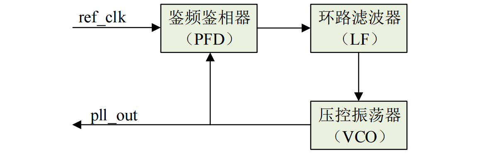
由上图可以看出 PLL 的工作流程如下：

1、通过 PFD(全称：Phase-Frequency Detector，即鉴频鉴相器)对参考时钟（ref_clk）频率和需要比较的时钟频率（即上图中的输出时钟：pll_out）进行对比。

2、PFD 的输出连接到 LF（全称：Loop Filter，即环路滤波器）上，用于控制噪声的带宽，滤掉高频噪声，使之趋于一个稳定的值，起到将带有噪声的波形变平滑的作用。如果 PFD 之前的波形抖动比较大，经过环路滤波器后抖动就会变小，趋近于信号的平均值。

3、经过 LF 的输出连接到 VCO（全称：Voltage Controlled Oscillator，即压控振荡器）上，LF 输出的电压可以控制 VCO 输出频率的大小，LF 输出的电压越大 VCO 输出的频率越高，然后将这个频率信号连接到PFD 作为需要比较的频率。

如果参考时钟输入的频率和需要比较的时钟频率不相等，该系统最终实现的就是让它们逐渐相等并稳定下来。例如参考时钟的频率是50MHz，经过整个闭环反馈系统后，锁相环对外输出的时钟频率也是50MHz。

这里我们用一个简单的生活行为来带大家理解一下锁相环的工作流程，我们使用驾驶车辆举例：

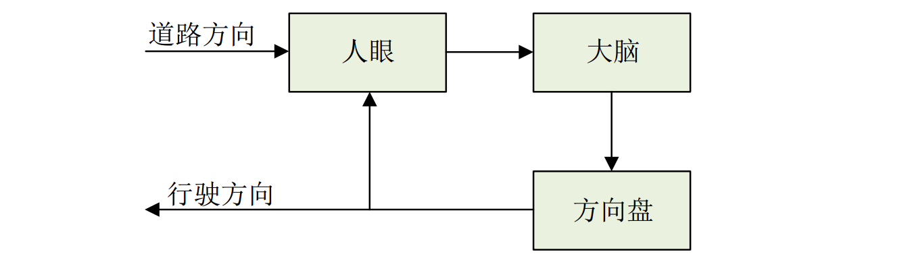

参考时钟可以类比为道路的方向，需要比较的时钟可以类比为汽车的行驶方向，人眼就是鉴频鉴相器，大脑就相当于滤波器，方向盘就相当于 VCO。人眼检测道路方向和行驶方向是否有偏差，大脑对方向偏差做出判断（偏左、偏右或无偏差），并将判断结果转换为方向盘的动作（左打、右打或不变），然后将调整后的行驶方向与道路方向再次通过人眼进行对比，经过反复的对比和调整后，最终使得行驶方向与道路方向一致。

接下来我们讲解一下 PLL 分频和倍频的工作原理

**PLL 分频原理图如下图所示：**

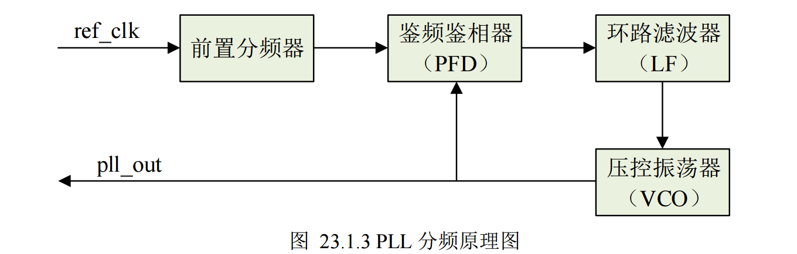

分频是在参考时钟与 PFD 之间加入一级分频器（可称为前置分频器），通过前置分频器 N(N 表示数字)分频后得到一个新的参考时钟，因此需要比较的时钟频率（即 pll_out）就始终是和新的参考时钟频率进行对比的，pll_out 的输出结果也会逐渐与新的参考时钟(ref_clk / N)相等，从而实现了分频的功能。

**PLL 倍频原理图如下图所示：**

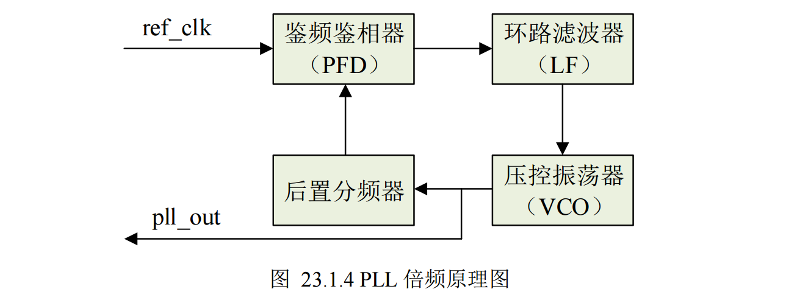
倍频是在 VCO 与 PFD 之间加入一级分频器（可称为后置分频器），通过后置分频器 M(M 表示数字)分频后得到一个新的需要比较的时钟频率（即 pll_out 分频后的时钟），因为此时与参考时钟频率进行对比的是分频后的输出时钟（pll_out/M），所以此时的输出时钟是参考时钟的 M 倍（pll_out = ref_clk * M），从而实现了倍频的功能。

需要注意的是，一个PLL IP核输出的时钟路数是有上限的，且输入/输出的时钟频率也是有范围限制的，我们不能无限制的输入无穷大/小的时钟频率，也不可能通过倍频或分频输出无穷大/小的时钟频率。这里我们总结了一下几款常用芯片的相关信息，如下表所示：
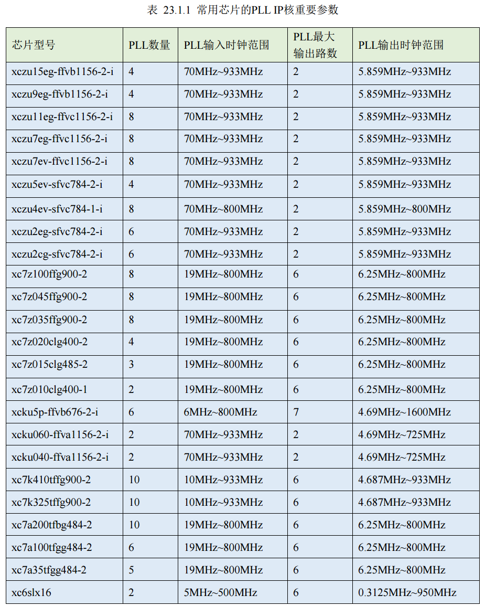

### 二、PLL IP 核配置

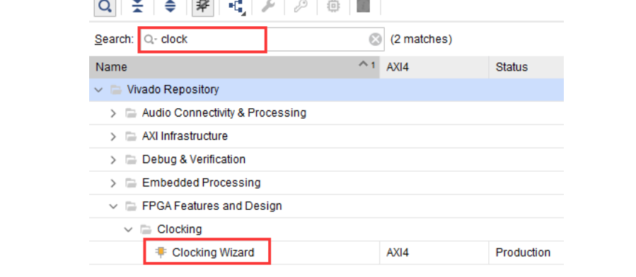
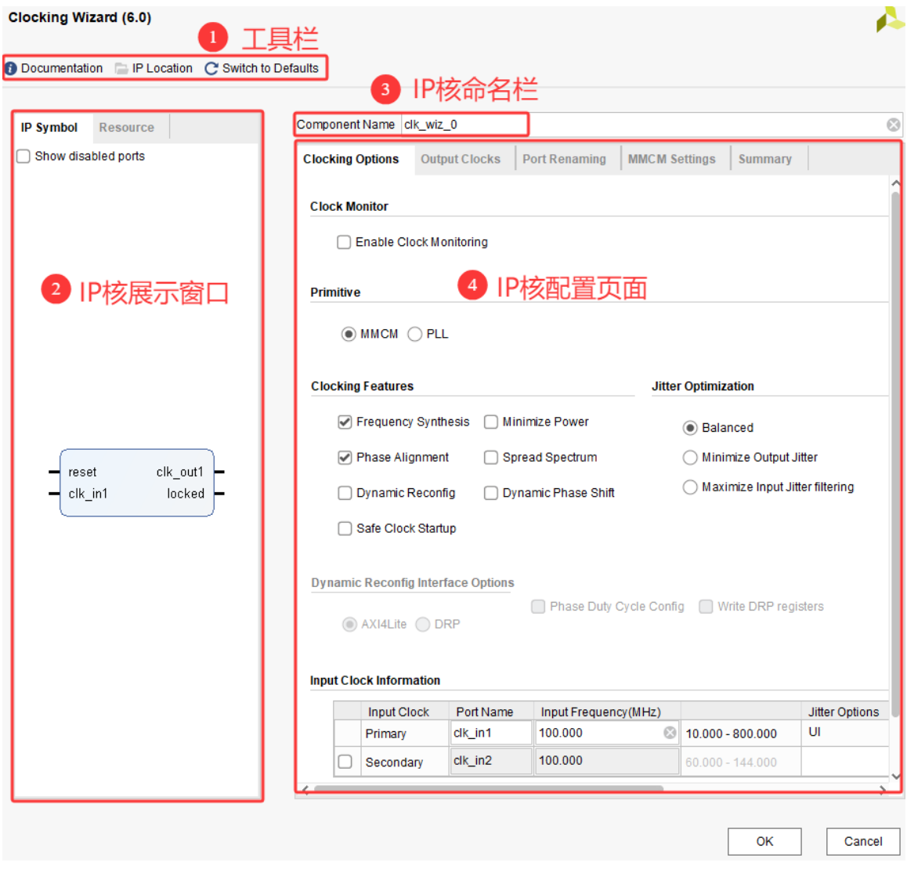

**PLL IP 的工具栏如下图所示**

1：Documentation：IP 相关文档入口，点击后出现上图红框中的内容，红框列表中各个元素详细解释如下：

- 1）Product Guide：IP 手册查看入口，点击可自动跳转到 Xilinx 官方文档 DocNav 软件，该 IP 手册的界面（安装了 DocNav）。PLL IP 官方使用手册是《Clocking Wizard v6.0 LogiCORE IP Product Guide》（PG065）。
- 2）Change Log：是 IP 版本更新记录，点击可以看到如下图所示的 PLL IP 更新记录
- 3）Product Webpage：是 IP 相关介绍的网页版，点击可跳转到如下图所示的 Xilinx 官方有关该 IP 介绍的网站
- 4）Answer Records：是与 IP 相关的 Xilinx 官方疑问解答记录网页，点击可跳转到如下图所示的网页。

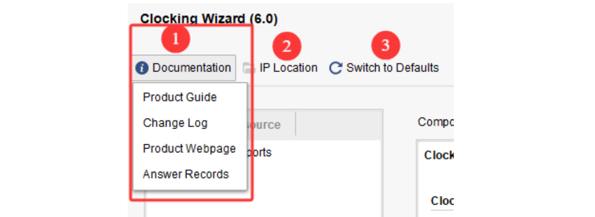

2：IP Location：设置 IP 的存放路径，点击“IP Location”出现如下图所示窗口，在窗口里可以通过点击“…”更换存放路径，默认是存放在工程路径下的…<工程名>.srcs\sources_1\ip，这里我们就保持默认

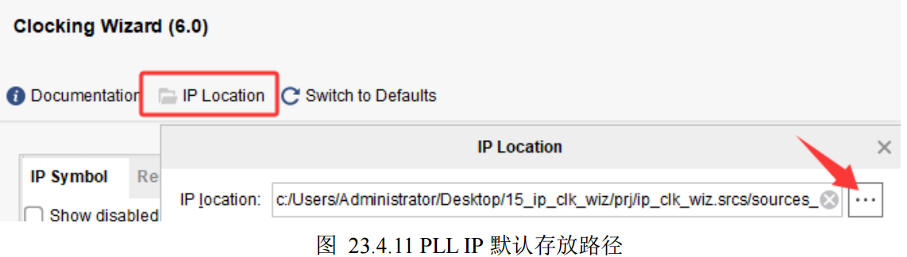
3：Switch to Default：点击后所有的设置恢复到默认值。

**PLL IP 核的各个参数配置页面**

#### **“Clocking Options”选项卡：**

（1）、“Clock Monitor”用来监控时钟是否停止、故障和频率变化。<u>我们一般不用，所以不做勾选。</u>

（2）、“Primitive”选项用于选择是使用 MMCM 还是 PLL 来完成时钟需求，对于我们的本次实验来说，MMCM 和 PLL 都可以完成，所以这里我们保持默认，选择性能较为强大的 MMCM 即可。

（3）、“Clocking Featurs”用来设置时钟的特征，包括 Frequency Synthesis（频率合成）、Minimize Power（最小化功率）、Phase Alignment（相位校准）、Dynamic Reconfig（动态重配置）、Safe Clock Startup（安全时钟启动）等，其中 Spread Spectrum（扩频）和 Dynamic Phase Shift(动态相位偏移)是使用 MMCM 时才能够设置的特征，这里我们保持默认的设置即可，感兴趣的同学也可以勾选其它选项来观察会有什么不同效果。

（4）、“Jitter Optimization”用于抖动优化，可选 Balanced（平衡）、Minimize Output Jitter（最小化输出抖动）或 Maximize Input Jitter filtering（最大化输入抖动滤波）等优化方式，这里我们保持默认平衡优化方式即可。

（5）、“Dynamic Reconfig Interface Options”用于选择动态重构接口，只有在设置时钟的特征（前面步骤（3）设置“Clocking Featurs”）时勾选动态重构（Dynamic Reconfig）选项后方可进行配置。

（6）、“Input Clock Information”下的表格用于设置输入时钟的信息，其中：

第一列“Input Clock（输入时钟）”中 Primary（主要，即主时钟）是必要的，Secondary（次要，即副时钟）是可选是否使用的，若使用了副时钟则会引入一个时钟选择信号（clk_in_sel），需要注意的是主副时钟不是同时生效的，我们可以通过控制 clk_in_sel 的高低电平来选择使用哪一个时钟，当 clk_in_sel 为 1时选择主时钟，当 clk_in_sel 为 0 时选择副时钟。这里我们只需要用到一个输入时钟，所以保持默认不启用副时钟（这个设置希望大家可以重点关注）。

第二列“Port Name（端口名称）”可以对输入时钟的端口进行命名，这里我们可以保持默认的命名。

第三列“Input Frequency(输入频率)”可以设置输入信号的时钟频率，单位为 MHz，主时钟可配置的输入时钟范围（10MHz~800MHz）可以在其后一列进行查看；副时钟可配置的时钟输入范围会随着主时钟的频率而有所改变，具体范围同样可以在其后一列进行查看。因为我们开发板上的晶振频率为 50MHz，所以我们将主时钟的时钟频率设置为 50。

第四列是提示可以输入的时钟范围，在第三列输入时钟的大小不能超出第四列提示的时钟范围。

第五列“Jitter Options（抖动选项）”有 UI(百分比)和 PS（皮秒）两种表示单位可选。

第六列“Input Jitter（输入抖动）”为设置时钟上升沿和下降沿的时间，例如输入时钟为 50MHz，Jitter Options 选择 UI，Input Jitter 输入 0.01，则上升沿和下降沿的时间不超过 0.2ns（20ns* 1%） ，若此时将 UI改为 PS，则 Input Jitter 的值会自动变成 200（0.2ns=200ps）。

第七列“Source（来源）”中有四种选项：
1. “Single ended clock capable pin（支持单端时钟引脚）”，当输入的时钟来自于单端时钟引脚时，需要选择这个。因为本次实验的系统时钟就是由晶振产生并通过单端时钟引脚接入的，所以这里我们选择“Single ended clock capable pin”。
2. “Differential clock capable pin（支持差分时钟引脚）”，当输入的时钟来自于差分时钟引脚时，需要选择这个。
3. “Global buffer（全局缓冲器）”，输入时钟只要在全局时钟网络上，就需要选择这个。例如前一个PLL IP 核的输出时钟接到后一个 PLL IP 核的输入时，只要前一个 PLL 输出的时钟不是“No buffer”类型即可。
4. “No buffer（无缓冲器）”，输入时钟必须经过全局时钟缓冲器（BUFG），才可以选择这个。例如前一个 PLL IP 核的输出时钟接到后一个 PLL IP 核的输入时，前一个 PLL 输出的时钟必须为 BUFG 或者BUFGCE 类型才可以。

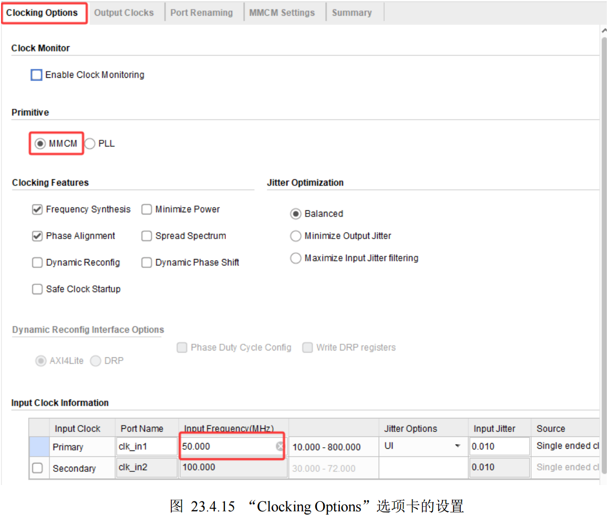

#### **“Output Clocks”选项卡**：

在“Output Clock”选项卡中，各参数（大家可以重点关注（1）中的内容）含义如下：

（1）、The phase is calculated relative to the active input clock 表格用于设置输出时钟的路数（一个 MMCM最多可输出七路不同频率的时钟信号）及参数，其中：

第一列“Output Clock”为设置输出时钟的路数，因为我们需要输出四路时钟，所以勾选前 4 个时钟。

第二列“Port Name”为设置时钟的名字，这里我们可以保持默认的命名。

第三列“Output Freq(MHz)”为设置输出时钟的频率，这里我们要对“Requested（即理想值）”进行设置，我们将四路时钟的输出频率分别设为 100、100、50 和 25，设置完理想值后，我们就可以在“Actual”下看到其对应的实际输出频率。需要注意的是 PLL IP 核的时钟输出范围为 4.6875MHz~800MHz，但这个范围是一个整体范围，根据驱动器类型的选择不同，其所支持的最大输出频率也会有所差异。

第四列“Phase (degrees)”为设置时钟的相位偏移，同样的我们只需要设置理想值，这里我们将第二路100MHz 的时钟输出信号的相位偏移设置为 180 度，其余三路信号不做相位偏移处理。

第五列“Duty cycle”为占空比，正常情况下如果没有特殊要求的话，占空比一般都是设置为 50%，所以这里我们保持默认的设置即可。

第六列“Drives”为驱动器类型，有五种驱动器类型可选：
- BUFG 是全局缓冲器，如果时钟信号要走全局时钟网络，必须通过 BUFG 来驱动，BUFG 可以驱动所有的 CLB，RAM，IOB。本次实验我们保持默认选项 BUFG。
- BUFH 是区域水平缓冲器，BUFH 可以驱动其水平区域内的所有 CLB，RAM，IOB。
- BUFGCE 是带有时钟使能端的全局缓冲器，它有一个输入端 I、一个使能端 CE 和一个输出端 O。只有当 BUFGCE 的使能端 CE 有效(高电平)时，BUFGCE 才有输出。
- BUFHCE 是带有时钟使能端的区域水平缓冲器，用法与 BUFGCE 类似。
- No buffer 即无缓冲器，当输出时钟无需挂在全局时钟网络上时，可以选择无缓冲区。

第七列“Max Freq of buffer”为缓冲器的最大频率，例如我们选取的 BUFG 缓冲器支持的最大输出频率为 628.141MHz。

（2）、USE CLOCK SEQUENCING（使用时钟排序），当在第一个选项卡上启用安全时钟启动功能时，Use Clock Sequence 表处于活动状态，可用于配置每个已启用时钟的序列号。在此模式下，只允许 BUFGCE作为时钟输出的驱动程序。

（3）、Clocking Feedback（时钟反馈），用于设置时钟信号的来源是片上还是片外，是自动控制还是用户控制，当自动控制片外的时钟时，还需要配置时钟信号的传递方式是单端还是差分，这里我们保持默认选项（自动控制片上）即可。

（4）、Enable Optional lnputs/Outputs for MMCM/PLL（启用 MMCM/PLL 的可选输入/输出），其中 reset（复位）和 power_down（休眠）为输入信号，locked（锁定）、clkfbstopped（指示信号，表示反馈时钟是否丢失）和 input_clk_stopped（指示信号，表示所选输入时钟不再切换）为输出信号，因为我们不需要锁相环进入休眠状态，也不需要看两个指示信号，所以这里我们保持默认启用复位信号和锁定信号即可。

（5）、Reset Type（复位类型），用于设置复位信号是高电平有效还是低电平有效，这里我们可以保持默认的高电平有效。

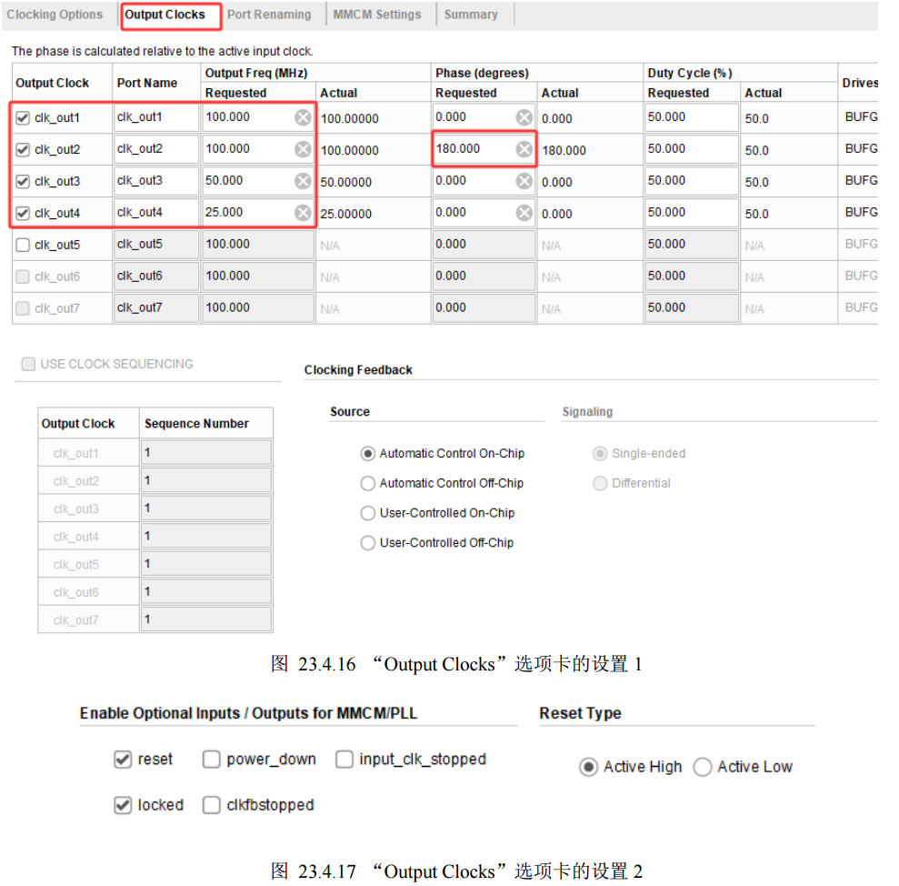

#### **“Port Renaming”选项卡**

“Port Renaming”选项卡主要是对一些控制信号（复位信号以外的信号）的重命名。在上一个选项卡中我们启用了锁定信号 locked，因此这里我们只看到了 locked 这一个可以重命名的信号，因为默认的名称已经可以让我们一眼看出该信号的含义，所以无需重命名，保持默认即可。

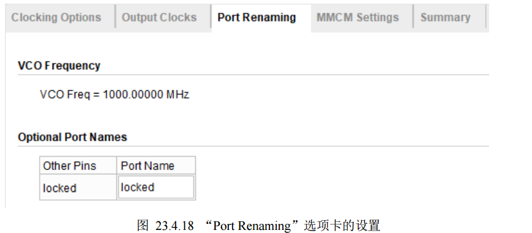

#### **“MMCM Setting”选项卡**
展示了对整个 PLL 的最终配置参数，这些参数都是由 Vivado 根据之前用户输入的时钟需求来自动配置的，Vivado 已经对参数进行了最优的配置，在绝大多数情况下都不需要用户对它们进行更改，也不建议更改，所以这一步保持默认即可，如下图所示

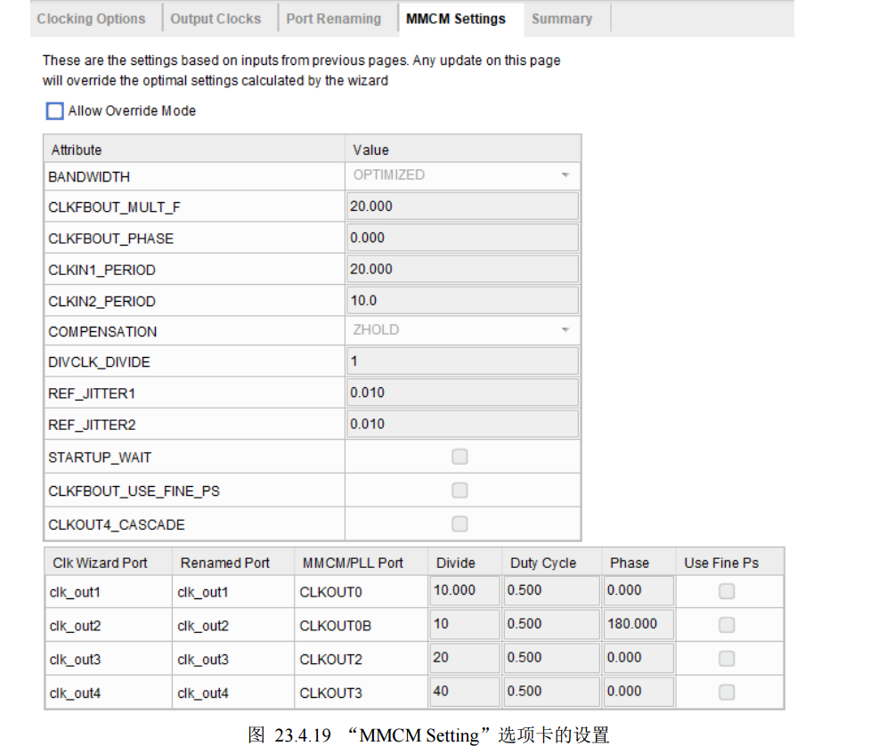

#### **“Summary”选项卡**
是对前面所有配置的一个总结，

## 旧版笔记

时钟管理单元 CMT 体框图
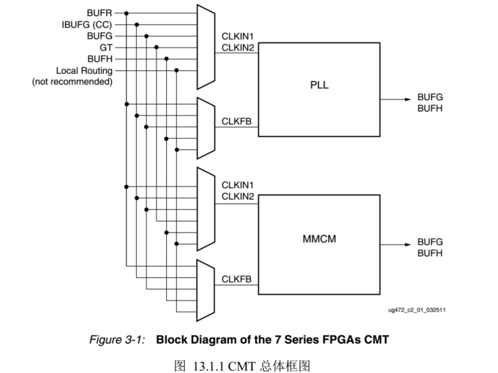

MMCM/PLL 的参考时钟可输入：
IBUFG(CC)即具有时钟能力的 IO 输入 （最常用）
区域时钟 BUFR
全局时钟 BUFG
GT 收发器输出时钟
行时钟 BUFH
本地布线（不推荐使用本地布线来驱动时钟资源）
MMCM/PLL 的输出可以驱动全局时钟 BUFG 和行时钟 BUFH 等等。 BUFG 能够驱动整个器件内部的PL 侧通用逻辑的所有时序单元的时钟端口。

BUFG/BUFH/CMT 在一个时钟区域内的连接框图如下图所示
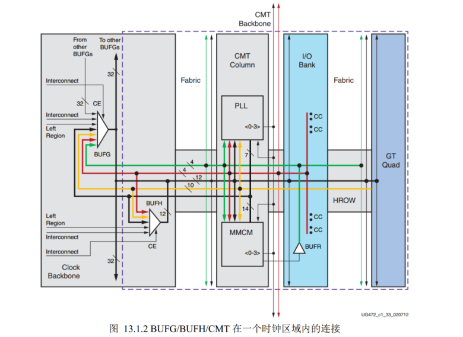
MMCM 和 PLL 的总体框图如下图所示。
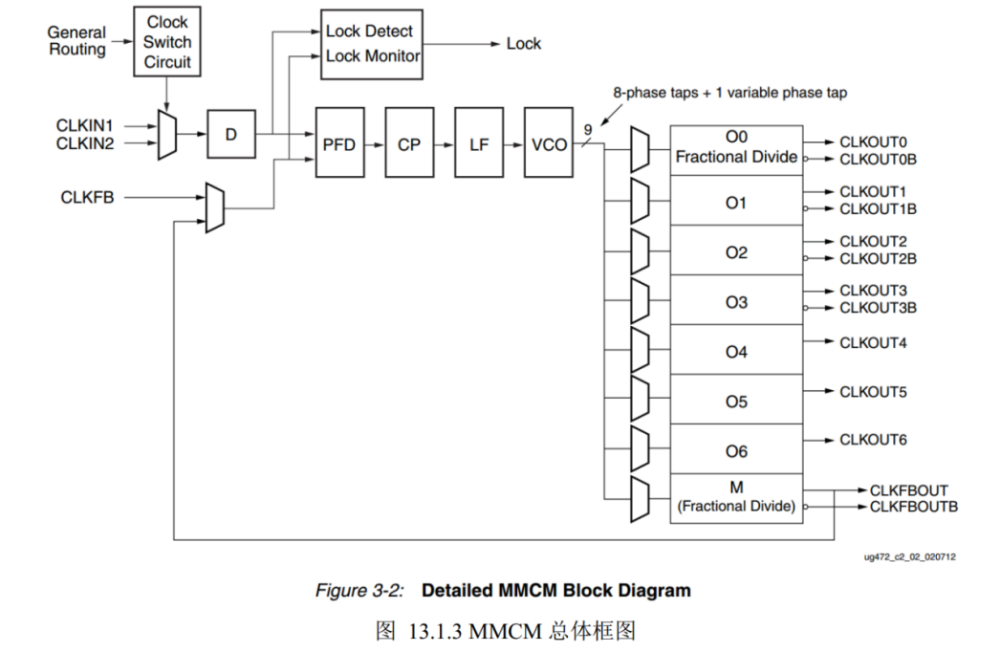
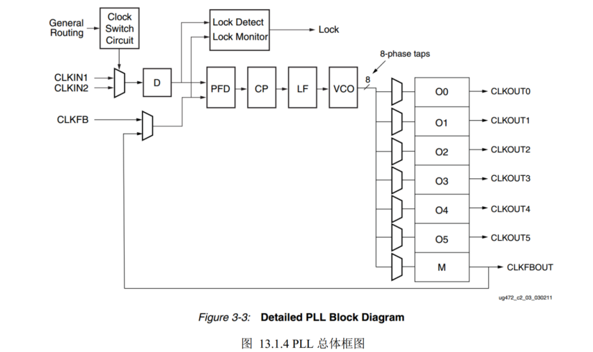

MMCM 的功能是 PLL 的超集，其具有比 PLL 更强大的相移功能。
l MMCM 主要用于驱动器件逻辑（CLB、 DSP、 RAM 等）的时钟。
l PLL 主要用于为内存接口生成所需的时钟信号，但也具有与器件逻辑的连接，因此如果需要额外的功能，它们可以用作额外的时钟资源。

PLL 由以下几部分组成
l 前置分频计数器（D 计数器）
l 相位-频率检测器（PFD， Phase-Frequency Detector）
l 电荷泵（Charge Pump）
l 环路滤波器（Loop Filter）
l 压控振荡器（VCO， Voltage Controlled Oscillator）
l 反馈乘法器计数器（M 计数器）
l 后置分频计数器（O1-O6 计数器）

Clock wizard IP核的配置
Component Name ：设置该 IP 元件的名称
1. “Clocking Options” 选项卡：
l Primitive ：使用 MMCM 还是 PLL 来输出不同的时钟
l Input Clock Information :输入频率（即板卡晶振频率50M）
2. “Output Clocks”选项卡：分频个数及配置
3. ”Port Renaming”选项卡 ：控制信号重命名
4. “MMCM Setting”选项卡 ： 展示整个 MMCM/PLL 的最终配置参数
5. “Summary”选项卡:是对前面所有配置的一个总结，
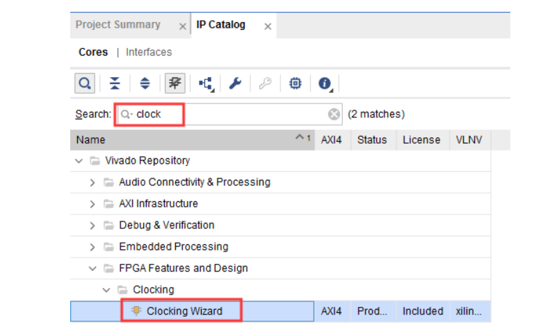
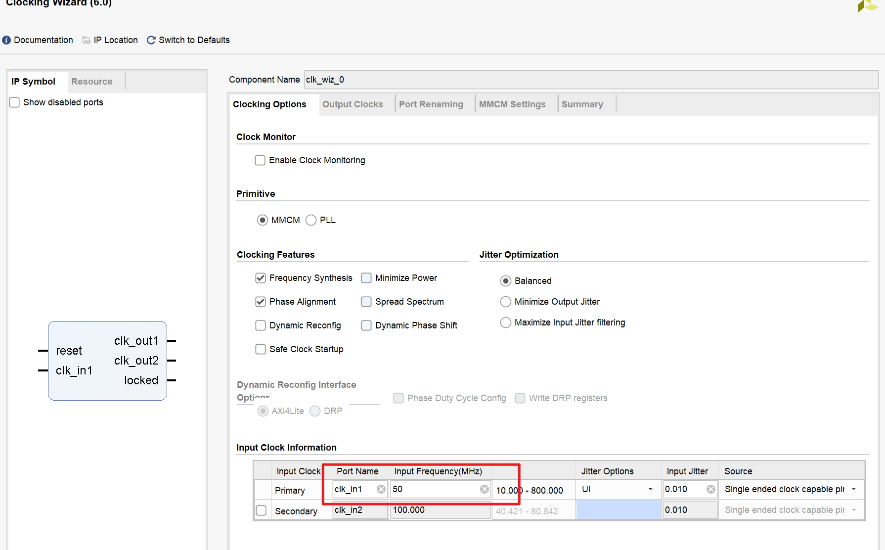
综合独立于顶层设计。在Out-of-Context Module Runs” 窗口中显示
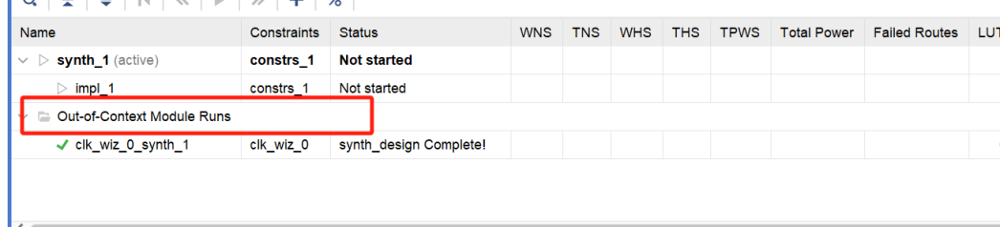
系统是低电平复位，ip核是高电平复位，此处需取反
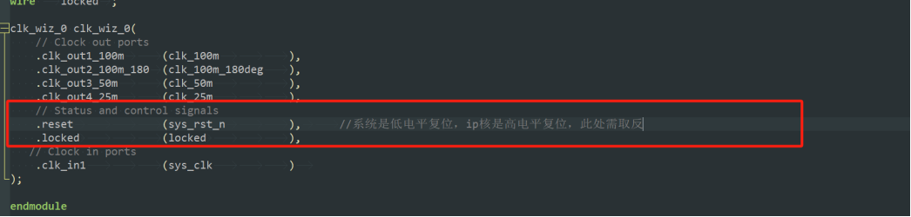
Locked拉高以后表示输出稳定了，时钟锁定了，可以使用了
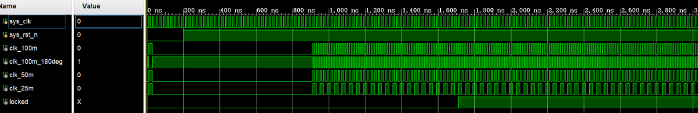
上板测试，示波器抓波形
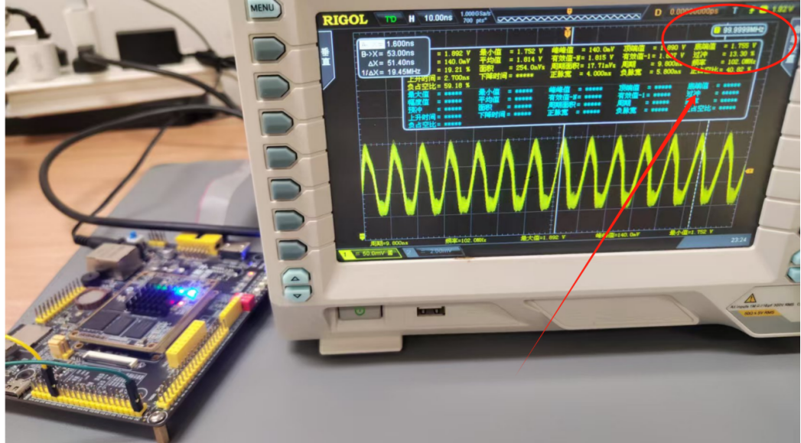
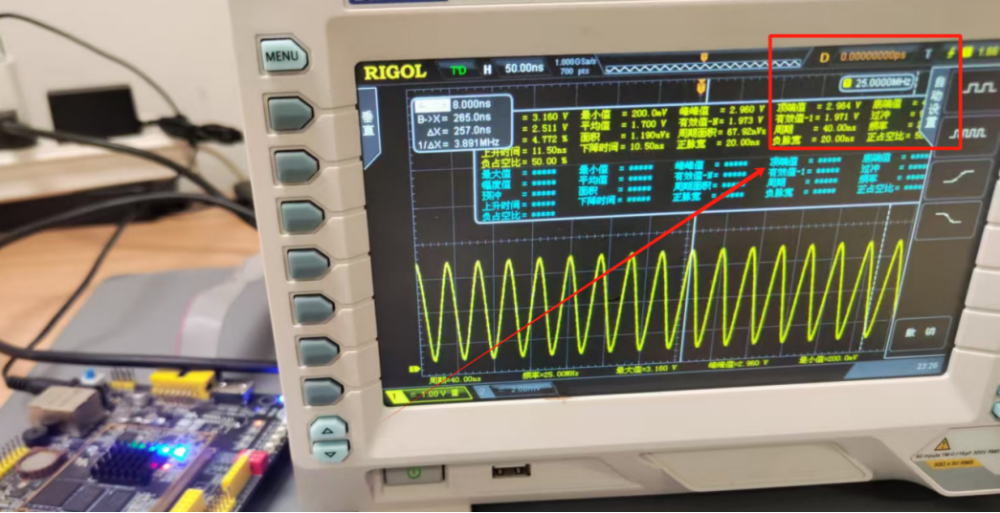