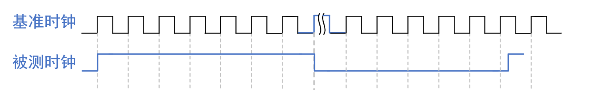
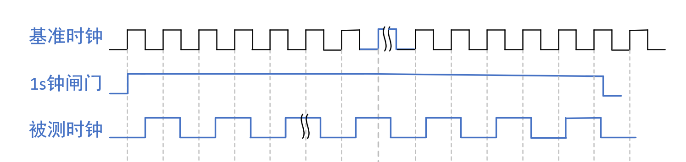
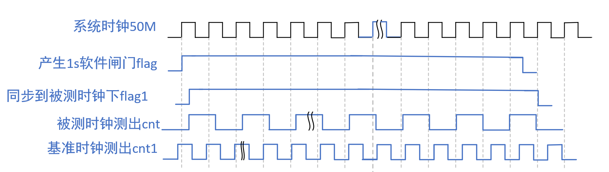

通过FPGA实现简易频率计，可测量外设时钟晶振频率

1，频率计简介
周期测量法：先测量出被测信号的周期T，然后根据频率f=1/T求出被测信号的频率。
引入基准时钟，用基准时钟去数被测时钟的周期。
T=cnt * t1
缺点：会有一个基准时钟的误差。只测低频信号

频率测量法：在时间t内对被测信号的脉冲数N进行计数，然后求出单位时间内的脉冲数，即为被测信号的频率。
例如，去数1s钟被测时钟震荡次数，来得到被测时钟的频率
缺点：会有一个被测时钟的误差。只测高频信号

等精度测量法：在计数允许的时间内，同时对基准时钟和被测信号进行计数，再通过数学公式推到得到被测信号的频率。
被测时钟一定会被同步之后的闸门整除
用被测时钟对flag1计数
再用基准时钟对flag1计数
cnt * T = cnt1 * T1
只有T是未知量
有点：高低皆可

2，硬件设计

3，实验任务

4，程序设计

5，下载验证

6，课程总结

