主要分为三个部分，
第一部分是中断函数是怎么使用的：通过MIO按键利用中断控制LED亮灭
第二部分是在UART控制器中如何使用串口中断
第三部分是在定时器中使用中断

**一、中断函数是怎么使用的**

GPIO模块框图：
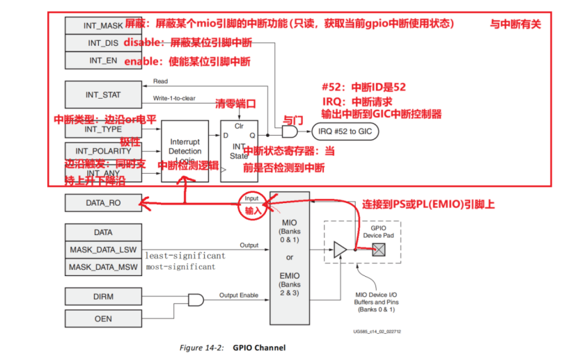

GIC如何知道中断请求来自哪里：中断ID，例如GPIO的ID是#52，根据ID识别中断是来自哪个外设的
ug585第229页列出了中断ID
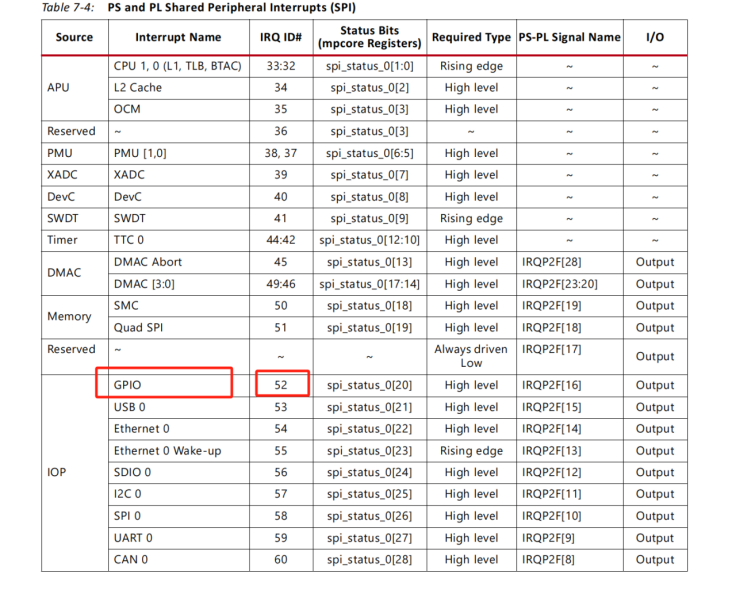
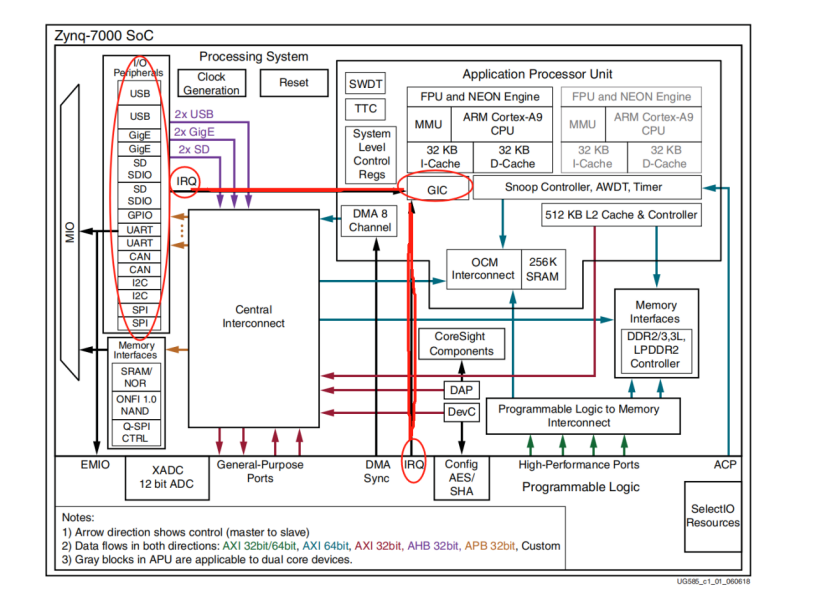

Q&A：

Q1：若GPIO产生了中断，GIC如何知道中断时来自于哪个引脚的
A1：最终传递给GIC的中断信号，可以通过INT_MASK的值来判断，中断来自于被屏蔽掉的信号之外的按键

Q2：若几个引脚都使能了，没有被屏蔽，如何判断中断来自于那个引脚
A2：INT_STAT寄存器，寄存了每个引脚中断的状态，可以通过查看该寄存器状态判断中断来源。中断会通过或or逻辑传递给GIC。

Q3：中断逻辑的或门如何运作
A3：中断会通过或or逻辑传输给GIC，GPIO一共有118个（54+64）引脚，不论是那个引脚产生了中断，都会向GIC产生一个中断请求。需要通过MASK和INT_STAT这两个寄存器去判断是哪一个寄存器产生的中断信号。

系统框图
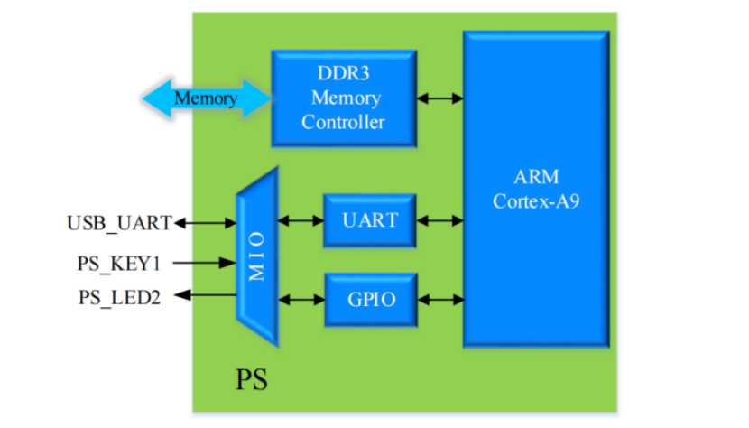

正点原子实验的系统框图是通过PS端的按键通过中断控制LED，但实验室开发板资源PS端没有按键，因此可通过EMIO将PL端的按键替换正点原子实验里的PS端按键
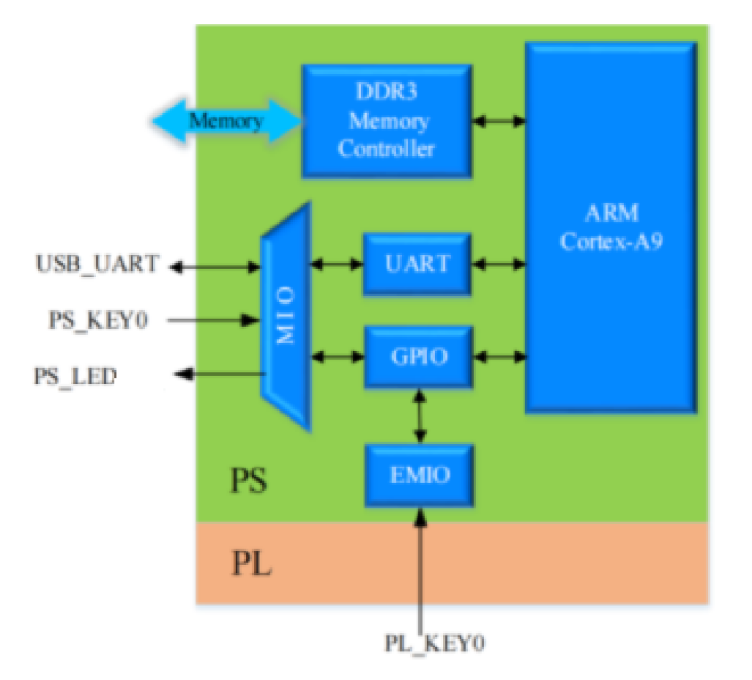

ug585编程指导：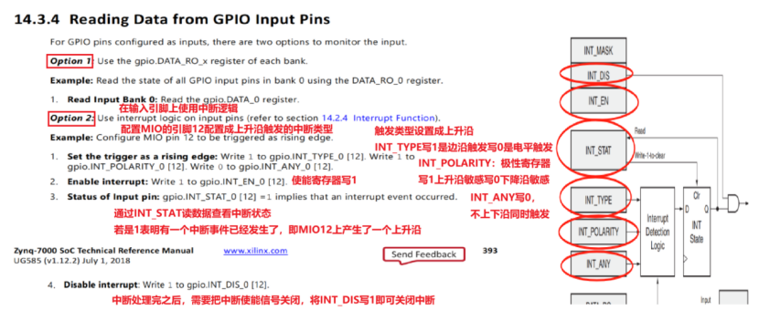

drivers里的例程：

main函数里的GpioIntrExample函数是此次实验的核心函数
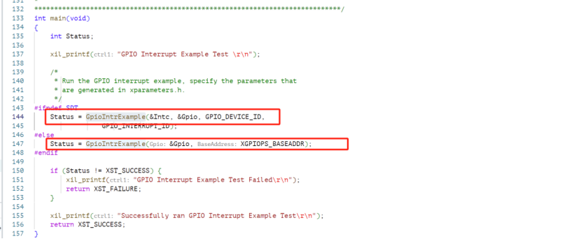

GpioIntrExample函数

通过case进行芯片选型开发板类型
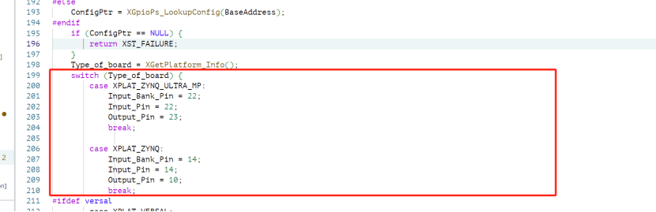

查找PS的GPIO查找器件驱动
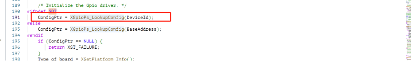

对GPIO器件进行初始化
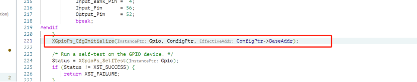

查找期间驱动和对PSGPIO进行初始化的程序在之前用过，如下
使用所有的器件之前，都需要这样的过程，查找配置信息及初始化
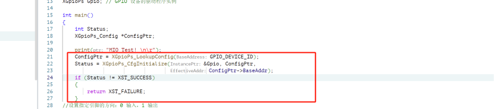

GPIO器件的自测程序
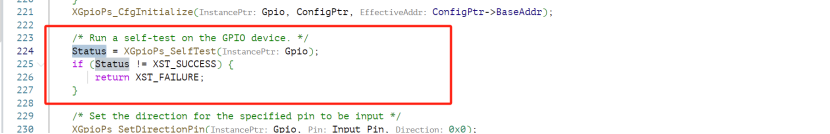

给特定的引脚设置方向，例如把GPIO的按键设置成输入
设置输出端口并使能
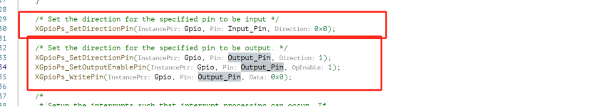

设置中断系统。所以中断的信息应该在这个函数当中，详细观察该函数
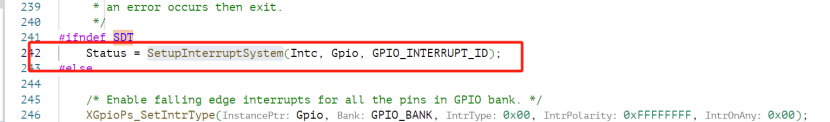
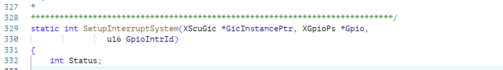

XScuGic类型，是ps里的通用的中断控制器
XGpioPs类型是Gpio的实例
GpioIntrId：中断的ID，对于gpio来说就是52

类型的注释如下


函数内容：
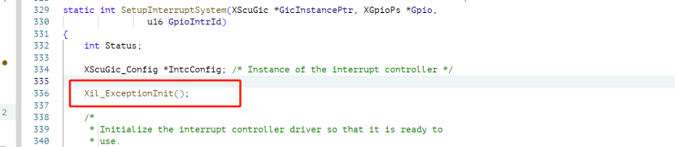

GPIO_INTERRUPT_ID通过ctrl按键查找发现其实就是52，与ug585中的中断号对应


报错Intc没有声明，Intc是什么？Intc是从example里传递过来的
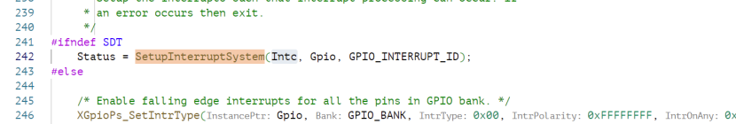
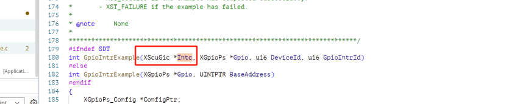

Intc是XScuGic的类型，数据从哪里来？
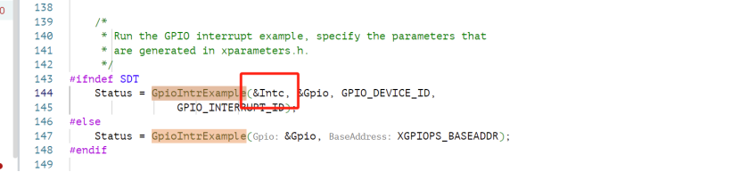

找到Intc变量，这是中断控制器的驱动实例
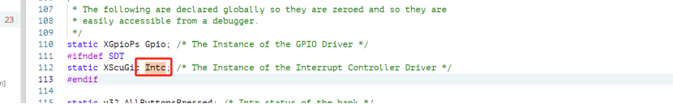

复制过来，但该类型并未声明
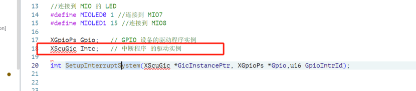

需找到该类型头文件


在声明中1，2变量均为指针类型变量，需要用的是这两个驱动实例的指针，因此需要在函数里也用指针
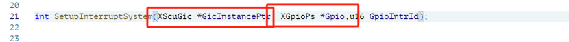

加个取地址的符号


下面仔细研究SetupInterruptSystem这个函数内部
用于反应函数运行的结果，用于寄存运行的结果，这个status不需要，可以删掉
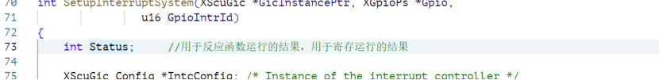

声明了一个配置类型的指针
这是中断控制器的实例，里面包含了中断的配置信息
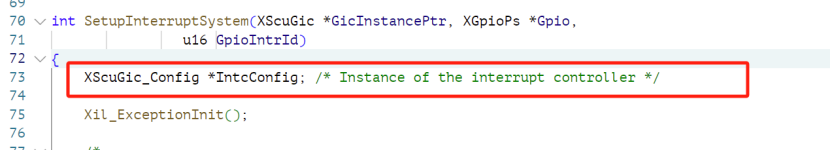

类似于int main里的XGpioPs_Config *ConfigPtr;
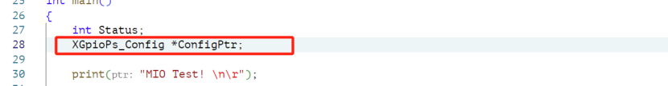

Xil_ExceptionInit();是什么，
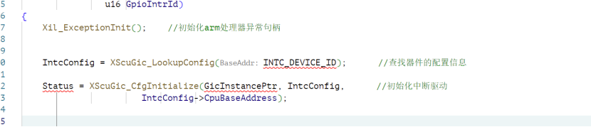

中断控制器ID没有定义，参照示例程序定义ID，因为只有一个GIC器件，因此ID号其实是0


这三个函数，只要用到外设的中断功能，就需要这几个函数

初始化并设置 ARM 处理器的异常处理功能。ARM 处理器支持 7 种异常情况：复位、未定义指令、软件中断、指令预取中止、数据中止、中断请求（IRQ）和快速中断请求（FIQ）。每种异常也都有自己的 ID 标识，其中 XIL_EXCEPTION_ID_INT 用于标识中断请求（IRQ）异常。我们通过调用函数 Xil_ExceptionRegisterHandler( XIL_EXCEPTION_ID_INT, (Xil_ExceptionHandler) XScuGic_InterruptHandler, &scugic_inst )来给 IRQ 异常注册处理程序，它会将中断控制器 GIC 的中断处理程序与 ARM 处理器中的硬件中断处理逻辑连接起来。另外还要通过 Xil_ExceptionEnable( )函数使能 IRQ 异常。
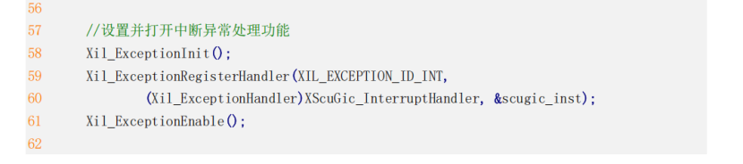

关联中断处理函数，变量有：中断控制器驱动实例指针，GPIO中断ID号52，中断的处理函数句柄，回调参考通常是驱动的指针


下面是中断的设置的步骤
首先是设置中断类型


详细看该函数
这个函数是给整个bank的pin设置中断类型
如果给单独的GPIO的引脚设置中断类型可使用XGpioPs_SetPinIntrType().
本次实验只想给单独引脚设置中断，所以可用XGpioPs_SetPinIntrType().这个函数，去头文件找一下
XGpioPs_SetIntrTypePin可以给单独引脚设置中断类型


中断类型可以看.h里的宏定义看看
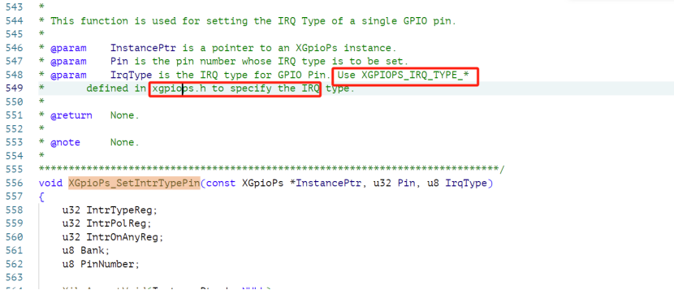

这个就是宏定义，上升沿、下降沿、双沿、高电平、低电平
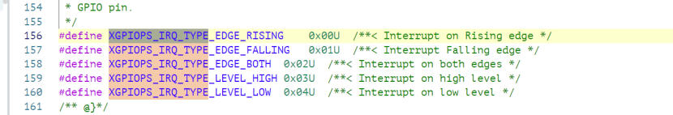

因为按键按下是下降沿，因此选择XGPIOPS_IRQ_TYPE_EDGE_FALLING，吧MIO12这个引脚中断类型设置好
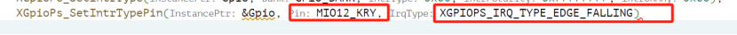

下面这个函数是设置回调函数的句柄，其实就是给GPIO中断设置一个中断的服务函数，就是每一个中断来的时候需要给一个中断服务函数，中断来的时候要首先执行一下这个中断服务函数，之后后再回到主函数中去执行。


这个函数的功能与XScuGic_Connect类似，只不过是给GIC控制器的异常处理函数的XGpioPs_IntrHandler
其中的XGpioPs_IntrHandler就是XGpioPs_SetCallbackHandler来设置的
也就是说将XScuGic_InterruptHandler这个句柄最终指向IntrHandler这个句柄
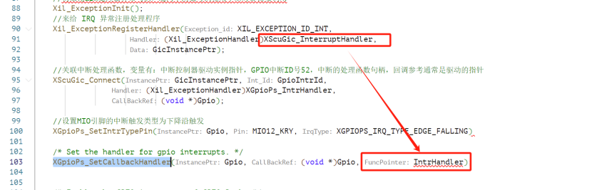

最终的IntrHandler句柄是我们自己编写的中断函数

这两个函数可以合并成一个函数，可以把自己编写的中断函数IntrHandler直接放到Xil_ExceptionRegisterHandler中的XScuGic_InterruptHandler
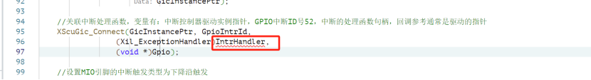

例程中的如下信号是给整个bank的中断使能信号


进入详细看看，去头文件看看，下面有对单独引脚设置使能信号的函数即XGpioPs_I ntrEnablePin(XGpioPs *InstancePtr, u32 Pin);
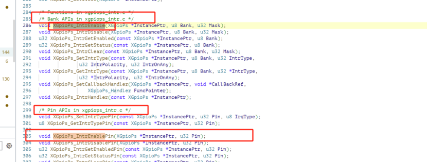

代码如下


GIC可以接收很多信号的中断，包括PS里的外设或PL的一些中断，可以接收，也可以屏蔽
打开GPIO外设中断的使能信号
其中有个中断的ID，每个中断源发送请求都会标出中断号，52
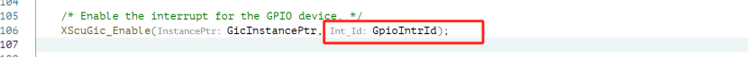

这两个函数有什么区别呢
上面是对GPIO外设进行配置，使能其中的一个MIO引脚的中断功能
下面的函数是对中断控制器进行一个配置，是为了打开GPIO外设中断的功能


最后还有一个函数


Xil_ExceptionEnableMask其实是与Xil_ExceptionInit();和Xil_ExceptionRegisterHandler属于同一组函数
其作用是使能处理器的中断

接下来最重要的是编写中断服务函数
先看示例里是怎么写的
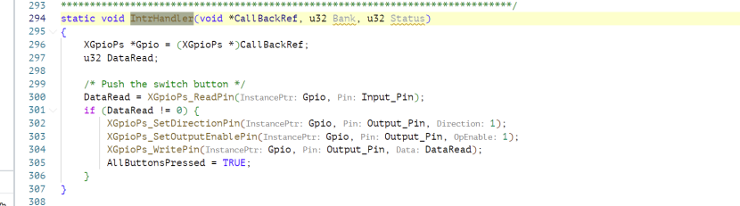

中断服务函数需要自己写，但是可以先写个简单的，测试一下是否成功调动中断服务函数
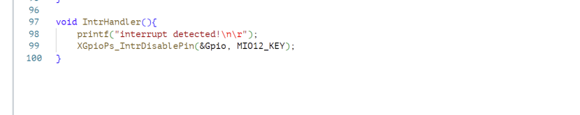


检测到中断服务函数可以正常运行，接下来怎么写中断服务函数？？
可以编写一个通过按键中断使led灯取反的操作
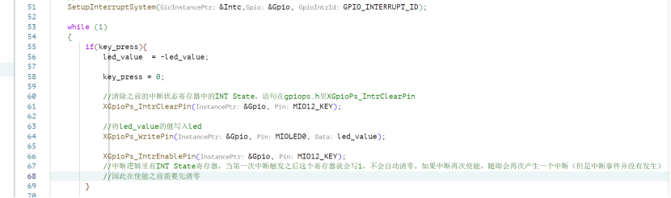


每次按下按键进入中断函数，使key_press置1，然后检测到key_press置1的时候对led取反

但是中断逻辑里有INT State寄存器，当第一次中断触发之后这个寄存器就会写1，不会自动清零。如果中断再次使能，随即会再次产生一个中断（但是中断事件并没有发生）因此在使能之前需要先清零。
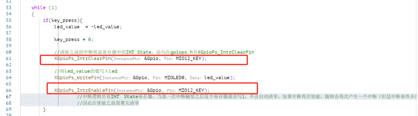

按键的抖动会导致按一次检测到多个下降沿，加入按键消抖功能，可以直接用usleep消抖
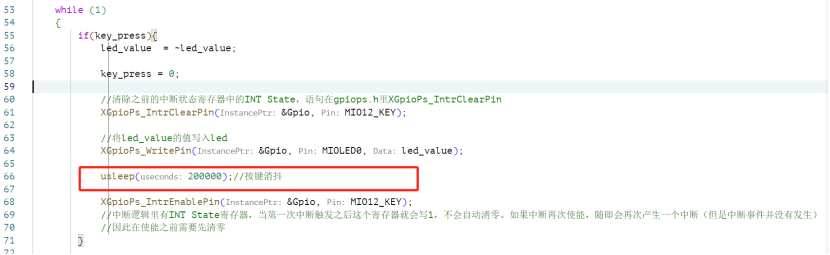

验证成功，我们成功的通过中断来控制led的亮灭。这就是中断函数的应用，那么在工程中中断函数是怎么应用的？？？
在工程中我们应该怎么使用中断函数？？
完整代码见最后

**二、UART控制器中如何使用串口中断**

首先什么是UART控制器呢？   
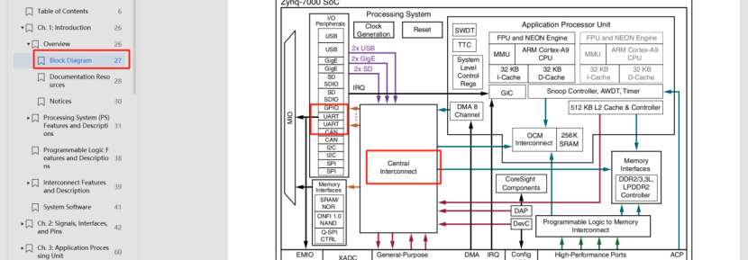

PS中提供了uart，在pl中需要手动写uart时序代码编写uart的时序，但是在ps端并不需要了解时序就可以直接使用uart
可以像操作fifo一样往寄存器里写入数据，uart控制器就能帮我们把控制器发送出去（接收过程同样）
在ug585 的19章有对uart控制器的讲解
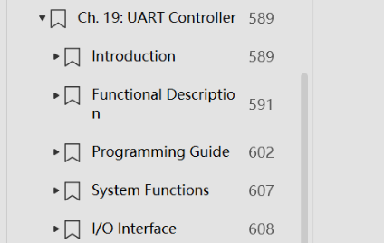

全双工、异步
通过控制 配置和模式寄存器来实现波特率或者发送数据等等配置
有独立的接收和发送的路径（两个）
每个路径包含了一个64字节的fifo，所以操作uart数据有点类似操作FIFO，主要是将数据连续或者非连续的写道FIFO当中
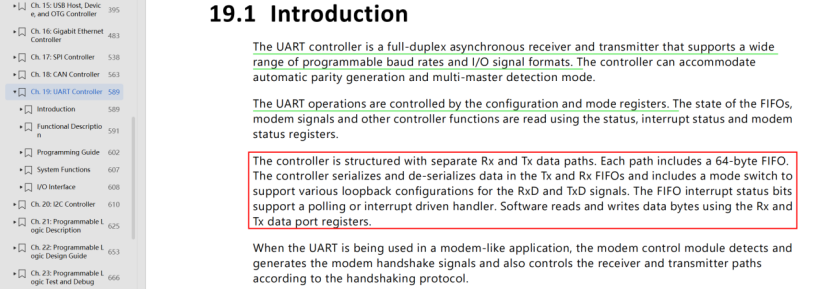

模式的切换是什么：给RxD和TxD进行配置，有四种模式，后面详细介绍
FIFO的中断状态为支持轮询 或者 中断 的方式
轮巡：不同的读取FIFO寄存器，检测当前
中断：例如可以配置接收的阈值，当达到这个阈值以后，产生一个中断。其实通过中断的方式可以更好的执行代码，节省cpu资源
收到串口数据打断进程
软件读写数据是通过Rx和T下数据端口寄存器实现的
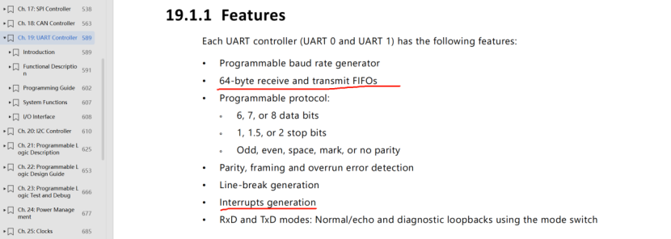

串口控制器有两个
可编程不同波特率产生
FIFO深度是64字节
数据位宽6、7、8位
停止位1、1.5、2位
校验方式奇、偶、校验位固定为0、固定为1、没有校验

中断产生
RxD和TxD模式设置：一共有四种

UART控制器框图
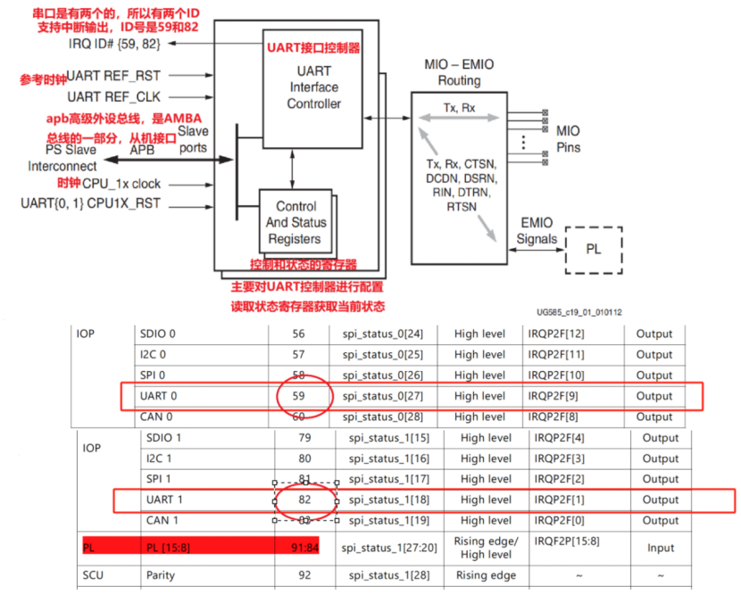

以下为UART的整体框图
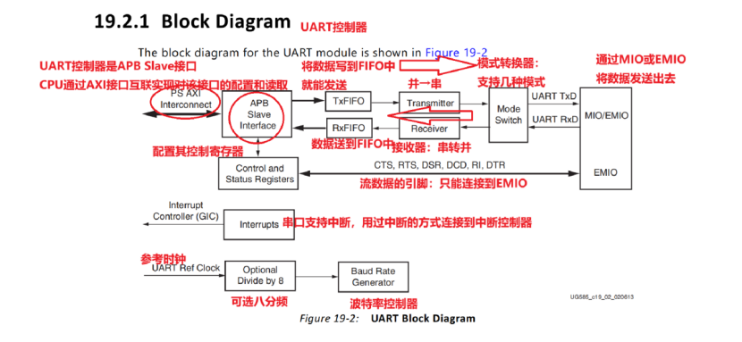

串口要发送数据还是接收数据实际是操纵其FIFO，相对于verilog相对简单，了解寄存器，就可以实现串口收发的功能

波特率的产生
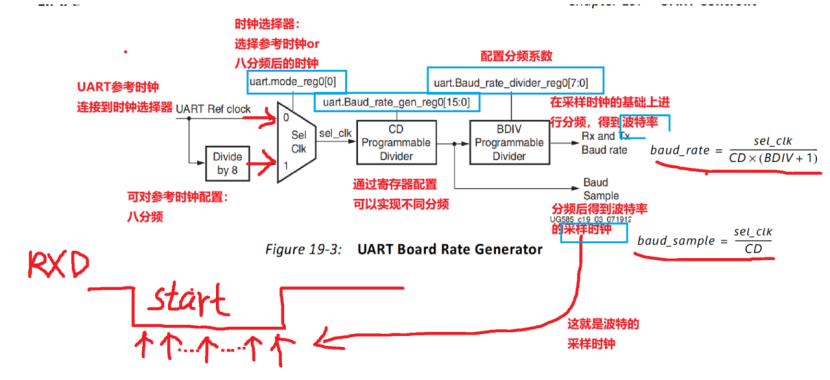

不同的参考时钟表格，对应的实际的波特率
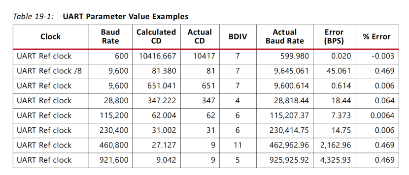

**发送FIFO介绍：TxFIFO**

发送FIFO存储了数据，数据由APB接口来进行写入，CPU操控TxFIFO寄存器写入数据存到FIFO中直到读出，并送到移位寄存器（并转串），最大8位
当数据写道发送FIFO内，FIFO的空标志会被清除
空标志：FIFO里写入数据后拉低，当数据读出去后，并加载到为位移寄存器后，空标志拉高
发送器：检测到FIFO非空，就从FIFO中读数据，并将其串行输出出去。并转串时间较长，主机有足够的时间继续像FIFO中写入数据。这样可以衔接每一波特连续传输
TxFIFO满状态标志：FIFO写满，阻止后面数据写入FIFO。FIFO容量只有64字节，
TxFIFO将满标志：快满了，可避免写入过多数据导致溢出
发送FIFO阈值触发：当前FIFO还有多少个数据。若配置成10，则当FIFO中达到10个数据以后可以产生标志位或中断，获取状态，知道当前FIFO中数据数量的阈值
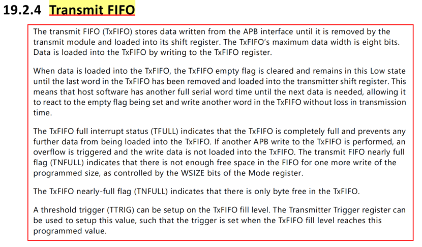

在波特率的控制下将数据按位进行输出
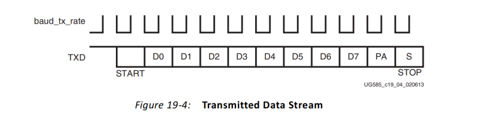

**接收FIFO介绍**

接收FIFO数据来源于后面的移位寄存器（串转并），写道RxFIFO中，最大位宽8位
RxFIFO空标志：写入数据后空标志会被清除。CPU通过APB接口读取数据。如果RxFIFO本身就是空的，那读到的数据都是0
RxFIFO满状态：FIFO已经写满，继续接收数据会溢出
阈值触发设置：通过接收触发寄存器进行设置：1-63。FIFO中数据达到阈值量则产生标志位，可通过该标志位产生中断，CPU处理该中断，将数据从接收FIFO中读出来

**数据采样**

由分频寄存器实现
如下图，配置成15，就是对每一位采样16次，采集中心位置为有效数据（较稳定）
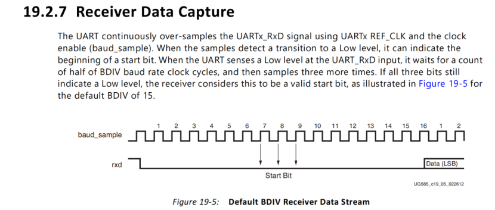

**I/O模式的切换**

正常模式、自动回应模式、本地环回模式、远端换环回模式
Mode Switch模式切换功能模块：位于发送模块和TxD端口之间，接收器和RxD之间。
箭头所指就是不同模式下的功能

一般用正常模式
正常模式：正常收发数据
自动回应模式：对端设备的数据会环回，CPU可接收数据，但是CPU无法发送数据
本地环回模式：发送器直接连接到接收器
远端环回模式：将接收端直接连接到发送端，CPU无法接收数据或发送数据
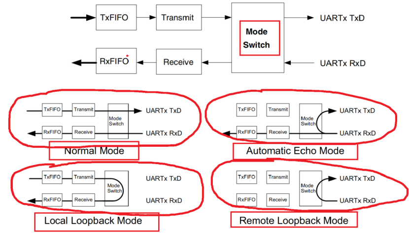

Q1：模式配置是干嘛用的（本地环回模式）？
A1：假设我们当前没有外设，或者板子还没有进行串口连接，此时我们想验证一下数据传输是否正确，就可以用本地环回模式，验证一下程序所控制的发送的数据和接受的数据是否一致。

Q2：远端环回模式是干嘛用的：
A2：假设我们的程序还没有调通，配置成远端环回模式，通过对端设备下发数据，看一下能不能收到数据，验证一下外部的硬件连接是不是正确的。

**中断和状态寄存器（重要）**

有两个状态寄存器，可通过软件读取
中断状态寄存器：读取状态，并产生中断
状态寄存器：只能获取状态

The Chnl_int_sts_reg0 register中断状态寄存器是粘性的（被置位后一直保持，直到软件把它清除。写1清除），这个寄存器与the Intrpt_mask_reg0 mask register中断掩码寄存器是按位与的操作。

什么意思：只有掩码寄存器的某一位是1，中断状态寄存器也是1的时候，与的结果是1，只有都是1时才能产生中断，送到中断控制器。

mask=0，表示屏蔽某位中断
mask=1，表示使能某位中断

 

**中断寄存器框图**

如下

中断使能寄存器和中断除能寄存器如果相同，相当于没有开启中断
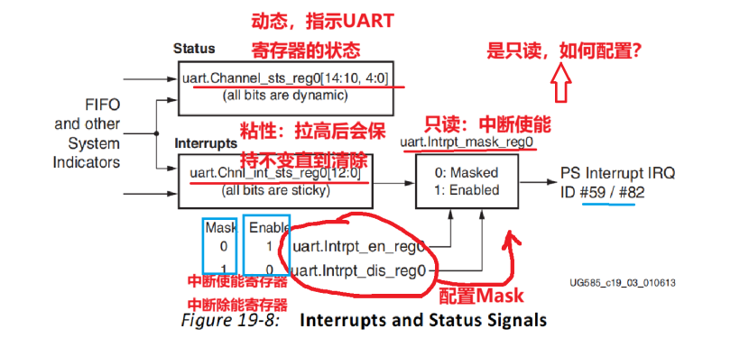

寄存器每一位所表示的含义如下
文档中详细写了每个标志位的含义
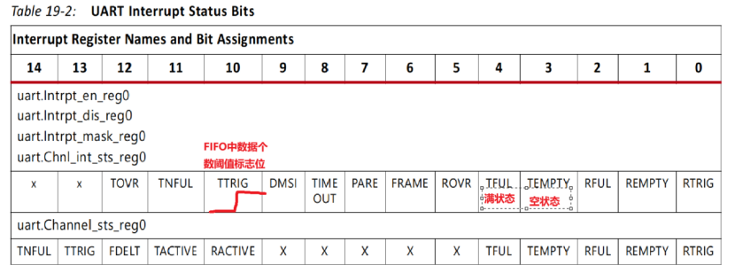
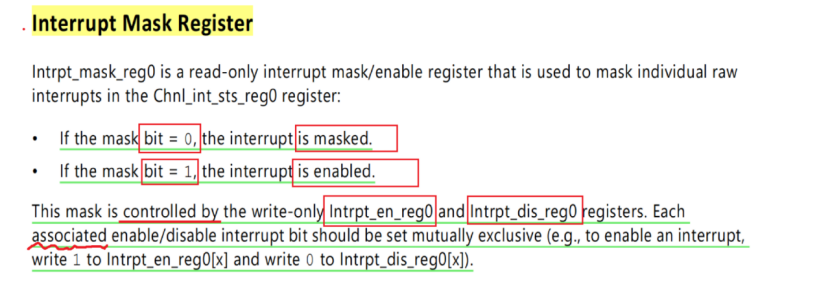

**FIFO中断**

接收FIFO和发送FIFO框图
UART FIFO产生中断很灵活，可以配置，产生中断框图如下
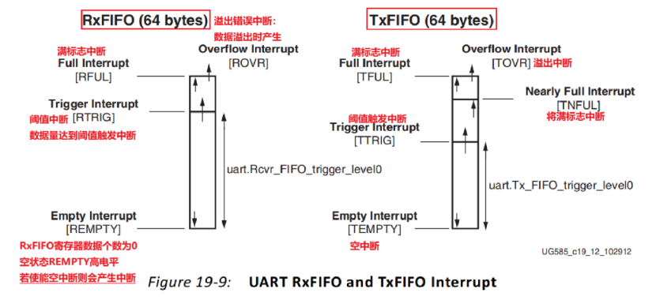

**编程指南**

如何对UART进行配置，以及收发数据如何实现

**如何配置寄存器功能**

帧格式
波特率
FIFO触发的阈值
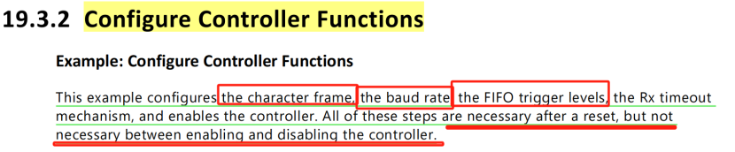

当控制器使能之后做了这些配置，不需要使用这些寄存器时可以除能。下次再需要使用时直接使能就可以，不需要再重新配置了

**配置uart帧格式**

下面给了一个配置uart帧格式个例子
比如向uart.mod_reg0写入0x0000_0020的时候会进行如下配置
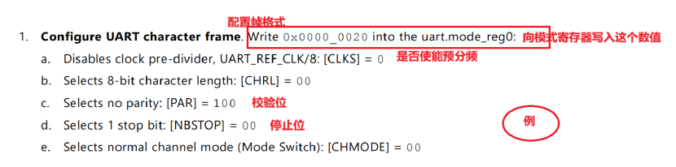

那么每一位对应的配置是如何配置的，ug585中也给了详细怎么配置，可以看文档最后有寄存器详细列表
文档最后有详细配置
例如最低位：使用参考时钟 or 八分频后的时钟
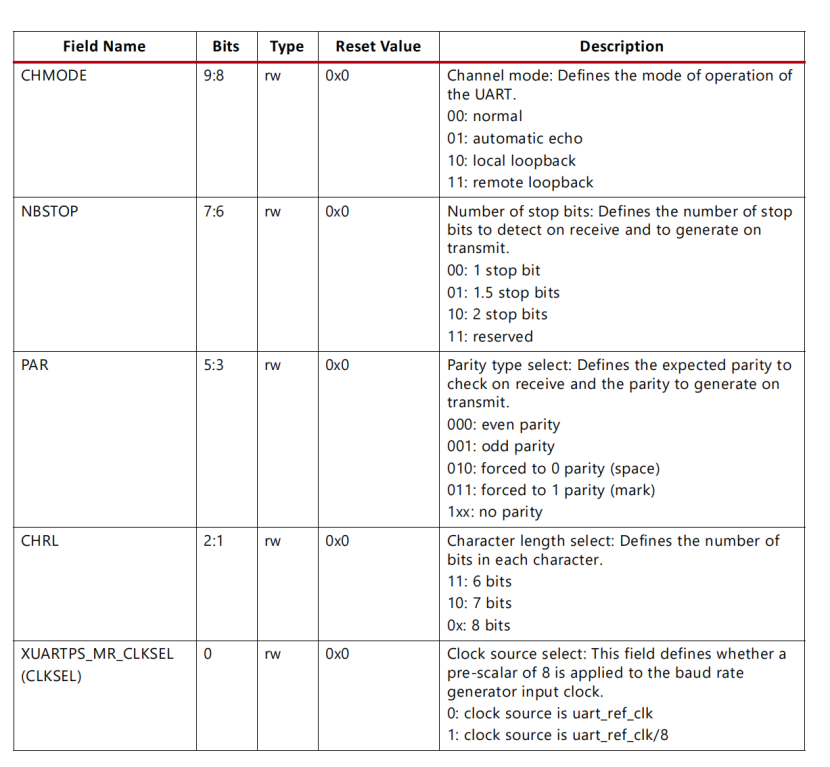

**配置uart的波特率**
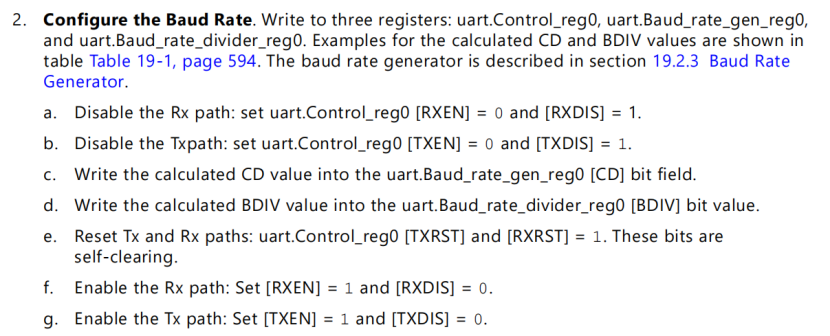

**设置RxFIFO触发等级**

设置触发等级：写到这个寄存器里面uart.Rcvr_FIFO_trigger_level0配置触发等级，可以写入1-63触发阈值，写0就是disable
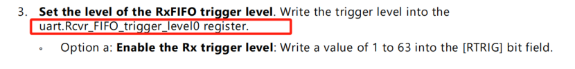


**使能控制器**

uart.Control_reg0 register.往这个寄存器里面配置使能控制器。0x0000_0117
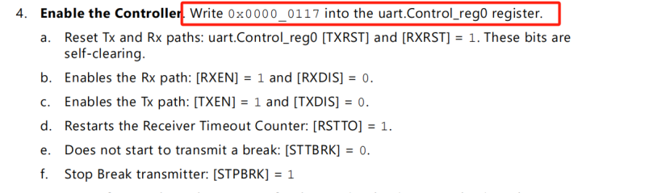

**以上的配置可以通过库函数来调用这些功能**

**传输数据**

接收数据的两种方式：轮询 or 中断

空时可一次性写入64个字节
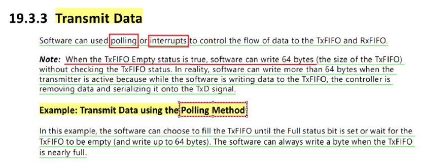

**使用轮询方式发送数据**
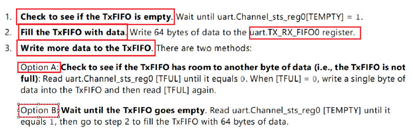

检查FIFO是否空，写入64位数据，
写入更多的数据到fifo，有两种方法
1：检查是否还有位置发送数据
2：等待FIFO空，空后再次写入64字节

**使用中断方式发送数据**

对空empty的中断除能
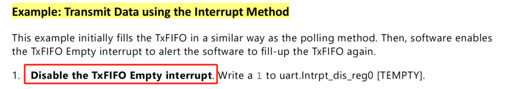

一次性写入64字节
检查fifo还有没有空间发送数据
重复以上两个步骤
使能中断
等待发送fifo为空，空后返回第一步骤重新除能重新发送数据
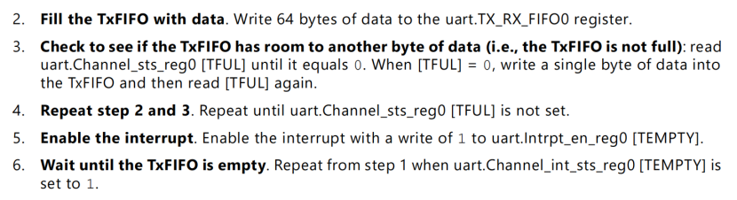

**接收数据**

轮询方式 or 中断方式

**轮询：**

等待数据量达到阈值
从RxFIFO中读出数据
重复第二步骤直到读空
接收超时，清零status bit

**中断：**

使能中断
等待RxFIFO数据量达到阈值 or 接收超时
读出数据：TX_RX_FIFO0
重复2、3过程
清除中断
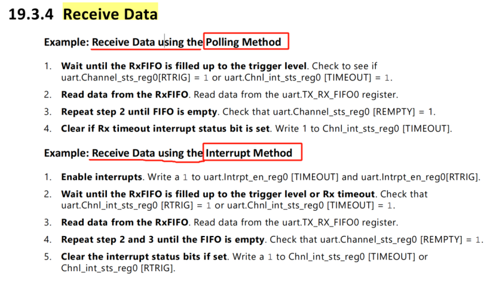

TX_RX_FIFO0：
将数据发送出去操纵的时TX_RX_FIFO0，然而将数据读进来也是操作的这个寄存器TX_RX_FIFO0
虽然操作的是同一个寄存器，但是其实是两个不同的FIFO
文档中有该寄存器的介绍（文档最后）
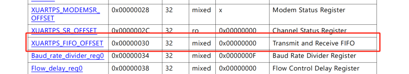
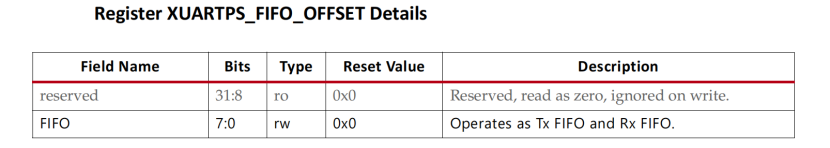

低八位，可读可写

**接收FIFO触发阈值的中断**
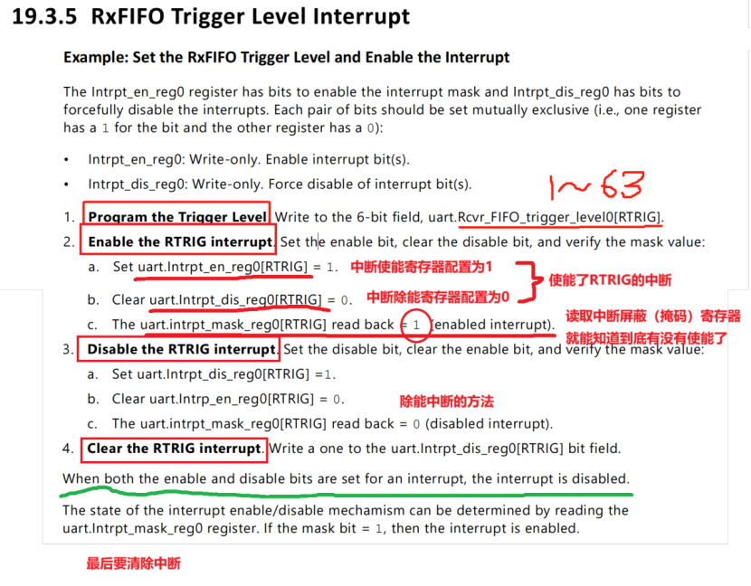

**UART中断的实现**

任务：通过UART控制器，完成串口中断数据的环回的功能

硬件连接，连接到MIO14和MIO15
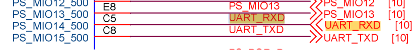
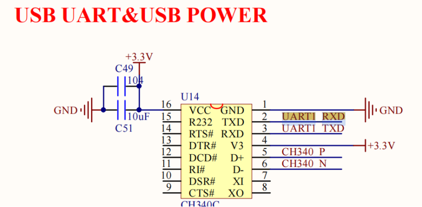

系统框图
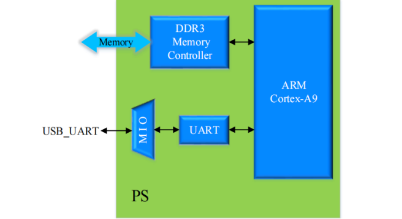

 系统程序是在DDR3内存中运行
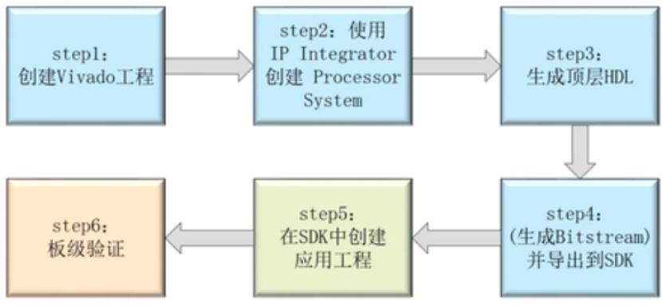

block设计其实可以通过model选择EMIO引脚的，但是我们此实验用的是MIO，不用设置不用勾选
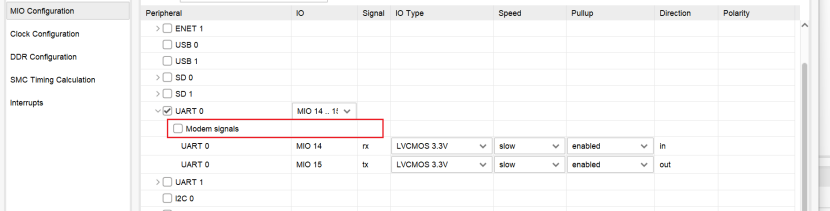

其实这些就是modem里的一些信号，但是平时不怎么用，只用到TXD和RXD就ok
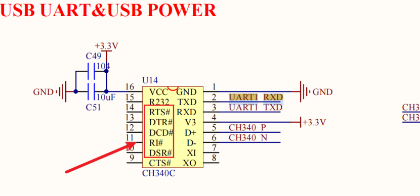

配置波特率

vivado里可以对uart的波特率进行配置，这里配置完以后其实可以在sdk/vitis里通过软件重新配置的
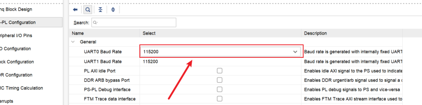

此刻我们用到的是MIO14和MIO15，但是如果想连接到EMIO也可以在这里配置成EMIO
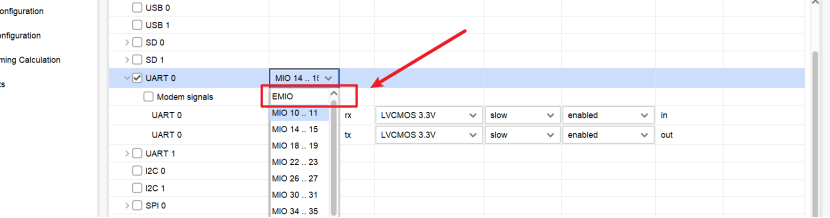

创建工程以后

首先要对使用的模块进行初始化

即对uart控制器和中断控制器进行初始化，并关联中断函数

塞林斯driver里给了实例

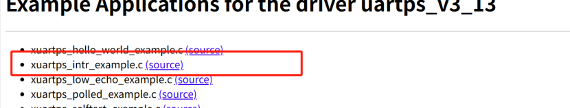

导入到工程中

通过看官方例程发现一个大致规律，若使用一个ps的外设，操作类似

GPIO中断：1、配置。2、使能外设中断。3、对中断控制器配置。

UART中断：1、配置。2、对中断控制器配置。3、关联中断处理函数并处理。4、清除中断

**示例是怎么对串口进行配置的**

查找配置→对串口进行初始化
```c

#include "xparameters.h"    //器件参数信息

#include "xstatus.h"        //包含 XST_FAILURE 和 XST_SUCCESS 的宏定义

#include "xil_printf.h"     //包含 print()函数

#include "xgpiops.h"        //包含 PS GPIO 的函数

#include "sleep.h"          //包含 sleep()函数

#include "xscugic.h"        //XScuGic类型变量 的头文件

#include <stdio.h>

//宏定义 GPIO 和 GIC 器件的ID

#define GPIO_DEVICE_ID      0               // XPAR_XGPIOPS_0_BASEADDR

#define INTC_DEVICE_ID      XPAR_SCUGIC_SINGLE_DEVICE_ID

//Gpio的中断号就是52,XPAR_XGPIOPS_0_INTR就是52

#define GPIO_INTERRUPT_ID   XPAR_XGPIOPS_0_INTR

//连接到 MIO 的 LED

#define MIOLED0     0

//设置ps端按键key

#define MIO12_KEY   12

XGpioPs_Config * ConfigPtr;     //实例

XScuGic_Config *IntcConfig;     //中断控制器实例

XGpioPs Gpio;                   // GPIO 设备的驱动程序实例

XScuGic Intc;                   // 中断程序 的驱动实例

void SetupInterruptSystem(XScuGic *GicInstancePtr, XGpioPs *Gpio,u16 GpioIntrId);

void IntrHandler();

u32 key_press;

int main(){

    u32 led_value = 0 ;

    printf("GPIO INTERRUPT Test! \n\r");

    //根据器件的ID，查找器件的配置信息

    ConfigPtr = XGpioPs_LookupConfig(GPIO_DEVICE_ID);

    //初始化GPIO驱动

    XGpioPs_CfgInitialize(&Gpio, ConfigPtr,ConfigPtr->BaseAddr);

    //设置指定引脚的方向：0 输入，1 输出

    XGpioPs_SetDirectionPin(&Gpio, MIOLED0, 1);

    //使能指定引脚输出：0 禁止输出使能，1 使能输出

    XGpioPs_SetOutputEnablePin(&Gpio, MIOLED0, 1);

    //设置中断系统

    SetupInterruptSystem(&Intc,&Gpio, GPIO_INTERRUPT_ID);

    while (1)

    {

        if(key_press){

            led_value  = ~led_value;

            key_press = 0;

            //清除之前的中断状态寄存器中的INT State，语句在gpiops.h里XGpioPs_IntrClearPin

            XGpioPs_IntrClearPin(&Gpio, MIO12_KEY);

            //将led_value的值写入led

            XGpioPs_WritePin(&Gpio, MIOLED0, led_value);

            usleep(200000);//按键消抖

            XGpioPs_IntrEnablePin(&Gpio, MIO12_KEY);

            //中断逻辑里有INT State寄存器，当第一次中断触发之后这个寄存器就会写1，不会自动清零。如果中断再次使能，随即会再次产生一个中断（但是中断事件并没有发生）

            //因此在使能之前需要先清零

        }

    }

    return 0;

}

//三个变量：中断控制器的驱动实例指针，GPIOPS驱动的实例指针，GPIO中断ID号

void SetupInterruptSystem(XScuGic *GicInstancePtr, XGpioPs *Gpio,

                u16 GpioIntrId)

{

    //查找GIC器件的配置信息，并初始化

    IntcConfig = XScuGic_LookupConfig(INTC_DEVICE_ID);

    XScuGic_CfgInitialize(GicInstancePtr, IntcConfig,IntcConfig->CpuBaseAddress);

    //初始化arm处理器异常句柄，这两个函数每次使用中断时都需要调用

    Xil_ExceptionInit();

    //来给 IRQ 异常注册处理程序

    Xil_ExceptionRegisterHandler(XIL_EXCEPTION_ID_INT,

                     (Xil_ExceptionHandler)XScuGic_InterruptHandler,

                     GicInstancePtr);

    //使能处理器的中断

    Xil_ExceptionEnableMask(XIL_EXCEPTION_IRQ);

    //关联中断处理函数，变量有：中断控制器驱动实例指针，GPIO中断ID号52，中断的处理函数句柄，回调参考通常是驱动的指针

    XScuGic_Connect(GicInstancePtr, GpioIntrId,

                 (Xil_ExceptionHandler)IntrHandler,

                 (void *)Gpio);

    //为GPIO器件使能中断

    XScuGic_Enable(GicInstancePtr, GpioIntrId);

    //设置MIO引脚的中断触发类型为下降沿触发

    XGpioPs_SetIntrTypePin(Gpio, MIO12_KEY, XGPIOPS_IRQ_TYPE_EDGE_FALLING);

    //打开MIO引脚的中断使能信号

    XGpioPs_IntrEnablePin(Gpio, MIO12_KEY);

}

void IntrHandler(){

    printf("interrupt detected!\n\r");

    key_press = 1 ;

    XGpioPs_IntrDisablePin(&Gpio, MIO12_KEY);

}
```