DMA(Direct Memory Access，直接存储器访问)是计算机科学中的一种内存访问技术
DMA允许某些计算机内部的硬件子系统独立地直接读写系统内存，而无需CPU介入处理
DMA 是一种快速的数据传送方式，通常用来传送数据量较多的数据块，很多硬件系统会使用DMA
包括硬盘控制器、绘图显卡、网卡和声卡、高速 AD/DA 

简介
DMA：允许不同速度的硬件设备进行沟通，而不需要依于中央处理器的大量中断负载。

CPU的逻辑：从来源把每一片段的数据复制到寄存器，再把它们再次写到新的地方。（占用CPU）
DMA 的逻辑：是用硬件实现存储器与存储器之间或存储器与 I/O 设备之间直接进行高速数据传输

使用 DMA时，CPU向DMA控制器发出一个存储传输请求
当DMA控制器在传输的时候，CPU执行其它操作
传输操作完成时 DMA 以中断的方式通知 CPU。

为了发起传输事务， DMA 控制器必须得到以下数据：
- 源地址 — 数据被读出的地址
- 目的地址 — 数据被写入的地址
- 传输长度 — 应被传输的字节数
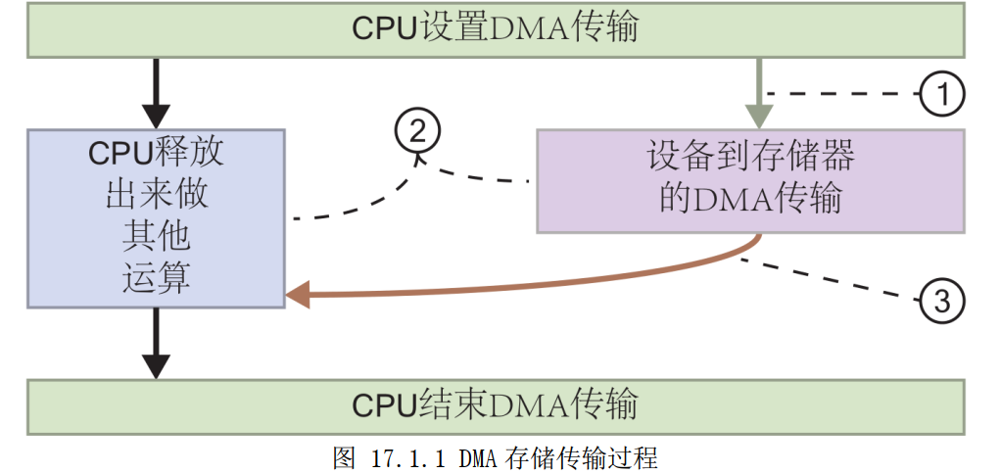
DMA 存储传输的过程如下：
1. 为了配置用 DMA 传输数据到存储器，处理器发出一条 DMA 命令
2. DMA 控制器把数据从外设传输到存储器或从存储器到存储器，而让 CPU 腾出手来做其它操作。
3. 数据传输完成后，向 CPU 发出一个中断来通知它 DMA 传输可以关闭了。

ZYNQ 提供了两种 DMA：
1. 集成在 PS 中的硬核 DMAC
2. PL 中使用的软核 AXI DMA IP

DMAC：
- DDR3到DDR3
- DDR3到OCM
- DDR3到PL（GP接口）
- DDR3到IO外设（内存、以太网等）

AXI DMA（HP）
- DDR3与IO外设交互

VDMA：更适合视频

参考资料
==pg021==

AXI IP核是集成在vivado设计软件中的软核
AXI DMA在memory和AXI4-Stream目标外设之间提供了高带宽直接内存访问
可选的 疏散/聚集 功能可以将数据搬移任务从CPU中释放出来
scatter/gather是AXI DMA的一种运行模式？？
单一模式 or s/g模式
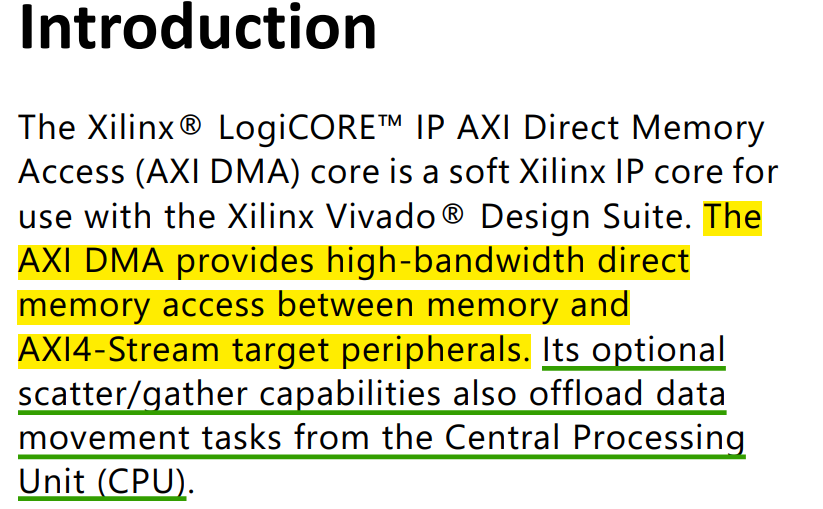
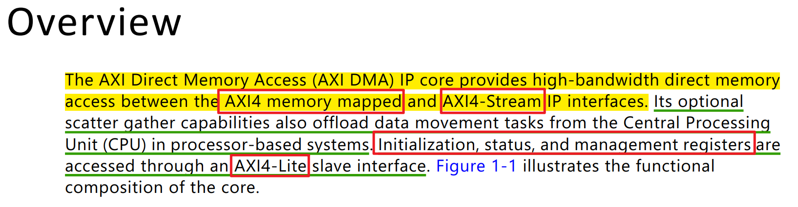
接口
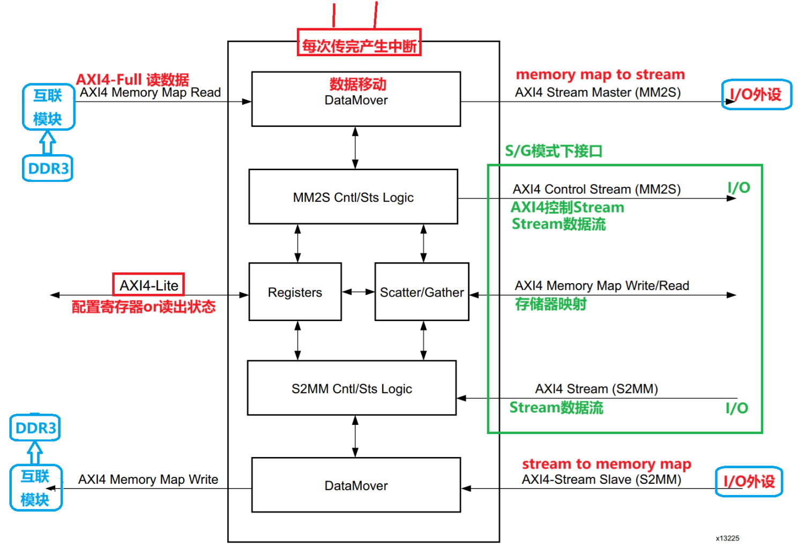
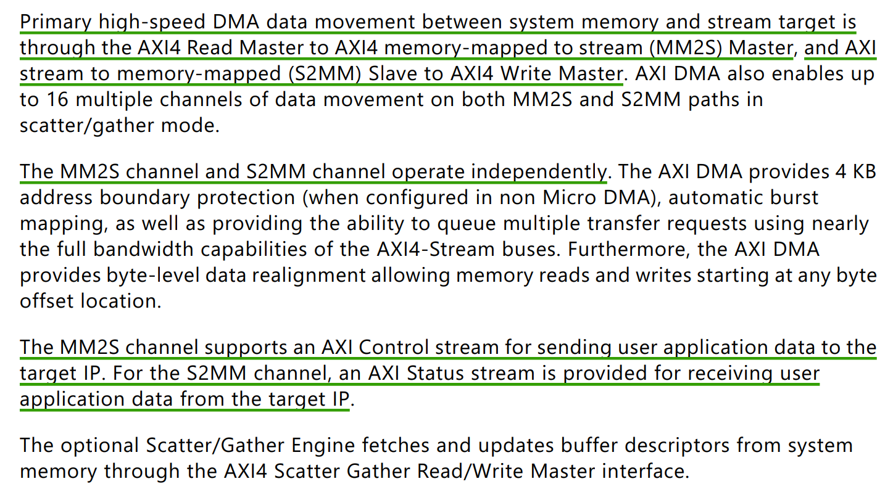
AXI DMA通过AXI4-Lite接口对寄存器做一些配置和获取
MM2S：MemoryMap to Stream 存储器映射(AXI-Full)到AXI4-Stream
S2MM：Stream to MemoryMap AXI4-Stream到存储器映射(AXI-Full)

每次传完，向CPU产生中断

最大时钟频率
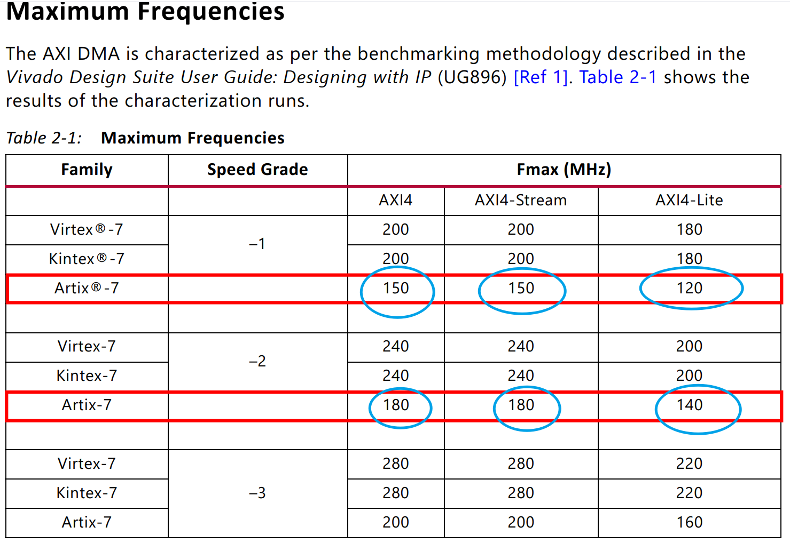

框图
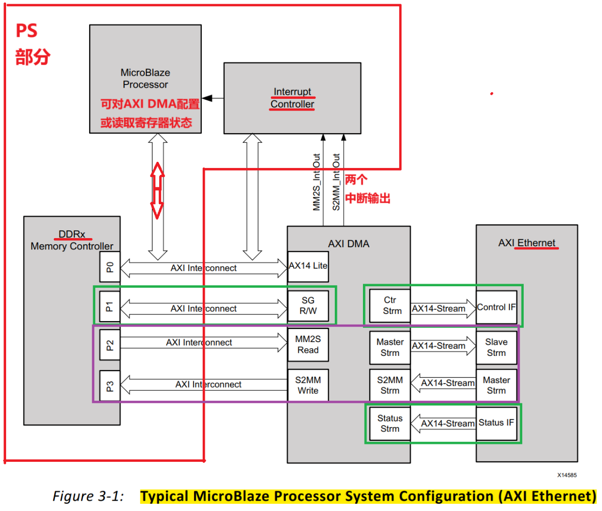

接口时钟
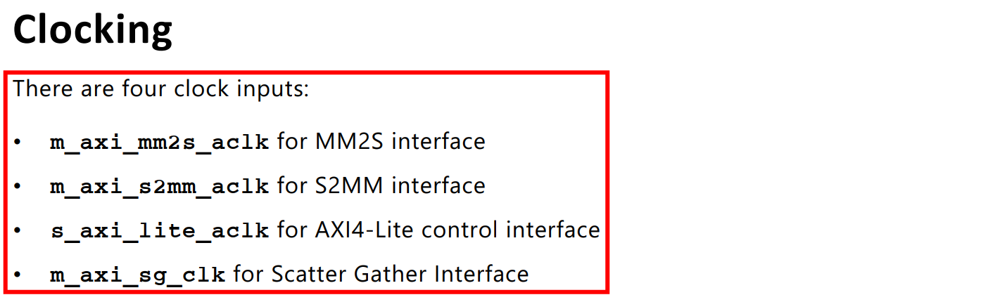
两种时钟模式：异步、同步
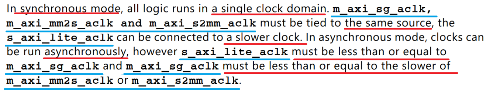
复位
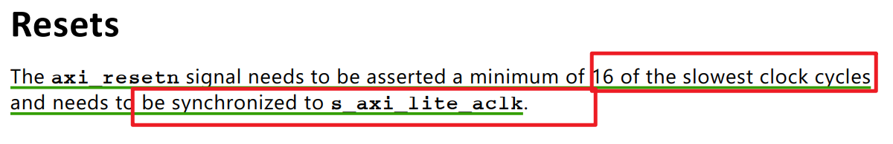
编程顺序
Direct Register模式下（简单DMA模式）：
此模式提供了在MM2S和S2MM通道上进行简单DMA传输的配置，只需较少的FPGA资源
通过访问DMACR、源地址或者目的地址和长度寄存器，来发起DMA的传输

当传输完成后，如果使能了产生中断输出，那么DMASR寄存器相关联的通道位会有效。

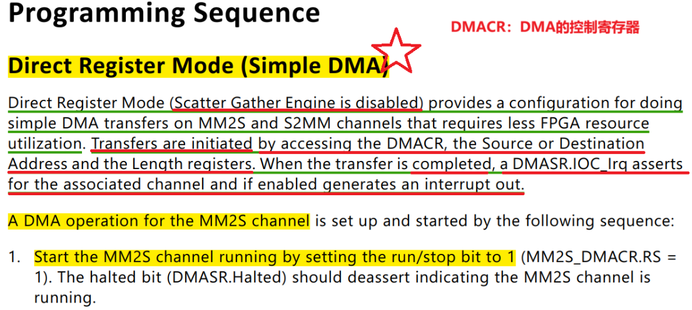
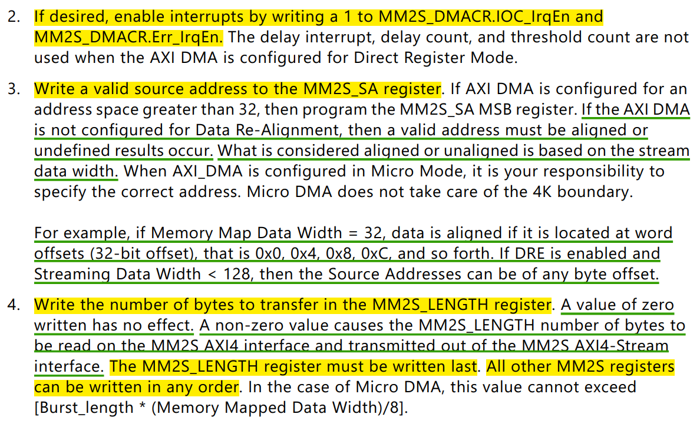
DMA的MM2S（存储器映射到Stream）通道的启动顺序
1. 开启/使能MM2S通道
2. 如果需要的话，可以使能中断
3. 写一个有效的源地址到MM2S_SA寄存器。
   如果没有使能DRE的功能，指定起始地址时，需要注意字节地址对其
   哪些地址是对齐或者不对齐的，取决于Stream流的数据位宽
4. 写传输的字节数到MM2S_LENGTH寄存器
   一个长度为0的值是无效的，一个非0值，将会决定存储器映射到Stream流的数据个数。
   需要注意的是，必须最后一个配置MM2S_LENGTH长度寄存器，而其他寄存器的配置顺序没有要求。

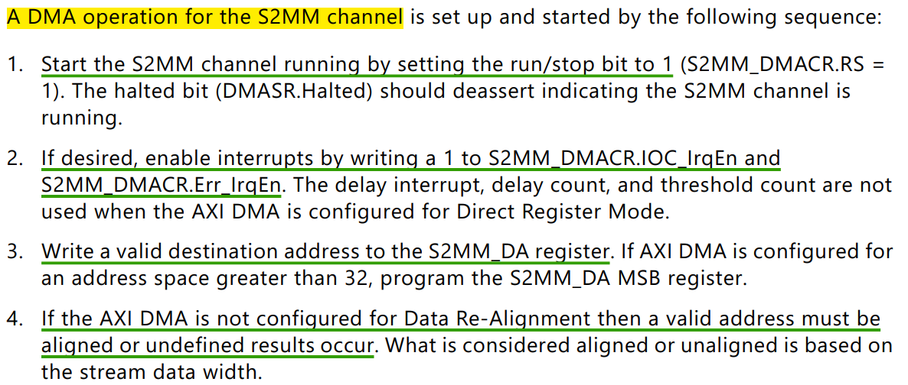
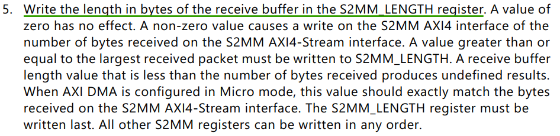
S2MM（Stream到存储器映射）通道的启动顺序
1. 开启/使能S2MM通道
2. 如果需要的话，可以使能中断
3. 写一个有效的目的地址到S2MM_DA寄存器。
4. 对齐和不对齐的要求
5. 写一个传输的字节数到S2MM_LENGTH寄存器里去

direst模式的缺点：
    配置完后只能连续地址空间读写，如果往不同地址搬运需要重新配置寄存器开启新的传输
s/g模式：
    解决direst register的缺点，但更复杂
    他把传输的基本参数，存储在内存中：
    这些参数就是被称为BD（Buffer Descriptor）
    在工作时，通过SG接口加载和更新BD中的状态
循环DMA模式：
    在s/g模式基础上做了个循环
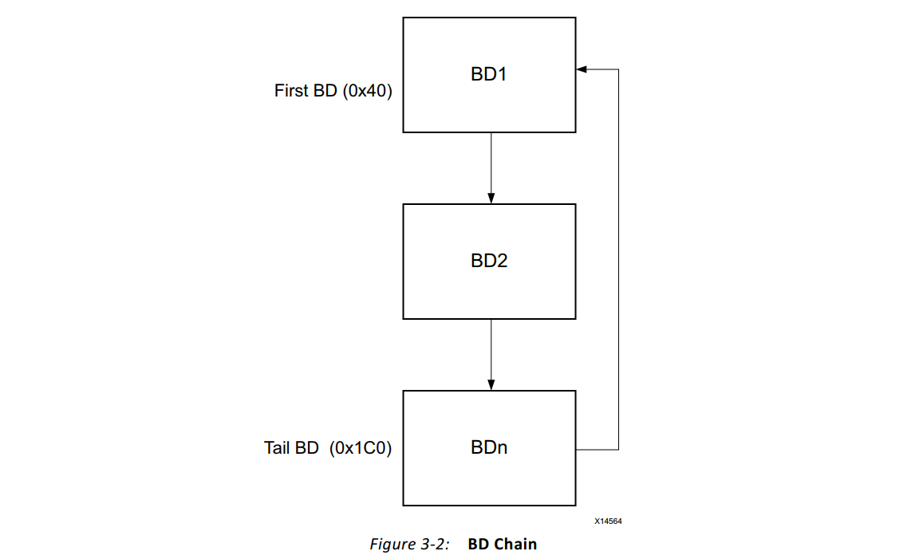

AXI DMA IP核介绍
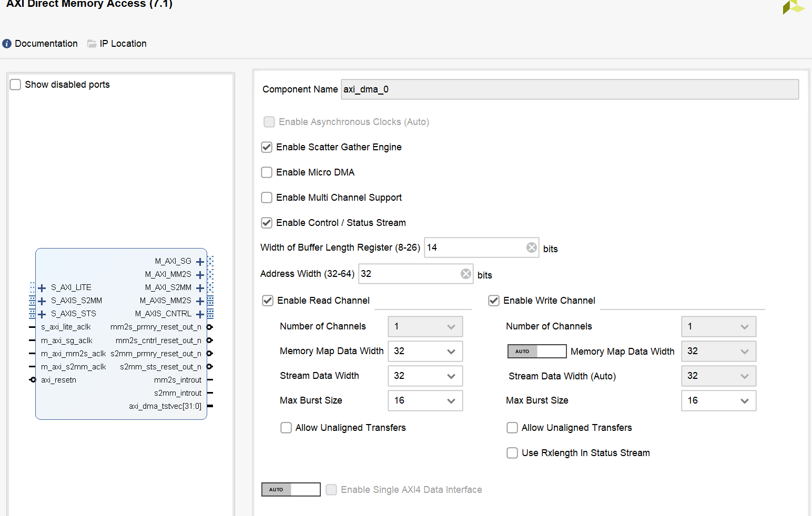
使能异步时钟（自动的，连线后会自适配）
使能S/G引擎：工作在S/G模式。去勾选：工作在direct模式
使能Micro DMA：高优化DMA，占用资源较少，一般用于传输少量数据的场景下
控制/状态Stream流：传输用户数据到Stream流的I/O外设
多通道：多个读通道和写通道
Buffer Length寄存器位宽：数据位宽，大小为2的n次方
地址位宽：设置AXI4接口的地址位宽，默认32，32-64
使能读通道
使能写通道
最大突发大小
是否使能非字节对齐：给定地址是否需要对齐
是否使能单个AXI4 Data接口：可以组合两个AXI4（S2MM\MM2S）接口到一个接口上

