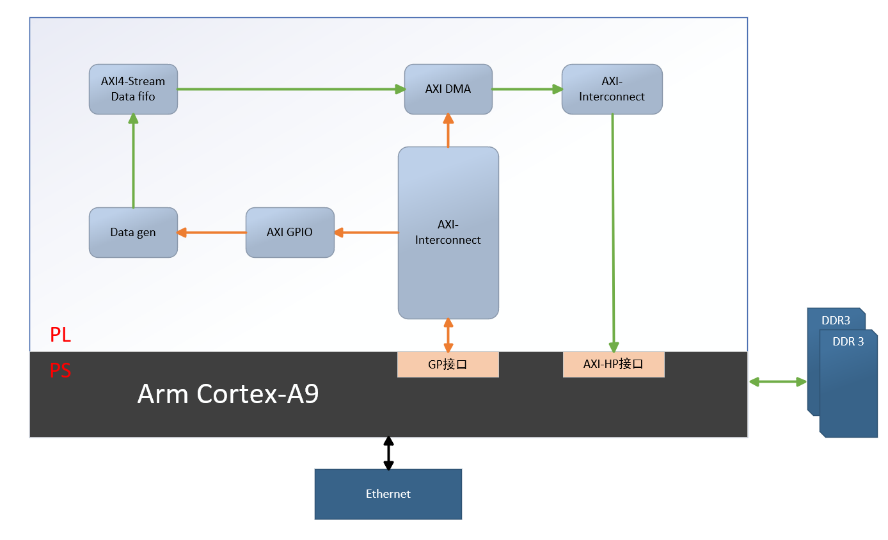
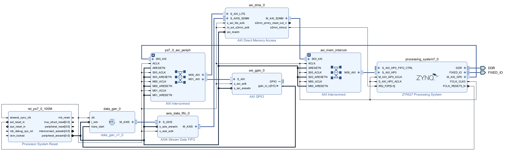
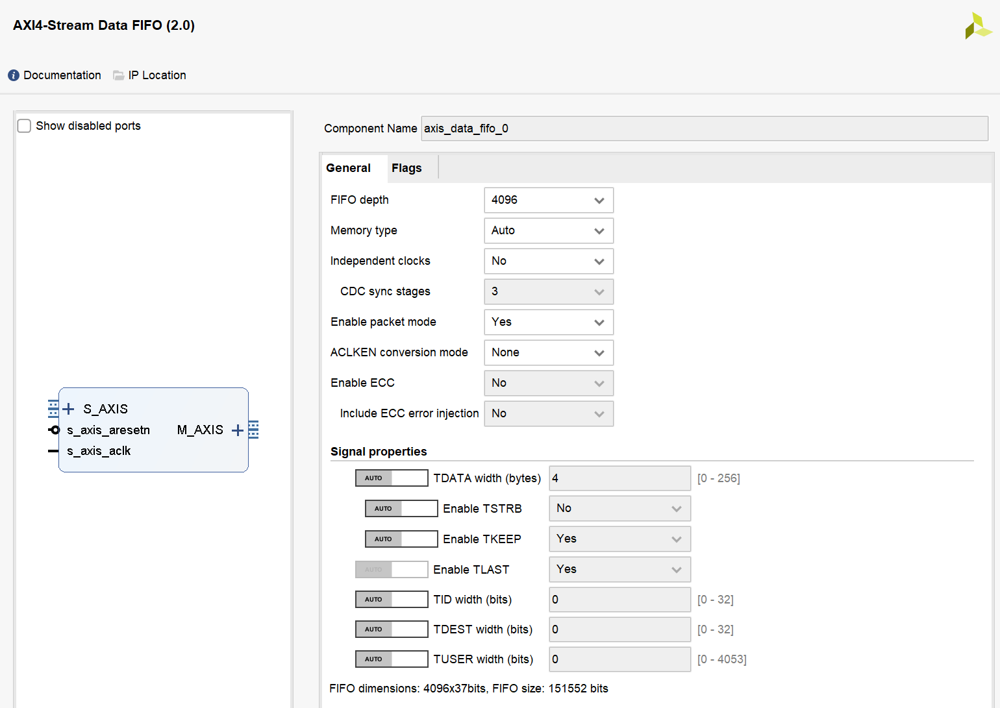
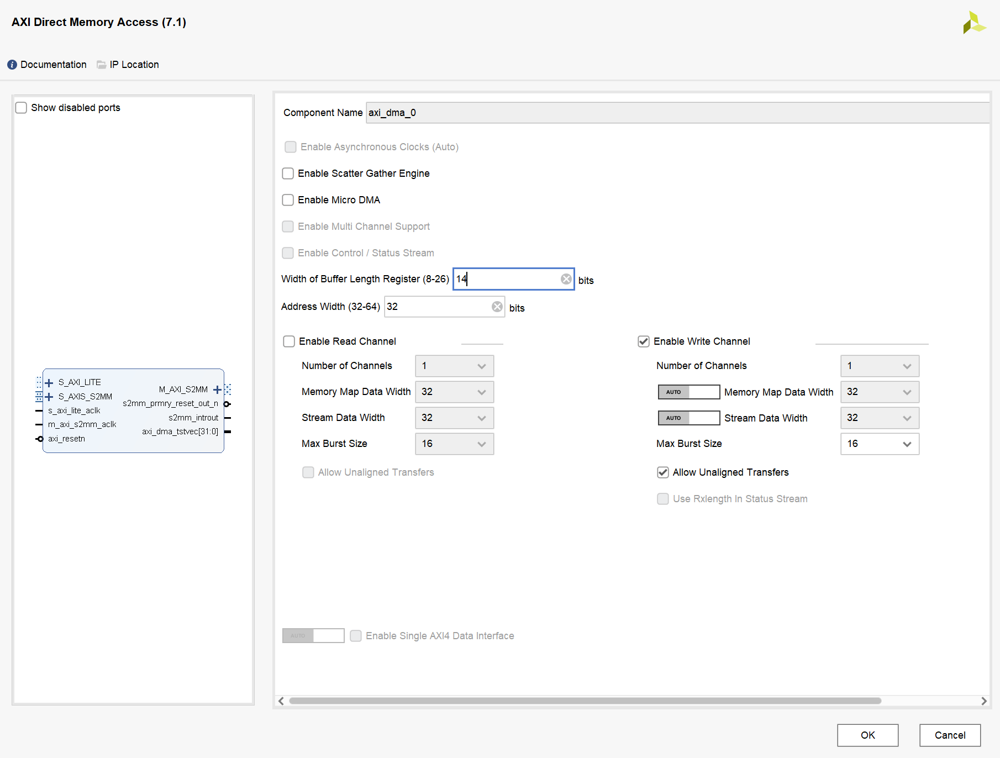
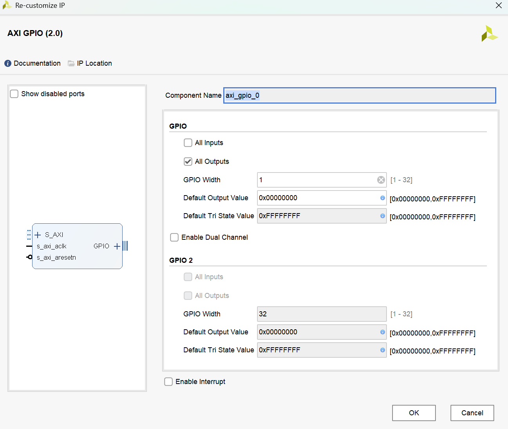
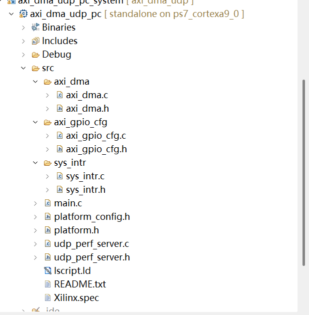
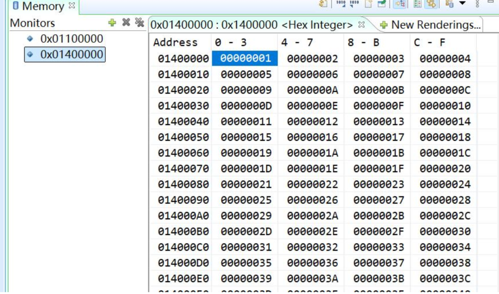
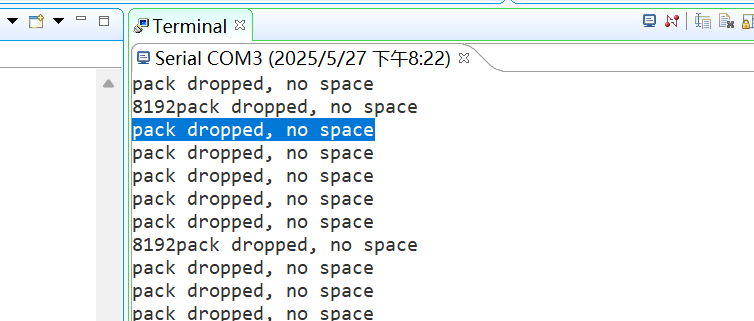

- [一、简介](15_AXI_DMA_UDP以太网传输.md#一、简介)
- [二、实验任务](15_AXI_DMA_UDP以太网传输.md#二、实验任务)
- [三 、硬件设计](15_AXI_DMA_UDP以太网传输.md#三%20、硬件设计)
- [四、软件设计](15_AXI_DMA_UDP以太网传输.md#四、软件设计)
- [五、下载验证](15_AXI_DMA_UDP以太网传输.md#五、下载验证)
- [六、本章总结](15_AXI_DMA_UDP以太网传输.md#六、本章总结)
- [七、遇到问题](15_AXI_DMA_UDP以太网传输.md#七、遇到问题)


## 一、简介
**AXI_DMA_UDP以太网传输**
开发环境：vivado2022.2
硬件设备：ZYNQ7010

参考资料
[【JokerのZYNQ7020】AXI_DMA_PL_PS。_axi keep信号-CSDN博客](https://blog.csdn.net/natty715/article/details/88095993)
[ZYNQ通过AXI DMA实现PL发送连续大量数据到PS DDR_zynq axidma-CSDN博客](https://blog.csdn.net/QDchenxr/article/details/134325391)
参考正点原子的教程《领航者ZYNQ之嵌入式Vitis开发指南v1_2》中的实验《 基于 OV5640 的 PS 以太网视频传输实验》配置，配置以太网、串口、中断等。

## 二、实验任务
**数据传输流程**
1. PS端下发控制指令，开启DMA传输的同时下发一个上升沿信号；
2. PL端接收到指令开始产生2048个32bit的数据，通过AXI DMA将数据传输到PS端的DDR3中；
3. PS端将PS端的DDR的数据通过UDP传输给PC，用网口传输助手查看传输的数据。
## 三 、硬件设计


```verilog
`timescale 1ns / 1ps

module data_gen #(
    parameter TRANS_NUM = 32'd2047 //1514*1024
    )
    (
    input               clk           ,
    input               i_rstn          ,
    input               trans_start,

    input               M_AXIS_tready   ,
    output  [31 : 0]    M_AXIS_tdata     ,
    output              M_AXIS_tvalid   ,
    output              M_AXIS_tlast    ,
    output  [3  : 0]    M_AXIS_tkeep
    );

reg     [31 : 0]    r_M_AXIS_tdata   ;
reg                 r_M_AXIS_tvalid ;
reg                 r_M_AXIS_tlast  ;
reg     [3  : 0]    r_M_AXIS_tkeep  ;

reg     [1  : 0]    r_current_state ;
reg     [1  : 0]    r_next_state;

reg trans_start_0, trans_start_1;
wire pos_trans_start;
assign pos_trans_start = trans_start_0 & (~trans_start_1);
always @(posedge clk) begin
    if(!i_rstn) begin
        trans_start_0 <= 1'd0;
        trans_start_1 <= 1'd0;
    end
    else begin
        trans_start_0 <= trans_start;
        trans_start_1 <= trans_start_0;
    end
end


localparam IDLE = 2'd0;
localparam TRAN = 2'd1;
localparam LAST = 2'd2;

always @(posedge clk ) begin
    if(!i_rstn)
        r_current_state <= IDLE;
    else
        r_current_state <= r_next_state;
end

always @(*) begin
    case(r_current_state)
        IDLE : r_next_state = (pos_trans_start && M_AXIS_tready) ? TRAN : IDLE;
        TRAN : r_next_state = (r_M_AXIS_tdata == TRANS_NUM) ? LAST : TRAN;
        LAST : r_next_state = M_AXIS_tready ? IDLE : LAST;
        default : r_next_state = IDLE;
    endcase
end

always @(posedge clk ) begin
    case(r_current_state)
        IDLE : begin
            r_M_AXIS_tdata <= 32'd0;
            r_M_AXIS_tvalid <= 1'd0;
            r_M_AXIS_tlast <= 1'd0;
            r_M_AXIS_tkeep <= 4'b1111;
        end
        TRAN : begin
            r_M_AXIS_tvalid <= 1'd1;
            if(M_AXIS_tready)begin
                r_M_AXIS_tdata <= r_M_AXIS_tdata + 32'd1;
                if(r_M_AXIS_tdata == TRANS_NUM)
                    r_M_AXIS_tlast <= 1'd1;
                else
                    r_M_AXIS_tlast <= 1'd0;
            end
            else
                r_M_AXIS_tdata <= r_M_AXIS_tdata;
        end
        LAST : begin
            if(!M_AXIS_tready)begin
                r_M_AXIS_tvalid <= 1'd1;
                r_M_AXIS_tlast <= 1'd1;
                r_M_AXIS_tdata <= r_M_AXIS_tdata;
            end
            else begin
                r_M_AXIS_tvalid <= 1'd0;
                r_M_AXIS_tlast <= 1'd0;
                r_M_AXIS_tdata <= 32'd0;
            end
        end
        default : begin
            r_M_AXIS_tdata <= 32'd0;
            r_M_AXIS_tvalid <= 1'd0;
            r_M_AXIS_tlast <= 1'd0;
            r_M_AXIS_tkeep <= 4'b1111;
        end
    endcase
end

assign  M_AXIS_tdata     = r_M_AXIS_tdata     ;
assign  M_AXIS_tvalid   = r_M_AXIS_tvalid   ;
assign  M_AXIS_tlast    = r_M_AXIS_tlast    ;
assign  M_AXIS_tkeep    = r_M_AXIS_tkeep    ;

endmodule
```
模块写好后直接添加进block design即可。
#### 添加axis data fifo，并配置

虽然引出了读数据计数引脚，但其实并未用到，可以关掉。
#### axi dma 配置

#### axi gpio配置

按上述配置完之后自动布线，然后valite design、generate output products、create HDL wrapper，一切无误之后综合布线，生成bit流
## 四、软件设计
参考：正点原子的教程《领航者ZYNQ之嵌入式Vitis开发指南v1_2》中的实验《 基于 OV5640 的 PS 以太网视频传输实验》软件设计部分，下面贴出修改的部分

#### main.c
```c
// Descriptions:        PS端网口传输OV5640摄像头视频在上位机显示

/***************************** Include Files *********************************/
 #include <stdio.h>
 #include <stdlib.h>
 #include <string.h>
 
 #include "xil_types.h"
 #include "xparameters.h"
// #include "emio_sccb_cfg/emio_sccb_cfg.h"
 #include "axi_gpio_cfg/axi_gpio_cfg.h"
 #include "axi_dma/axi_dma.h"
// #include "ov5640/ov5640_init.h"
 #include "sys_intr/sys_intr.h"
 
 #include "udp_perf_server.h"
 #include "netif/xadapter.h"
 #include "platform.h"
 #include "platform_config.h"
 #include "xil_printf.h"
 #include "lwip/tcp.h"
 
 #include "sleep.h"
 #include "lwip/priv/tcp_priv.h"
 #include "lwip/init.h"
 #include "lwip/inet.h"
 #include "xil_cache.h"
 
 extern volatile int TcpFastTmrFlag;
 extern volatile int TcpSlowTmrFlag;
 
 #define DEFAULT_IP_ADDRESS  "192.168.1.10"
 #define DEFAULT_IP_MASK     "255.255.255.0"
 #define DEFAULT_GW_ADDRESS  "192.168.1.1"
 
 void start_application(void);
 void print_app_header(void);
 int lwip_udp_init();
 #define MAX_PKT_LEN     2048      //发送包长度
 
 //函数声明
 struct netif *netif;
 extern volatile int rx_done;
 extern u8 *rx_buffer_ptr;
 u32 fifo_count = 0;
 u8 dma_start_flag = 0;            //0：启动DMA ，1：关闭DMA
 
 struct netif server_netif;
 static XScuGic Intc;              //GIC
 
 
 int main(void)
 {
//     u32 status;
     u16 cmos_h_pixel;   //ov5640 DVP 输出水平像素点数
     u16 cmos_v_pixel;   //ov5640 DVP 输出垂直像素点数
     u16 total_h_pixel;  //ov5640 水平总像素大小
     u16 total_v_pixel;  //ov5640 垂直总像素大小

     cmos_h_pixel = 640;
     cmos_v_pixel = 480;
     total_h_pixel = 2844;
     total_v_pixel = 1968;
 
     axi_gpio_init();               // 初始AXI-GPIO接口
     axi_dma_cfg();                 // 配置AXI DMA
     Init_Intr_System(&Intc);       // 初始DMA中断系统
     Setup_Intr_Exception(&Intc);   // 启用来自硬件的中断
     dma_setup_intr_system(&Intc);  // 建立DMA中断系统
 
     lwip_udp_init();               // UDP通信配置
 
     //接收和处理数据包
     while (1) {

         xemacif_input(netif);
 
//         fifo_count = get_fifo_count(); //PS端读取FIFO中的读数据计数
 
         //FIFO中的读数据计数个数达到发送包长度后，开始启动DMA从FIFO中读取1024个数据存储进DDR中
         if((dma_start_flag == 0)){
        	 axi_gpio_out1();
             axi_dma_start(MAX_PKT_LEN);
             axi_gpio_out0();
             dma_start_flag = 1;

         }
         //DMA搬运1024个数据完成后，网口就可以从DDR中取数据进行发送了
         if(rx_done){
             udp_tx_data(rx_buffer_ptr,8192);
             rx_done = 0;
             dma_start_flag = 0;
         }
     }
     return 0;
 }
 
 static void print_ip(char *msg, ip_addr_t *ip)
 {
     print(msg);
     xil_printf("%d.%d.%d.%d\r\n", ip4_addr1(ip), ip4_addr2(ip),
             ip4_addr3(ip), ip4_addr4(ip));
 }
 
 static void print_ip_settings(ip_addr_t *ip, ip_addr_t *mask, ip_addr_t *gw)
 {
     print_ip("Board IP:       ", ip);
     print_ip("Netmask :       ", mask);
     print_ip("Gateway :       ", gw);
 }

 //设置静态IP地址
 static void assign_default_ip(ip_addr_t *ip, ip_addr_t *mask, ip_addr_t *gw)
 {
     int err;
 
     xil_printf("Configuring default IP %s \r\n", DEFAULT_IP_ADDRESS);
 
     err = inet_aton(DEFAULT_IP_ADDRESS, ip);
     if (!err)
         xil_printf("Invalid default IP address: %d\r\n", err);
 
     err = inet_aton(DEFAULT_IP_MASK, mask);
     if (!err)
         xil_printf("Invalid default IP MASK: %d\r\n", err);
 
     err = inet_aton(DEFAULT_GW_ADDRESS, gw);
     if (!err)
         xil_printf("Invalid default gateway address: %d\r\n", err);
 }
 
 int lwip_udp_init()
 {
     /*设置领航者开发板的MAC地址 */
     unsigned char mac_ethernet_address[] = {
         0x00, 0x0a, 0x35, 0x00, 0x01, 0x02 };
 
     netif = &server_netif;

     xil_printf("\r\n\r\n");
     xil_printf("-----lwIP RAW Mode UDP Server Application-----\r\n");
 
     /* 初始化lwIP*/
     lwip_init();
 
     /* 将网络接口添加到netif_list，并将其设置为默认网络接口 （用于输出未找到特定路由的所有数据包） */
     if (!xemac_add(netif, NULL, NULL, NULL, mac_ethernet_address,
                 PLATFORM_EMAC_BASEADDR)) {
         xil_printf("Error adding N/W interface\r\n");
         return -1;
     }
     netif_set_default(netif);
 
     /* 指定网络是否已启动*/
     netif_set_up(netif);
 
     //设置静态IP地址
     assign_default_ip(&(netif->ip_addr), &(netif->netmask), &(netif->gw));
 
     //打印IP设置
     print_ip_settings(&(netif->ip_addr), &(netif->netmask), &(netif->gw));
 
     xil_printf("\r\n");
 
     /* 打印应用程序标题 */
     print_app_header();
 
     /* 启动应用程序*/
     start_application();
     xil_printf("\r\n");
     return 0;
 }
```
#### axi_gpio_cfg.c
```c
// Descriptions:        AXI GPIO配置

#include "axi_gpio_cfg.h"
#define AXI_GPIO_0_ID XPAR_AXI_GPIO_0_DEVICE_ID	//AXI GPIO 0器件 ID
#define AXI_GPIO_0_CHANEL1   1
XGpio   axi_gpio_inst0;      //AXI GPIO 0 驱动实例

//AXI GPIO初始化
void axi_gpio_init(void)
{
    //AXI GPIO 0驱动
    XGpio_Initialize(&axi_gpio_inst0, AXI_GPIO_0_ID);
    //配置AXI GPIO 0 通道1为输入
    XGpio_SetDataDirection(&axi_gpio_inst0, AXI_GPIO_0_CHANEL1,0);
}

//通过AXI GPIO获取FIFO数据个数
//u32 get_fifo_count(void)
//{
//    u32 fifo_count = 0;
//    fifo_count = XGpio_DiscreteRead(&axi_gpio_inst0, AXI_GPIO_0_CHANEL1);
//    return fifo_count;
//}
void axi_gpio_out1(void)
{
	XGpio_DiscreteWrite(&axi_gpio_inst0, 1, 0x01);
	}

void axi_gpio_out0(void)
{
	XGpio_DiscreteWrite(&axi_gpio_inst0, 1, 0x00);
	}
```
#### axi_gpio_cfg.h
```c
// Descriptions:        SCCB驱动

#include "xil_types.h"
#include "xgpio.h"

#ifndef AXI_GPIO_CFG_
#define AXI_GPIO_CFG_

void axi_gpio_init(void);
void axi_gpio_out0(void);
void axi_gpio_out1(void);
//u32 get_fifo_count(void);

#endif /* sccb_EMIO_CFG_ */
```
#### axi_dma.c
```c
// Descriptions:        Axi dma驱动程序在中断模式下接收数据包
/***************************** Include Files *********************************/
#include "axi_dma.h"

/************************** Constant Definitions *****************************/
#define DMA_DEV_ID             XPAR_AXIDMA_0_DEVICE_ID
#define RX_INTR_ID             XPAR_FABRIC_AXIDMA_0_VEC_ID
#define INTC_DEVICE_ID         XPAR_SCUGIC_SINGLE_DEVICE_ID
#define DDR_BASE_ADDR          XPAR_PS7_DDR_0_S_AXI_BASEADDR   //0x00100000
#define MEM_BASE_ADDR          (DDR_BASE_ADDR + 0x1000000)     //0x01100000
#define RX_BUFFER_BASE         (MEM_BASE_ADDR + 0x00300000)    //0x01400000
#define RESET_TIMEOUT_COUNTER  10000    //复位时间

/************************** Variable Definitions *****************************/

static XAxiDma axidma;     //XAxiDma实例
volatile int rx_done=0;    //接收完成标志
volatile int error;        //传输出错标志
u32 *rx_buffer_ptr;

/************************** Function Definitions *****************************/

int axi_dma_cfg(void)
{

    int status;

    XAxiDma_Config *config;

    rx_buffer_ptr = (u32 *) RX_BUFFER_BASE;

    xil_printf("\r\n--- Entering axi_dma_cfg --- \r\n");

    config = XAxiDma_LookupConfig(DMA_DEV_ID);
    if (!config) {
        xil_printf("No config found for %d\r\n", DMA_DEV_ID);
        return XST_FAILURE;
    }

    //初始化DMA引擎
    status = XAxiDma_CfgInitialize(&axidma, config);
    if (status != XST_SUCCESS) {
        xil_printf("Initialization failed %d\r\n", status);
        return XST_FAILURE;
    }

    if (XAxiDma_HasSg(&axidma)) {
        xil_printf("Device configured as SG mode \r\n");
        return XST_FAILURE;
    }

    xil_printf("AXI DMA CFG Success\r\n");
    return XST_SUCCESS;

}

//启用AXI DMA
int axi_dma_start(u32 pkt_len)
{
    int status;
    u32 a;
    //初始化标志信号
    error   = 0;
    a = (u32)(pkt_len*sizeof(u32));
    xil_printf("%d",a);
    status = XAxiDma_SimpleTransfer(&axidma, (u32) rx_buffer_ptr,
    		(u32)(pkt_len*sizeof(u32)), XAXIDMA_DEVICE_TO_DMA);

    if (status != XST_SUCCESS) {
    	xil_printf("AXI DMA Start FAILURE\r\n");
    	return XST_FAILURE;
    }

    Xil_DCacheFlushRange((UINTPTR) rx_buffer_ptr, pkt_len); //刷新Data Cache
    return XST_SUCCESS;
}

//DMA RX中断处理函数
void rx_intr_handler(void *callback)
{
    u32 irq_status;
    int timeout;
    XAxiDma *axidma_inst = (XAxiDma *) callback;

    irq_status = XAxiDma_IntrGetIrq(axidma_inst, XAXIDMA_DEVICE_TO_DMA);
    XAxiDma_IntrAckIrq(axidma_inst, irq_status, XAXIDMA_DEVICE_TO_DMA);

    //Rx出错
    if ((irq_status & XAXIDMA_IRQ_ERROR_MASK)) {
        error = 1;
        xil_printf("XAxiDma error");
        XAxiDma_Reset(axidma_inst);
        timeout = RESET_TIMEOUT_COUNTER;
        while (timeout) {
            if (XAxiDma_ResetIsDone(axidma_inst))
                break;
            timeout -= 1;
        }
        return;
    }
    //Rx完成
    if ((irq_status & XAXIDMA_IRQ_IOC_MASK))
        rx_done = 1;

    irq_status = XAxiDma_IntrGetIrq(axidma_inst, XAXIDMA_DEVICE_TO_DMA);
}

//建立DMA中断系统
//  @param   int_ins_ptr是指向XScuGic实例的指针
//  @param   AxiDmaPtr是指向DMA引擎实例的指针
//  @param   rx_intr_id是RX通道中断ID
//  @return：成功返回XST_SUCCESS，否则返回XST_FAILURE
int dma_setup_intr_system(XScuGic * int_ins_ptr)
{
    int status;
    //设置优先级和触发类型
    XScuGic_SetPriorityTriggerType(int_ins_ptr, RX_INTR_ID, 0xA0, 0x3);

    //为中断设置中断处理函数
    status = XScuGic_Connect(int_ins_ptr, RX_INTR_ID,
            (Xil_InterruptHandler) rx_intr_handler, &axidma);
    if (status != XST_SUCCESS) {
        return status;
    }
    XScuGic_Enable(int_ins_ptr, RX_INTR_ID);

    //使能DMA中断
    XAxiDma_IntrEnable(&axidma,XAXIDMA_IRQ_ALL_MASK,XAXIDMA_DEVICE_TO_DMA);

    return XST_SUCCESS;
}
```
#### udp_perf_server.c
```c
#include <stdio.h>
#include <string.h>
#include "lwip/err.h"
#include "lwip/udp.h"
#include "xil_printf.h"
#include "lwip/inet.h"

static struct udp_pcb *pcb;

#define SER_PORT 8000

//打印应用程序
void print_app_header()
{
    xil_printf("\r\n-----Network port UDP transmission camera video display on upper computer ------\r\n");
}

//UDP发送功能函数
void udp_tx_data(u8 *buffer_ptr,unsigned int len){
    static struct pbuf *ptr;

    ptr = pbuf_alloc(PBUF_TRANSPORT, len, PBUF_POOL); /* 申请内存 */

    if (ptr)
    {
        pbuf_take(ptr, buffer_ptr,len); /* 将buffer_ptr中的数据打包进pbuf结构中 */
        udp_send(pcb, ptr);              /* udp发送数据 */
        pbuf_free(ptr);                  /* 释放内存 */
    }
}

void start_application()
{
    err_t err;

    /* 设置客户端的IP地址 */

    ip_addr_t DestIPaddr;

    IP4_ADDR( &DestIPaddr,192,168,1,102);

    //创建新的UDP PCB
    pcb = udp_new();
    if (!pcb) {
        xil_printf("Error creating PCB. Out of Memory\r\n");
        return;
    }

    //绑定端口
    err = udp_bind(pcb, IP_ADDR_ANY, SER_PORT);
    if (err != ERR_OK) {
        xil_printf("Unable to bind to port %d; err %d\r\n",
                SER_PORT, err);
        udp_remove(pcb);
        return;
    }
    /* 设置客户端的端口 */
    udp_connect(pcb, &DestIPaddr, 8000);

    xil_printf("UDP server started @ port %d\n\r", SER_PORT);
}
```


## 五、下载验证
### 调试结果
#### 网口调试助手




## 六、本章总结


## 七、遇到问题


==问题：包掉落，无空间==
pack dropped, no space

==不知道为啥，貌似不影响UDP传输==


