参考文档
[Microsemi Libero系列教程（全网首发）-CSDN博客](https://blog.csdn.net/whik1194/article/details/102901710)
[Libero使用教程（新建，仿真，下载）-CSDN博客](https://blog.csdn.net/qq_50027598/article/details/130534463)
[Libero在线Debug/抓取信号流程_libero怎么抓信号-CSDN博客](https://blog.csdn.net/chengding0389/article/details/137581491)
[Libero在Program Device报错 Error:A programming file must be loaded before running the command_libero soc的flashpro闪退-CSDN博客](https://blog.csdn.net/cqluffy/article/details/150010011)

# 一、创建工程
## 1.1 新建文件
新建工程，命名，路径
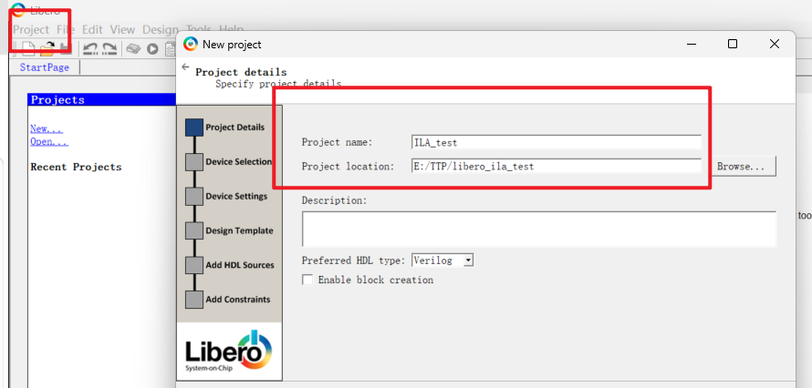
选择芯片型号

电平选择：根据文档NI_HRD中的接口电平，可以判断，在libero中电平选择LVCMOS33

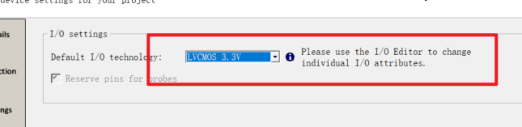
## 1.2 创建HDL设计
导入HDL设计文件，PDC约束文件，没有，直接跳过
创建HDL文件
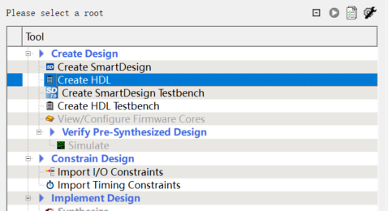
写一个简单计数器，用于ila抓数

## 1.3 创建SmartDesign图形化工具
类似于block design，可以通过图像化来设计FPGA项目。
可在smartdesign中添加自己写的hdl文件，也可加入ip核，也可添加外部库文件，通过拖拽和连线的方式完成设计。

创建smartdesign图形化工具

检查语法错误

设顶层

两种方法在smartdesign添加模块
1：将自己写的hdl拖拽进去（推荐）
2：右键我们的HDL文件，点击Instantiate，然后选择我们要添加到的SmartDesign文件
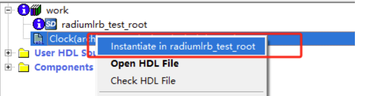

还需要将我们的HDL文件的端口与外部的信号连接起来，比如我们的输入时钟信号和输出时钟信号，我们需要将它们放置到顶层，作为我们的IO引脚，这样才能与外部的晶振和IO口映射起来，我们选择想要放置到顶层的端口，右键，点击Promote to Top Level
把端口设为i/o引脚
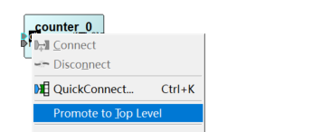
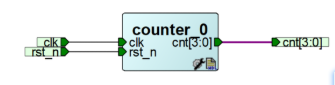

Generate Component生成组件文件
方法一：

方法二：
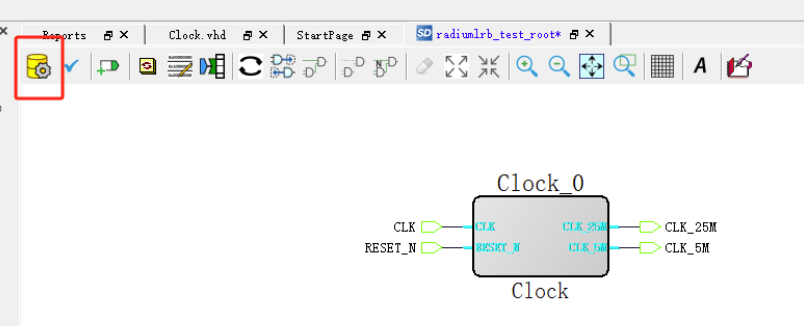

模块过多可用自动连线
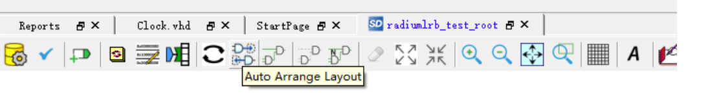

# 二、引脚分配

双击Create/Edit I/O Attributes来进行引脚分配
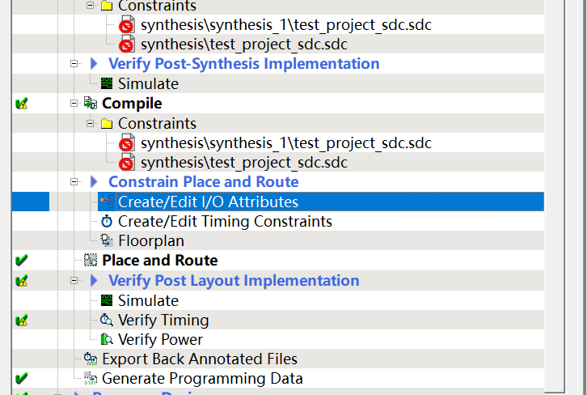
找几个output口作为工具验证的出口
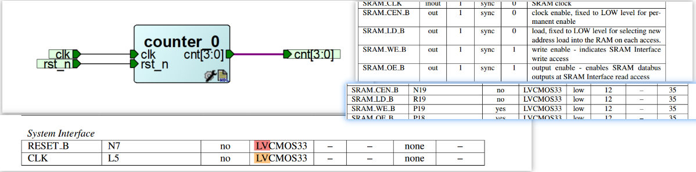

分配引脚，记得locked
因为板卡已经焊好、硬件定型后，必须做的强制locked操作
如果不勾选「Locked」，Libero 在每次重新编译、布局布线时，为了优化时序 / 资源，会自动把你的逻辑信号分配到其他物理引脚上

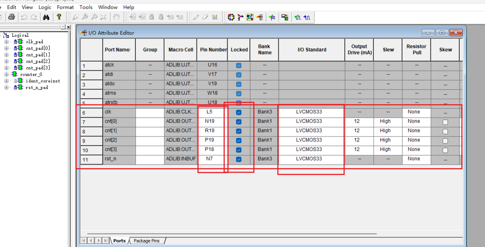
保存即可

# 三、仿真
待补充。。。。。

# 四、逻辑分析仪debug（重点）

右键synthesize，打开Synplify Pro
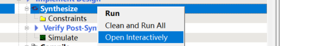
下图是Synplify Pro界面
新建 Identify 调试实现（给代码装内置示波器）
无需修改任何配置，下一步

再打开刚刚创建的综合文件 
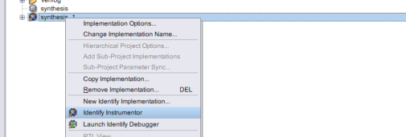

配置内存深度
深度不能设置的太大，否则可能内存不足

右键选择采样时钟：Sample Clock
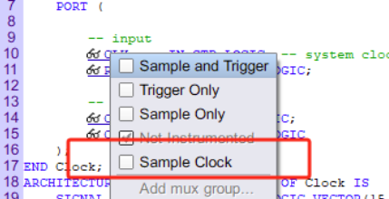

右键选择想要观察的对象，可以选择sample only或者sample and trigger
sample only是只观察
sample and trigger是既观察，又可作为触发的条件

完成后ctrl+s保存，回到综合管理

设置完信号以后点击run，一路ok

如果采样深度设置过大或者观测变量过多这里v_ram可能超过限制，省着点玩儿
完成以后直接关闭Synplify Pro
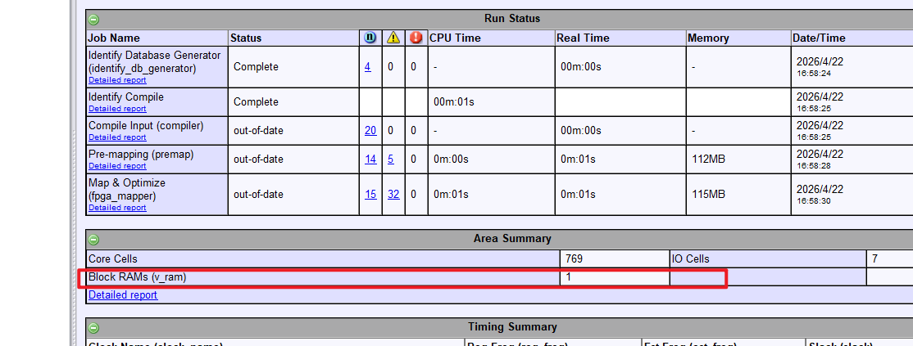

点击Identify Debug Design理论来说就可以进行在线调试了，
但是这里遇到一个问题，需要绕路来结局

**Libero 11.9 在Program Device时报错**
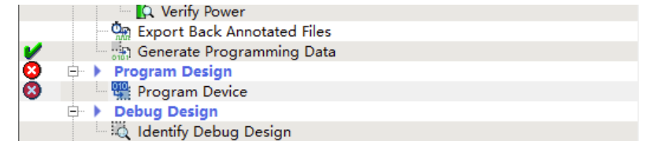
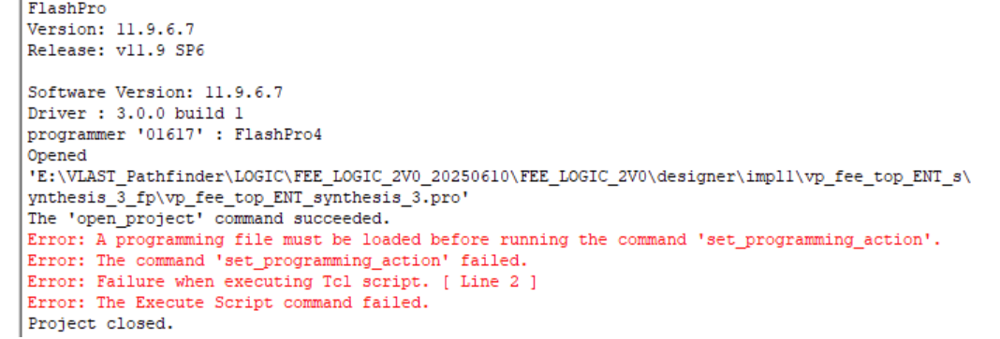

出错原因：
工程目录目录下生成的.pro文件是有问题的。
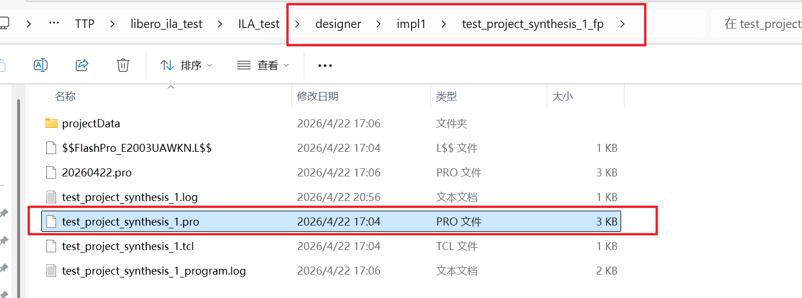

如何解决：
思路：生成正确的.pro文件，替换调因软件bud导致的默认目录里的.pro文件

**解决方法：**
打开flash pro
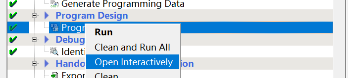
在flashpro里创建一个新的文件夹，点击_File-New Project_，并在这个新的文件夹里生成一个pro文件
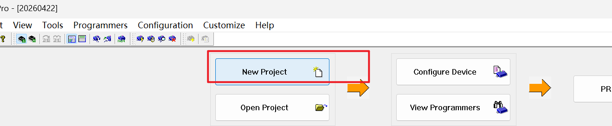
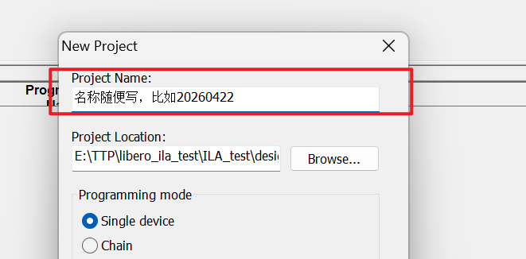

然后点击_Configuration-Load Programming File_，impl1文件夹下想调用的.pdb文件：

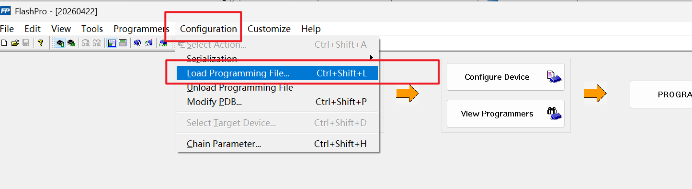
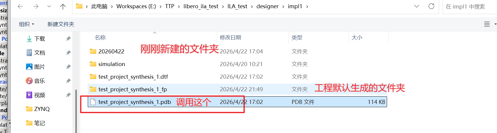
这样就会在20220422这个文件夹里生成一个正确的
FlashPro文件 和 .pro文件，把这两个文件复制到工程的文件夹里，替换掉（此时一定要提前关闭Flashpro）
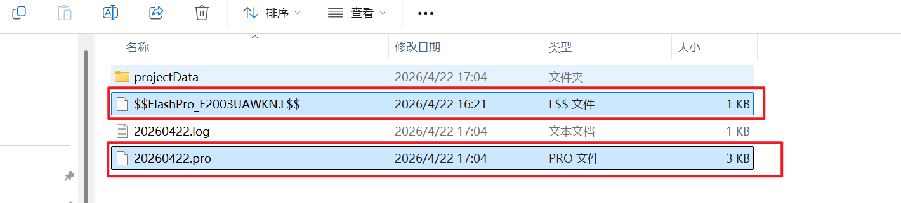
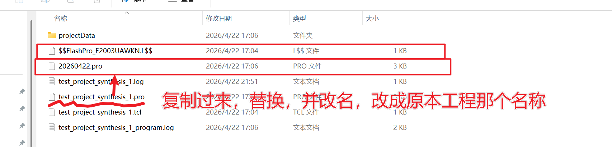

完成以上操作以后就可以Identify Debug Design了
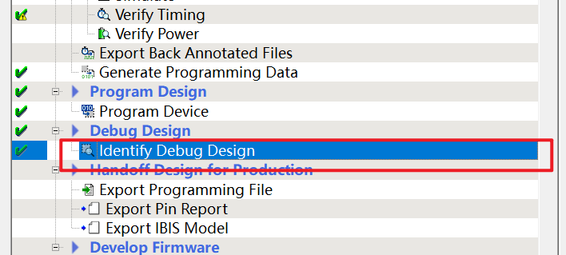

进入在线调试以后
设置触发条件Set trigger expressions
点小人图标，一旦有触发条件来临，信号后面会出现黄色标志，双击即可查看波形图
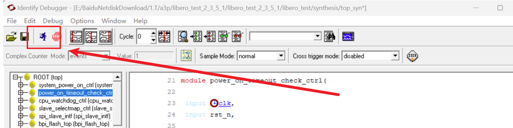

黄色的是信号的值，点带眼镜的信号，选Set trigger expressions可以设置触发条件
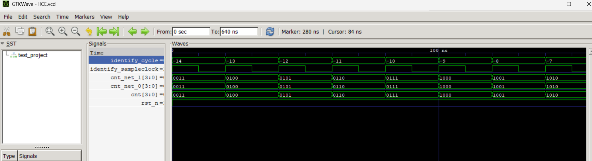

