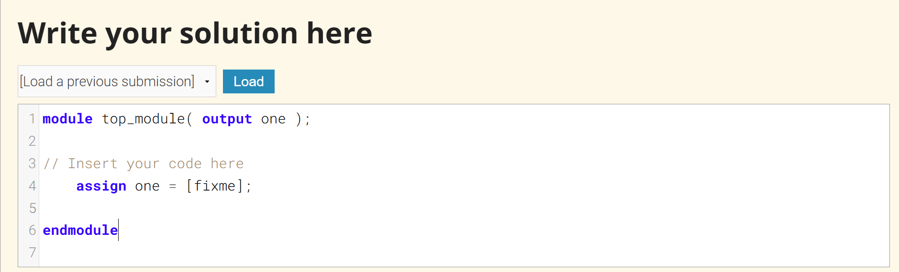
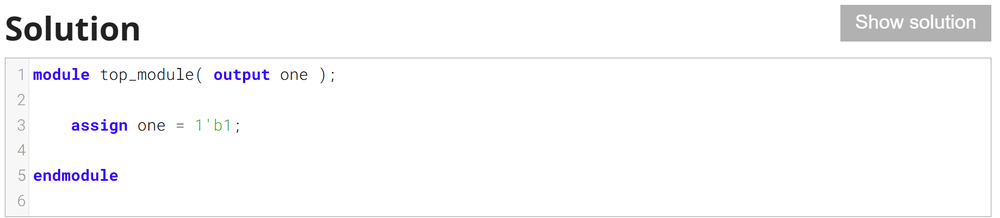

HDL bits
账号：missdong
密码：w* s ** d* 1 ** ! 

## HDL bits每道题的流程：
1. Writing Code 编写代码
2. Compiling (Logic Synthesis) 编译（逻辑综合）
3. Simulation 仿真
4. Final Status 最终状态：Compile Error、Simulation Error、Incorrect、Success!

## Problem Statement

Build a circuit with no inputs and one output. 
构建一个无输入、单输出的电路。
That output should always drive 1 (or logic high).
该输出应始终输出高电平（逻辑1）。

把【fixme】改成1'b1即可

