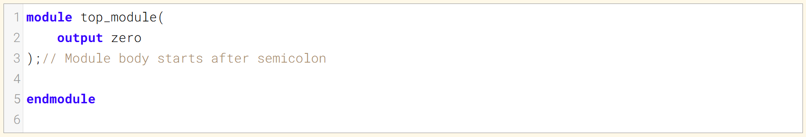
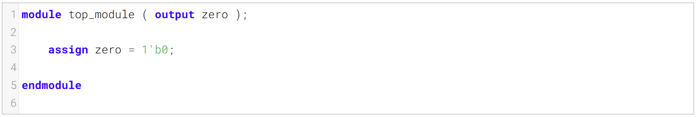
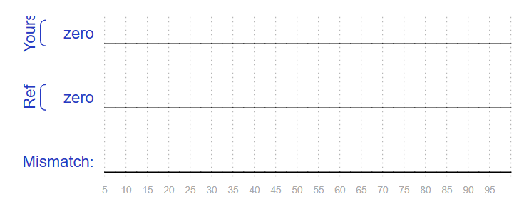

Build a circuit with no inputs and one output that outputs a constant 0
构建一个无输入、单输出且输出恒定0的电路

Now that you've worked through the previous problem, let's see if you can do a simple problem without the hints.
既然你已经解决了前面的问题，我们来看看你能否在没有提示的情况下完成一道简单的题目。

### Module Declaration

### Write your solution here

### Solution
用assign语句将Zero赋值为0即可

