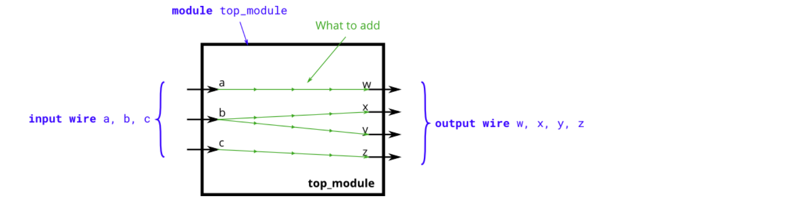
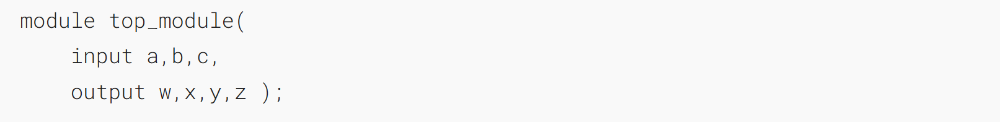
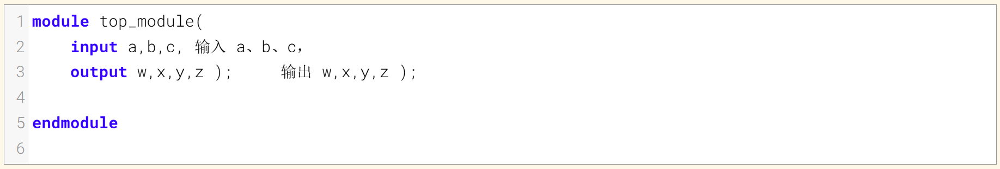
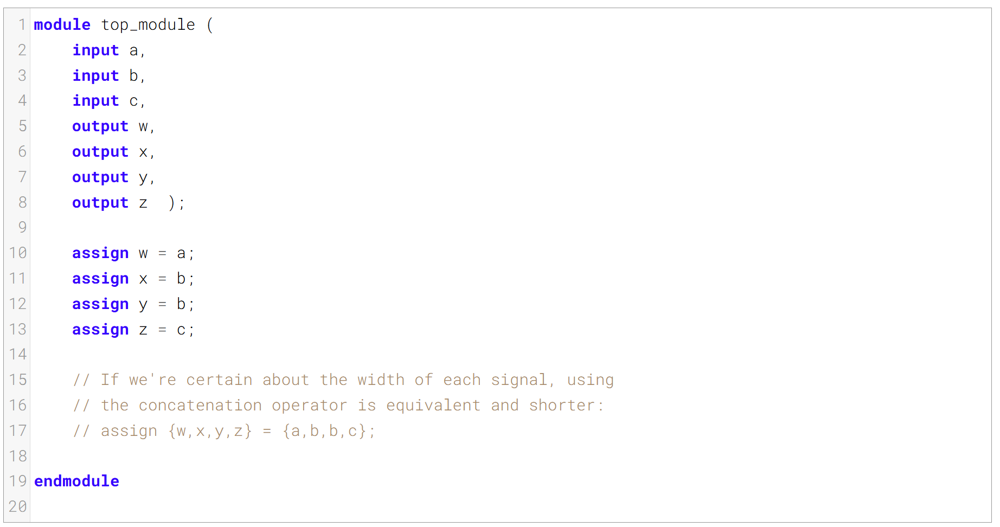
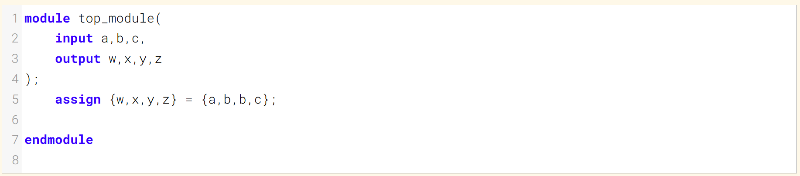
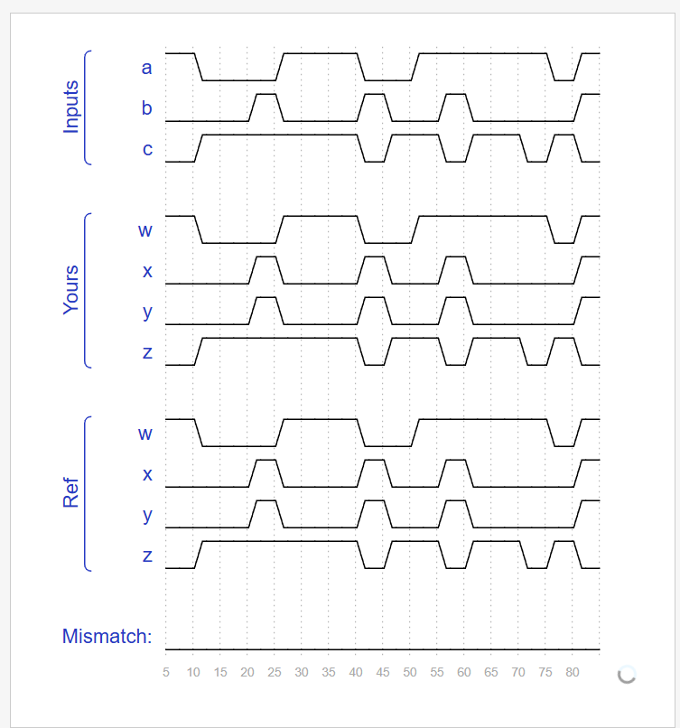

Create a module with 3 inputs and 4 outputs that behaves like wires that makes these connections:
创建一个包含3个输入和4个输出的模块，该模块以连线形式实现以下连接关系：

a -> w
b -> x
b -> y
c -> z

The diagram below illustrates how each part of the circuit corresponds to each bit of Verilog code. From outside the module, there are three input ports and four output ports.
下方的示意图展示了电路的每个部分与 Verilog 代码的每一位如何对应。从模块外部来看，该电路有三个输入端口和四个输出端口。

When you have multiple assign statements, the **order** in which they appear in the code **does not matter**. Unlike a programming language, assign statements ("continuous assignments") describe _connections_ between things, not the _action_ of copying a value from one thing to another.
当你有多个赋值语句时，它们在代码中出现的顺序并不重要。与编程语言不同，赋值语句（“连续赋值”）描述的是事物之间的连接，而非将一个值从一个事物复制到另一个事物的操作。

One potential source of confusion that should perhaps be clarified now: The green arrows here represent connections _between_ wires, but are not wires in themselves. The module itself _already_ has 7 wires declared (named a, b, c, w, x, y, and z). This is because `input` and `output` declarations actually declare a wire unless otherwise specified. Writing `input wire a` is the same as `input a`. Thus, the `assign` statements are not creating wires, they are creating the connections between the 7 wires that already exist.
这里有一个或许现在就应该澄清的潜在混淆点：此处的绿色箭头代表线路之间的连接，而非线路本身。该模块本身已声明了7根线路（命名为a、b、c、w、x、y和z）。这是因为`input`和`output`声明在未特别指定的情况下，实际上会声明一根线路。编写`input wire a`与`input a`效果相同。因此，`assign`语句并非创建线路，而是在已存在的7根线路之间建立连接。

### Module Declaration

### Write your solution here

### Solution

**方法一：**

**方法二：**
如果能确认每个信号的位宽，使用拼接符会使代码更简洁

### Timing diagrams for selected test cases

