## 4.1 概述

### 一、组合逻辑电路特点

数字电路分为两大类：组合逻辑电路、时序逻辑电路
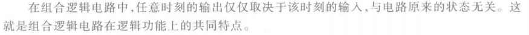
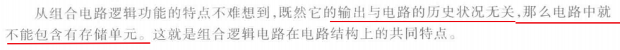

### 二、逻辑功能的描述
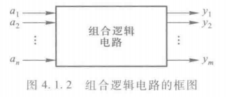
函数形式：
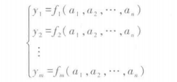
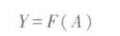
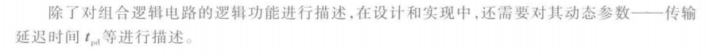
真值表、逻辑图、波形图均可描述

## 4.1 组合逻辑电路的分析方法

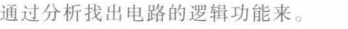
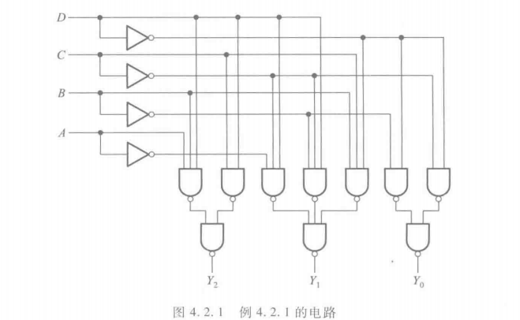
逻辑式：

真值表
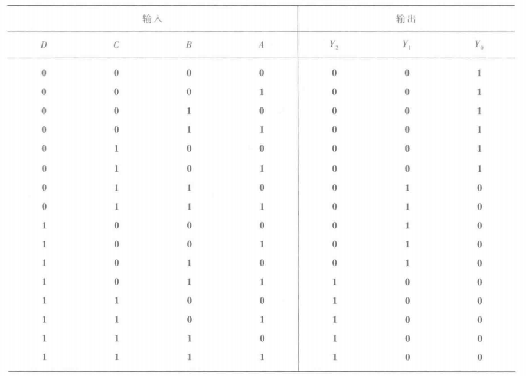
功能一目了然。
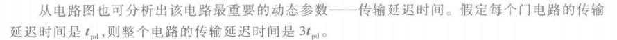
## 4.3 组合逻辑电路的基本设计方法
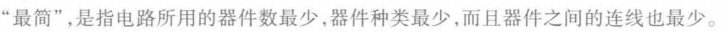
#### 一、进行逻辑抽象
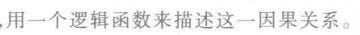
#### 二、写出逻辑函数式
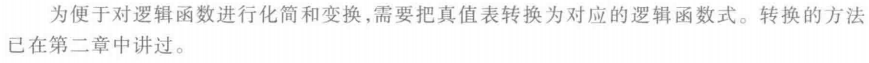
#### 三、选定器件类型
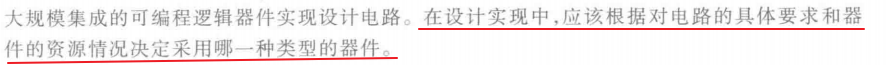
#### 四、将逻辑函数化简或转换成适当的描述形式
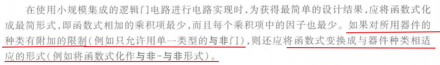
#### 五、根据化简或转换后的逻辑式画出逻辑电路的连接图
#### 六、设计验证
#### 七、工艺设计
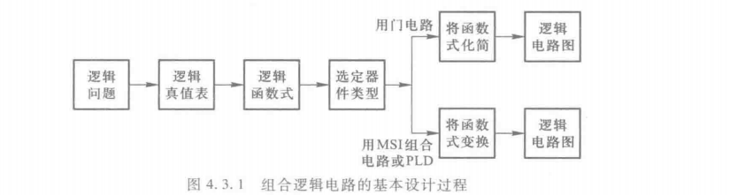

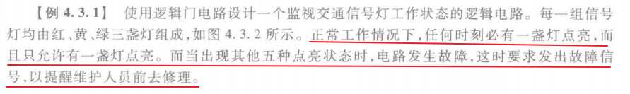
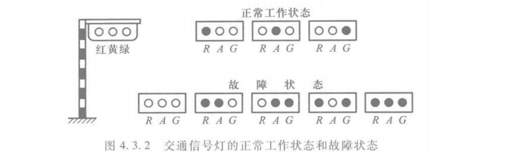
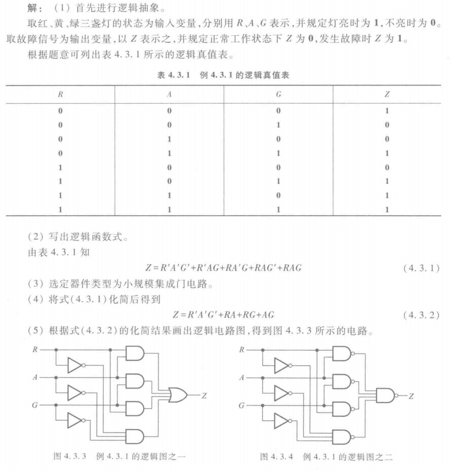
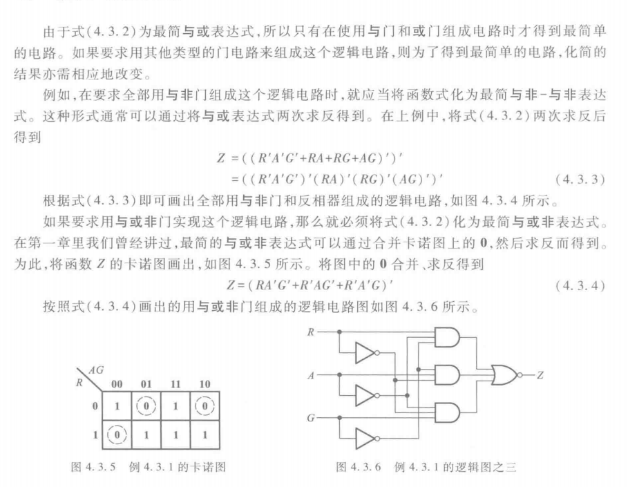

## 4.4 若干常用的组合逻辑电路模块
### 4.4.1 编码器
#### 一、普通编码器
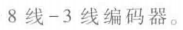
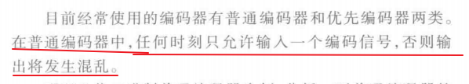
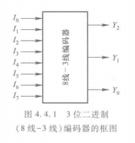
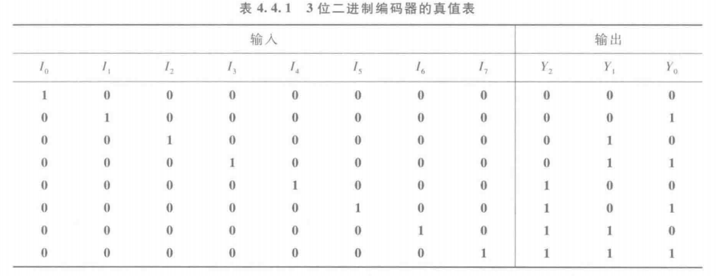
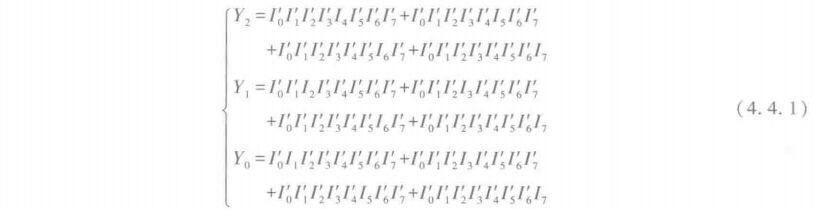

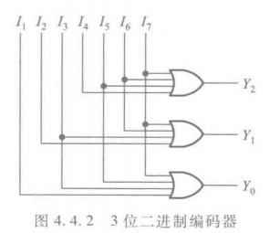
#### 二、优先编码器
##### 8-3优先译码器
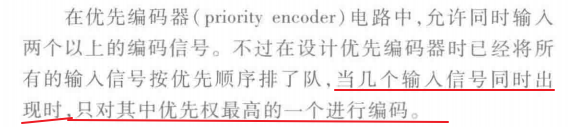
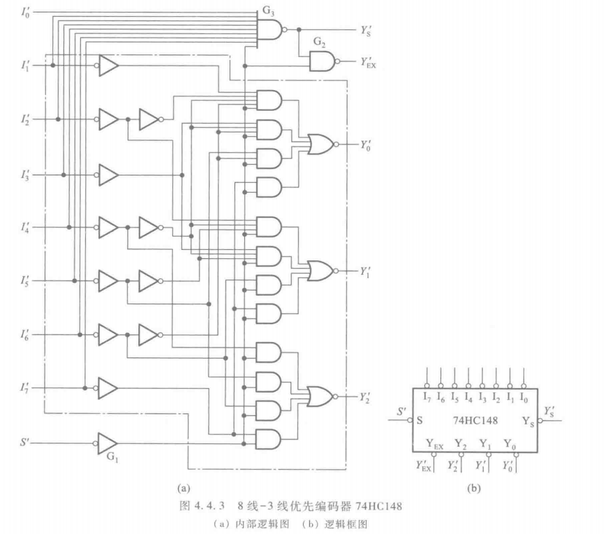

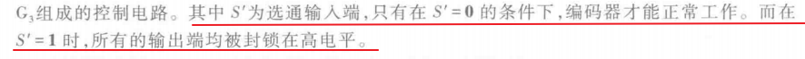
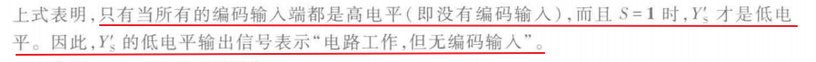
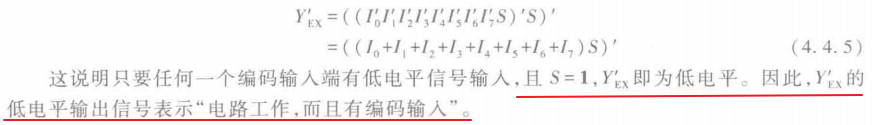
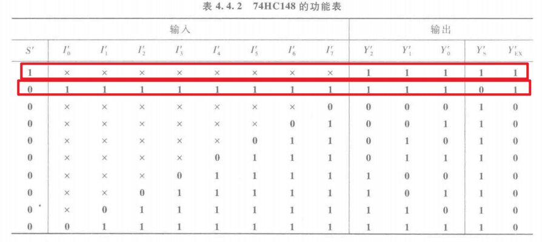
##### 2-十进制优先译码器
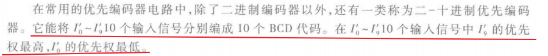
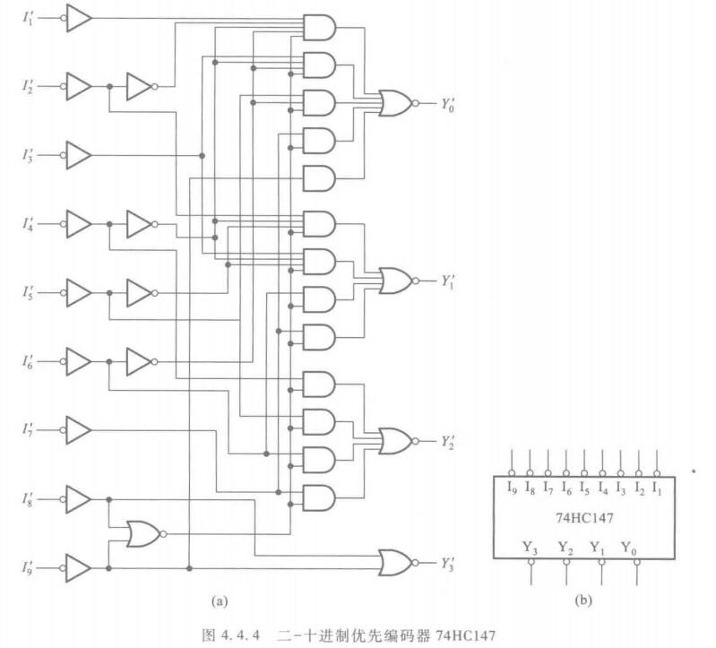

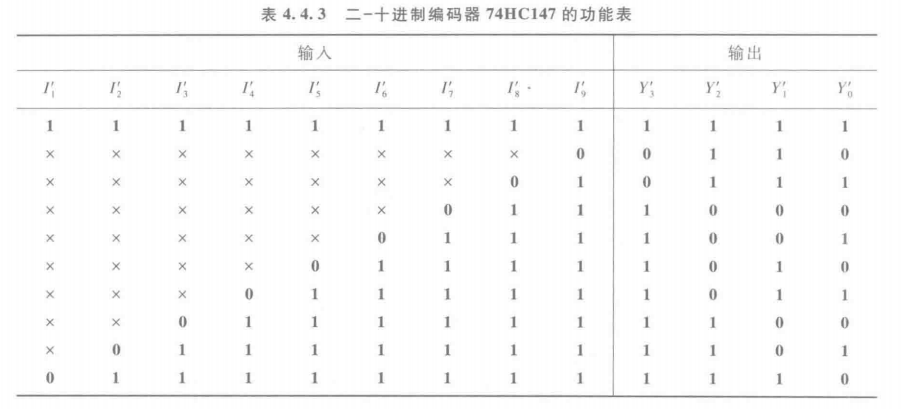
输入输出均为**低电平有效**（L = 有效，H = 无效）
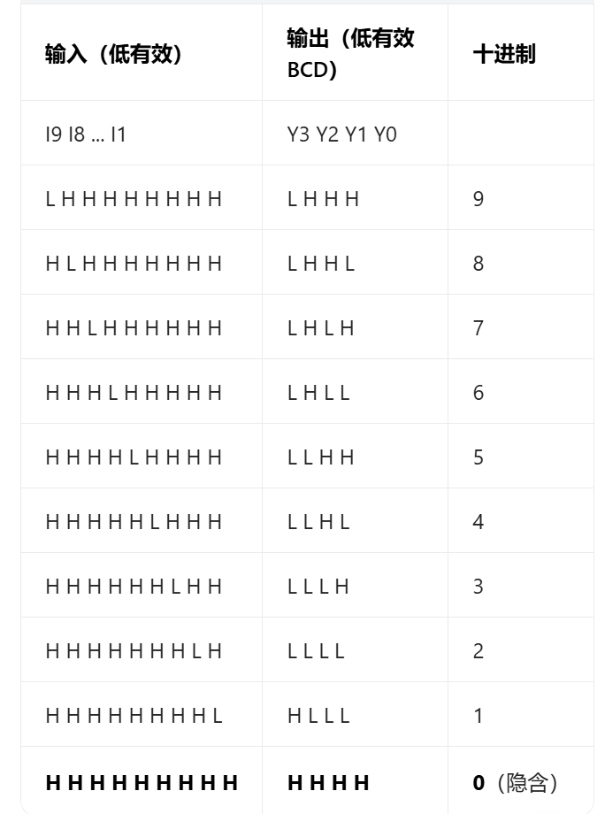
### 4.4.2 译码器

