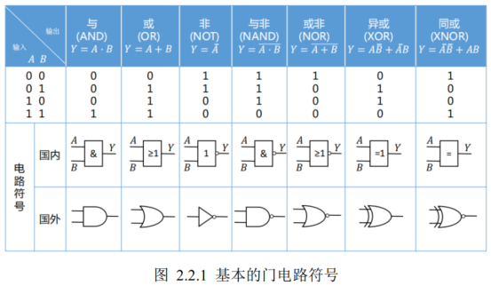
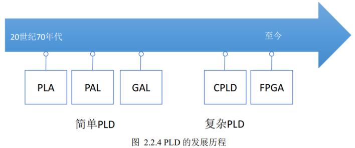
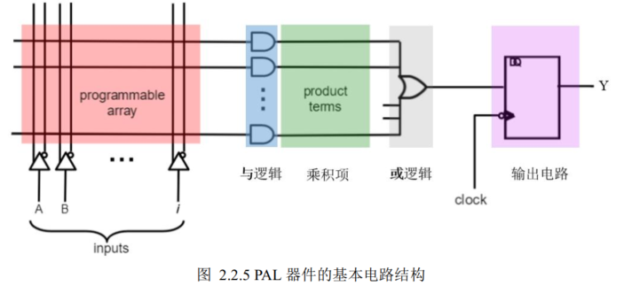
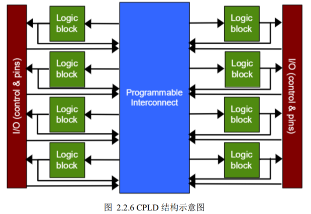
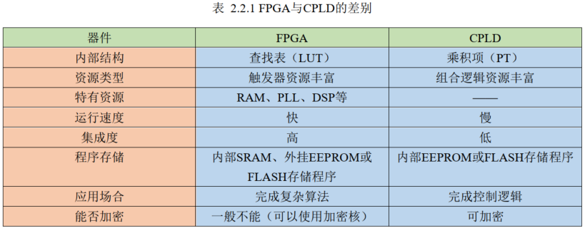
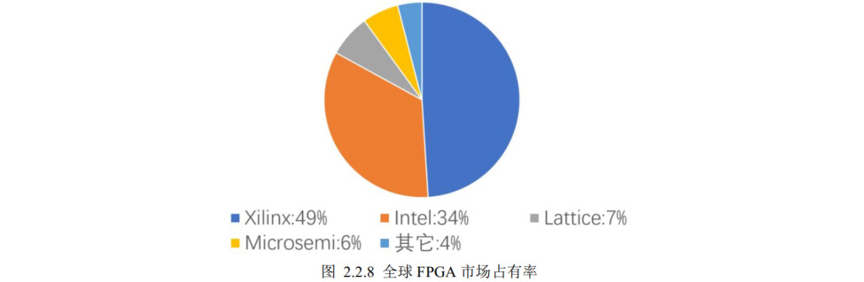
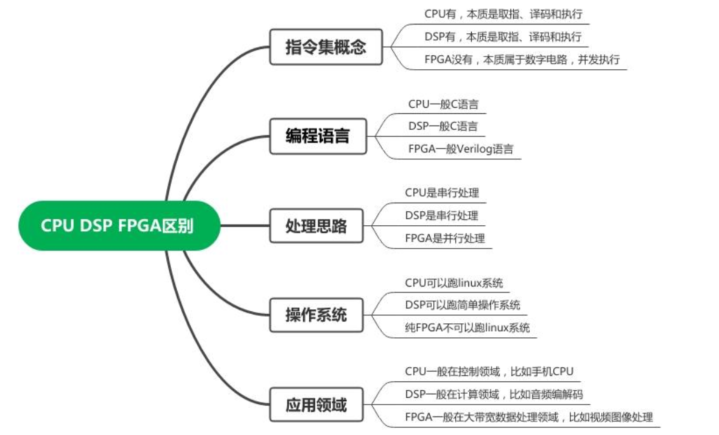

- [一、FPGA 简介](#一、FPGA%20简介)
- [二、FPGA 的发展](#二、FPGA%20的发展)
	- [2.1 数字集成电路发展](#二、FPGA%20的发展#2.1%20数字集成电路发展)
	- [2.2 FPGA 的由来](#二、FPGA%20的发展#2.2%20FPGA%20的由来)
	- [2.3FPGA 产业现状](#二、FPGA%20的发展#2.3FPGA%20产业现状)
- [三、FPGA 的技术优势](#三、FPGA%20的技术优势)
	- [3.1 FPGA 扮演的角色](#三、FPGA%20的技术优势#3.1%20FPGA%20扮演的角色)
	- [3.2 FPGA 的应用领域](#三、FPGA%20的技术优势#3.2%20FPGA%20的应用领域)
- [四、FPGA、 CPU 和 DSP 对比](#四、FPGA、%20CPU%20和%20DSP%20对比)

---
### 一、FPGA 简介
FPGA：Field Programmable Gate Array
中文名：现场可编程门阵列
- 现场：FPGA 可以在使用时进行编程，随时可以重复写入了
- 门阵列：以查找表（LookupTable， LUT）的形式实现逻辑门。就是将某个简单逻辑功能的全部可能结果写到一个存储单元中，并根据输入的变化直接查找结果并输出
- 可编程：通过编程将FPGA 中的逻辑门重新“排列组合”

---
### 二、FPGA 的发展
#### 2.1 数字集成电路发展
常用的门电路有与门、 或门、 非门、 与非门、 异或门等，

数字集成电路发展：
- 小规模集成电路（ Small Scale Integrated circuit， SSI）
- 中规模集成电路（Medium Scale Integrated circuit， MSI）
- 大规模集成电路（Large Scale Integrated circuit， LSI）
- 超大规模集成电路（Very Large Scale Integrated circuit， VLSI）
- 甚大规模集成电路（Ultra Large Scale Integrated circuit， ULSI）
- “片上系统” （System on Chip， SoC）
#### 2.2 FPGA 的由来

> 最早发明 FPGA 的是 Xilinx 公司，由Ross H. Freeman 和 Bernard V. Vonderschmitt 两人共同创办。Freeman 在 1985年制作了第一枚真正意义上的 FPGA 芯片 XC2064，该芯片采用了 4 输入、 1 输出的 LUT 和 FF 相结合的基本逻辑单元。后来加入 Xilinx 的 William S. Carter 又发明了更高效的单元间连接方法。这两个人的发明分别被称为 Freeman 专利和 Carter 专利，它们是 PLD 历史上最为有名的两个专利。

从逻辑功能的特点上将数字集成电路分类
**可以分为通用型和专用型两类：**
- 通用型：如前面介绍到的中、小规模集成电路（如 74 系列），逻辑功能都比较简单，而且是固定不变的。由于它们的这些功能在组成复杂数字系统时经常要用到，所以这些器件具有很强的通用性。
- 专用型：集成度越来越高，如果能把所设计的数字系统做成一片大规模集成电路，则不仅能减小电路的体积、重量和功耗，而且可以使电路的可靠性大为提高。像这种为某种专门用途而设计的集成电路称为专用集成电路，即所谓的 ASIC（Application Specific Integrated Circuit）。比如手机、平板电脑中的主控芯片都属于专用集成电路。
**优劣：**
- ASIC 有诸多优势，但是在用量不大的情况下，设计和制造这样的专用集成电路不仅成本很高，而且设计制造的周期也很长。
- 可编程逻辑器件（ Programmable Logic Device， PLD）的出现成功解决了这个矛盾。作为一种通用器件生产，但它的逻辑功能是由用户通过对器件进行编程来设定的，而且有些 PLD 的集成度很高，足以满足一般数字系统设计的需要。可以由设计人员自行编程从而将数字系统“集成” 在一片 PLD 上，做成“片上系统” （System on Chip， SoC），而不必去请芯片制造厂商设计和制作专用集成电路芯片了。

PLD 大体上可以分为：
- **SPLD**：（simple PLD，简单 PLD），SPLD 中又可分为 PLA、 PAL 和GAL 几种类型。
- **CPLD**：（complex PLD，复杂PLD）
- **FPGA**：（field-programmable gate array，现场可编程门阵列）。

**SPLD**：下图是 SPLD 中 PAL（可编程阵列逻辑）的电路结构图。通过对输入端（ input）到与门之间的可编程阵列（programmable array）进行编程，利用 PAL 可以获得不同形式的组合逻辑函数。

**CPLD**：通过扩展 SPLD 的概念就可以得到 CPLD， CPLD 是复杂可编程逻辑器件，相当于将多个 PAL 用可编程互联阵列（Programmable Interconnect Array， PIA）连接起来，形成一个大的 PLD，如下图。CPLD 相对于 SPLD 最大的优势就是拥有更大的逻辑资源和布线的可能性。
	Logic block（逻辑块）通常被称为逻辑阵列模块， 或者 LAB（Logic Array Block）。
	每个LAB 相当于一个 PAL 电路，不同型号的 CPLD 器件可以包含十几个甚至上百个 LAB。
	通过 PIA 将这些LAB 连接起来，就可以构成规模更大的逻辑电路了。
	在 PAL 中， I/O 管脚是直接连接到逻辑的。
	而在 CPLD 中， I/O 管脚是通过 PIA 从器件的主要逻辑中分离出来的。
	I/O 管脚有它自己的控制逻辑， 
	I/O控制单元可以根据需要将相应的引脚设置成输入、输出或双向工作模式。

**FPGA**：是在 PAL、 GAL 和 CPLD 等可编程逻辑器件的基础上进一步发展的产物，但是 FPGA 和其前辈CPLD 有着非常大的差异。

FPGA 基本结构一般由六部分组成，
1. 可编程输入/输出单元
2. 基本可编程逻辑单元
3. 底层嵌入功能单元
4. 布线资源
5. 嵌入式块 RAM
6. 内嵌专用硬核。
#### 2.3FPGA 产业现状
两巨头：赛灵思（Xilinx）、阿尔特拉（Altera），
紧排其后：莱迪思（Lattice）和美高森美（Microsemi） 。

国产FPGA厂商：紫光同创、安路科技、高云半导体、上海复旦微电子、成都华微电子、智多晶、易灵思和京微齐力

---
### 三、FPGA 的技术优势
**优点**：
高性能：
	硬件并行处理，在每个时钟周期内可以完成更多的任务。行为确定，用作硬件加速器时没有 CPU 才有的时间片、线程或资源冲突的问题
可重构性：
	可编程，因此一般在某些标准通信协议还不成熟的情况下，往往使用 FPGA 作为设计器件。
上市时间：
	编程后既可直接作为产品使用，无需等待三个月至一年的 ASIC 芯片流片周期，极大加速企业产品上市时间。
实时性：
	可以实时处理输入数据，在自动驾驶或工业控制等低延迟或实时响应的应用中具有很大优势。
**缺点：**
开发门槛高：
	需要具备较难的 Verilog 硬件编程经验。
成本高：
	FPGA 通常比单片机更昂贵。FPGA 需要进行定制化设计和生产，需要更高级别的技术和设备。
控制类任务实现代价高：
	由于 FPGA 是硬件可编程的，在某些情况下， FPGA 可能无法像单片机那样可以轻松完成一些控制任务。比如通过 SCCB 接口初始化配置 OV5640 摄像头的上百个寄存器，单片机就比 FPGA 好配置的多。
主频较低：
	FPGA 由于硬件资源是固定的，布局布线性能上不如专用的 ASIC 芯片那样灵活，最高频率远不如 ASIC可以达到几个 GHz，专用芯片还是 ASIC 更好

适用领域：数字信号处理、视频处理、图像处理、 5G通信领域、医疗领域、工业控制、云计算、硬件加速、人工智能、数据中心、自动驾驶、芯片验证
#### 3.1 FPGA 扮演的角色

FPGA 软件方向：
	以软件开发为主，开发 FPGA 在数据分析、人工智能、机器视觉等领域的加速应用能力，主要采用 OpenCL 和 HLS 技术实现软硬件协同开发。做算法、做控制，偏软件。
FPGA 硬件方向：
	以逻辑设计为主，针对 FPGA 特定领域的应用设计和集成电路设计，以及芯片验证能力。做接口、做通信，偏硬件。
#### 3.2 FPGA 的应用领域
1. **通信领域**
	- 基带处理资源
		基带处理主要包括信道编解码(LDPC、 Turbo、卷积码以及 RS 码的编解码算法)和同步算法的实现(WCDMA 系统小区搜索等)。
	- 接口和连接资源
		接口和连接功能主要包括无线基站对外的高速通信接口(PCI Express、以太网 MAC、高速 AD/DA 接口)以及内部相应的背板协议(OBSAI、 CPRI、 EMIF、 LinkPort)的实现。
	- RF 应用资源
		RF 应用主要包括调制/解调、上/下变频(WiMAX、 WCDMA、 TD-SCDMA 以及 CDMA2000 系统的单通道、多通道 DDC/DUC)、削峰(PC-CFR)以及预失真(Predistortion)等关键技术的实现。
2. **数字信号处理领域**
	无线通信、软件无线电、高清影像编辑和处理
3. **视频图像处理领域**
	图像处理(ISP)，视频处理，视频分析等；在 ISP 方面，比如降噪、宽动态、去雾， 3A等；在视频处理方面，比如缩放、去隔行、全景拼接、鱼眼矫正等；在视频分析方面，包括边缘，形状，纹理提取，物体检测、分类、背景建模等。产品例子包括全景相机、 4K 智能相机、高清微投、大屏显示等
4. **高速接口设计领域**
	FPGA 可以用来做高速信号处理，一般如果 AD 采样率高，数据速率高，这时就需要FPGA 对数据进行处理，比如对数据进行抽取滤波，降低数据速率，使信号容易处理、传输以及存储。等等
5. **IC 验证领域**
	验证相对成熟的 RTL， IC 原型验证
6. **人工智能领域**
	主要集中在前端和边缘侧。
---
### 四、FPGA、 CPU 和 DSP 对比
**CPU：**
一般都是基于指令流水线的架构，从存储器中进行指令的读取，指令的解析，指令的执行这样的流程。因此，在了解 CPU 之前，我们需要去了解 CPU 的指令集，再去了解指令的具体执行方式，然后针对具体的芯片了解其外围电路。指令集是 CPU 用来计算和控制计算机系统的一套指令的集合。
CPU 一般包括几种：
1. 单片机（也叫微处理器），比如早期的 intel 8051 单片机，近几年比较火的 ST 的 STM32 单片机。
2. 通用 CPU，比如 intel 和 AMD 的台式机 CPU。
3. 高性能 ARM CPU，比如 ARM Coretex A53/57 内核，一般用在手机或者手持设备中。
4. RISC-V 处理器，近期 RISC-V 比较火，优势是开源且高性能，吸引了国内外很多家公司在研究。

**DSP:**
DSP 其实是一种独特的 CPU，只是拥有自己的完整指令系统，是可以处理大量数字信号的器件。DSP 通常负责数字信号(视频、音频和其他的传感器获得的数字信号)处理，在日常生活中，常见的数字电视机机顶盒、 MP3、 MP4 和光模块等都广泛使用了 DSP。由于设计的专一化， DSP 可以在较低的成本下，执行比较复杂的编解码信号处理工作。

CPU 具有比较强的事务管理功能，可以用来跑 UI 以及应用程序， CPU 优点主要在于擅长控制。
DSP 主要是来做计算，例如加解密算法，调制解调等，其优势是强大的数据处理能力和较高的运行速度。
FPGA 主要使用 Verilog 进行编程，灵活性强，并行处理度高，可编程，可以做到很高的带宽处理。

