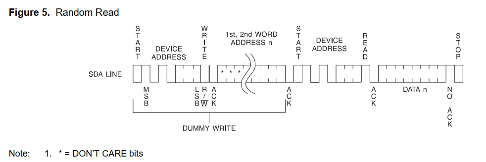

EEPROM：非易失性存储器。断电保存数据，支持改写

开发板板载了AT24C64芯片

硬件设计

AT24C64芯片数据手册阅读笔记：
特性：
支持两种电压：2.7-5.5 or 1.8-5.5（开发板常用3.3v）
8192字节x8 = 64kbit
2线串行接口（iic）
双向数据传输（半双工）
通信速率：不同电压速率不同，不超400k就ok
写保护引脚
32字节的页写模式
写周期最大==10ms==
读写次数100万次，保留100年
封装（硬件工程师关心）

描述
8192字节x8 = 64kbit
65536位
非易失性
最大支持8颗同时挂载到iic接口

芯片不同封装的引脚
A0-A2是地址配置
SDA：串行数据线
SCL：串行时钟输入线
WP：写保护

框图

引脚介绍：
SCL：上升沿将数据写到EEPROM里，下降沿从EEPROM输出数据
SDA：双向，分时复用
A2A1A0：改变器件地址。默认接地
WP：写保护。接GND允许操作。接VCC后写保护，无法往EEPROM里写数据

内部结构
256页
每页32字节
共8k字节
64kbit
随机字地址范围12对应AT24C32，13对应AT24C64（字节地址总共13位）

其他参数，影响时序

IIC通信协议
集成电路总线，两线式串行总线，半双工。适用于主从通信，支持一主多从。
标准模式：100Kbit/s
快速模式：400Kbit/s
高速模式：3.4Mbit/s

器件操作
时钟和数据的传说：SDA通常被外围设备拉高。==SDA只有在SCL低电平期间改变==，==数据在SCL高电平期间改变表示开始或结束操作==

开始操作：SCL高电平期间，SDA由高到低，开始操作

结束操作：SCL高电平期间，SDA由低到高，表示结束操作

响应操作：以8位数据传输，第9个时钟FPGA会释放这根线，第9个时钟EEPROM会发送0来应答

待机模式：stop后会进入待机模式，节省功耗

存储器复位：掉电后可按照指定操作对存储器复位

IIC通信时序图
标注的时间，前面表格里描述了参数

写周期时序图

数据有效，数据需要在SCL为低电平时改变

开始和结束的时序

输出应答位

器件地址
前4位是0和1的序列，是固定值
后面3为可配置，最大支持8个器件的组合
第8位表示当前操作是读还是写

写操作
分为 字节写 和 页写
字节写：写完一字节以后进行stop，EEPROM进入写周期，期间不允许其他操作，写完可等待10ms
页写：最大支持32字节页写。写完以后不发送停止位，继续发数据。写一字节以后低5位（共32位）会自动累加。

当前地址读
读一次以后，字节地址计数器会自动增加。==读到最后一页最后一个字节，会跳转到第一页的第一个字节。（写的话只会在当前页地址循环）==
一共256页，一页32个

随机地址读
先执行“哑写”操作，“哑写”为的是改变地址计数器，然后stop
再进行读操作。

连续读操作

IIC是如何实现一根线复用的
定义端口线时定义成inout端口

sda_dir置1时，sda_out直接驱动sda
sda_dir置0时，sda_out高阻态，相当于断开，sda_in当作输入来使用

