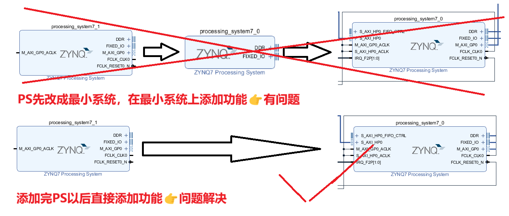

任务：使用PL的AXI DMA IP核从DDR3中读取数据，并将数据写回到DDR3中


实现：
在最小系统下操作
首先打开HP接口，打开时钟复位，打开GP接口（PS作为Master）

打开中断，打开PL时钟（为PL DMA提供时钟）

添加AXI DMA IP核

设置IP核，关闭S/G模式，使用简单DMA传输模式。其他默认

添加AXI4 Stream Data FIFO

配置这个fifo，默认即可
2个1位中断线，合成1个2位中断线

自动连接

再次自动连接

手动连接fifo和concat

Generate output products + create HDL Wrapper
打开SDK，创建Empty工程，添加axidma模板

创建main.c，对照模板进行编程（文档末尾）

程序在进入DDR读写功能后卡住

时序很差

怀疑是时序差导致的DDR无法工作
尝试更改综合策略，但无效果

现在怀疑是系统自动连线的时钟导致的，想把100M同步时钟换成PLL试一下


运行“report_timing”或“report_timing_summary”命令后，会注意到 WNS、TNS、WHS 和 THS。
WNS 代表最差负时序裕量 (Worst Negative Slack)
TNS 代表总的负时序裕量 (Total Negative Slack)，也就是负时序裕量路径之和。
WHS 代表最差保持时序裕量 (Worst Hold Slack)
THS 代表总的保持时序裕量 (Total Hold Slack)，也就是负保持时序裕量路径之和。
这些值告诉设计者设计与时序要求相差多少。如果为正值，则说明能达到时序要求，若为负值，则说明时序达不到要求

TNS到达-20000多，应该是一些致命的硬性问题导致的时序错误

vivado逆天Bug
太恶心了


继续实验
Debug As
Launch on Hardware (System Debugger)

添加Memory Monitors
添加需要监视的储存器地址0x1200000

改成16进制


设置断点

断点Xil_DCacheFlushRange((UINTPTR) tx_buffer_ptr, MAX_PKT_LEN);   //刷新Data Cache
处，0x1200000的值已经被改写成
由于 CPU 与 DDR3 之间是通过 Cache 交互的
数据暂存在 Cache中，没有刷新 Data Cache 数据到 DDR3
==显示的数据是 Data Cache 中的。==
而0x1400000还未写入数据

运行到断点 3 处，
执行完第 100 行的 DMA 发送函数，
完成从内存中读取数据传输给外设，
即DMA 从地址 0x1200000 处读取数据传输给外设， 
此时地址 0x1400000 处的数据未更新。

接着运行到断点 5 处，
刷新 Data Cache 后，
此时我们发现地址 0x1400000 处的值变为 00，
紧随其后的地址处的数据都变成预期的值。

到此，使用 DMA 从 DDR3 中读取数据， 并将数据写回到 DDR3 中的实验任务就完成了。
继续往下执行，到程序结束，


```verilog
/***************************** Include Files *********************************/

#include "xaxidma.h"
#include "xparameters.h"
#include "xil_exception.h"
#include "xscugic.h"

/************************** Constant Definitions *****************************/

#define DMA_DEV_ID XPAR_AXIDMA_0_DEVICE_ID
#define RX_INTR_ID XPAR_FABRIC_AXIDMA_0_S2MM_INTROUT_VEC_ID
#define TX_INTR_ID XPAR_FABRIC_AXIDMA_0_MM2S_INTROUT_VEC_ID
#define INTC_DEVICE_ID XPAR_SCUGIC_SINGLE_DEVICE_ID
#define DDR_BASE_ADDR XPAR_PS7_DDR_0_S_AXI_BASEADDR //0x00100000
#define MEM_BASE_ADDR (DDR_BASE_ADDR + 0x1000000) //0x01100000
#define TX_BUFFER_BASE (MEM_BASE_ADDR + 0x00100000) //0x01200000
#define RX_BUFFER_BASE (MEM_BASE_ADDR + 0x00300000) //0x01400000
#define RESET_TIMEOUT_COUNTER 10000 //复位时间
#define TEST_START_VALUE 0x0 //测试起始值
#define MAX_PKT_LEN 0x100 //发送包长度

/************************** Function Prototypes ******************************/

static int check_data(int length, u8 start_value);
static void tx_intr_handler(void *callback);
static void rx_intr_handler(void *callback);
static int setup_intr_system(XScuGic * int_ins_ptr, XAxiDma * axidma_ptr,
                             u16 tx_intr_id, u16 rx_intr_id);
static void disable_intr_system(XScuGic * int_ins_ptr, u16 tx_intr_id,
                                u16 rx_intr_id);

/************************** Variable Definitions *****************************/

static XAxiDma axidma; //XAxiDma 实例
static XScuGic intc; //中断控制器的实例
volatile int tx_done; //发送完成标志
volatile int rx_done; //接收完成标志
volatile int error; //传输出错标志

/************************** Function Definitions *****************************/

int main(void) {
	int i;
	int status;
	u8 value;
	u8 *tx_buffer_ptr;
	u8 *rx_buffer_ptr;
	XAxiDma_Config *config;

	tx_buffer_ptr = (u8 *) TX_BUFFER_BASE;
	rx_buffer_ptr = (u8 *) RX_BUFFER_BASE;

	xil_printf("\r\n--- Entering main() --- \r\n");

	config = XAxiDma_LookupConfig(DMA_DEV_ID);
	if (!config) {
		xil_printf("No config found for %d\r\n", DMA_DEV_ID);
		return XST_FAILURE;
	}

//初始化 DMA 引擎
	status = XAxiDma_CfgInitialize(&axidma, config);
	if (status != XST_SUCCESS) {
		xil_printf("Initialization failed %d\r\n", status);
		return XST_FAILURE;
	}

	if (XAxiDma_HasSg(&axidma)) {
		xil_printf("Device configured as SG mode \r\n");
		return XST_FAILURE;
	}

//建立中断系统
	status = setup_intr_system(&intc, &axidma, TX_INTR_ID, RX_INTR_ID);
	if (status != XST_SUCCESS) {
		xil_printf("Failed intr setup\r\n");
		return XST_FAILURE;
	}

//初始化标志信号
	tx_done = 0;
	rx_done = 0;
	error = 0;

	value = TEST_START_VALUE;
	for (i = 0; i < MAX_PKT_LEN; i++) {
		tx_buffer_ptr[i] = value;
		value = (value + 1) & 0xFF;
	}

	Xil_DCacheFlushRange((UINTPTR) tx_buffer_ptr, MAX_PKT_LEN); //刷新 Data Cache

//传送数据
	status = XAxiDma_SimpleTransfer(&axidma, (UINTPTR) tx_buffer_ptr,
	                                MAX_PKT_LEN, XAXIDMA_DMA_TO_DEVICE);
	if (status != XST_SUCCESS) {
		return XST_FAILURE;
	}

	status = XAxiDma_SimpleTransfer(&axidma, (UINTPTR) rx_buffer_ptr,
	                                MAX_PKT_LEN, XAXIDMA_DEVICE_TO_DMA);
	if (status != XST_SUCCESS) {
		return XST_FAILURE;
	}

	Xil_DCacheFlushRange((UINTPTR) rx_buffer_ptr, MAX_PKT_LEN); //刷新 Data Cache
	while (!tx_done && !rx_done && !error)
		;
//传输出错
	if (error) {
		xil_printf("Failed test transmit%s done, "
		           "receive%s done\r\n", tx_done ? "" : " not",
		           rx_done ? "" : " not");
		goto Done;
	}

//传输完成，检查数据是否正确
	status = check_data(MAX_PKT_LEN, TEST_START_VALUE);
	if (status != XST_SUCCESS) {
		xil_printf("Data check failed\r\n");
		goto Done;
	}

	xil_printf("Successfully ran AXI DMA Loop\r\n");
	disable_intr_system(&intc, TX_INTR_ID, RX_INTR_ID);

Done:
	xil_printf("--- Exiting main() --- \r\n");
	return XST_SUCCESS;
}
//检查数据缓冲区
static int check_data(int length, u8 start_value) {
	u8 value;
	u8 *rx_packet;
	int i = 0;

	value = start_value;
	rx_packet = (u8 *) RX_BUFFER_BASE;
	for (i = 0; i < length; i++) {
		if (rx_packet[i] != value) {
			xil_printf("Data error %d: %x/%x\r\n", i, rx_packet[i], value);
			return XST_FAILURE;
		}
		value = (value + 1) & 0xFF;
	}

	return XST_SUCCESS;
}

//DMA TX 中断处理函数
static void tx_intr_handler(void *callback) {
	int timeout;
	u32 irq_status;
	XAxiDma *axidma_inst = (XAxiDma *) callback;

//读取待处理的中断
	irq_status = XAxiDma_IntrGetIrq(axidma_inst, XAXIDMA_DMA_TO_DEVICE);
//确认待处理的中断
	XAxiDma_IntrAckIrq(axidma_inst, irq_status, XAXIDMA_DMA_TO_DEVICE);

//Tx 出错
	if ((irq_status & XAXIDMA_IRQ_ERROR_MASK)) {
		error = 1;
		XAxiDma_Reset(axidma_inst);
		timeout = RESET_TIMEOUT_COUNTER;
		while (timeout) {
			if (XAxiDma_ResetIsDone(axidma_inst))
				break;
			timeout -= 1;
		}
		return;
	}

//Tx 完成
	if ((irq_status & XAXIDMA_IRQ_IOC_MASK))
		tx_done = 1;
}

//DMA RX 中断处理函数
static void rx_intr_handler(void *callback) {
	u32 irq_status;
	int timeout;
	XAxiDma *axidma_inst = (XAxiDma *) callback;

	irq_status = XAxiDma_IntrGetIrq(axidma_inst, XAXIDMA_DEVICE_TO_DMA);
	XAxiDma_IntrAckIrq(axidma_inst, irq_status, XAXIDMA_DEVICE_TO_DMA);

//Rx 出错
	if ((irq_status & XAXIDMA_IRQ_ERROR_MASK)) {
		error = 1;
		XAxiDma_Reset(axidma_inst);
		timeout = RESET_TIMEOUT_COUNTER;
		while (timeout) {
			if (XAxiDma_ResetIsDone(axidma_inst))
				break;
			timeout -= 1;
		}
		return;
	}

//Rx 完成
	if ((irq_status & XAXIDMA_IRQ_IOC_MASK))
		rx_done = 1;
}

//建立 DMA 中断系统
// @param int_ins_ptr 是指向 XScuGic 实例的指针
// @param AxiDmaPtr 是指向 DMA 引擎实例的指针
// @param tx_intr_id 是 TX 通道中断 ID
// @param rx_intr_id 是 RX 通道中断 ID
// @return：成功返回 XST_SUCCESS，
static int setup_intr_system(XScuGic * int_ins_ptr, XAxiDma * axidma_ptr,
                             u16 tx_intr_id, u16 rx_intr_id) {
	int status;
	XScuGic_Config *intc_config;

//初始化中断控制器驱动
	intc_config = XScuGic_LookupConfig(INTC_DEVICE_ID);
	if (NULL == intc_config) {
		return XST_FAILURE;
	}
	status = XScuGic_CfgInitialize(int_ins_ptr, intc_config,
	                               intc_config->CpuBaseAddress);
	if (status != XST_SUCCESS) {
		return XST_FAILURE;
	}

//设置优先级和触发类型
	XScuGic_SetPriorityTriggerType(int_ins_ptr, tx_intr_id, 0xA0, 0x3);
	XScuGic_SetPriorityTriggerType(int_ins_ptr, rx_intr_id, 0xA0, 0x3);

//为中断设置中断处理函数
	status = XScuGic_Connect(int_ins_ptr, tx_intr_id,
	                         (Xil_InterruptHandler) tx_intr_handler, axidma_ptr);
	if (status != XST_SUCCESS) {
		return status;
	}

	status = XScuGic_Connect(int_ins_ptr, rx_intr_id,
	                         (Xil_InterruptHandler) rx_intr_handler, axidma_ptr);
	if (status != XST_SUCCESS) {
		return status;
	}

	XScuGic_Enable(int_ins_ptr, tx_intr_id);
	XScuGic_Enable(int_ins_ptr, rx_intr_id);

//启用来自硬件的中断
	Xil_ExceptionInit();
	Xil_ExceptionRegisterHandler(XIL_EXCEPTION_ID_INT,
	                             (Xil_ExceptionHandler) XScuGic_InterruptHandler,
	                             (void *) int_ins_ptr);
	Xil_ExceptionEnable();

//使能 DMA 中断
	XAxiDma_IntrEnable(&axidma, XAXIDMA_IRQ_ALL_MASK, XAXIDMA_DMA_TO_DEVICE);
	XAxiDma_IntrEnable(&axidma, XAXIDMA_IRQ_ALL_MASK, XAXIDMA_DEVICE_TO_DMA);

	return XST_SUCCESS;
}

//此函数禁用 DMA 引擎的中断
static void disable_intr_system(XScuGic * int_ins_ptr, u16 tx_intr_id,
                                u16 rx_intr_id) {
	XScuGic_Disconnect(int_ins_ptr, tx_intr_id);
	XScuGic_Disconnect(int_ins_ptr, rx_intr_id);
}

```


