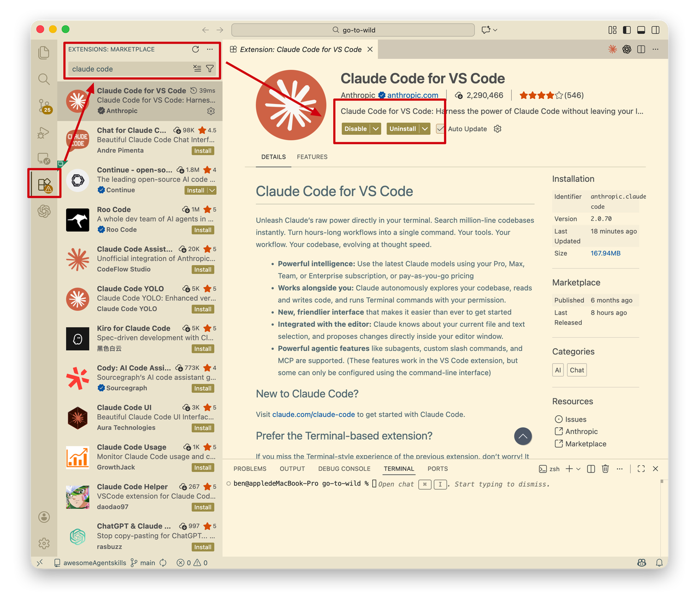
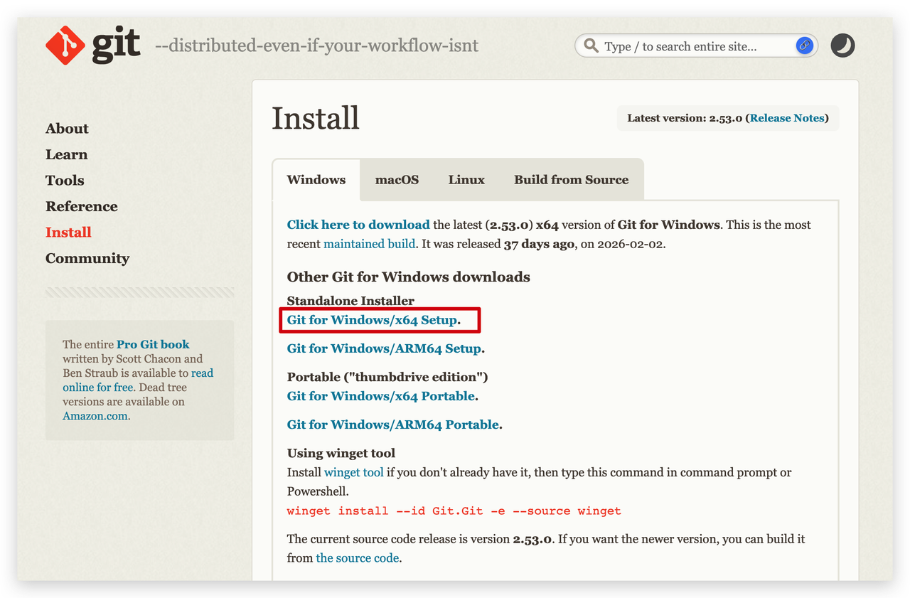
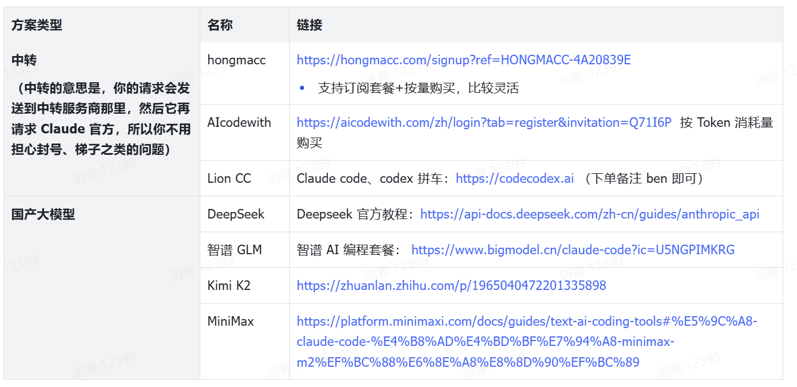
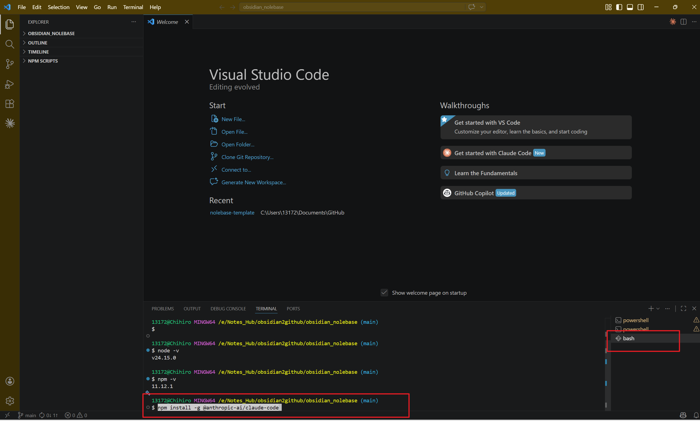
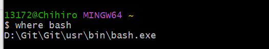
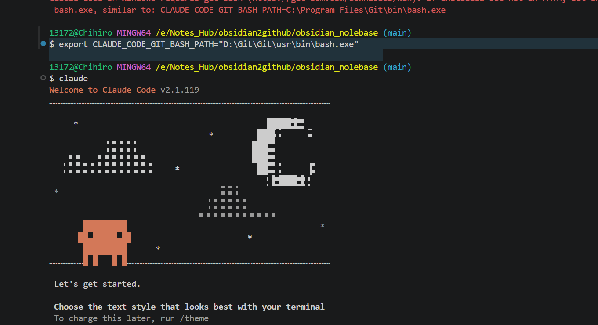
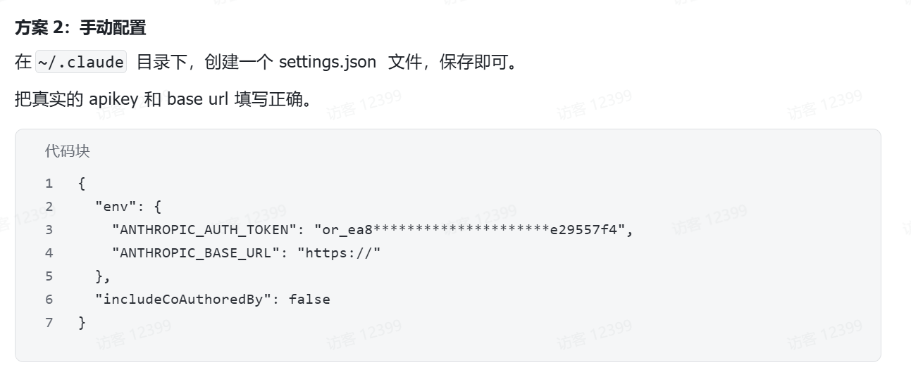
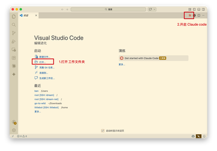
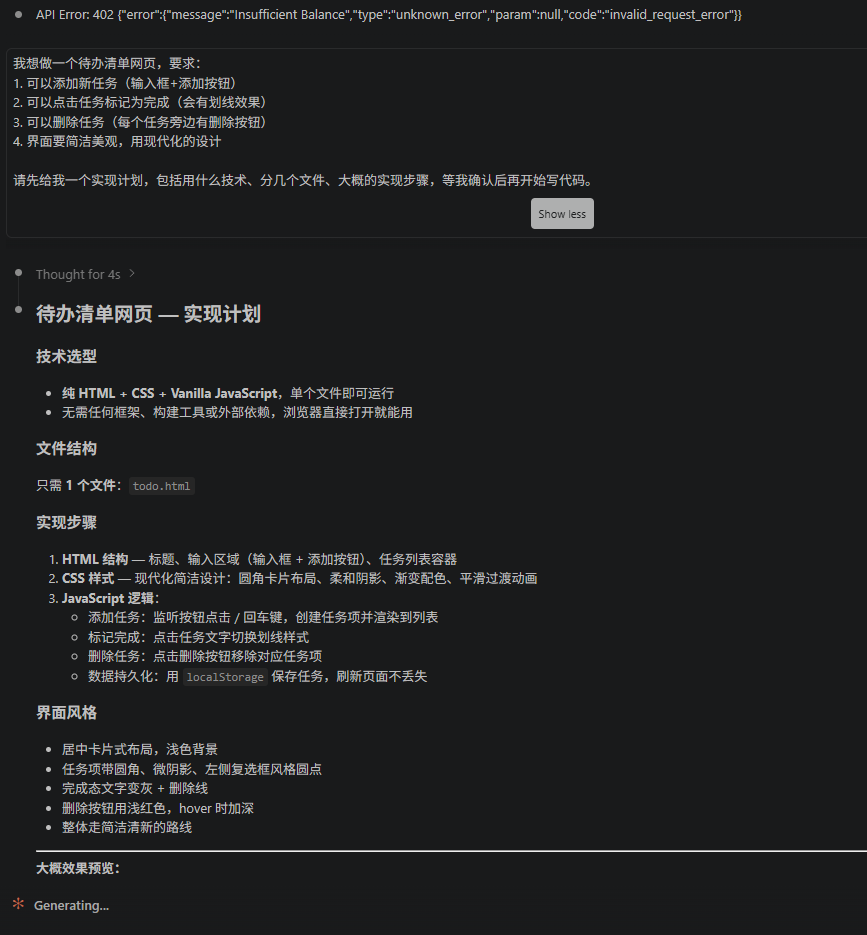

[Claude code 保姆级入门教程，不学命令行版（2026.3 月更新） - 飞书云文档](https://waytoagi.feishu.cn/docx/DKp0dhZ5foPMg2xrDYKcO0rtnxd)


## **第一步：准备工作**

### **1.1 安装 Claude Code**
使用终端、命令行还是挡住了非常多的朋友，这个时候，有个界面很重要！

Claude code、Codex 官方也都推出了插件，安装即可使用。

  

#### 第一步：安装必备软件

1. ##### 安装 vs code
    

https://code.visualstudio.com/

在 vs vode 官网下载安装，免费的，它主要是用来编程的，但我们主要用它运行 Claude code 插件。

2. ##### 安装 claude code 插件
    

点击链接：https://marketplace.visualstudio.com/items?itemName=anthropic.claude-code，会自动跳转到 vs code 安装。

或者在 vs code 插件市场搜索「Claude code」，即可安装




3. ##### 安装 git
    

Git 是运行 claude code 必备的软件，用来做代码版本管理，需要安装。

- Windows：https://git-scm.com/install/windows ，一般选「Git for Windows/x64 Setup.」，如果电脑芯片是 ARM，则选下面那个。安装的时候，一路默认安装即可。安装之后，需要重新启动 vs code。



#### **第二步：配置账号**

唯一的门槛，就是搞定一个能在 Claude code 里用的账号。

可以这样理解 Claude code：它是一个工具，Claude code 和大模型的关系，就像手机和运营商的关系。你的手机可以选电信、联通、移动，都能打电话上网， Claude code 就相当于手机，大模型就相当于运营商，你可以在 Claude code 使用各种模型，你只需要为大模型付费。

Claude 官方会直接封中国用户的账号，所以使用官方账号门槛很高。

推荐使用中转方案，或者用国产大模型平替。

如何选择？

- 如果追求效果最好，选中转；
    
- 如果追求简单方便，选国产大模型。




#### 要提前安装Node.js
node -v
npm -v
检查是否安装完成


#### 然后安装 Claude Code
```
npm install -g @anthropic-ai/claude-code
```




#### 2. 配置环境变量

```
export ANTHROPIC_BASE_URL=https://api.deepseek.com/anthropicexport ANTHROPIC_AUTH_TOKEN=${DEEPSEEK_API_KEY}export ANTHROPIC_MODEL=deepseek-v4-pro[1m]export ANTHROPIC_DEFAULT_OPUS_MODEL=deepseek-v4-proexport ANTHROPIC_DEFAULT_SONNET_MODEL=deepseek-v4-proexport ANTHROPIC_DEFAULT_HAIKU_MODEL=deepseek-v4-flashexport CLAUDE_CODE_SUBAGENT_MODEL=deepseek-v4-proexport CLAUDE_CODE_DISABLE_NONESSENTIAL_TRAFFIC=1export CLAUDE_CODE_DISABLE_NONSTREAMING_FALLBACK=1export CLAUDE_CODE_EFFORT_LEVEL=max
```

#### 3. 进入项目目录，执行 `claude` 命令，即可开始使用了。

```
cd my-project
claude
```

claude的时候要改一下地址

用
where bash找




然后再修改目录
$ export CLAUDE_CODE_GIT_BASH_PATH="D:\Git\Git\usr\bin\bash.exe"
再claude
就打开了



手动配置以后


就可以使用 了，
但是得充钱，充tocken
冲了1块钱试了一下可以使用。安装完毕





可以使用



