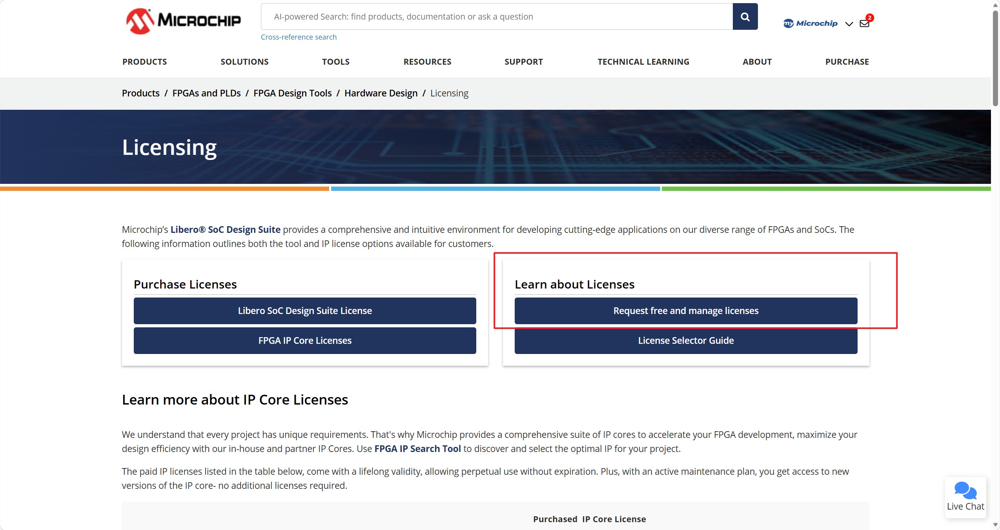
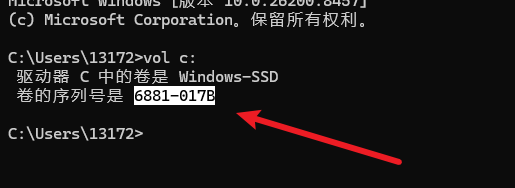
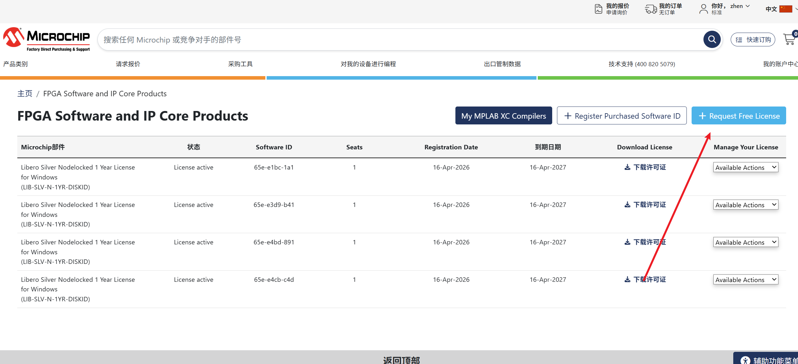
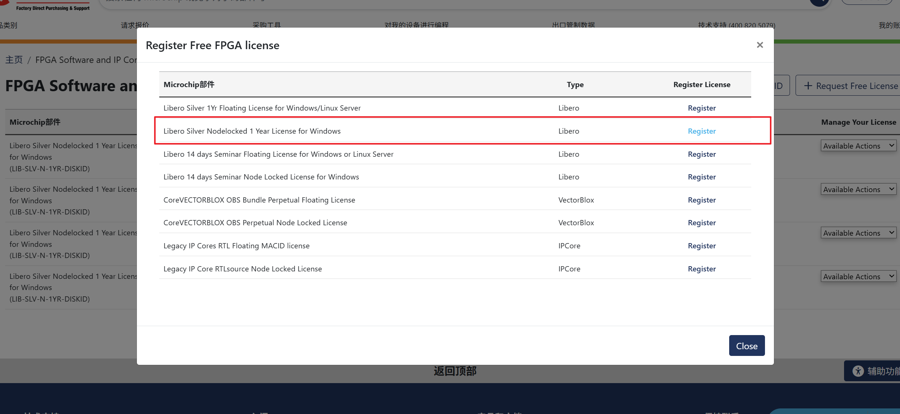
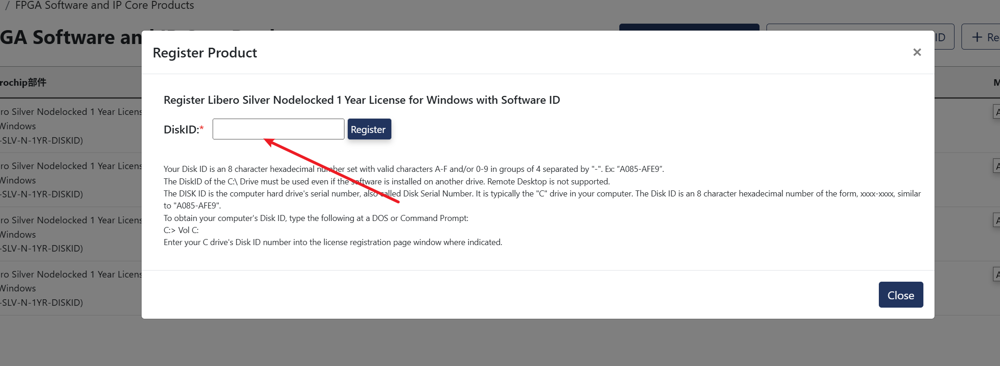
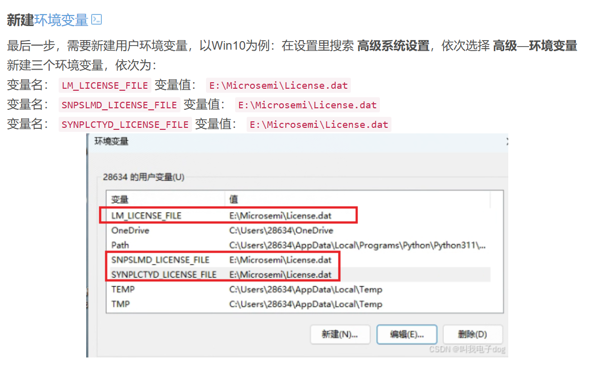

## 1、注册账号

## 2、申请License
[Licensing | Microchip Technology](https://www.microchip.com/en-us/products/fpgas-and-plds/fpga-and-soc-design-tools/fpga/licensing)

打开cmd输入vol c:
无论装在那个盘，都是vol c:
获取序列号

申请1年

输入c盘id

申请成功
10min后在该网址下载，或者自动发到邮箱中下载均可

## 3、下载license后，修改变量

license.dat文件放在软件根目录即可

以下内容供复试使用，地址根据实际地址修改

变量名： LM_LICENSE_FILE 变量值： E:\Microsemi\License.dat
变量名： SNPSLMD_LICENSE_FILE 变量值： E:\Microsemi\License.dat
变量名： SYNPLCTYD_LICENSE_FILE 变量值： E:\Microsemi\License.dat

