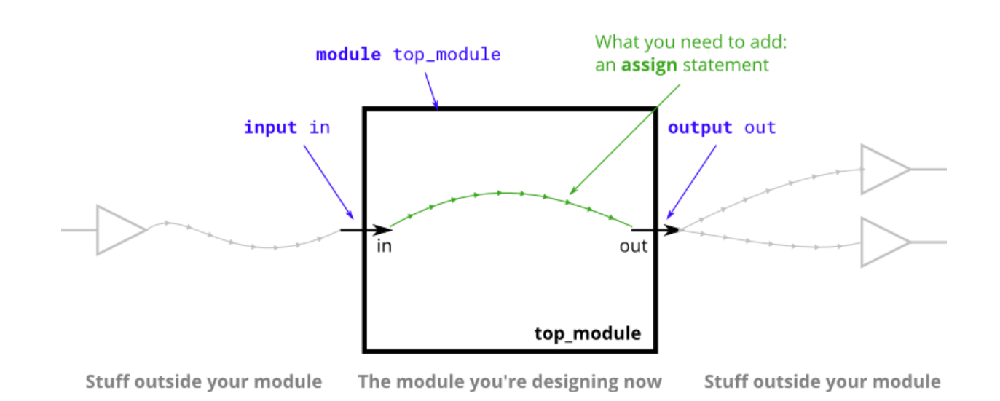
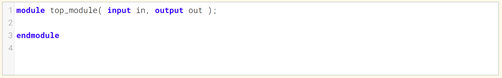
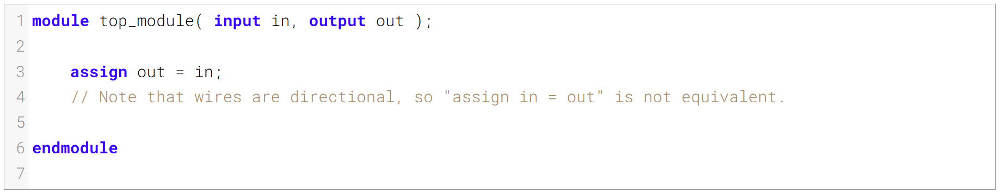

Create a module with **one input** and **one output** that behaves like a wire.
创建一个具有一个输入和一个输出、行为类似于导线的模块。

Unlike physical wires, wires (and other signals) in Verilog are _directional_. This means information flows in only one direction, from (usually one) _source_ to the _sinks_ (The source is also often called a _driver_ that _drives_ a value onto a wire). In a Verilog "continuous assignment" (`assign left_side = right_side;`), the value of the signal on the right side is driven onto the wire on the left side. The assignment is "continuous" because the assignment continues all the time even if the right side's value changes. A continuous assignment is not a one-time event.
与物理导线不同，Verilog 中的导线（以及其他信号）具有方向性。这意味着信息仅沿一个方向流动，从（通常是一个）源端流向汇端（源端通常也被称为驱动器，负责将值驱动到导线上）。在 Verilog 的“连续赋值”（`assign left_side = right_side;`）中，右侧信号的值会被驱动到左侧的导线上。这种赋值是“连续”的，因为即便右侧的值发生变化，赋值也会一直生效。连续赋值并非一次性的操作。

The ports on a module also have a direction (usually input or output). An input port is _driven by_ something from outside the module, while an output port _drives_ something outside. When viewed from inside the module, an input port is a driver or source, while an output port is a sink.
模块上的端口也具有方向（通常为输入或输出）。输入端口由模块外部的某个信号驱动，而输出端口则驱动模块外部的某个对象。从模块内部来看，输入端口是驱动源，输出端口则是接收端。

The diagram below illustrates how each part of the circuit corresponds to each bit of Verilog code. The module and port declarations create the black portions of the circuit. Your task is to create a wire (in green) by adding an `assign` statement to connect `in` to `out`. The parts outside the box are not your concern, but you should know that your circuit is tested by connecting signals from our test harness to the ports on your `top_module`.
下图展示了电路的每个部分与 Verilog 代码的每一位如何对应。模块和端口声明构成了电路的黑色部分。你的任务是通过添加一条 `assign` 语句创建一根导线（绿色），将 `in` 连接到 `out`。方框外的部分与你无关，但你需要知道，我们会通过将测试平台的信号连接到你的 `top_module` 的端口，来对电路进行测试。

In addition to continuous assignments, Verilog has three other assignment types that are used in procedural blocks, two of which are synthesizable. We won't be using them until we start using procedural blocks.
除了连续赋值语句外，Verilog 还有另外三种用于过程块的赋值类型，其中两种是可综合的。我们要到开始使用过程块时才会用到它们。

### Module Declaration

### Write your solution here

### Solution
直接把in通过组合逻辑赋值给out即可
注意wire是有方向的，右侧 赋值 给左侧

