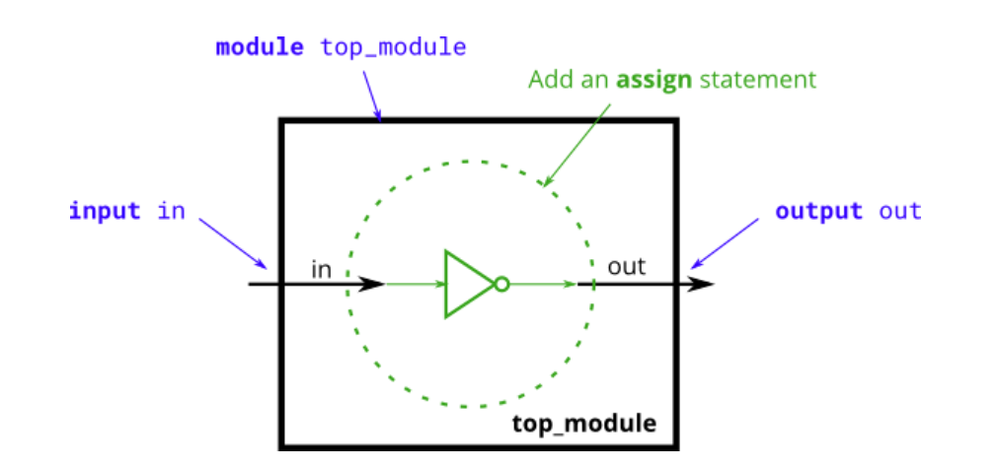
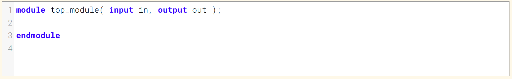
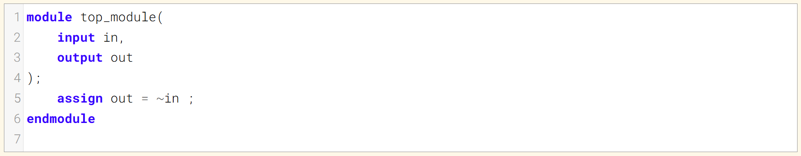
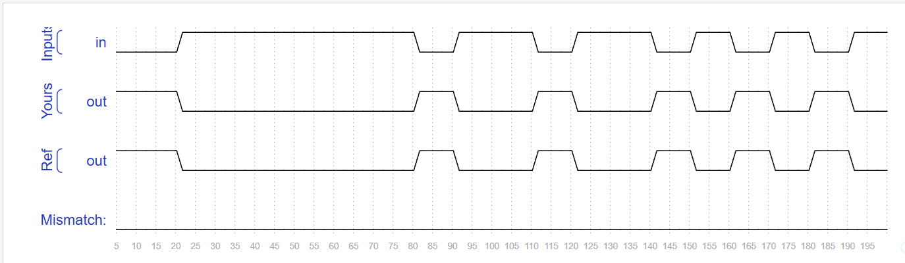

# Notgate 非门
Create a module that implements a NOT gate.
创建一个实现非门的模块。

This circuit is similar to wire, but with a slight difference. When making the connection from the wire `in` to the wire `out` we're going to implement an inverter (or "NOT-gate") instead of a plain wire.
这个电路类似于导线，但有一个细微差别。在从`in`导线到`out`导线的连接过程中，我们将使用一个反相器（或“非门”）来替代普通的导线。

Use an assign statement. The `assign` statement will _continuously drive_ the inverse of `in` onto wire `out`.
使用 assign 语句。`assign` 语句会持续将 `in` 的反值驱动到线网 `out` 上。

### Module Declaration 模块声明

### Write your solution here

### Solution

### Timing diagrams

