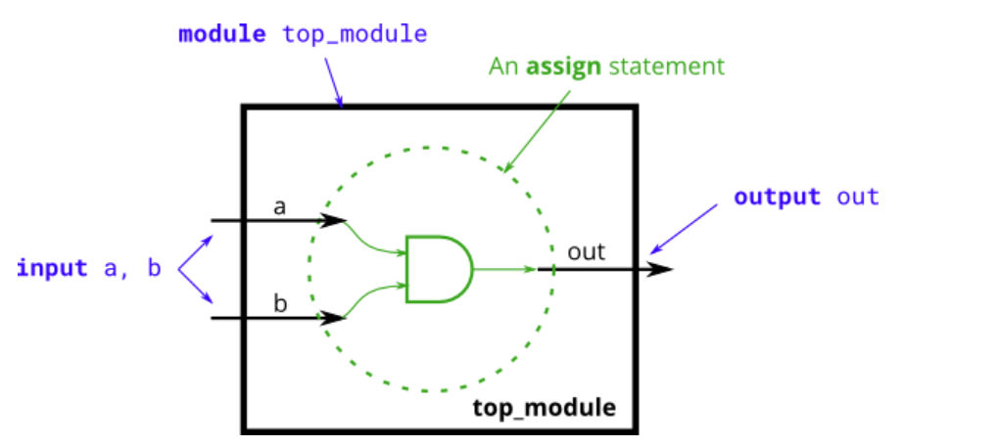
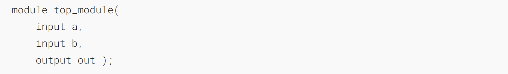
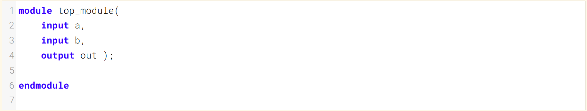
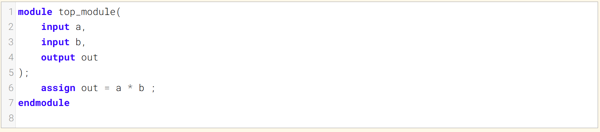
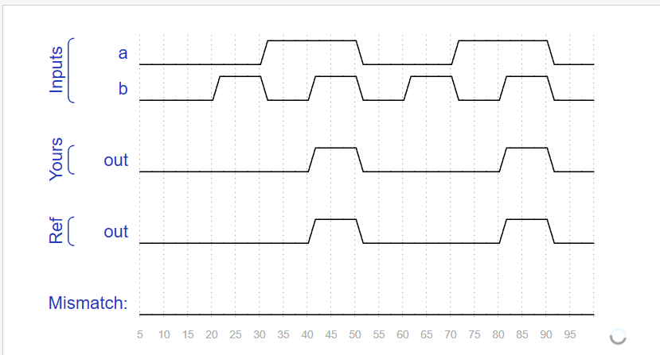

# And gate 与门
Create a module that implements an AND gate.
创建一个实现与门的模块。

This circuit now has three wires (`a`, `b`, and `out`). Wires `a` and `b` already have values driven onto them by the input ports. But wire `out` currently is not driven by anything. Write an `assign` statement that drives `out` with the AND of signals `a` and `b`.
该电路现在有三根导线（`a`、`b` 和 `out`）。导线 `a` 和 `b` 已由输入端口赋予了值，但导线 `out` 目前没有任何信号驱动。请编写一条 `assign` 语句，使 `out` 输出信号 `a` 和 `b` 的与运算结果。

Note that this circuit is very similar to the NOT gate, just with one more input. If it sounds different, it's because I've started describing signals as being _driven_ (has a known value determined by something attached to it) or _not driven_ by something. `Input wires` are driven by something outside the module. `assign` statements will drive a logic level onto a wire. As you might expect, a wire cannot have more than one driver (what is its logic level if there is?), and a wire that has no drivers will have an undefined value (often treated as 0 when synthesizing hardware).
请注意，该电路与非门非常相似，只是多了一个输入。如果听起来有所不同，那是因为我开始将信号描述为被驱动（具有由连接的外部元件确定的已知值）或未被驱动。`Input wires`由模块外部的元件驱动。`assign`语句会将一个逻辑电平驱动到线上。正如你所料，一根线不能有多个驱动源（如果有多个，其逻辑电平是什么？），而没有驱动源的线将具有未定义的值（在综合硬件时通常被视为0）。

### Module Declaration1

### Write your solution here

### Solution

### Timing diagrams

