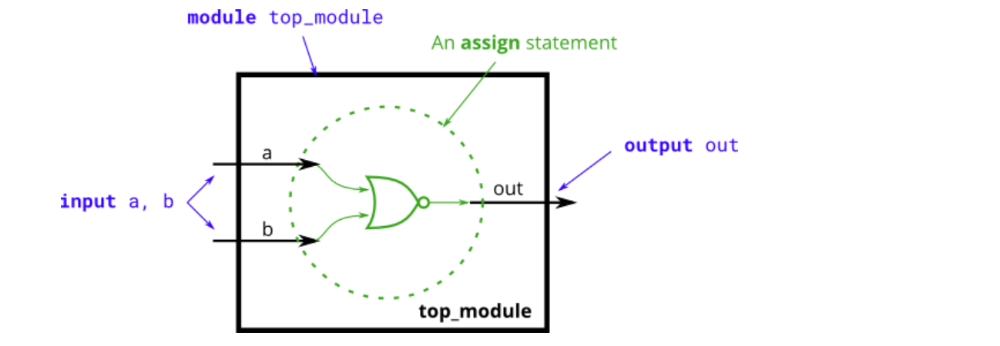
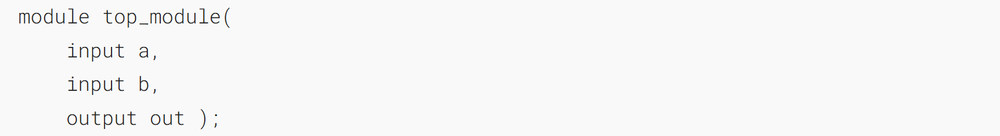
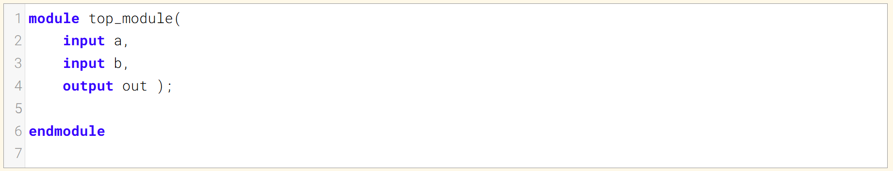
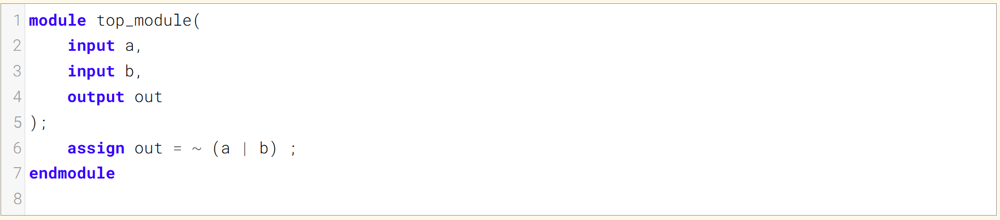
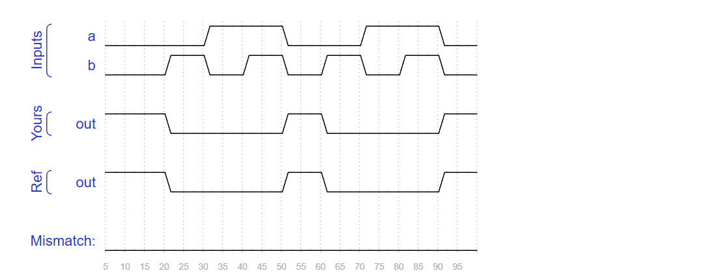

Create a module that implements a NOR gate. A NOR gate is an OR gate with its output inverted. A NOR function needs two operators when written in Verilog.
创建一个实现或非门的模块。或非门是输出取反的或门。在 Verilog 中编写或非逻辑需要两个操作数。

An `assign` statement drives a wire (or "net", as it's more formally called) with a value. This value can be as complex a function as you want, as long as it's a _combinational_ (i.e., memory-less, with no hidden state) function. An `assign` statement is a _continuous assignment_ because the output is "recomputed" whenever any of its inputs change, forever, much like a simple logic gate.
一条赋值语句为一根导线（或更正式地称为“线网”）赋予一个值。该值可以是任意复杂的函数，只要它是组合逻辑函数（即无记忆、无隐藏状态的函数）。`assign`语句属于连续赋值，因为每当其任意输入发生变化时，输出都会被“重新计算”，且这一过程会持续进行，非常类似于一个简单的逻辑门。

### Module Declaration

### Write your solution here

### Solution

### Timing diagrams

