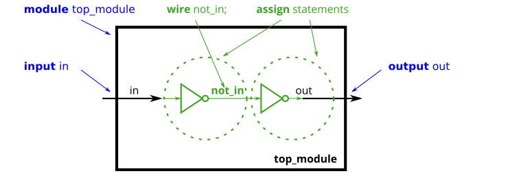
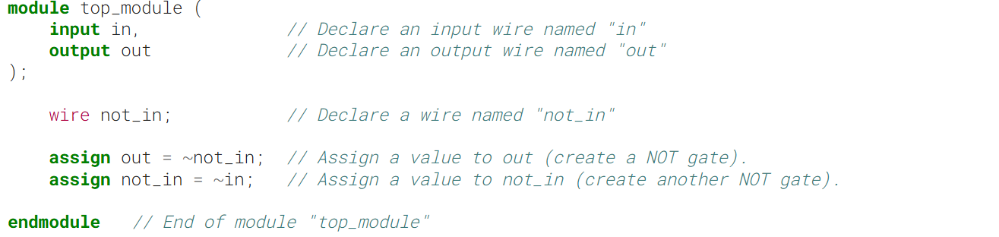
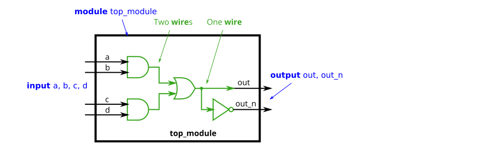
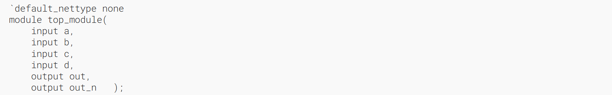
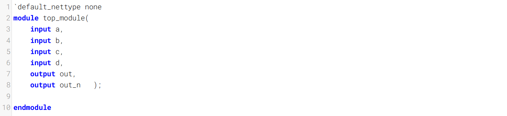
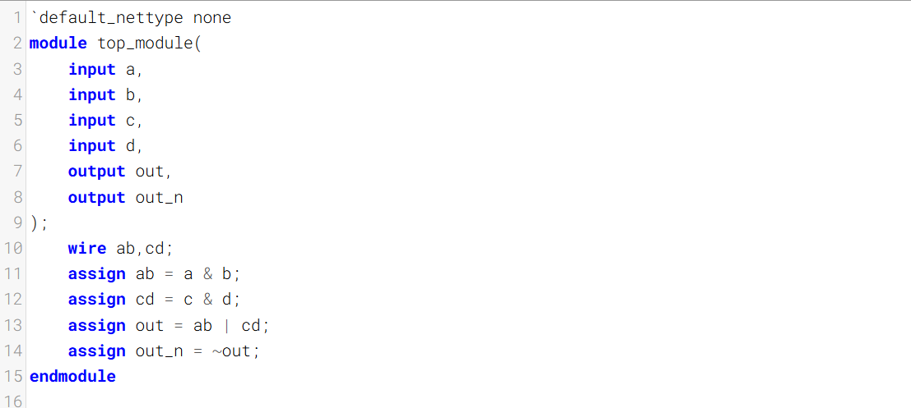
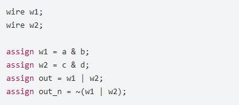
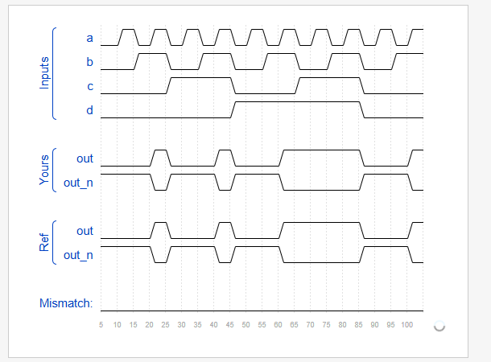

The circuits so far have been simple enough that the outputs are simple functions of the inputs. As circuits become more complex, you will need wires to connect internal components together. When you need to use a wire, you should declare it in the body of the module, somewhere before it is first used. (In the future, you will encounter more types of signals and variables that are also declared the same way, but for now, we'll start with a signal of type wire).
到目前为止，这些电路都足够简单，其输出是输入的简单函数。随着电路变得越来越复杂，你需要用导线将内部组件连接起来。当你需要使用导线时，应在模块主体内、首次使用它之前的某个位置对其进行声明。（后续你会遇到更多类型的信号和变量，它们也都采用相同的方式声明，但目前我们先从 wire 类型的信号开始。）

### Example

In the above module, there are three wires (in, out, and not_in), two of which are already declared as part of the module's input and output ports (This is why you didn't need to declare any wires in the earlier exercises). The wire not_in needs to be declared inside the module. It is not visible from outside the module. Then, two NOT gates are created using two assign statements. Note that it doesn't matter which of the NOT gates you create first: You still end up with the same circuit.
在上述模块中，有三根连线（in、out 和 not_in），其中两根已被声明为模块的输入和输出端口（这也是你在之前的练习中无需声明任何连线的原因）。连线 not_in 需要在模块内部进行声明，它从模块外部是不可见的。随后，通过两条 assign 语句创建了两个非门。需要注意的是，先创建哪一个非门并无影响，最终得到的电路是相同的。

## Practice
Implement the following circuit. Create two intermediate wires (named anything you want) to connect the AND and OR gates together. Note that the wire that feeds the NOT gate is really wire out, so you do not necessarily need to declare a third wire here. Notice how wires are driven by exactly one source (output of a gate), but can feed multiple inputs.
实现以下电路。创建两条中间导线（名称可任意）来连接与门和或门。请注意，连接非门的导线实际上就是输出导线，因此你无需额外声明第三条导线。注意导线的驱动源只能是一个（门的输出），但可以为多个输入提供信号。

If you're following the circuit structure in the diagram, you should end up with four assign statements, as there are four signals that need a value assigned.
如果你按照图中的电路结构来操作，最终应该得到四条赋值语句，因为有四个信号需要赋予值。

(Yes, it is possible to create a circuit with the same functionality without the intermediate wires.)
（是的，无需中间导线也可以创建具有相同功能的电路。）

### Module Declaration

### Write your solution here

### Solution
我的答案
严格按照文字要求来的
输出out没有进行wire声明，那输出out直接~给的out_n

以下为其他答案

不用声明任何wire也能实现

### Timing diagrams
