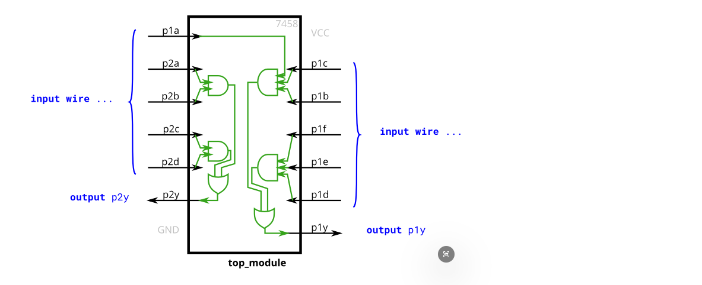
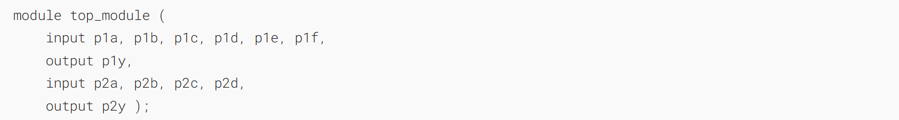
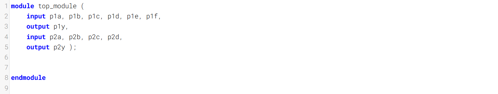
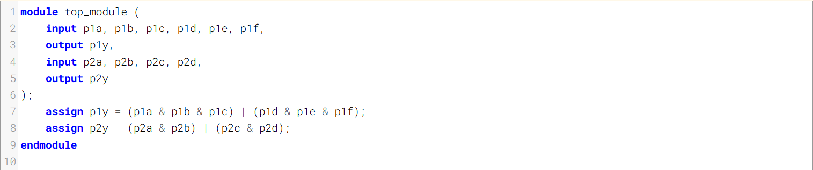
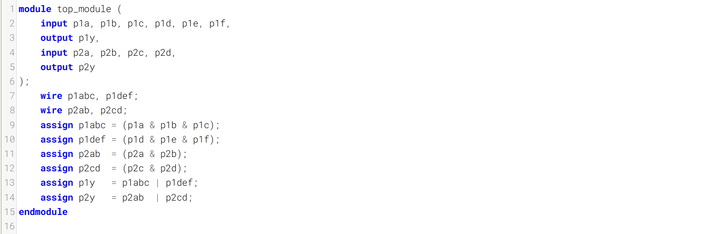
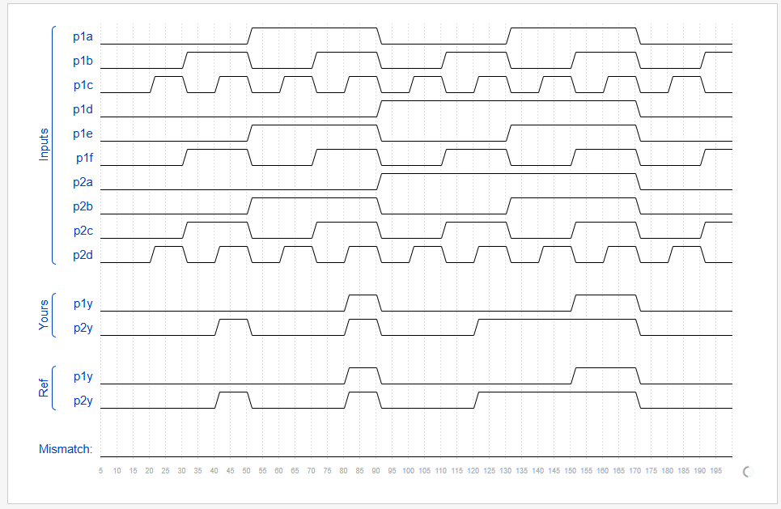

The 7458 is a chip with four AND gates and two OR gates. This problem is slightly more complex than 7420
7458是一款包含四个与门和两个或门的芯片。这个问题比7420稍微复杂一些。

Create a module with the same functionality as the 7458 chip. It has 10 inputs and 2 outputs. You may choose to use an `assign` statement to drive each of the output wires, or you may choose to declare (four) wires for use as intermediate signals, where each internal wire is driven by the output of one of the AND gates. For extra practice, try it both ways.
创建一个功能与7458芯片相同的模块。该模块有10个输入和2个输出。你可以选择使用`assign`语句驱动每一根输出线，也可以选择声明（四根）连线作为中间信号，其中每一根内部连线都由一个与门的输出驱动。作为额外练习，两种方法都可以尝试一下

### Module Declaration

### Write your solution here

### Solution1
You may choose to use an `assign` statement to drive each of the output wires, 

### Solution2
or you may choose to declare (four) wires for use as intermediate signals, where each internal wire is driven by the output of one of the AND gates.

### Timing diagrams
