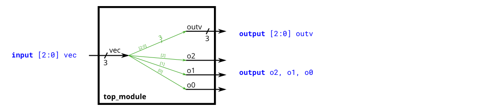
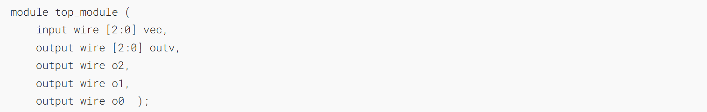
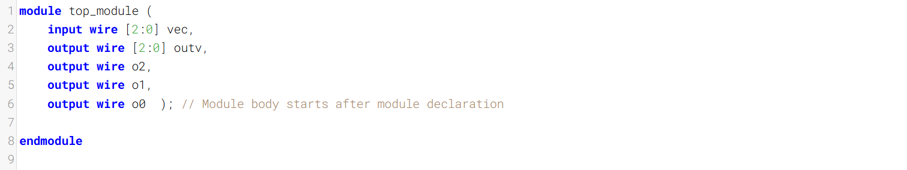
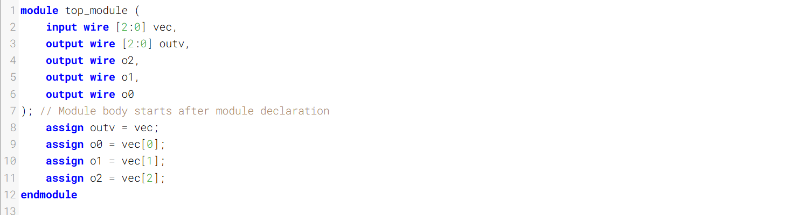
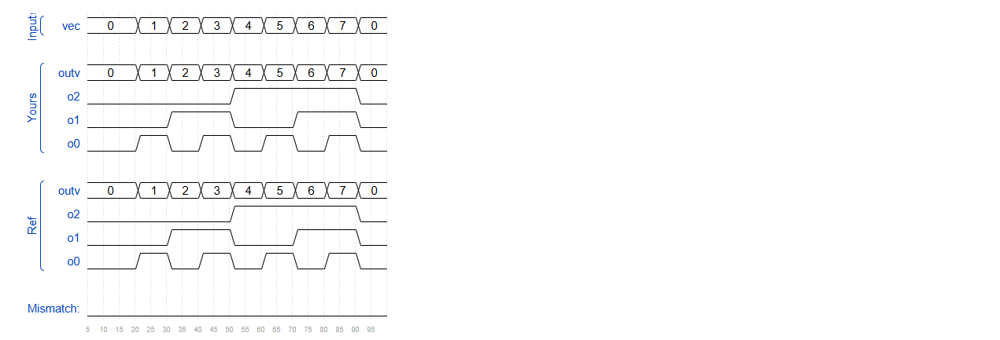

Vectors are used to group related signals using one name to make it more convenient to manipulate. For example, wire [7:0] w; declares an 8-bit vector named w that is functionally equivalent to having 8 separate wires.
向量用于通过一个名称对相关信号进行分组，以更方便地对其进行操作。例如，`wire [7:0] w;` 声明了一个名为 w 的 8 位向量，其功能等同于拥有 8 根独立的导线。

Notice that the _declaration_ of a vector places the dimensions _before_ the name of the vector, which is unusual compared to C syntax. However, the _part select_ has the dimensions _after_ the vector name as you would expect.
请注意，向量的声明是将维度放在向量名称之前，这与 C 语言的语法不同。不过，在选取部分，维度的位置则如你所预期的那样，放在向量名称之后。

Build a circuit that has one 3-bit input, then outputs the same vector, and also splits it into three separate 1-bit outputs. Connect output `o0` to the input vector's position 0, `o1` to position 1, etc.
构建一个具有一个3位输入的电路，该电路输出相同的向量，并将其拆分为三个独立的1位输出。将输出`o0`连接到输入向量的第0位，`o1`连接到第1位，依此类推。

In a diagram, a tick mark with a number next to it indicates the width of the vector (or "bus"), rather than drawing a separate line for each bit in the vector.
在图中，旁边标有数字的刻度线表示向量（或“总线”）的宽度，而非为向量中的每一位单独绘制一条线。

### Module Declaration

### Write your solution here

### Solution

也可以

### Timing diagrams

