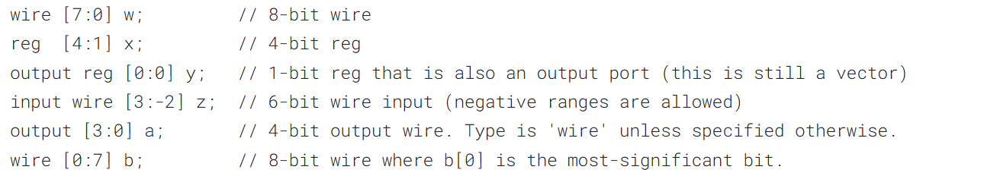
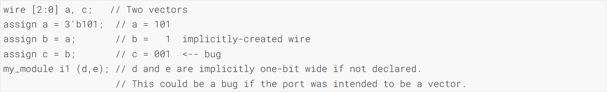
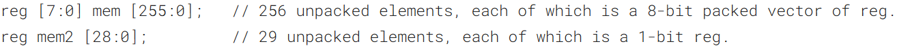
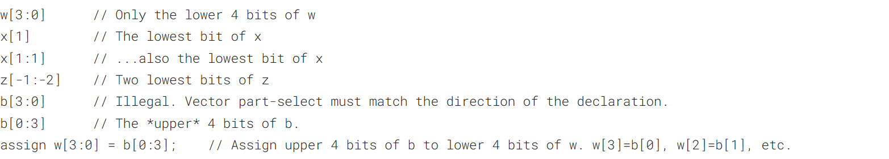
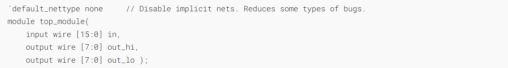
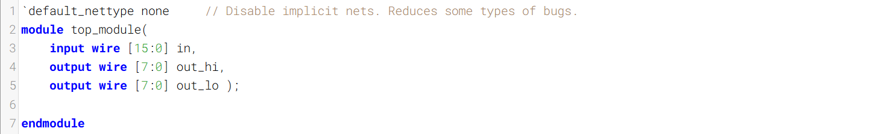
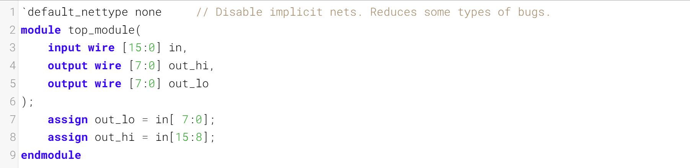
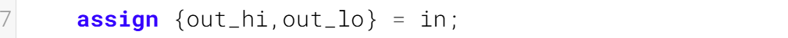
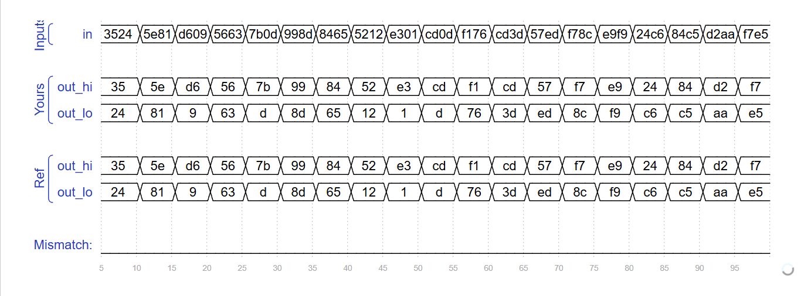

Vectors are used to group related signals using one name to make it more convenient to manipulate. For example, wire [7:0] w; declares an 8-bit vector named w that is equivalent to having 8 separate wires.
向量用于通过一个名称对相关信号进行分组，以更方便地对其进行操作。例如，`wire [7:0] w;` 声明了一个名为 w 的 8 位向量，这相当于拥有 8 根独立的导线。
### Declaring Vectors

Vectors must be declared:
向量必须这样声明：

type [upper:lower] vector_name;

type specifies the datatype of the vector. This is usually wire or reg. If you are declaring a input or output port, the type can additionally include the port type (e.g., input or output) as well. Some examples:
type 指定了向量的数据类型。通常为 wire 或 reg。如果声明的是输入或输出端口，类型还可额外包含端口类型（例如 input 或 output）。示例如下：



The _endianness_ (or, informally, "direction") of a vector is whether the the least significant bit has a lower index (little-endian, e.g., [3:0]) or a higher index (big-endian, e.g., [0:3]). In Verilog, once a vector is declared with a particular endianness, it must always be used the same way. e.g., writing `vec[0:3]` when `vec` is declared `wire [3:0] vec;` is illegal. Being consistent with endianness is good practice, as weird bugs occur if vectors of different endianness are assigned or used together.
向量的字节序（通俗也可称为“方向”）指的是最低有效位对应的索引更小（小端序，例如 [3:0]）还是更大（大端序，例如 [0:3]）。在 Verilog 中，一旦向量以特定的字节序声明，就必须始终以相同的方式使用。例如，若 `vec` 被声明为 `wire [3:0] vec;`，却写入 `vec[0:3]`，这是非法的。保持字节序一致是良好的编程习惯，因为如果将不同字节序的向量赋值或一起使用，会出现奇怪的错误。
#### Implicit nets 隐式线网
Implicit nets are often a source of hard-to-detect bugs. In Verilog, net-type signals can be implicitly created by an `assign` statement or by attaching something undeclared to a module port. Implicit nets are always one-bit wires and causes bugs if you had intended to use a vector. Disabling creation of implicit nets can be done using the `` `default_nettype none `` directive.
隐式网络通常是难以检测的错误的来源。在 Verilog 中，网络类型信号可通过 `assign` 语句或通过将未声明的内容附加到模块端口来隐式创建。隐式网络始终是一位线网，若你打算使用向量则会引发错误。可使用 `` `default_nettype none `` 指令禁用隐式网络的创建。


Adding `` `default_nettype none `` would make the third line of code an error, which makes the bug more visible.
添加 ``` `default_nettype none ``` 会使代码的第三行报错，从而让这个 bug 更容易被发现。

==Verilog 的“默认规则”：Verilog 中，在**任何地方**使用一个**未事先声明**的变量名，综合工具会**自动帮你隐式创建**一个 `wire` 类型信号。==
==b 从未声明，触发隐式网络规则 → 自动生成一个 1 位的 wire b== 
==3 位 a 赋值给 1 位 b → 发生截断，只保留最低位 1（二进制 101 的最低位是 1）==
==所以 b 实际值是 1'b1==

==`my_module i1 (d,e);` 这句话的"不对"之处==
- ==`d` 和 `e` 这两个信号名在之前没有出现过==
- ==根据隐式网络规则，编译器会**自动创建**两个 1 位的 `wire` 信号，分别叫 `d` 和 `e`==
- ==然后把 `my_module` 的**第一个端口**连到 `d`，**第二个端口**连到 `e`==
#### Unpacked vs. Packed Arrays 非压缩数组与压缩数组

You may have noticed that in _declarations_, the vector indices are written _before_ the vector name. This declares the "packed" dimensions of the array, where the bits are "packed" together into a blob (this is relevant in a simulator, but not in hardware). The _unpacked_ dimensions are declared _after_ the name. They are generally used to declare memory arrays. Since ECE253 didn't cover memory arrays, we have not used packed arrays in this course. See [http://www.asic-world.com/systemverilog/data_types10.html](http://www.asic-world.com/systemverilog/data_types10.html) for more details.
你可能已经注意到，在声明中，向量索引写在向量名称之前。这声明了数组的“压缩”维度，其中各位被“压缩”成一个数据块（这在模拟器中有效，但在硬件中不适用）。解压缩维度则写在名称之后。它们通常用于声明存储器数组。由于 ECE253 课程未涉及存储器数组，因此我们在本课程中没有使用压缩数组。有关更多详细信息，请参见网址



### Accessing Vector Elements: Part-Select访问向量元素：部分选择
Accessing an entire vector is done using the vector name. For example:
通过向量名来访问整个向量。例如：

assign w = a;

takes the entire 4-bit vector _a_ and assigns it to the entire 8-bit vector _w_ (declarations are taken from above). If the lengths of the right and left sides don't match, it is zero-extended or truncated as appropriate.
获取整个4位向量a，并将其赋值给整个8位向量w（声明来自上文）。若右侧和左侧的位数不匹配，则相应地进行零扩展或截断操作。

The part-select operator can be used to access a portion of a vector:
部分选择运算符可用于访问向量的某一部分：

- ==`b[3:0]` 是**非法**的，因为你的向量 `b` 很可能是声明为 `[0:3]` 这种**升序**方向的，而 `[3:0]` 是**降序**方向，与声明方向不匹配。==
- ==`b[0:3]` 是**合法**的，它选取的是 `b` 的**高 4 位**（如果 `b` 声明为 `[0:3]`）==。
## A Bit of Practice 一点小练习
Build a combinational circuit that splits an input half-word (16 bits, [15:0] ) into lower [7:0] and upper [15:8] bytes.
构建一个组合电路，将一个输入的半字（16位，[15:0]）拆分为低[7:0]字节和高[15:8]字节。
### Module Declaration

### Write your solution here

## Solution
方法一：

方法二：

### Timing diagrams
