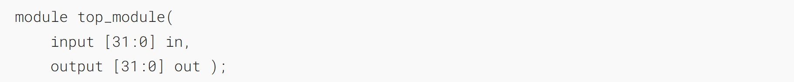
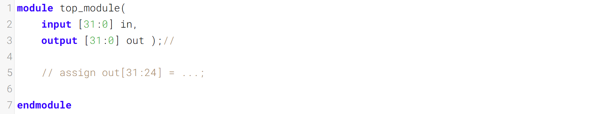
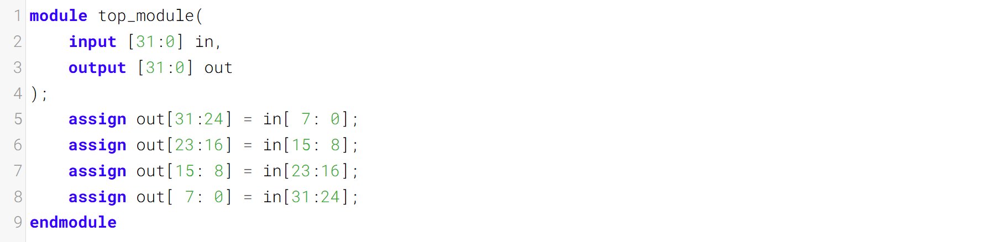
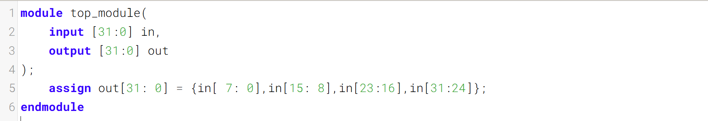
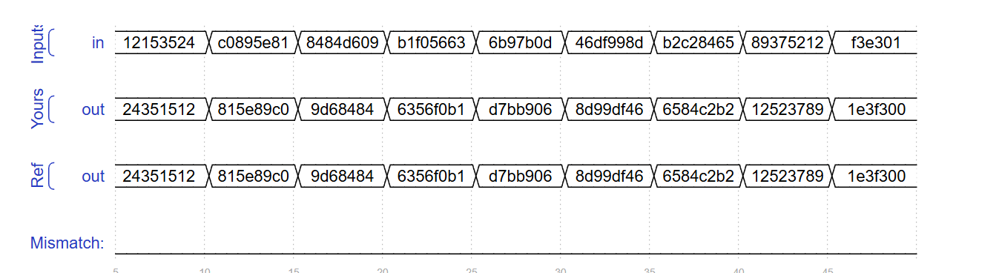

A 32-bit vector can be viewed as containing 4 bytes (bits [31:24], [23:16], etc.). Build a circuit that will reverse the _byte_ ordering of the 4-byte word.
一个32位向量可被视为包含4个字节（位[31:24]、[23:16]等）。构建一个电路，将4字节字的字节顺序反转。

AaaaaaaaBbbbbbbbCcccccccDddddddd => DdddddddCcccccccBbbbbbbbAaaaaaaa

This operation is often used when the [endianness](https://en.wikipedia.org/wiki/Endianness) of a piece of data needs to be swapped, for example between little-endian x86 systems and the big-endian formats used in many Internet protocols.
当需要交换一段数据的[字节序](https://en.wikipedia.org/wiki/Endianness)时，通常会使用此操作，例如在小端序的 x86 系统与许多互联网协议中使用的大端序格式之间进行转换。
### Module Declaration

### Write your solution here

## Solution

### Timing diagrams

