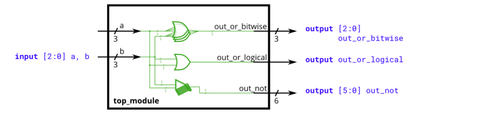
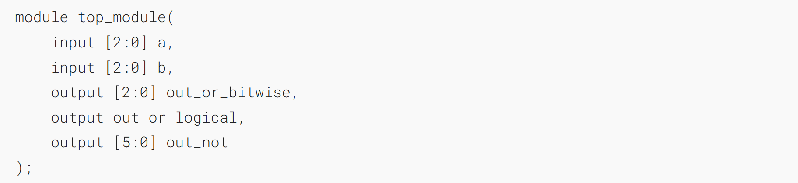
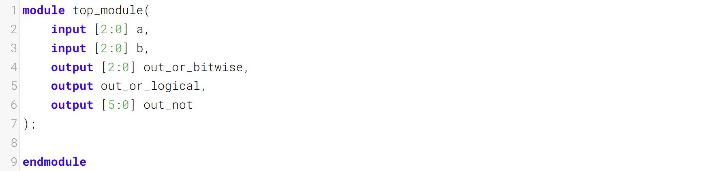
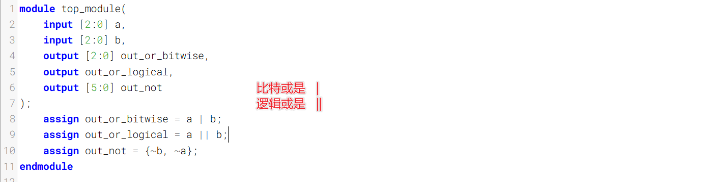
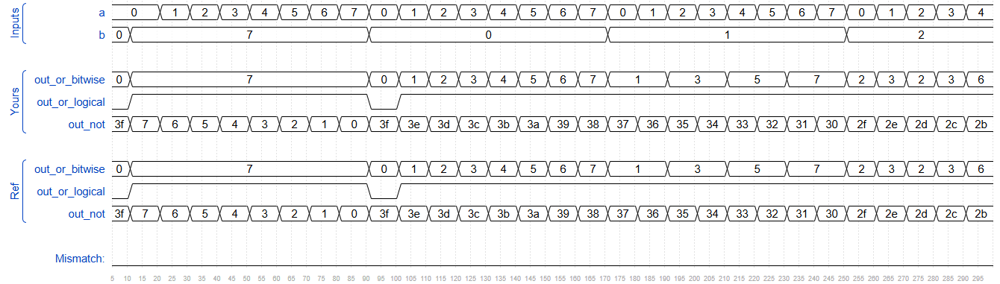

Build a circuit that has two 3-bit inputs that computes the bitwise-OR of the two vectors, the logical-OR of the two vectors, and the inverse (NOT) of both vectors. Place the inverse of `b` in the upper half of `out_not` (i.e., bits [5:3]), and the inverse of `a` in the lower half.
构建一个包含两个3位输入的电路，该电路可计算两个向量的按位或、两个向量的逻辑或，以及两个向量的反（非）。将`b`的反码放在`out_not`的上半部分（即比特位[5:3]），将`a`的反码放在下半部分。
### Bitwise vs. Logical Operators 按位运算符与逻辑运算符
Earlier, we mentioned that there are bitwise and logical versions of the various boolean operators (e.g., norgate). When using vectors, the distinction between the two operator types becomes important. A bitwise operation between two N-bit vectors replicates the operation for each bit of the vector and produces a N-bit output, while a logical operation treats the entire vector as a boolean value (true = non-zero, false = zero) and produces a 1-bit output.
此前我们提到过，各类布尔运算符存在按位版本和逻辑版本（例如 或非门）。在使用向量时，这两种运算符类型之间的区别变得至关重要。两个 N 位向量之间的按位运算会对向量的每一位重复执行该操作，并输出一个 N 位结果；而逻辑运算会将整个向量视为一个布尔值（真 = 非零，假 = 零），并输出一个 1 位结果。

Look at the simulation waveforms at how the bitwise-OR and logical-OR differ.
观察仿真波形，了解按位或和逻辑或的区别。

### Module Declaration

### Write your solution here

### Solution

### Timing diagrams

