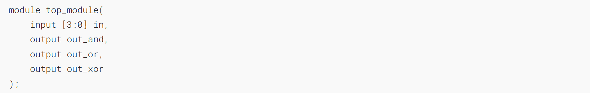
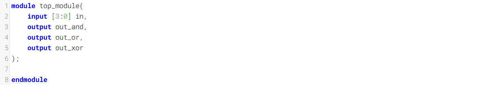
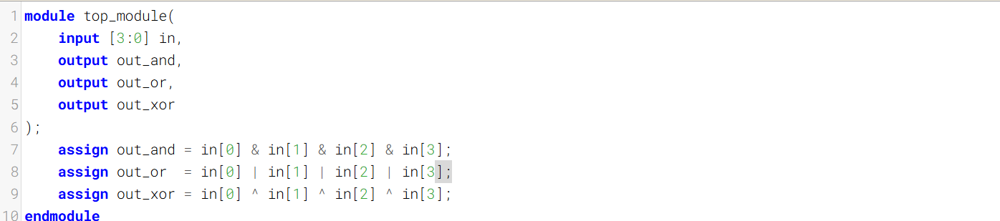
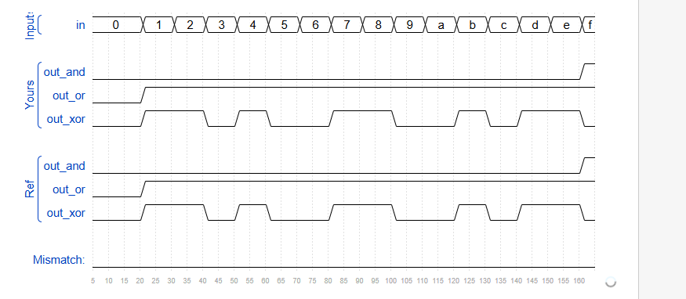

Build a combinational circuit with four inputs, in[3:0].
在[3:0]中构建具有四个输入的组合电路。

There are 3 outputs:
- out_and: output of a 4-input AND gate.
- out_or: output of a 4-input OR gate.
- out_xor: output of a 4-input XOR gate.

To review the AND, OR, and XOR operators, see [andgate](https://hdlbits.01xz.net/wiki/andgate "andgate"), [norgate](https://hdlbits.01xz.net/wiki/norgate "norgate"), and [xnorgate](https://hdlbits.01xz.net/wiki/xnorgate "xnorgate").

See also: [Even wider gates](https://hdlbits.01xz.net/wiki/gates100 "gates100").

### Module Declaration

### Write your solution here

### Solution
==我的答案：非常不推荐==

==应该这么写，用归约运算符，其实就是对所有位进行相同的运算，最终得到1位结果==

==Verilog 归约运算符家族==

| 运算符         | 名称   | 示例      | 等价展开（假设 `in` 为 `[3:0]`）               | 结果位宽 |
| ----------- | ---- | ------- | ------------------------------------- | ---- |
| `&`         | 归约与  | `&in`   | `in[0] & in[1] & in[2] & in[3]`       | 1 位  |
| `~&`        | 归约与非 | `~&in`  | `~(in[0] & in[1] & in[2] & in[3])`    | 1 位  |
| `\|`        | 归约或  | `\|in`  | `in[0] \| in[1] \| in[2] \| in[3]`    | 1 位  |
| `~\|`       | 归约或非 | `~\|in` | `~(in[0] \| in[1] \| in[2] \| in[3])` | 1 位  |
| `^`         | 归约异或 | `^in`   | `in[0] ^ in[1] ^ in[2] ^ in[3]`       | 1 位  |
| `~^` 或 `^~` | 归约同或 | `~^in`  | `~(in[0] ^ in[1] ^ in[2] ^ in[3])`    | 1 位  |

### Timing diagrams

