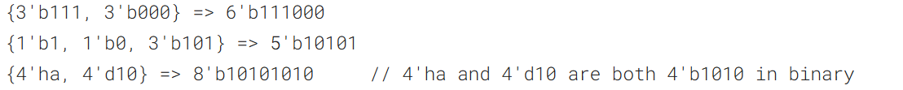
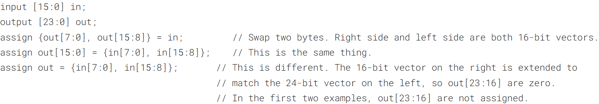
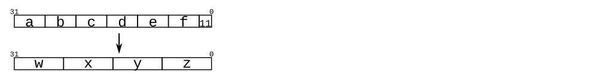
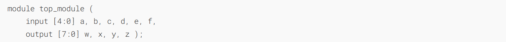
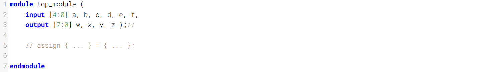
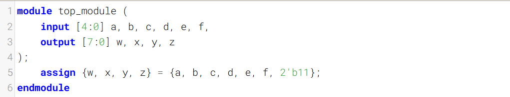
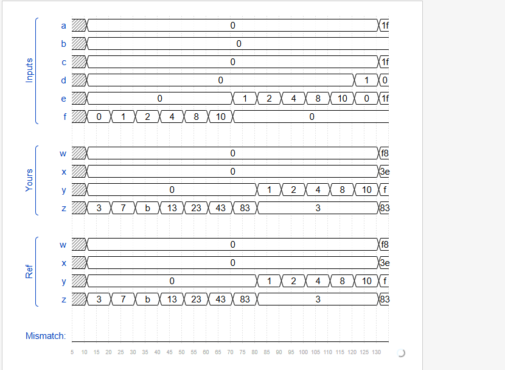

[Part selection](https://hdlbits.01xz.net/wiki/Vector1 "Vector1") was used to select portions of a vector. The concatenation operator {a,b,c} is used to create larger vectors by concatenating smaller portions of a vector together.
[部分选择](https://hdlbits.01xz.net/wiki/Vector1 "Vector1")用于选择向量的部分内容。拼接运算符 {a,b,c} 用于通过将向量的较小部分拼接在一起来创建更大的向量。

Concatenation needs to know the width of every component (or how would you know the length of the result?). Thus, {1, 2, 3} is illegal and results in the error message: unsized constants are not allowed in concatenations.
拼接操作需要知道每个组件的宽度（否则如何得知结果的长度？）。因此，{1, 2, 3} 是非法的，会产生错误信息：拼接操作中不允许使用未指定大小的常量。

The concatenation operator can be used on both the left and right sides of assignments.
拼接运算符可用于赋值语句的左侧和右侧。

## A Bit of Practice
Given several input vectors, concatenate them together then split them up into several output vectors. There are six 5-bit input vectors: a, b, c, d, e, and f, for a total of 30 bits of input. There are four 8-bit output vectors: w, x, y, and z, for 32 bits of output. The output should be a concatenation of the input vectors followed by two 1 bits:
给定若干输入向量，将它们拼接在一起后再拆分为多个输出向量。存在六个5位输入向量：a、b、c、d、e和f，总计30位输入。存在四个8位输出向量：w、x、y和z，共32位输出。输出应为输入向量的拼接结果后紧跟两个1位：

### Module Declaration

### Write your solution here

## Solution
==直接拼接即可==

## Timing diagrams

