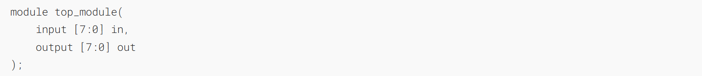
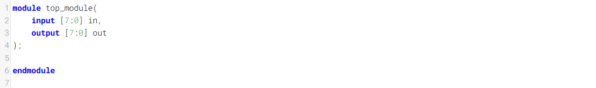
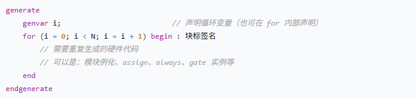
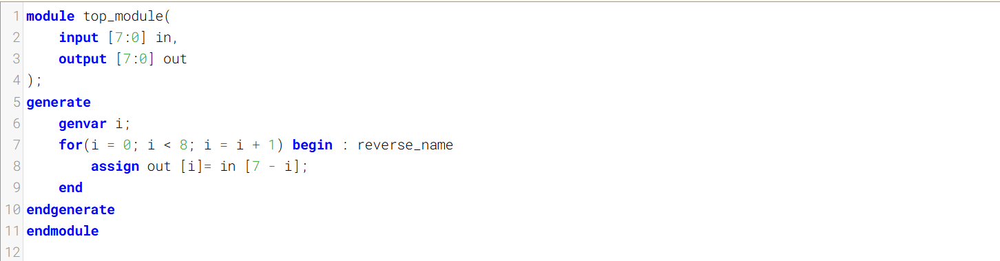
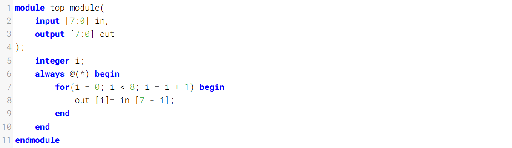
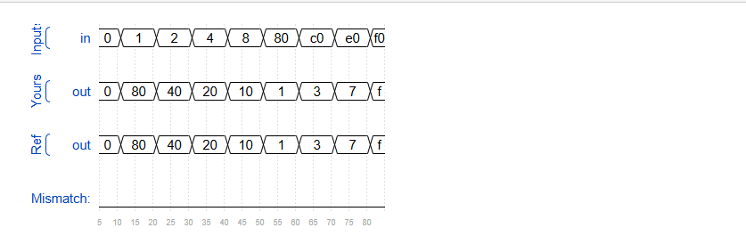

Given an 8-bit input vector [7:0], reverse its bit ordering.
给定一个8位输入向量[7:0]，将其位序反转。

See also: [Reversing a longer vector](https://hdlbits.01xz.net/wiki/Vector100r "Vector100r").
另请参阅：[反转更长的向量](https://hdlbits.01xz.net/wiki/Vector100r "Vector100r")。
### Module Declaration

### Write your solution here


==这里要介绍一种Verilog里很少用的代码==
==generate==

==这是generate的写代码的规范，本道题用generate写比较方便。==
==也可以用aways@( * ) 来完成==

```verilog
// 你的代码
generate
    for(i=0; i<=7; i=i+1) begin:conv
        assign out[i] = in[7-i];
    end
endgenerate
// 综合器看到的是（展开后）
assign out[0] = in[7];
assign out[1] = in[6];
// ...
assign out[7] = in[0];
```

==**`generate` 的 `for`**：它发生在**编译阶段**，就像C语言里的 `#define` 宏。想象一下，在综合器开始工作前，它先把你的代码"展开"了==
==**`always @(*)` 的 `for`**：这个循环在**仿真/综合阶段**才起作用。综合器会分析这个 `always` 块，理解你要实现的功能，然后生成一个等价的、由8个并行的赋值操作组成的电路。它**不会**先把你代码里的 `for` 展开成8条 `assign` 语句，而是直接生成门级网表。==

- ==`generate for` 用的是 `genvar`，因为它是在**告诉综合器如何生成你的电路**。==
- ==`always @(*) for` 用的是 `integer`，因为它是在**描述你的电路工作时要用到的一个临时计数器**（尽管它最终常被优化掉）。==
### Solution



### Timing diagrams
