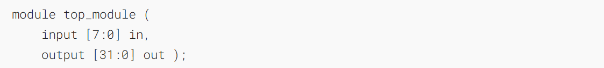
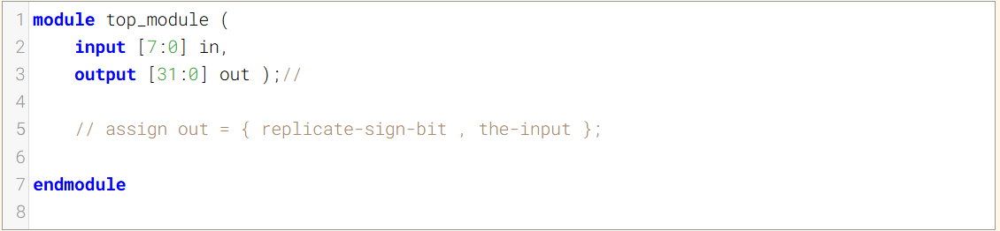
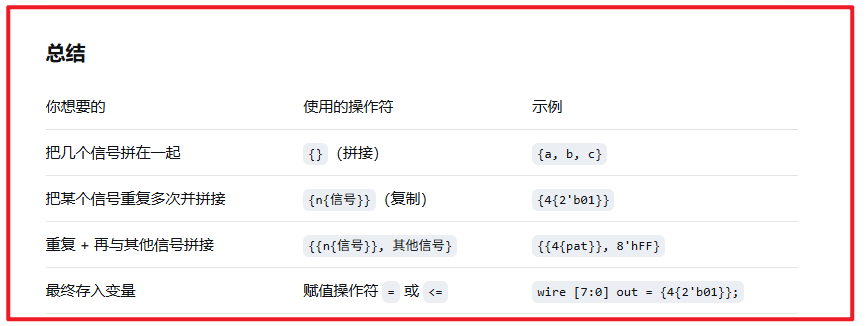
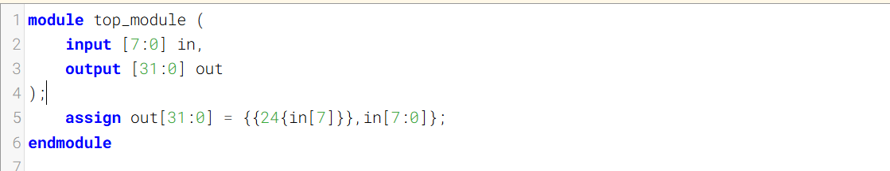
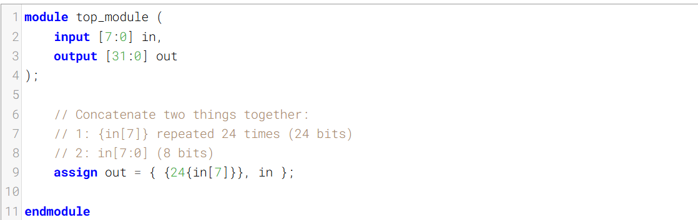

The [concatenation operator](https://hdlbits.01xz.net/wiki/Vector3 "Vector3") allowed concatenating together vectors to form a larger vector. But sometimes you want the same thing concatenated together many times, and it is still tedious to do something like assign a = {b,b,b,b,b,b};. The replication operator allows repeating a vector and concatenating them together:
[连接运算符](https://hdlbits.01xz.net/wiki/Vector3 "Vector3")可以将多个向量连接起来以形成一个更大的向量。但有时你需要将同一个内容重复连接多次，像编写 `a = {b,b,b,b,b,b};` 这样的语句仍然很繁琐。复制运算符则可以重复一个向量并将它们连接在一起：

Build a circuit that sign-extends an 8-bit number to 32 bits. This requires a concatenation of 24 copies of the sign bit (i.e., replicate bit[7] 24 times) followed by the 8-bit number itself.
构建一个将8位数字符号扩展为32位的电路。这需要将24个符号位（即将位[7]复制24次）与8位数字本身进行拼接。

### Module Declaration

### Write your solution here

拼接符号的多种用法

### Solution

==注意一下这里的{}是怎么嵌套的==

标准答案

其他答案
