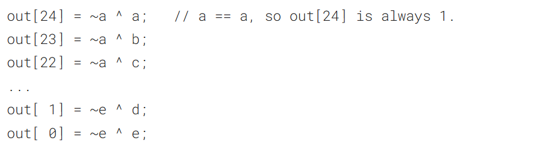
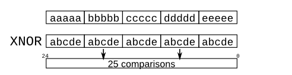
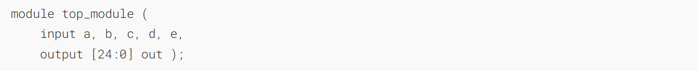
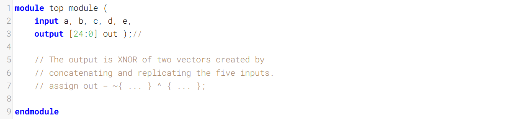
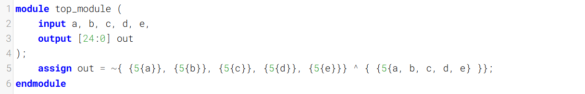
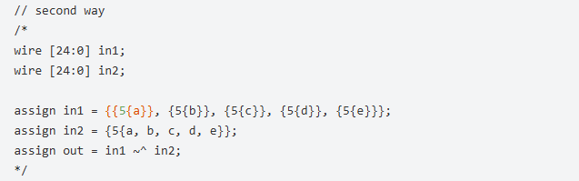

Given five 1-bit signals (a, b, c, d, and e), compute all 25 pairwise one-bit comparisons in the 25-bit output vector. The output should be 1 if the two bits being compared are equal.
给定五个 1 位信号（a、b、c、d、e），计算 25 位输出向量中所有 25 组两两一位信号的比较结果。若被比较的两个位相等，则输出为 1。

As the diagram shows, this can be done more easily using the [replication](https://hdlbits.01xz.net/wiki/Vector4 "Vector4") and concatenation operators.
如图所示，使用[复制](https://hdlbits.01xz.net/wiki/Vector4 "Vector4")和拼接运算符可以更轻松地完成此操作。

- The top vector is a concatenation of 5 repeats of each input
- 顶部向量是每个输入重复5次后的拼接结果
- The bottom vector is 5 repeats of a concatenation of the 5 inputs
- 底部向量是5个5个输入拼接结果的重复

### Module Declaration

### Write your solution here

### Solution

其他答案

