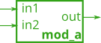
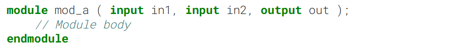
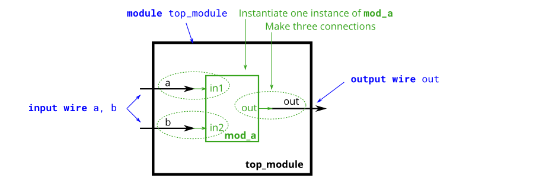
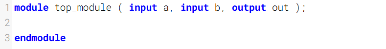
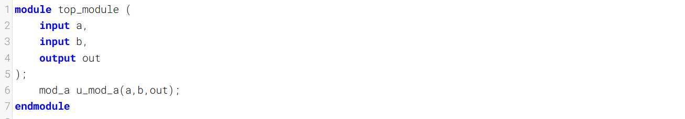
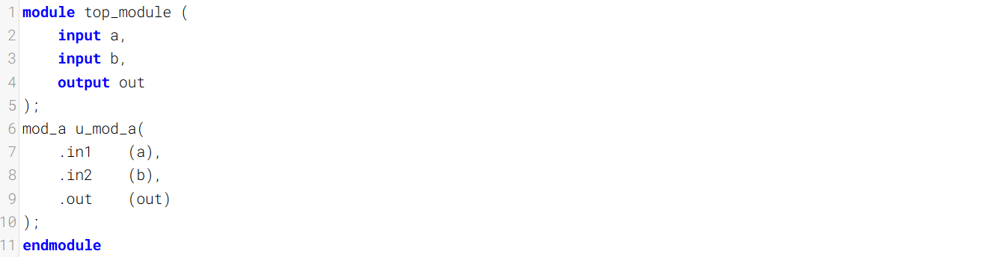

By now, you're familiar with a `module`, which is a circuit that interacts with its outside through input and output ports. Larger, more complex circuits are built by _composing_ bigger modules out of smaller modules and other pieces (such as assign statements and always blocks) connected together. This forms a hierarchy, as modules can contain instances of other modules.
到现在，你已经熟悉了`module`——它是一种通过输入和输出端口与外部交互的电路。更大、更复杂的电路是由将较小模块和其他部件（如 assign 语句和 always 块）连接在一起组合而成的更大模块构成的。这形成了一种层级结构，因为模块可以包含其他模块的实例。

The figure below shows a very simple circuit with a sub-module. In this exercise, create one _instance_ of module **mod_a**, then connect the module's three pins (`in1`, `in2`, and `out`) to your top-level module's three ports (wires `a`, `b`, and `out`). The module `mod_a` is provided for you — you must instantiate it.
下图展示了一个带有子模块的非常简单的电路。在本练习中，创建一个模块 `mod_a` 的实例，然后将该模块的三个引脚（`in1`、`in2` 和 `out`）连接到顶层模块的三个端口（导线 `a`、`b` 和 `out`）。模块 `mod_a` 已为你提供——你必须对其进行实例化。

When connecting modules, only the ports on the module are important. You do not need to know the code inside the module. The code for module `mod_a` looks like this:
连接模块时，只有模块上的端口很重要。你不需要知道模块内部的代码。模块 `mod_a` 的代码如下所示：

The hierarchy of modules is created by instantiating one module inside another, as long as all of the modules used belong to the same project (so the compiler knows where to find the module). The code for one module is not written _inside_ another module's body (Code for different modules are not nested).
模块的层级结构是通过在一个模块中实例化另一个模块来创建的，前提是所使用的所有模块都属于同一个项目（这样编译器才能知道模块的位置）。一个模块的代码不会写在另一个模块的主体内部（不同模块的代码不嵌套）。

You may connect signals to the module by port name or port position. For extra practice, try both methods.
你可以通过端口名或端口位将信号连接到该模块。作为额外练习，可以尝试两种方法。

### Connecting Signals to Module Ports 将信号连接到模块端口

There are two commonly-used methods to connect a wire to a port: by position or by name.
将导线连接到端口有两种常用方法：按位置连接或按名称连接。

#### 一、By position 按位置
The syntax to connect wires to ports by position should be familiar, as it uses a C-like syntax. When instantiating a module, ports are connected left to right according to the module's declaration. For example:
按位置将线路连接到端口的语法应该很熟悉，因为它使用类似 C 语言的语法。实例化模块时，端口会按照模块的声明从左到右进行连接。例如：

`mod_a instance1 ( wa, wb, wc );`

This instantiates a module of type `mod_a` and gives it an _instance name_ of "instance1", then connects signal `wa` (outside the new module) to the **first** port (`in1`) of the new module, `wb` to the **second** port (`in2`), and `wc` to the **third** port (`out`). One drawback of this syntax is that if the module's port list changes, all instantiations of the module will also need to be found and changed to match the new module.
这会实例化一个类型为 `mod_a` 的模块，并为其指定实例名为“instance1”，随后将信号 `wa`（位于新模块外部）连接到新模块的第一个端口 `in1`，将 `wb` 连接到第二个端口 `in2`，将 `wc` 连接到第三个端口 `out`。这种语法的一个缺点是，如果模块的端口列表发生变化，所有该模块的实例化代码都需要被找到并修改，以匹配更新后的模块端口。

#### 二、By name 按名称

Connecting signals to a module's ports _by name_ allows wires to remain correctly connected even if the port list changes. This syntax is more verbose, however.
按名称将信号连接到模块的端口，即使端口列表发生变化，连线也能保持正确连接。不过，这种语法更为冗长。

`mod_a instance2 ( .out(wc), .in1(wa), .in2(wb) );`

The above line instantiates a module of type `mod_a` named "instance2", then connects signal `wa` (outside the module) to the port **named** `in1`, `wb` to the port **named** `in2`, and `wc` to the port **named** `out`. Notice how the ordering of ports is irrelevant here because the connection will be made to the correct name, regardless of its position in the sub-module's port list. Also notice the period immediately preceding the port name in this syntax.
上述代码实例化了一个类型为 `mod_a`、名为“instance2”的模块，随后将模块外部的信号 `wa` 连接至名为 `in1` 的端口，将 `wb` 连接至 `in2` 端口，将 `wc` 连接至 `out` 端口。请注意，此处端口的连接顺序无关紧要，因为无论端口在子模块端口列表中的位置如何，连接都会根据正确的名称建立。同时也请注意，在这种语法中，端口名前紧接一个句点。

### Module Declaration

### Write your solution here

### Solution1

### Solution2

