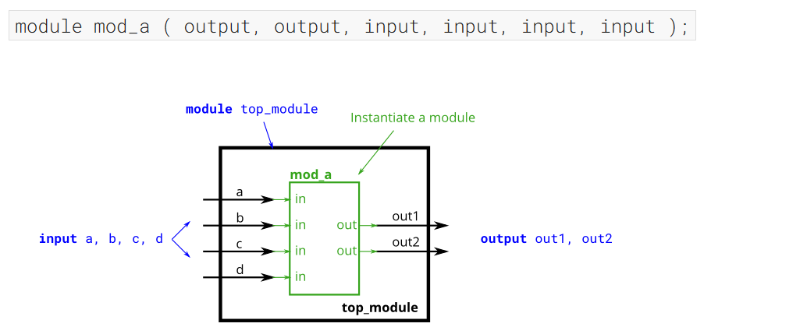
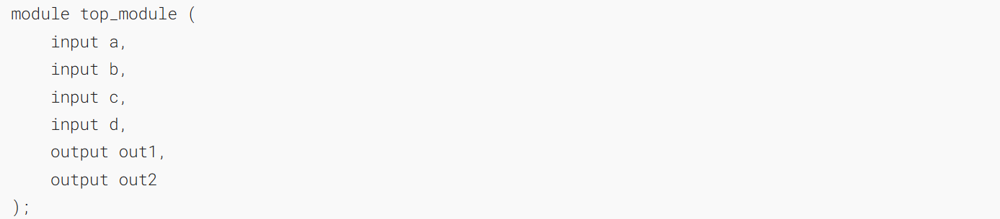
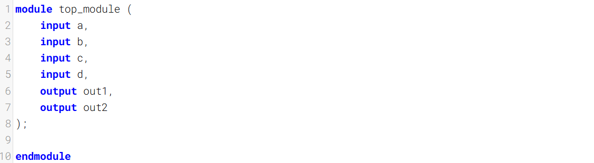
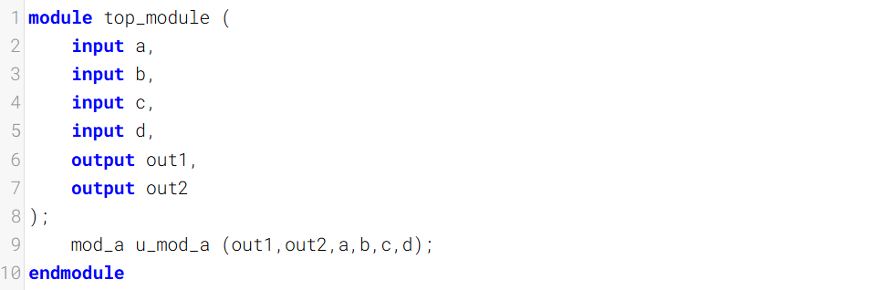

按位置连接端口

This problem is similar to the previous one ([module](https://hdlbits.01xz.net/wiki/module "module")). You are given a module named `mod_a` that has 2 outputs and 4 inputs, in that order. You must connect the 6 ports _by position_ to your top-level module's ports `out1`, `out2`, `a`, `b`, `c`, and `d`, in that order.
这个问题与上一个问题（[模块](https://hdlbits.01xz.net/wiki/module "module")）类似。你会得到一个名为 `mod_a` 的模块，它按顺序有 2 个输出端和 4 个输入端。你必须按位置将这 6 个端口连接到顶层模块的端口 `out1`、`out2`、`a`、`b`、`c` 和 `d`，连接顺序保持不变。

You are given the following module:
为你提供以下模块：

### Module Declaration

### Write your solution here

### Solution

