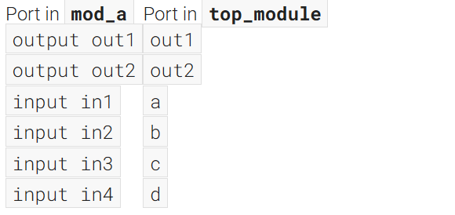
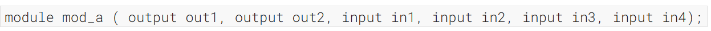
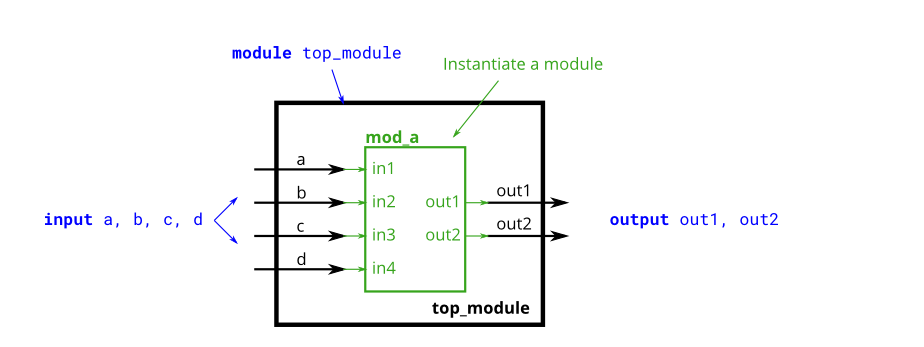
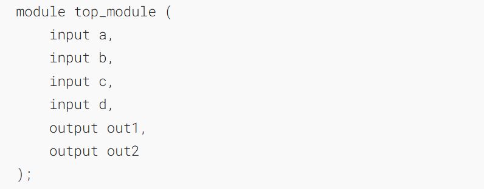
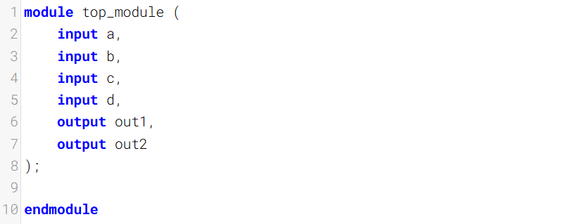
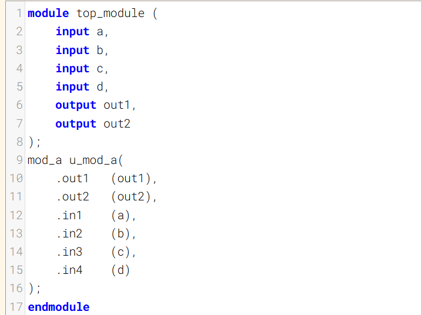

按名称连接端口

This problem is similar to [module](https://hdlbits.01xz.net/wiki/module "module"). You are given a module named `mod_a` that has 2 outputs and 4 inputs, in some order. You must connect the 6 ports _by name_ to your top-level module's ports:
这个问题类似于[模块](https://hdlbits.01xz.net/wiki/module "module")。你会得到一个名为`mod_a`的模块，它有2个输出端和4个输入端，顺序不定。你必须按名称将这6个端口连接到顶层模块的端口：

You are given the following module:

### Module Declaration

### Write your solution here

### Solution

