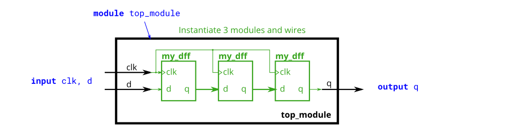
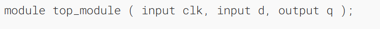
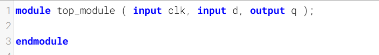
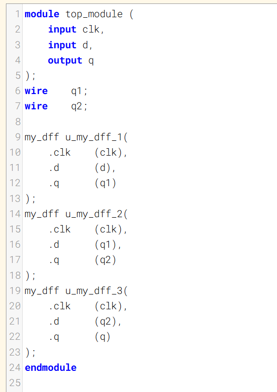
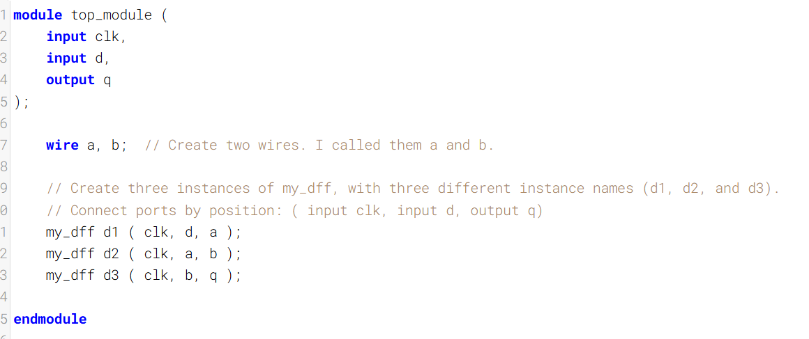

三个模块

You are given a module `my_dff` with two inputs and one output (that implements a D flip-flop). Instantiate three of them, then chain them together to make a shift register of length 3. The `clk` port needs to be connected to all instances.
为你提供一个名为 `my_dff` 的模块，该模块有两个输入和一个输出（实现了一个 D 触发器）。请实例化其中三个模块，然后将它们级联在一起，构成一个长度为 3 的移位寄存器。需要将 `clk` 端口连接到所有实例。

The module provided to you is: `module my_dff ( input clk, input d, output q );`
提供给你的模块是：`module my_dff ( input clk, input d, output q );`

Note that to make the internal connections, you will need to declare some wires. Be careful about naming your wires and module instances: the names must be unique.
请注意，要建立内部连接，你需要声明一些连线。注意连线和模块实例的命名：名称必须是唯一的。

### Module Declaration

### Write your solution here

### Solution

### Solution2

