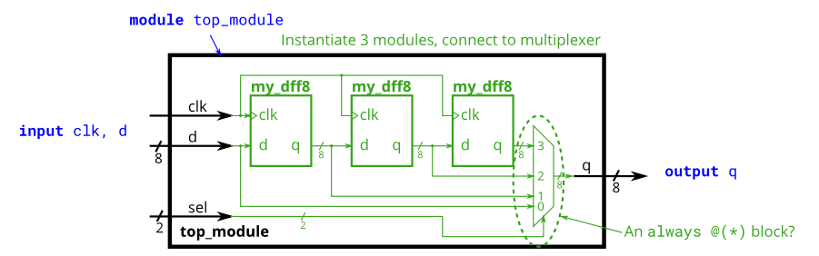
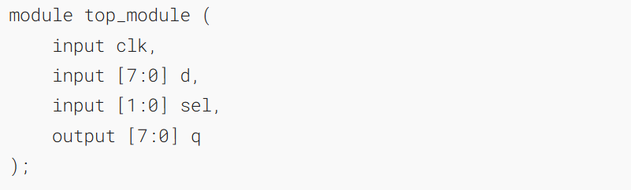
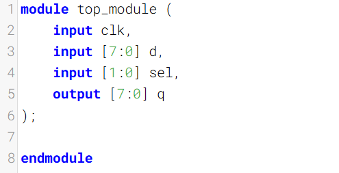
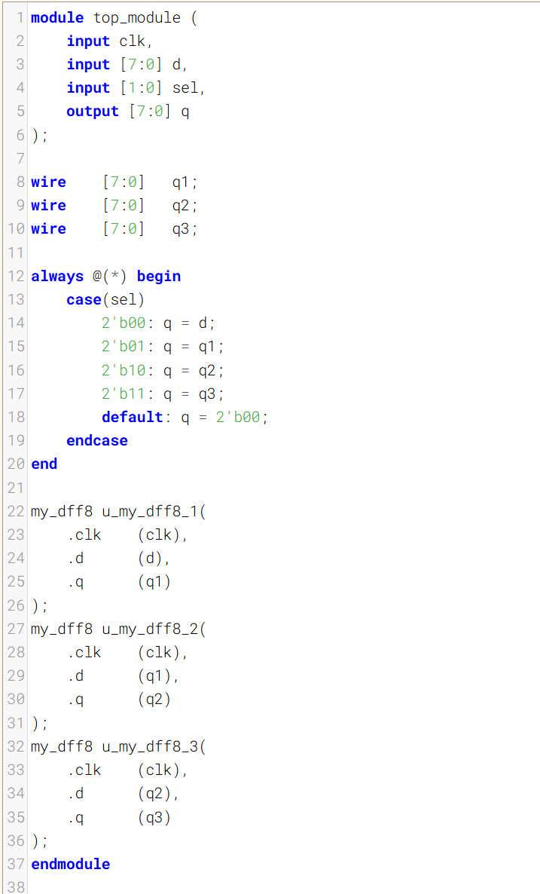

模块与向量

This exercise is an extension of [module_shift](https://hdlbits.01xz.net/wiki/module_shift "module_shift"). Instead of module ports being only single pins, we now have modules with vectors as ports, to which you will attach wire vectors instead of plain wires. Like everywhere else in Verilog, the vector length of the port does not have to match the wire connecting to it, but this will cause zero-padding or truncation of the vector. This exercise does not use connections with mismatched vector lengths.
本练习是module_shift的扩展。模块端口不再只是单个引脚，现在我们使用带有向量作为端口的模块，并将为其连接线向量而非普通线。与 Verilog 中的其他地方一样，端口的向量长度不必与所连接的线向量长度一致，但这会导致向量的零填充或截断。本练习不使用向量长度不匹配的连接。

You are given a module `my_dff8` with two inputs and one output (that implements a set of 8 D flip-flops). Instantiate three of them, then chain them together to make a 8-bit wide shift register of length 3. In addition, create a 4-to-1 multiplexer (not provided) that chooses what to output depending on `sel[1:0]`: The value at the input d, after the first, after the second, or after the third D flip-flop. (Essentially, `sel` selects how many cycles to delay the input, from zero to three clock cycles.)
为你提供一个包含 8 个 D 触发器的模块 `my_dff8`，该模块有两个输入和一个输出。请实例化三个该模块，然后将它们级联起来，构建一个位宽为 8 位、长度为 3 的移位寄存器。此外，需创建一个 4 选 1 多路选择器（未提供），根据 `sel[1:0]` 选择输出内容：输入 d 的值、经过第一个触发器后的值、经过第二个触发器后的值，或经过第三个触发器后的值。本质上，`sel` 用于选择对输入进行多少个时钟周期的延迟，延迟范围为 0 到 3 个时钟周期。

The module provided to you is: 
`module my_dff8 ( input clk, input [7:0] d, output [7:0] q );`
提供给你的模块是：
`module my_dff8 ( input clk, input [7:0] d, output [7:0] q );`

The multiplexer is not provided. One possible way to write one is inside an `always` block with a `case` statement inside. (See also: [mux9to1v](https://hdlbits.01xz.net/wiki/mux9to1v "mux9to1v"))
未提供多路复用器。一种可能的编写方式是在包含 `always` 块且内部有 `case` 语句的代码中实现。（另见：[mux9to1v](https://hdlbits.01xz.net/wiki/mux9to1v "mux9to1v")）

### Module Declaration

### Write your solution here

### Solution

