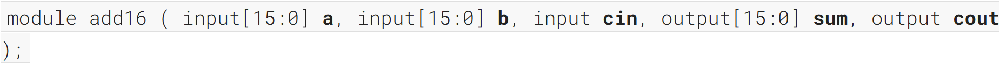
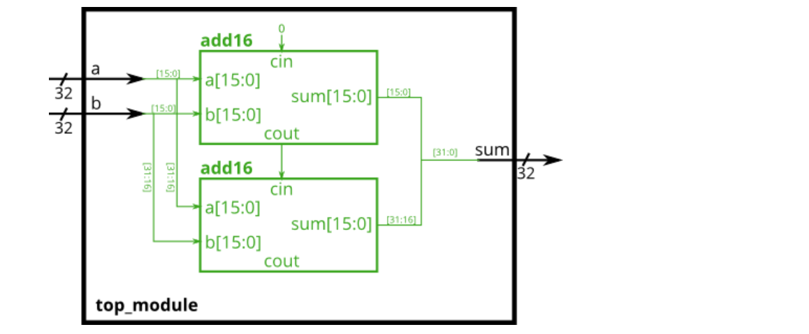
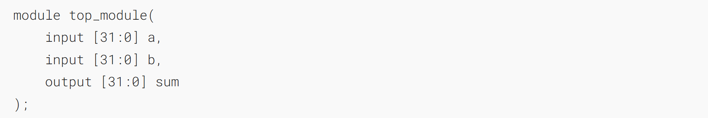
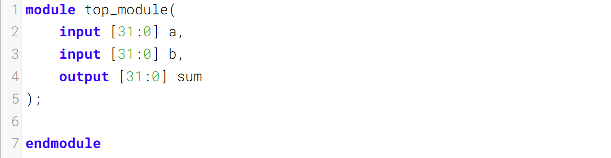
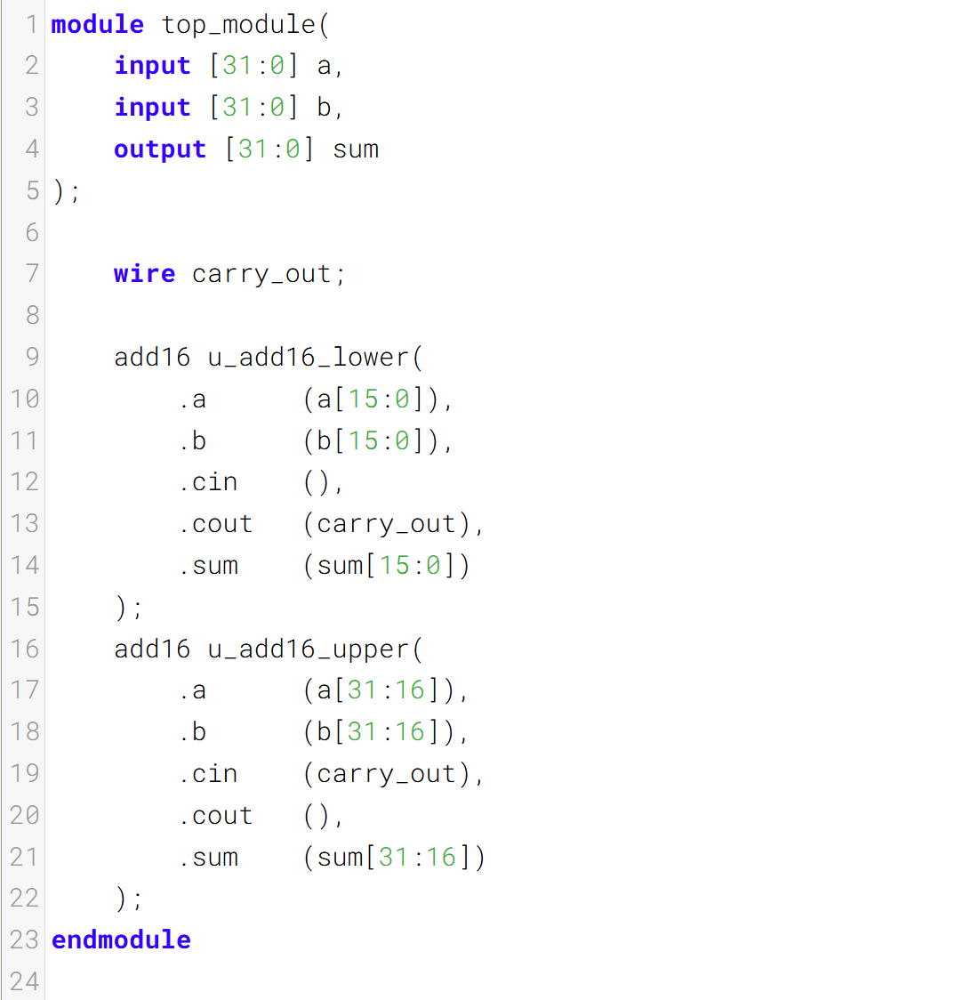

加法器 1

You are given a module `add16` that performs a 16-bit addition. Instantiate two of them to create a 32-bit adder. One add16 module computes the lower 16 bits of the addition result, while the second add16 module computes the upper 16 bits of the result, after receiving the carry-out from the first adder. Your 32-bit adder does not need to handle carry-in (assume 0) or carry-out (ignored), but the internal modules need to in order to function correctly. (In other words, the `add16` module performs 16-bit a + b + cin, while your module performs 32-bit a + b).
为你提供一个执行16位加法的模块`add16`。请实例化两个该模块来构建一个32位加法器。第一个add16模块计算加法结果的低16位，第二个add16模块在接收到第一个加法器的进位输出后，计算结果的高16位。你的32位加法器无需处理进位输入（假设为0）或进位输出（忽略），但内部模块需要正确处理这些信号。（也就是说，`add16`模块执行的是16位的a + b + 进位输入运算，而你的模块执行的是32位的a + b运算。）

Connect the modules together as shown in the diagram below. The provided module `add16` has the following declaration:
按照下图将各模块连接起来。所提供的模块 `add16` 的声明如下：

### Module Declaration

### Write your solution here

### Solution

