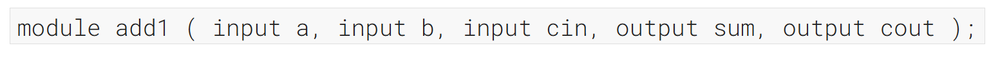
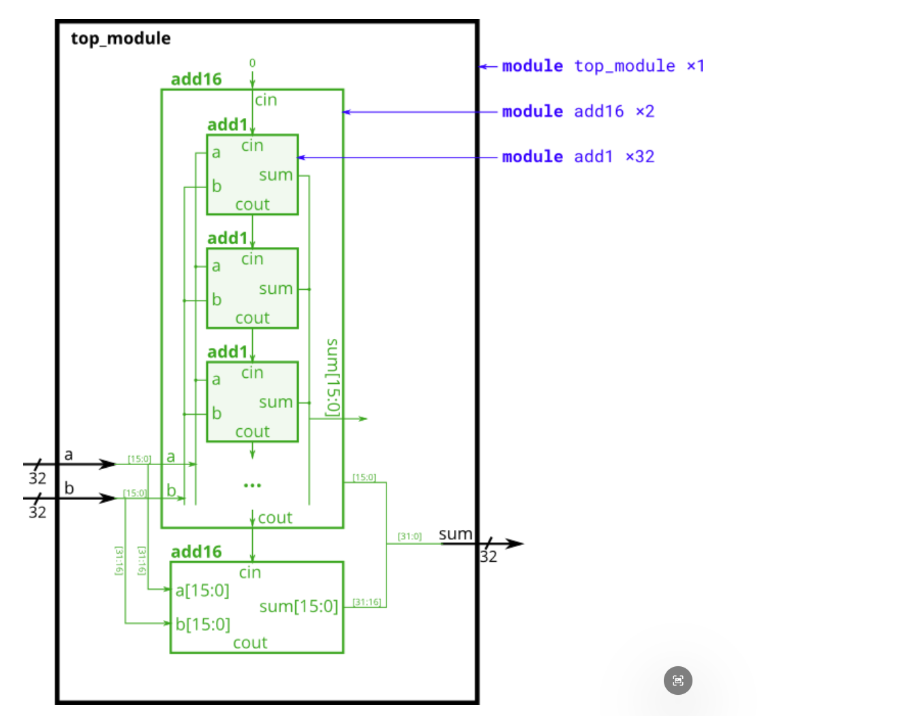
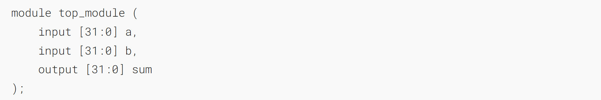
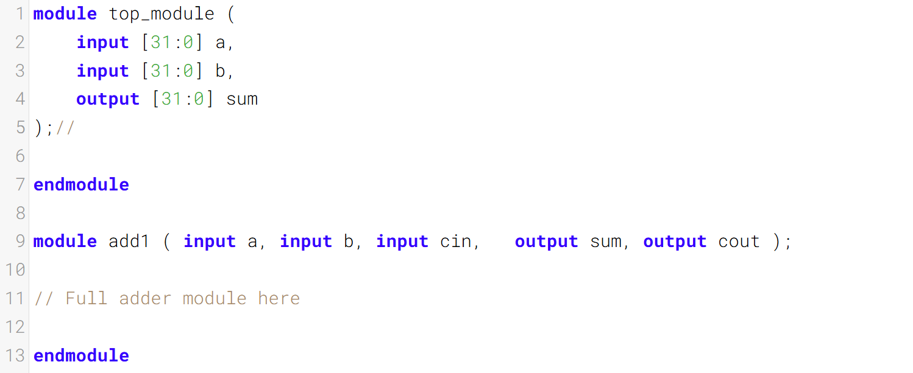

加法器 2、

In this exercise, you will create a circuit with two levels of hierarchy. Your `top_module` will instantiate two copies of `add16` (provided), each of which will instantiate 16 copies of `add1` (which you must write). Thus, you must write _two_ modules: `top_module` and `add1`.
在本练习中，你将创建一个具有两层层次结构的电路。你的`top_module`将实例化两个`add16`（已提供），每个16位加法器又会实例化16个`add1`（你需要自行编写）。因此，你必须编写两个模块：`top_module`和`add1`。

Like [module_add](https://hdlbits.01xz.net/wiki/module_add "module_add"), you are given a module `add16` that performs a 16-bit addition. You must instantiate two of them to create a 32-bit adder. One `add16` module computes the lower 16 bits of the addition result, while the second `add16` module computes the upper 16 bits of the result. Your 32-bit adder does not need to handle carry-in (assume 0) or carry-out (ignored).
与[module_add](https://hdlbits.01xz.net/wiki/module_add "module_add")类似，你会得到一个执行16位加法的`add16`模块。你需要实例化其中两个来构建一个32位加法器。一个`add16`模块计算加法结果的低16位，而第二个`add16`模块计算结果的高16位。你的32位加法器无需处理进位输入（假定为0）或进位输出（忽略不计）。

Connect the `add16` modules together as shown in the diagram below. The provided module `add16` has the following declaration:
按照下图所示将`add16`模块相互连接。所提供的模块`add16`的声明如下：


Within each `add16`, 16 full adders (module `add1`, not provided) are instantiated to actually perform the addition. You must write the full adder module that has the following declaration:
在每个`add16`中，会实例化16个全加器（模块`add1`，未提供）来实际执行加法运算。你需要编写具有以下声明的全加器模块：


Recall that a full adder computes the sum and carry-out of a+b+cin.
回想一下，全加器用于计算 a+b+cin 的和与进位输出。

In summary, there are three modules in this design:
总而言之，本设计包含三个模块：


If your submission is missing a `module add1`, you will get an error message that says `Error (12006): Node instance "user_fadd[0].a1" instantiates undefined entity "add1"`.
如果你的提交缺少一个`module add1`，你将收到一条显示`Error (12006): Node instance "user_fadd[0].a1" instantiates undefined entity "add1"`的错误信息。



### Module Declaration



### Write your solution here



### Solution
sum是和位
cout是进位位

assign sum = a^b^cin; 
- 异或运算 `^` 就是模 2 加法：`0^0=0, 0^1=1, 1^0=1, 1^1=0`。
- 三个数按位模 2 加等价于 `(a ^ b) ^ cin`。
- 真值表验证：输入奇数个 1 时 `sum=1`，偶数个 1 时 `sum=0`，这正是加法结果的 LSB。


assign cout = a&b|a&cin|b&cin;
- `a & b`：a 与 b 同时为 1 → 必然进位。
- `a & cin`：a 与进位同时为 1 → 进位。
- `b & cin`：b 与进位同时为 1 → 进位。


```verilog
module top_module (
    input 	[31:0] a	,
    input 	[31:0] b	,
    output 	[31:0] sum
);
wire cout_cin;

add16 u_add16_1( 
    .a		(a[15:0]),
    .b		(b[15:0]),
    .cin	(1'b0),
    .sum	(sum[15:0]),
    .cout 	(cout_cin)
);
add16 u_add16_2( 
    .a		(a[31:16]),
    .b		(b[31:16]),
    .cin	(cout_cin),
    .sum	(sum[31:16]),
    .cout 	()
);
endmodule

module add1 ( 
    input 	a	, 
    input 	b	, 
    input 	cin	,   
    output 	sum	, 
    output 	cout 
);
	assign sum = a^b^cin;
    assign cout = a&b | a&cin | b&cin;
endmodule
```


