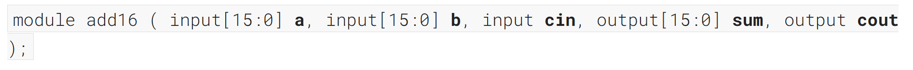
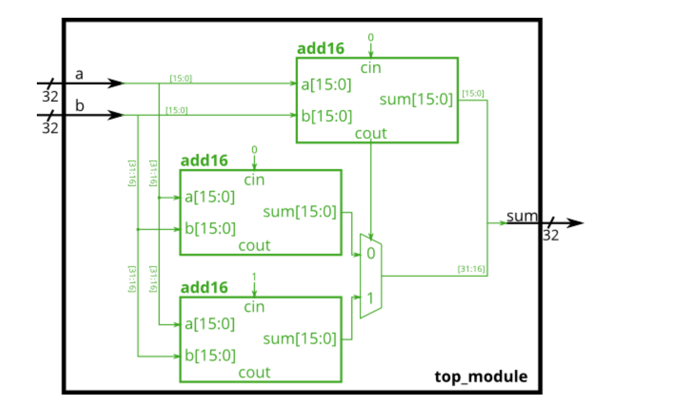
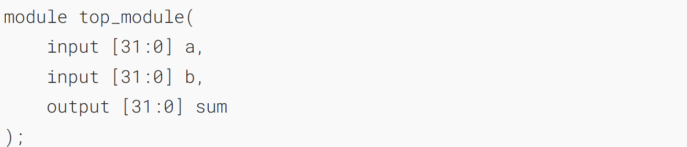
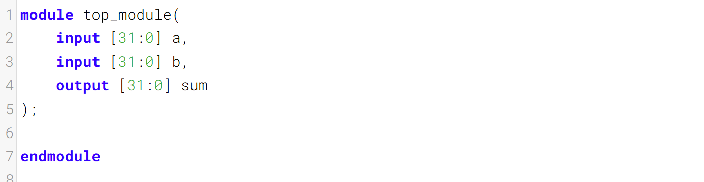

# Module cseladd 变更模块

One drawback of the ripple carry adder (See [previous exercise](https://hdlbits.01xz.net/wiki/module_add "module_add")) is that the delay for an adder to compute the carry out (from the carry-in, in the worst case) is fairly slow, and the second-stage adder cannot begin computing _its_ carry-out until the first-stage adder has finished. This makes the adder slow. One improvement is a carry-select adder, shown below. The first-stage adder is the same as before, but we duplicate the second-stage adder, one assuming carry-in=0 and one assuming carry-in=1, then using a fast 2-to-1 multiplexer to select which result happened to be correct.
超前进位加法器的一个缺点（见[上一道练习题](https://hdlbits.01xz.net/wiki/module_add "module_add")）是，加法器计算进位输出（在最坏情况下由进位输入推导而来）的延迟相当长，而且第二级加法器必须等第一级加法器完成计算后，才能开始计算自身的进位输出。这使得整个加法器的运算速度较慢。一种改进方案是采用如下所示的进位选择加法器。第一级加法器与之前的设计相同，但我们对第二级加法器进行了复制：一个假设进位输入为0，另一个假设进位输入为1，随后通过一个高速2选1多路选择器选出正确的结果。

In this exercise, you are provided with the same module `add16` as the previous exercise, which adds two 16-bit numbers with carry-in and produces a carry-out and 16-bit sum. You must instantiate _three_ of these to build the carry-select adder, using your own 16-bit 2-to-1 multiplexer.
在本练习中，你将获得与上一练习相同的模块 `add16`，该模块可对两个16位数字进行带进位输入的加法运算，并输出进位输出和16位和。你需要实例化其中三个模块，结合你自己设计的16位2选1多路复用器来构建进位选择加法器。

Connect the modules together as shown in the diagram below. The provided module `add16` has the following declaration:
按下图所示将各个模块连接起来。所提供的模块 `add16` 声明如下：





### Module Declaration


### Write your solution here


### Solution
```verilog
module top_module(
    input [31:0] a,
    input [31:0] b,
    output [31:0] sum
);
wire 		sel;
wire [31:0] sum_r;
wire [15:0] sum_r_0;
wire [15:0] sum_r_1;
    
assign sum = sum_r;

always @(*) begin
    case(sel)
        1'b0:	sum_r[31:16] = sum_r_0;
        1'b1:	sum_r[31:16] = sum_r_1;
        default: sum_r[31:16] = 16'b0;
    endcase
end

add16 u_add16_1( 
    .a		(a[15:0]),
    .b		(b[15:0]),
    .cin	(1'b0),
    .sum	(sum_r[15:0]),
    .cout 	(sel)
);
add16 u_add16_2( 
    .a		(a[31:16]),
    .b		(b[31:16]),
    .cin	(1'b0),
    .sum	(sum_r_0),
    .cout 	()
);
add16 u_add16_3( 
    .a		(a[31:16]),
    .b		(b[31:16]),
    .cin	(1'b1),
    .sum	(sum_r_1),
    .cout 	()
);
endmodule
```


