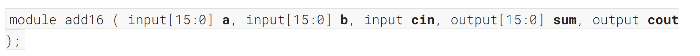
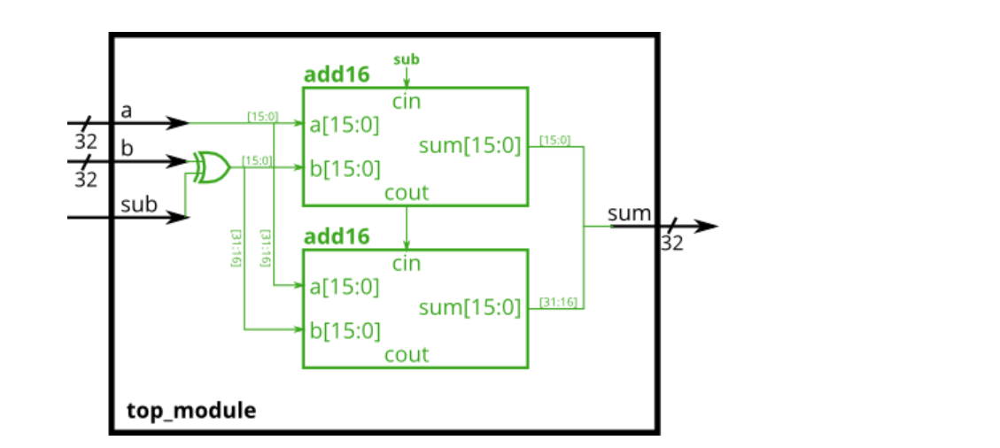
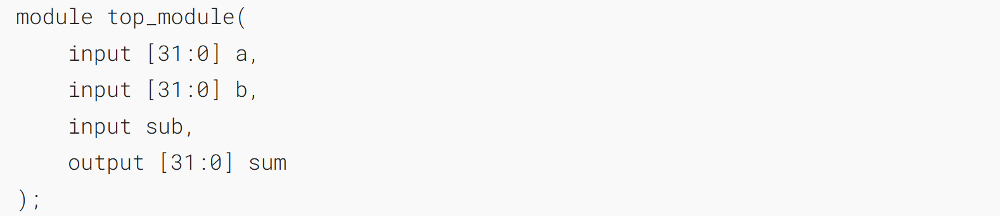
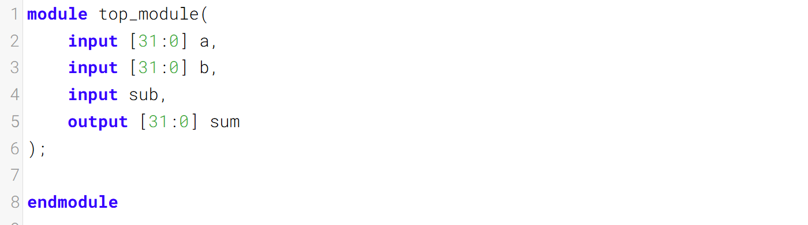

加法减法器

An adder-subtractor can be built from an adder by optionally negating one of the inputs, which is equivalent to inverting the input then adding 1. The net result is a circuit that can do two operations: (a + b + 0) and (a + ~b + 1). See [Wikipedia](https://en.wikipedia.org/wiki/Adder%E2%80%93subtractor) if you want a more detailed explanation of how this circuit works.
加法减法器可由加法器构建，方法是对其中一个输入选择性取反，这等同于将输入取反后再加 1。最终得到的电路可执行两种运算：(a + b + 0) 和 (a + ~b + 1)。若想了解该电路的详细工作原理，可参考[维基百科](https://en.wikipedia.org/wiki/Adder%E2%80%93subtractor)。

Build the adder-subtractor below. 
在下方构建一个加减法器。

You are provided with a 16-bit adder module, which you need to instantiate twice:
为你提供一个16位加法器模块，你需要对其进行两次实例化：



Use a 32-bit wide XOR gate to invert the b input whenever sub is 1. (This can also be viewed as b[31:0] XORed with sub replicated 32 times. See [replication operator](https://hdlbits.01xz.net/wiki/vector4 "vector4").). Also connect the sub input to the carry-in of the adder.
使用一个32位宽的异或门在sub为1时反转b输入。（这也可以理解为将b[31:0]与sub复制32次后进行异或运算，参见[复制运算符](https://hdlbits.01xz.net/wiki/vector4 "vector4")。）同时将sub输入连接到加法器的进位输入端。



### Module Declaration


### Write your solution here


### Solution
```verilog
module top_module(
    input [31:0] a,
    input [31:0] b,
    input sub,
    output [31:0] sum
);
wire 		cout_cin;
wire [31:0]	b_sub;

assign b_sub = b ^ {32{sub}};

add16 u_add16_1(
    .a		(a[15:0]	),
    .b		(b_sub[15:0]),
    .cin	(sub		),
    .sum	(sum[15:0]	),
    .cout	(cout_cin)
);    
add16 u_add16_2(
    .a		(a[31:16]	),
    .b		(b_sub[31:16]),
    .cin	(cout_cin	),
    .sum	(sum[31:16]	),
    .cout	()
);  
endmodule
```


